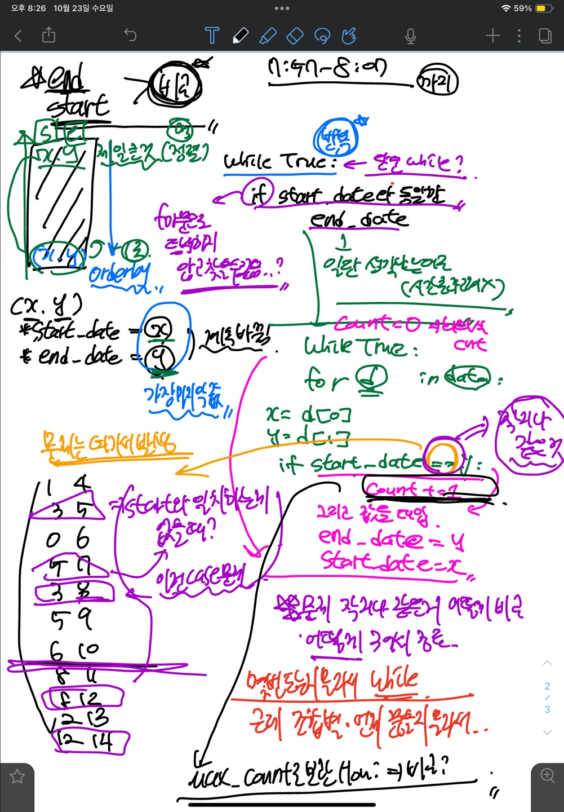

# baekjoon_1931

사이트: 백준
난이도: 실버1
날짜: 2024년 10월 23일
다중 선택: 파이썬
문제: ??????, Re(다시), ※, △, 내것이 아님, 못푼문제, 아쉬움, 취약파트, 코드작성
알고리즘 유형: 탐욕(그리디)
완료: No
자료구조: 리스트
텍스트: 2시간 소요? → 람다도 이해못하고, 아이디어만 떠오르는데 아무리 봐도 코드를 못짜겠었음

## 접근 방법 & 아이디어



## 알아두면 좋을 개념, TIP

<aside>
💡

**람다 표현식 : Python에서 익명 함수를 만드는 방법**

</aside>

```python
lambda x: x + 1
```

⇒  입력값 **`x`**에 1을 더하는 익명 함수

- **`lambda x: (x[1], x)` :** 각 요소가 튜플일 때, 두 번째 요소(**`x[1]`**)를 우선적으로, 
                                           첫 번째 요소(**`x`**)를 그 다음 기준으로 정렬하겠다

**[위에 구문을 일반 함수로 바꾸면?]**

```python
def 더하기_함수(x):
    return x + 1
    
------------------------
lambda x: x + 1

#lambda == 이건 함수야
#x == 입력값
#x+1 == 함수가 하는 일

```

```python
meetings = [(1, 4), (3, 5), (0, 6)]
meetings.sort(key=lambda x: (x[1], x[0]))
```

### 더 쉽게 람다  이해하기

---

<aside>
💡

**결론적으로 보면 변수 할당도 똑같고 =>가 파이썬에선 :로 사용되는 느낌**

</aside>

```python
#JS
const sum = (num1, num2) => num1 + num2;
#Python
sum = lambda num1, num2: num1 + num2
```

- **화살표 (`=>`)**: JavaScript에서 사용.
- **콜론 (`:`)**: Python에서 사용.

- python의 람다 표현식은 `JavaScript의 화살표 함수`와 비슷한 개념

```python
#JS
// 일반 함수
const sum = function(num1, num2) {
    return num1 + num2;
};

// 화살표 함수
const sum = (num1, num2) => num1 + num2;
```

- 상기는 자바스크립트, 하기는 파이썬

```python
#Python
# 일반 함수
def sum(num1, num2):
    return num1 + num2

# 람다 표현식
sum = lambda num1, num2: num1 + num2
```

<aside>
💡

**sort(key=) : 리스트의 각 요소에 대해 `함수를 호출`하고 그 `결과를 기준으로 반환`**

</aside>

- **`key`** 매개변수를 사용하면 정렬 기준을 지정할 수 있다
    - 리스트를 정렬할 때, 어떤 기준으로 정렬할 지에 대해 정할 수 있음
- **`key`**는 각 요소에 대해 호출할 함수를 지정하며, 이 함수의 반환값을 기준으로 정렬

### 더 쉽게 sort 이해하기

---

→ `함수` 가 키포인트 그래서 **`abs`**, **`len`** 같은 내장 함수도 사용 가능!!!

```python
def get_second_element(item):
    return item[1]

meetings = [(1, 4), (3, 5), (0, 6)]
meetings.sort(key=get_second_element)
```

[절대값 기준으로 정렬]

```python
#절대값 기준으로 정렬한다고 가정
# 숫자 리스트를 절대값 기준으로 정렬
numbers = [-3, 1, -2, 4] #모두 절대값이 있다고 가정된 상태로 솔트
numbers.sort(key=abs)
# 결과: [1, -2, -3, 4]
```

[튜플 리스트 정렬]

```python
#예시와 같은 튜플 리스트 정렬
#두번쨰 요소 기준으로 정렬
meetings = [(1, 4), (3, 5), (0, 6)]
meetings.sort(key=lambda x: x[1])
# 결과: [(1, 4), (3, 5), (0, 6)]
```

**[문자열 길이로 정렬]**

```python
words = ["apple", "banana", "cherry"]
words.sort(key=len)
```

## 코드 최종본

## 초기 코드 구현

### 트러블 슈팅

---

## 지피티 참고

1. **정렬**: 회의를 끝나는 시간 기준으로 정렬해야 한다는 점이 강조되어 있습니다. 이는 가장 빨리 끝나는 회의를 먼저 선택하여 최대한 많은 회의를 배치할 수 있도록 하는 전략입니다.
2. **반복문과 조건문**: 각 회의를 순회하면서, 현재 선택된 마지막 회의의 종료 시간 이후에 시작하는 회의를 선택하는 방식입니다. 이 과정에서 **`count`** 변수를 사용하여 선택된 회의의 개수를 세고 있습니다.
3. **변수 사용**: **`start_date`**와 **`end_date`** 변수를 사용하여 각 회의의 시작 및 종료 시간을 관리하고, 이를 통해 다음에 선택할 수 있는 회의를 결정합니다.
4. **최대 개수 계산**: 최종적으로 **`max_count`**라는 변수를 통해 최대 사용할 수 있는 회의의 개수를 계산하는 방식입니다

---

```python
def maxMeetings(meetings): #여러개의 회의를 나타내는 리스트 => 리스트 내부에 리스트가 있음
    # 종료 시간, 시작 시간 기준으로 정렬
    # list중 하나 => 즉 각각의 list 하나를 뽑고
    meetings.sort(key=lambda x: (x[1], x[0])) #그 list의 x1, x2를 적절하게 배분
    #sort() 함수는 기본적으로 리스트의 요소를 튜플로 해석하여 첫 번째 요소부터 정렬
    #종료 시간(x[1])과 시작 시간(x)을 기준으로 정렬
    #정렬된 회의를 순회하며 겹치지 않는 최대 개수의 회의를 선택
    #위 코드에서 lambda x: (x[1], x)는 각 회의의 종료 시간과 시작 시간을 기준으로 정렬하기 위해 사용

    count = 0
    last_end_time = 0

    for start, end in meetings:
        if start >= last_end_time:
            count += 1
            last_end_time = end
    return count

# 입력 처리
N = int(input())
meetings = [list(map(int, input().split())) for _ in range(N)] #meeting
#[[1, 4], [3, 5], [0, 6], [5, 7], [3, 8], [5, 9], [6, 10], [8, 11], [8, 12], [2, 13], [12, 14]]
'''
11
1 4
3 5
0 6
5 7
3 8
5 9
6 10
8 11
8 12
2 13
12 14
'''

# 최대 회의 수 계산
result = maxMeetings(meetings)
print(result)

-----------------------------------
# x는 meetings 리스트의 개별 요소
meetings = [
    [1, 4], #개별요소
    [2, 3],
    [3, 5],
    [0, 6]
]
```

## 다른 방법 접근 시도