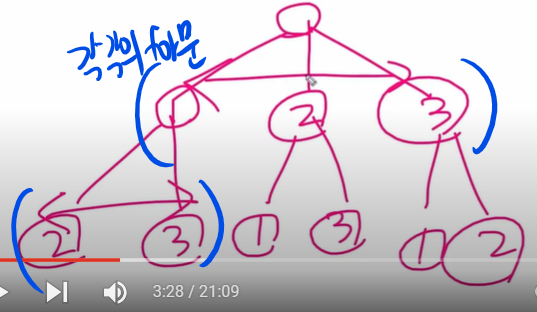

# [재귀] N과 M이해하기

날짜: 2024년 10월 14일

# 모든 경우의 수를 확인해야 할 때 
→ 재귀함수 사용한 백트래킹

---

- 백트래킹 언제? = N, M일 때 (수가 정해져있지 않고, 달라질 때)
    - for문을 늘리면서 사용할 수 없을 때
- 트리방식으로 이해하면 좋다.



- 재귀 함수를 구현 → for문을 늘려서 깊이를 마음대로 설정할 수 있음
- 단, 재귀 함수는 `if로 마지막 값을 정해줄 수` 있어야 함


- for에서 1부터 N까지 가는것이 상기 그림을 결정
- 이 중에서 하나를 선택하고 재귀함수로 들어감 → 다시 for문을 만남
    - 즉 1의 과정이 → 2와 3을 만나게 됨 (2가 종료하고 3을 만남)
    - 결론적으로 num이 M과 만족할 때 종료하게 됨


## 리스트 동작을 단계별

---

1. **시작**: **`result = []`** (비어있음)
2. **1을 선택**:
    - **`result =`**
    - 1을 사용했다고 표시
3. **1 다음에 2를 선택**:
    - **`result = [1, 2]`**
    - 2개를 선택했으므로 "1 2" 출력
    - 2를 제거: **`result =`**
4. **1 다음에 3을 선택**:
    - **`result = [1, 3]`**
    - 2개를 선택했으므로 "1 3" 출력
    - 3을 제거: **`result =`**
5. **1로 시작하는 모든 경우를 봤으므로 1 제거**:
    - **`result = []`** (다시 비어있음)

1. **이제 2를 선택**:
    - **`result =`**
    - 2를 사용했다고 표시
2. **2 다음에 1을 선택**:
    - **`result = [2, 1]`**
    - 2개를 선택했으므로 "2 1" 출력
    - 1을 제거: **`result =`**
3. **2 다음에 3을 선택**:
    - **`result = [2, 3]`**
    - 2개를 선택했으므로 "2 3" 출력
    - 3을 제거: **`result =`**
4. **2로 시작하는 모든 경우를 봤으므로 2 제거**:
    - **`result = []`** (다시 비어있음)
5. **마지막으로 3을 선택**:
    - **`result =`**
    - 3을 사용했다고 표시
6. **3 다음에 1을 선택**:
    - **`result = [3, 1]`**
    - 2개를 선택했으므로 "3 1" 출력
    - 1을 제거: **`result =`**
7. **3 다음에 2를 선택**:
    - **`result = [3, 2]`**
    - 2개를 선택했으므로 "3 2" 출력
    - 2를 제거: **`result =`**
8. **모든 경우를 다 봤으므로 종료**

## 핵심 포인트

1. **추가 (Append)**:
    - `result.append(i)`는 현재 선택한 숫자를 리스트의 끝에 추가합니다.
    - 이는 새로운 숫자를 선택할 때마다 실행됩니다.
2. **제거 (Pop)**:
    - `result.pop()`은 리스트의 마지막 요소를 제거합니다.
    - 이는 백트래킹 과정에서 실행되며, 이전 상태로 돌아가는 역할을 합니다.
3. **재귀와 백트래킹**:
    - 재귀 호출 (`recur(num + 1)`) 이후에 `pop()`이 실행됩니다.
    - 이를 통해 모든 가능한 조합을 탐색하고, 이전 상태로 돌아갈 수 있습니다.
4. **상태 유지**:
    - `result` 리스트는 현재까지 선택된 숫자들의 상태를 나타냅니다.
    - 재귀 호출이 깊어질수록 리스트에 숫자가 추가되고, 백트래킹 시 제거됩니다.

이러한 과정을 통해 `result` 리스트는 모든 가능한 순열을 순차적으로 생성하고 출력하는 데 사용됩니다. 재귀와 백트래킹의 조합으로 효율적으로 모든 경우의 수를 탐색할 수 있습니다.

# 한줄에 하나씩 문제의 조건을 만족하는 수열을 출력한다. 중복되는 수열을 여러 번 출력하면 안되며, 각 수열은 공백으로 구분해서 출력

---

[](https://www.acmicpc.net/problem/15650)

- 1부터 N까지 1개 선택
- 결과값에 추가
- recur(num+1)
- 다음에도 선택해야하는데 중복없이 n개 선택해야 함 → `방문여부 체크`

```python
import sys
input = sys.stdin.readline  # 입력 속도 향상을 위해 sys.stdin.readline 사용

# N: 1부터 N까지의 자연수, M: 선택할 숫자의 개수
N, M = map(int, input().split())

result = []  # 현재 선택된 숫자들을 저장할 리스트
visited = [False] * (N+1)  # 각 숫자의 사용 여부를 표시할 리스트 (0은 사용하지 않으므로 N+1 크기로 생성)

def recur(num):
    # num: 현재까지 선택한 숫자의 개수
    if num == M:  # M개의 숫자를 모두 선택했다면
        print(' '.join(map(str, result)))  # 현재 결과를 출력
        return
    
    for i in range(1, N+1):  # 1부터 N까지의 숫자에 대해
        if not visited[i]:  # i번째 숫자를 아직 사용하지 않았다면
            visited[i] = True  # i번째 숫자를 사용했다고 표시
            result.append(i)  # 결과 리스트에 i 추가
            
            recur(num+1)  # 다음 숫자를 선택하기 위해 재귀 호출
            
            visited[i] = False  # i번째 숫자 사용 표시를 취소 (백트래킹)
            result.pop()  # 결과 리스트에서 i 제거 (백트래킹)

recur(0)  # 0개의 숫자로 시작하여 재귀 함수 호출
```

## 주요 포인트

1. **초기화**:
    - `result`와 `visited` 리스트를 초기화
    - `visited`는 N+1 크기로 만들어 1부터 N까지의 숫자 사용 여부를 쉽게 체크할 수 있게 한다.
2. **재귀 함수 `recur`**:
    - 이 함수는 현재까지 선택한 숫자의 개수(`num`)를 매개변수로 받는다.
    - 기저 조건(`num == M`)에 도달하면 현재 결과를 출력하고 종료한다..
    - 1부터 N까지의 모든 숫자에 대해 반복하며, 아직 사용하지 않은 숫자를 선택한다.
3. **백트래킹**:
    - 숫자를 선택한 후 재귀 호출을 하고, 호출이 끝나면 선택을 취소합니다.
    - 이를 통해 모든 가능한 조합을 효율적으로 탐색할 수 있습니다.
4. **시작점**:
    - `recur(0)`으로 함수를 시작
    - 이는 아직 **아무 숫자도 선택하지 않은 상태**에서 시작
        - 빈 상태에서 시작함으로써 모든 가능한 조합을 고려
        - 조합을 만들기 시작할 때, 아무것도 선택하지 않은 상태에서 시작하는 것이 논리적입

# 암시적 트리가 만들어지는 이유

---

ex) N=4, M=2

- 루트 노드는 빈 상태 **`[]`**
- 첫 번째 레벨에서 1, 2, 3, 4 중 하나를 선택
    - 두 번째 레벨에서는 첫 번째 선택보다 큰 숫자들 중 하나를 선택

```python
         []
   /    /   \    \
  1    2     3    4
 / \  / \   /
2  3 3  4  4
 4
```

```python
def recur(num):
    if num == M:
        print(' '.join(map(str, result)))
        return
    
    for i in range(1, N+1): #for 루프가 각 레벨에서 가능한 모든 선택지(분기)를 생성
        if not visited[i]:
            visited[i] = True
            result.append(i)
            
            recur(num+1)  # 호출이 트리의 다음 레벨로 이동
            
            visited[i] = False
            result.pop() #이전 레벨로 돌아가는 과정
            #숫자를 다시 미사용 상태로 되돌리고, 결과리스트에서 제거하여 -> 다음 반복에서도 가능하게
            #한번 선택한 숫자를 다시 사용하기 위함
```

```python
recur(0) 호출 → 루트 노드

i=1 선택 → ``
recur(1) 호출

i=2 선택 → [1,2] 출력
i=3 선택 → [1,3] 출력
i=4 선택 → [1,4] 출력
백트래킹하여 `` 제거

i=2 선택 → ``
recur(1) 호출
i=3 선택 → [2,3] 출력
i=4 선택 → [2,4] 출력
```