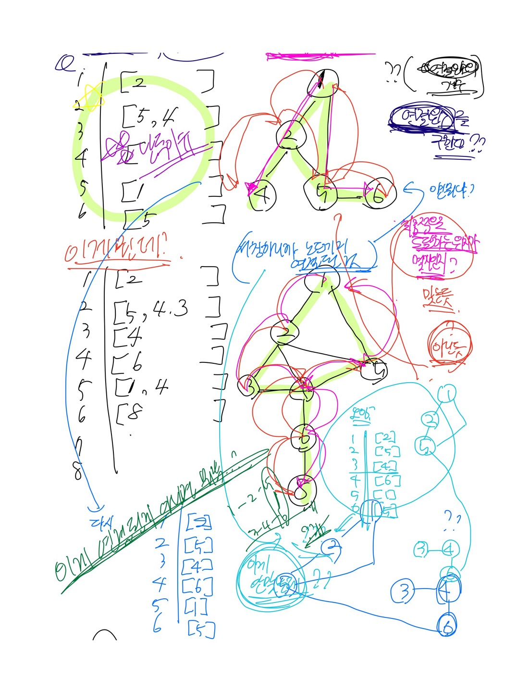

# baekjoon_11724

사이트: 백준
난이도: 실버2
날짜: 2024년 10월 20일
다중 선택: 파이썬
문제: ??????, ※, 취약파트
알고리즘 유형: DFS
완료: Yes
자료구조: 이차원리스트

## 접근 방법 & 아이디어




## 알아두면 좋을 개념, TIP

<aside>
💡

**연결리스트란?**

</aside>

- 연결 리스트(Linked List)**는 노드라는 단위로 구성된 자료 구조로, 각 노드는 데이터와 다음 노드를 가리키는 포인터를 포함**한다.
- 이 구조는 데이터가 메모리 상에 연속적으로 저장되지 않고, 필요에 따라 동적으로 추가되거나 삭제될 수 있는 장점이 있다.

## 코드 최종본

```python
#주석 없는 것
def dfs(adjList, start, visited):
    visited[start] = True
    for i in adjList[start]:
        if not visited[i]: #
            visited[i] = True
            dfs(adjList,i, visited)
    return
N, M = map(int, input().split())
adjList = [[] for _ in range(N+1)]
for i in range(M):
    v1, v2 = map(int, input().split())
    adjList[v1].append(v2)
    adjList[v2].append(v1)
visited = [False] * (N+1)
count = 0
for i in range(1, N+1):
    if visited[i] == False:
        count += 1
        dfs(adjList, i, visited)
print(count)
'---------------------------'
#주석 있는 것

#방향 없는 그래프가 주어졌을 떄? 연결 요소의 개수를 구한느 프로그램 (무방향? 뭐지 -> 양방향/단방향도 아닌것?)
#일단 양방향으로 묶어버리자
#첫째줄에 N과 간선의 개수 M이 주어진다. == 각각의 양 끝접
#문제 자첼 이해하지 못함 == 난독 이슈였다
#읽어봤을 떄 얼음틀이나, 유기농 배추와 비슷한 문제일 것 같다고 판단됨
#따라서 2차원 리스트처럼 그냥 단순 노드를 for구문으로 돌면서 count하면 될 것 같다고 판단

#값은 나오는데 채점중 1에서 안넘어감 -> recursive인가?
#오예 또 바로 나왔다! 왜 되고 있는지 의문임
import sys
sys.setrecursionlimit(10**6) #이건 나중에 기억해둬야할듯?
input = sys.stdin.readline

def dfs(adjList, start, visited):
    #현재 adjList
    visited[start] = True #해당 노드 방문 처리
    for i in adjList[start]: #start의 인접노드들 중
        if not visited[i]: #방문하지 않은 노드가 있을 때
            #방문한다
            visited[i] = True #방문처리
            #그리고 인접리스트 또 탐색
            dfs(adjList,i, visited) #dfs() takes 2 positional arguments but 3 were given
    return #동일하게 딱히 돌려줄 것은 없음

N, M = map(int, input().split()) #정점의 개수N, 간선의 개수M
#인접 리스트의 공간을 만든다
adjList = [[] for _ in range(N+1)] #정점 + 1 => 0을 포함하지 않을 것 이기 때문
#arr = [list(map(int, input().split())) for _ in range(M)] #간선 개수만큼
for i in range(M):
    v1, v2 = map(int, input().split())
    adjList[v1].append(v2)
    adjList[v2].append(v1) #양방향으로 노드 연결
#노드 연결 확인
#print(adjList)
#이제 1부터 N까지 노드를 돌고 연결 요소 확인을 위해 count한다
visited = [False] * (N+1)
count = 0
for i in range(1, N+1): #N까지 세야하기 때문에
    #0이 아니라면?
    if visited[i] == False:
        count += 1 #일단 있는 것이니 count + 1해주고
        #인접리스트 채우기
        #방문도 확인해야 함
        dfs(adjList, i, visited) #시작노드까지 -> 방향 전환 필요없음 => 방문 필요없을수도? : 아니 필요해
print(count)
```

## 초기 코드 구현

### 트러블 슈팅

---

## 지피티 참고

## 다른 방법 접근 시도