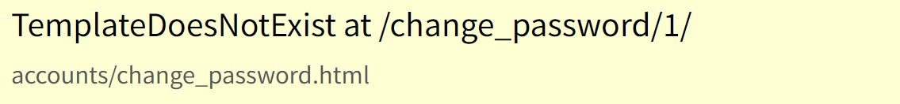

# [복습] Authenticated 헷갈리는 용어

날짜: 2024년 10월 13일

# login 함수 구현 시 → login() 메서드, form 이해하기

---

```sql
#login을 하기 위해서 get과 post로 생각
def login(request):
    if request.method == "POST":  
        form = AuthenticationForm(request, request.POST)
        if form.is_valid(): #form에 정보를 기반으로 -> 유저 확인
            my_login(request, form.get_user()) #요청 == save대신 -> 진행
            return redirect('accounts:index') #login 페이지--> 여기로 가는게 아니라 index로
    else : 
        form = AuthenticationForm() #인증 폼
    context = {
        'form' : form
    } #인증 페이지로
    return render(request, 'accounts/login.html', context) #login을 해야하니까
```

<aside>
💡

**login 메서드 ⇒ login(request. form.get_user())**

</aside>

- 요청(request)에 포함된 `세션 정보`와 폼에서 얻은 `사용자 정보`를 `연동`시켜 로그인 상태를 만드는 것
- 세션을 통해 서버에 사용자의 로그인 상태를 유지하는 방식

| 요소 | 설명 | 역할 |
| --- | --- | --- |
| `request` | HTTP 요청 객체 | `세션 정보를 포함`한  요청 데이터 제공 |
| `form.get_user()` | 인증된 사용자 객체 반환 메서드 | **폼에서 `인증된` 사용자 정보 추출** |
| `my_login` 함수 | 로그인 처리 함수 | 사용자를 로그인 상태로 만듦 |

| 단계 | 과정 | 설명 |
| --- | --- | --- |
| 1 | 폼 제출 | 사용자가 로그인 정보 입력 및 제출 |
| 2 | 폼 유효성 검사 | 입력된 정보의 유효성 확인 |
| 3 | 사용자 객체 획득 | `form.get_user()`로 인증된 사용자 정보 획득 |
| 4 | 로그인 함수 호출 | `my_login(request, user)` 호출 |
| 5 | 세션에 정보 저장 | 사용자 정보를 세션에 저장하여 로그인 상태 유지 |

## 세션 정보와 로그인 `사용자 정보를 연동`시키는 이유

---

<aside>
💡

 애플리케이션의 전반적인 보안, 사용성, 그리고 기능성을 크게 향상

</aside>

| 이유 | 설명 | 장점 |
| --- | --- | --- |
| 사용자 인증 유지 | 로그인 상태를 `여러 요청에 걸쳐 유지` | - `반복적인 로그인 불필요`
- 사용자 편의성 증가 |
| 보안 강화 | `인증된 사용자만 특정 리소스 접근` 가능 | - 무단 접근 방지
- 데이터 유출 위험 감소 |
| 사용자 경험 개선 | `개인화`된 서비스 제공 | - 이전 활동 지점부터 재개 가능
- 맞춤형 콘텐츠 제공 |
| 책임성 증가 | 사용자 `활동 추적` 및 책임 부여 | - 악의적 활동 억제
- 문제 발생 시 원인 파악 용이 |
| 세션 관리 | 로그인 상태의 체계적 관리 | - 세션 만료 처리
- 다중 서버 환경에서 일관성 유지 |
| 권한 관리 | 사용자별 `접근 권한` 차등 부여 | - 세분화된 접근 제어
- 역할 기반 권한 관리 |

⇒ 따라서 세션을 저장하고, 세션 아이디를 사용자에게 쿠키로 전달함

## 세션과 쿠키

---

<aside>
💡

서버는 세션을 저장하고 그 세션을 식별할 수 있는 ID를 쿠키를 통해 클라이언트에 보내주는 방식

</aside>

| 과정 | 설명 |
| --- | --- |
| 1. 세션 생성 | 서버에서 `사용자 인증 후 세션 정보 생성` |
| **2. 세션 ID 생성** | 생성된 세션에 대한 `고유 ID` 부여 |
| 3. 쿠키에 세션 ID 저장 | 세션 ID를 클라이언트 쿠키에 저장 |
| **4. 쿠키 전송** | 세션 ID가 포함된 `쿠키를 클라이언트`에 전송 |
| 5. 요청 시 쿠키 사용 | 클라이언트가 요청 시 쿠키의 세션 ID 포함 |
| 6. 세션 정보 접근 | `서버가 세션 ID로 해당 세션 정보 접근` |

# sth.html의 url 템플릿 태그의 구조 분석하기

---

```sql

```

네, URL 템플릿 태그의 구조를 표로 정리해 드리겠습니다:

| 구성 요소 | 예시 | 설명 | 정의 위치 |
| --- | --- | --- | --- |
| 앱 이름 (namespace) | `accounts` | URL 네임스페이스 지정 | `urls.py`의 `app_name = 'accounts'` |
| 구분자 | `:` | 앱 이름과 URL 이름 구분 | 템플릿 태그 내에서 사용 |
| URL 이름 | `login` | 특정 URL 패턴의 이름 | `urls.py`의 `name='login'` 파라미터 |

# 회원가입 생성 과정에서의 → [forms.py](http://forms.py) 작성 유의

---

- 회원가입에서 무언가를 가릴 필요가 없기 때문에 `fiels`는 고려하지 않아도 됨
- 메타태그는 `sth.Meta`

```sql
# .forms할필요가 없음
class MyUserCreationForm(UserCreationForm): #forms.UserCreationForm
    class Meta(UserCreationForm.Meta): #이런느낌? #메타상속..? 메타 부르기
        model = get_user_model() #사용자 기반으로 == 함수 호출을 해야 함!!
        #fields = ("Username", "Password",)
        #signup에는 별도 필드를 설정할 필요가 없음..!
        #meta만 특수하게 sth.META상속

#AttributeError: 'function' object has no attribute '_meta'

# class Form(forms.ModelForm):
#조금 다른 느낌    
#     class Meta:
#         model = 
#         fields = ("",)
```

# logout 버튼 활성화 오류

---

[base.html]

```html
  
    <a href="">[LOGIN]</a>
    <a href="">[Sign UP]</a>
  
    <a href="">[Update]</a> 
    <form action="" method="POST"> <!--logout--> 
      
      <input type="submit" value="[LOGOUT]">
    </form>
  
```

- 반대로 작성함 → 인증되었을 때 회원 수정 : 로그아웃이 진행되어야 함

[urls.py]

```python
path('logout/', views.logout, name='logout'),
```

[views.py]

```python
def logout(request):
    auth_logout(request)
    return redirect('accounts:index')
```

# AttributeError at /accounts/signupdate/

---

- 'AnonymousUser' object has no attribute '_meta'
    - 현재 익명 유저로 들어와짐 == 로그인 활성화 후 진행될 수 있도록 `@` 데코레이션 사용하는게 좋을 듯해보임

# TemplateDoesNotExist at /change_password/1/

---

- accounts/change_password.html



- templates가 존재하지 않는다.
    - 뷰에서 잘못된 템플릿 이름을 사용함
    - 템플릿 파일이 올바른 위치에 없음
        - 확인을 해보니까 == change_password의 html을 만들지 않음

## 비밀번호 변경에 취약

---

[나의 코드]

```python
path('change_password/<int:user_pk>/', views.change_password, name="change_password"),

```

<aside>
💡

수정 1

</aside>

```python
path('<int:user_pk>/password/', views.change_password, name="change_password"),
```

→ 일단 현재 추출한 것에서 / password/로 경로를 바꾸었다

[나의 코드]

[views.py]

```python
#비밀번호 변경 기능 구현
#    path('change_password/<int:user_pk>/', views.change_password, name="change_password"),
#그러면 동일하게 비밀번호 변경 form이 필요함 == 아마 내장?
#동일하게 업데이트 하는 것과 유사함 : 단 이거는 user정보를 받아서 지행해야 함
def change_password(request, user_pk):
    #user 정보...
    user = User.objects.get(pk=user_pk)
    if request.method == "POST":
        form = PasswordChangeForm(request.POST, user)
        if form.is_valid():
            form.save()
            return redirect('accounts:index') #비밀번호 변경되었을 떄 -> 변동없이 만들기
    else : #음.. request로 ..? request.user랑 비교 해야할 것 같음
        #?? 
        form = PasswordChangeForm(request, user)#어떤 것? 유저 정보를 받아와야 함
    context = {
        'form' : form
    }
    return render(request, 'accounts/change_password.html', context)

```

<aside>
💡

수정1

</aside>

```python
#비밀번호 변경 기능 구현
#    path('change_password/<int:user_pk>/', views.change_password, name="change_password"),
#그러면 동일하게 비밀번호 변경 form이 필요함 == 아마 내장?
#동일하게 업데이트 하는 것과 유사함 : 단 이거는 user정보를 받아서 지행해야 함
def change_password(request, user_pk):
    #user 정보...
    # user = User.objects.get(pk=user_pk)
    if request.method == "POST":
        form = PasswordChangeForm(request.user, request.POST) #user먼저 받는 것
        if form.is_valid():
            form.save()
            return redirect('accounts:index') #비밀번호 변경되었을 떄 -> 변동없이 만들기
    else : #음.. request로 ..? request.user랑 비교 해야할 것 같음
        #?? 
        form = PasswordChangeForm(request.user)#어떤 것? 유저 정보를 받아와야 함
    context = {
        'form' : form
    }
    return render(request, 'accounts/change_password.html', context)

```

| 항목 | PasswordChangeForm(request.user, request.POST) | form.get_user() |
| --- | --- | --- |
| 목적 | `현재 로그인한 사용자`의 비밀번호 변경 | 인증 후 사용자 객체 반환 |
| 사용 시점 | 비밀번호 변경 폼 초기화 | 로그인 폼 유효성 검사 후 |
| 첫 번째 인자 | `현재 인증된` 사용자 객체 | (해당 없음) |
| 두 번째 인자 | 폼 데이터 (POST 요청) | (해당 없음) |
| 관련 상황 | 사용자가 `이미 로그인된` 상태 | `사용자`가 로그인 시도 중
→ form에 새로운 사용자 →session없음 |
- `PasswordChangeForm`은 이미 인증된 사용자의 정보를 사용
- `form.get_user()`는 새로운 로그인 시도에서 사용자 정보를 얻음

⇒ **로그인된 사용자의 세션 정보를 이용하여 해당 사용자만의 비밀번호 변경을 가능하게 하는 것**

## 세션 자동 로그아웃 방지

---

→ `update_seesion_auth_hash`

```python
 user = form.save() #form.save()한 유저의 정보
update_session_auth_hash(request, user) #reuqest와 함께 같이 다시 돌려준다 -> login처럼
#login의 역할이 아니라 구조적인 부분이 동일하다는 것
```