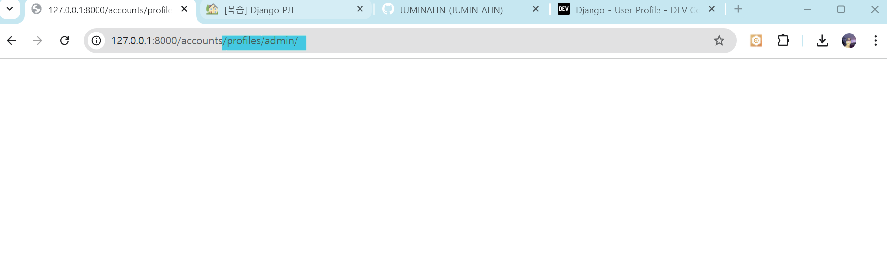

# [복습] Django PJT

날짜: 2024년 10월 20일

# AttributeError: module 'accounts.views' has no attribute 'username’

---

- 모듈 자체의 문제라서 일단 module 등록과 관련된 것부터 검토를 진행해야 할 것 같음
    - account view에 username이라는 속성이 없다..
    - view ⇒ 확인 == 현재 `profiles`로 명명해놓고, url에는 `username`으로 작성함

[프로젝트 자체 : urls.py]

```python
urlpatterns = [
    path('admin/', admin.site.urls),
    path('boards/', include('boards.urls')),
    path('accounts/', include('accounts.urls')), #accounts 확인
]
```

[앱 자체 : urls.py]

```python
  #path profiles => 근데 프로필 페이지는 여러 유저가 올 수 있음
    #바로 user의 정보를 담게 되면, risk가 발생함 => 따라서 어떠한 기능에 유저가 오는지를 명시해두는게 좋음
    path('profiles/<str:username>/', views.username, name="username") #아마 userpk를 작성해도 무방할 것이나 -> 사용자 친화성을 위해 username
```

→ [settings.py](http://settings.py) 확인 



→ 들어와지는 것 확인함

# Profile page View 만들기

---

- 현재 문제는 user model에 직접적인 접근
    - 권장사항이 아니므로 → `get_user_model` 을 사용해야 함

[views.py]

```python

from .models import User

#accounts에서 profile을 확인해야 함
def profiles(request, username): #link에서 받을 request내부와 username
    #이 username을 어떻게 할 것인가?
    #username과 관련된 페이지를 보여줘야 함 == 언제? 프로필 페이지를 눌렀을 때 == user의 정보를 가져와야 함
    user = User.objects.get(username=username) #username이라는 category에 username을 전달해준다.
    context = {
        'user' : user #이렇게 아닌데,,
    }
    return render(request, 'accounts/profile.html', context)
```

<aside>
💡

**수정 사항**

</aside>

```python
#accounts에서 profile을 확인해야 함
def profiles(request, username): #link에서 받을 request내부와 username
    #이 username을 어떻게 할 것인가?
    #username과 관련된 페이지를 보여줘야 함 == 언제? 프로필 페이지를 눌렀을 때 == user의 정보를 가져와야 함
    User = get_user_model() #직접적인 호출 => 권고사항X
    person = User.objects.get(username=username) #username이라는 category에 username을 전달해준다.
    context = {
        'person' : person #이렇게 아닌데,,
    }
    return render(request, 'accounts/profile.html', context)
```

## 왜 Usermodel을 직접 참조하지 않는가?

---

<aside>
💡

유연성, 재사용성, 유지보수 측면에서 `get_user_model()`이 큰 장점

</aside>

| 특성 | 직접 참조 (from .models import User) | **get_user_model() 사용** |
| --- | --- | --- |
| 유연성 | 낮음 | **높음** |
| 재사용성 | 낮음 | **높음** |
| 유지보수 | 어려움 | 용이함 |
| **커스텀 User 모델 지원** | **제한적** | **완전 지원** |
| 코드 변경 필요성 | 높음 | 낮음 |
| 프로젝트 간 이식성 | 낮음 | 높음 |

# 정참조 / 역참조 스스로 이해해보기

---

## 유저와 게시글의 관계

---

- User와 Article ⇒ 1:N관계

**[boards.model]**

```python
# Create your models here.
class Board(models.Model):
    #게시글과 user 참조 진행 중
    #외래키로 1대 N 관계 진행 중인 것을 알 수 있음
    #board즉 게시판에서 사용자를 조회한다면 => board = Board.objects.get(pk=pk)
    #board.author를 통해 조회할 수 있음 ==> 단 사용자가 board를 참조하려면?
    #author.board_set.all()을 진행해야 한다는 의미
    author = models.ForeignKey(settings.AUTH_USER_MODEL, on_delete=models.SET_NULL, null=True, related_name='board') #이미 역참조화
    #명확한 구분을 위해 related_name 설정 
    title = models.CharField(max_length=20)
    content = models.TextField()
    created_at = models.DateTimeField(auto_now_add=True)
    updated_at = models.DateTimeField(auto_now=True)
```

**[정방향 참조]**

- Board 모델에서 User 모델을 참조하는 것은 정방향 참조
    - board에 작성한 사용자 조회

```python
board = Board.objects.get(pk=1) 
author = board.author  # 이 게시글의 작성자 (User 인스턴스)
```

**[역참조]**

- User 모델에서 Board 모델을 참조하는 것이 역참조
    - 사용자가 작성한 보드 == 게시글 모두 조회

```python
user = User.objects.get(username='example_user')
user_boards = user.board_set.all()  # 이 사용자가 작성한 모든 게시글
```

**[accounts의 profile.html]**

```python
  <h1>유저가 쓴 글</h1>
  <div class='bg-secondary text-white'>
    <!--현재는 userporfile페이지로 board에 접근해야 하는 상황-->
    <!--person에 author가 있음 :: 내가 board로 바꿈-->
    <!--역 참조를 진행해야 함 -->
      
    <!--그런데 요구 조건을 보면 없을수도 있음 : 이부분 확인하고 if문으로 만들기-->
     <!--person.board.all이 있는 것이지-->
       <!--해당 유저가 작성한 게시글 조회 : 역참조 => board로 바꿈 : 모든 정보 조회-->
      <!--person in person.board.all : 여기서 for의 내용은 이걸로 하지 않아도 됨 :: 좀 더 명시화하자-->
        <p>글 번호 : {{article.pk}}</p> <!--해당 게시글의 번호를 가져온다 : 즉 board-->
        <p>글 제목 : {{article.title}}</p>
          
    
      <p>아직 작성한 게시글이 없습니다.</p>
    
  </div>
```

# 댓글과 게시글의 관계**

---

- User와 Comments관게 ⇒ 1:N
- Board와 Comments의 관계 ⇒ 1:N

**[boards.model]**

```python
class Comment(models.Model):
    #자 댓글을 보면 => 댓글로 저자에 접근하려면
    #상기 게시글에서 진행한 것과 동일하게 진행하면 됨 comment = Comment.Object.get(pk=pk)
    #댓글을 쓴 저자 접근 == comment.author
    #단, 역참조 => 저자가 쓴 댓글 모두 참고 == author.comment_set.all() => realted 설정했으니 author.usercomment.all()
    author = models.ForeignKey(settings.AUTH_USER_MODEL, on_delete=models.SET_NULL, null=True, related_name='usercomment') 
    #자 여기서도 게시글은 하나이지만 댓글이 여러개일 수 있음
    #comment.board로 접근하면 => 댓글이 달린 보드 == 해당 댓글이 있는 보드
    #board.comments.all() => 보드에 있는 댓글 전체 
    board = models.ForeignKey(Board, on_delete=models.CASCADE, related_name='comments')
    #대댓글 관련된 내용인 것 같음
    parent_comment = models.ForeignKey('self', on_delete=models.CASCADE, null=True, blank=True, related_name='replies')
    content = models.CharField(max_length=200)
    created_at = models.DateTimeField(auto_now_add=True)
    updated_at = models.DateTimeField(auto_now=True)
```

**[accounts의 profile.html]**

```python

  <h1>유저가 쓴 댓글</h1> <!--동일하게 접근 : 다시 models로 가서 한번 보자 -->
  <!--그러면 유저에서 댓글은 역참조해야함 -->
  
     <!--사람이 작성한 댓글 모두 조회-->
      <!--근데 어떠한 게시글에 대한 댓글을 작성했는지 알고 싶음-->
      <!--comment : 지금 댓글 --> <!--즉 댓글로 또 게시글 참조 : 바로 참조 가능-->
      <!--그냥 board라고하면 board에 대한 인스턴스만 뜸 : title까지 -->
      <p>작성한 게시글 명 : {{comment.board.title}} ---  유저의 댓글 : {{comment.content}}</p>
        
  
    <p>아직 작성한 게시글이 없습니다.</p>
  
```

## **User와 Comment 관계**

---

**[정방향 참조: Comment -> User]**

- 댓글에서 작성자 조회

```python
pythoncomment = Comment.objects.get(pk=1)
author = comment.author  *# 이 댓글의 작성자 (User 인스턴스)*
```

**[역참조: User -> Comment]**

- 사용자가 작성한 모든 댓글 조회

```python
pythonuser = User.objects.get(username='example_user')
user_comments = user.usercomment.all()  *# 이 사용자가 작성한 모든 댓글*
```

## **Board와 Comment 관계**

---

**[정방향 참조: Comment -> Board]**

- 댓글이 속한 게시글 조회

```python
pythoncomment = Comment.objects.get(pk=1)
board = comment.board  *# 이 댓글이 속한 게시글 (Board 인스턴스)*
```

**[역참조: Board -> Comment]**

- 게시글에 달린 모든 댓글 조회

```python
pythonboard = Board.objects.get(pk=1)
board_comments = board.comments.all()  *# 이 게시글에 달린 모든 댓글*
```

## **Comment 자기참조 관계 (대댓글)**

---

**[정방향 참조: Comment(Reply) -> Comment(Parent)]**

- 대댓글에서 원 댓글 조회

```python
pythonreply = Comment.objects.get(pk=2)  *# 대댓글 인스턴스*
original_comment = reply.parent_comment  *# 원 댓글 (Comment 인스턴스)*
```

**[역참조: Comment(Parent) -> Comment(Reply)]**

- 댓글에 달린 모든 대댓글 조회

```python
pythoncomment = Comment.objects.get(pk=1)
replies = comment.replies.all()  *# 이 댓글에 달린 모든 대댓글*
```

### 전반적인 구조 참고 주석

---

```python
class Comment(models.Model):
    # [정방향 참조: Comment -> User]
    # 댓글에서 작성자 조회
    # comment = Comment.objects.get(pk=1)
    # author = comment.author  # 이 댓글의 작성자 (User 인스턴스)
    author = models.ForeignKey(settings.AUTH_USER_MODEL, on_delete=models.SET_NULL, null=True, related_name='usercomment')

    # [역참조: User -> Comment]
    # 사용자가 작성한 모든 댓글 조회
    # user = User.objects.get(username='example_user')
    # user_comments = user.usercomment.all()  # 이 사용자가 작성한 모든 댓글

    # [정방향 참조: Comment -> Board]
    # 댓글이 속한 게시글 조회
    # comment = Comment.objects.get(pk=1)
    # board = comment.board  # 이 댓글이 속한 게시글 (Board 인스턴스)
    board = models.ForeignKey(Board, on_delete=models.CASCADE, related_name='comments')

    # [역참조: Board -> Comment]
    # 게시글에 달린 모든 댓글 조회
    # board = Board.objects.get(pk=1)
    # board_comments = board.comments.all()  # 이 게시글에 달린 모든 댓글

    # [정방향 참조: Comment -> Comment(Parent)]
    # 대댓글에서 원 댓글 조회
    # reply = Comment.objects.get(pk=2)  # 대댓글 인스턴스
    # original_comment = reply.parent_comment  # 원 댓글 (Comment 인스턴스)
    parent_comment = models.ForeignKey('self', on_delete=models.CASCADE, null=True, blank=True, related_name='replies')

    # [역참조: Comment(Parent) -> Comment(Reply)]
    # 댓글에 달린 모든 대댓글 조회
    # comment = Comment.objects.get(pk=1)
    # replies = comment.replies.all()  # 이 댓글에 달린 모든 대댓글

    content = models.CharField(max_length=200)
    created_at = models.DateTimeField(auto_now_add=True)
    updated_at = models.DateTimeField(auto_now=True)
```

# 팔로워가 0명인 것을 if 구문에서 나타내고 싶을 때

---

[초기 코드]

```python
  <h1>팔로워</h1>
   <!--팔로워가 0인 경우-->
    <p>팔로워 한 사람이 없습니다.</p>
  
    <p>팔로워는 총 {{person.followers | length}}명 입니다.</p>
  
```

<aside>
💡

**수정 코드**

</aside>

```python
  <h1>팔로워</h1>
   <!--팔로워가 0인 경우-->
    <p>팔로워 한 사람이 없습니다.</p>
  
    <p>팔로워는 총 {{person.followers | length}}명 입니다.</p>
  

```

# 팔로우 기능 구현

---

**[urls.py]**

```python
    #해당 유저를 follow => 해당 유저를 팔로우하는 것
    path('<str:username>/follows/', views.follows, name="follows"), #follow하는 것
```

**[views.py]**

```python

#이거는 post정보만 활용될 것
#팔로우 기능 구현 -> user이름 필요없음 pk정보 받아서 팔로우
def follows(request, user_pk):
    User = get_user_model()
    person = User.objects.get(pk=user_pk) #person 정보 받았음
    #이 사람의 정보를 받아서 -> 팔로우 하는 것
    #관계를 추가하는 것 -> 일단 내가 그 사람이면 안돼
    if request.user != person: #같으면 안되고
        #같지 않다면 -> 이 유저들의 관계속에 내가 있는지 확인 => follower들의 목록
        if request.user in person.followers.all() : #이 팔로워들 안에 있다면 ==> 여기서는 메서드 호출하기!!
            #관계 해제
            person.followers.remove(request.user) #지운다.
        else :
            #관계 추가 => add를 해준다. => 그냥 기존에
            person.followers.add(request.user) #그냥 그 profile 페이지에
    return redirect('accounts:profiles', person.username) #그사람의 정보 == profile에는 name을 사용하니까
```

→ 여기서는 메서드 `all()` 을 호출해주어야 한다

# 팔로우가 되지 않는 문제 발생

---

[profile.html]

```python
    <h1>{{person.username}}님의 프로필 페이지</h1> <!--일단 나 관련된 내용-->
    <!--일단 현재 나의 팔로잉, 팔로워-->
    <!--팔로잉은 나이 기준-->
    <!--팔로워는 역참조 : 일단 following과 followers간의 내용-->
    <!--팔로워도 person : 매개변수 인ㅅ자가 동일하기 떄문에-->
    <div>
      <p>팔로잉 : {{person.following|length}} / 팔로워 : {{person.followers|length}}</p>
      <!--follow상태일때, 아닐 떄 구분-->
      
         <!--전체-->
          <form action="accounts:follows" method="POST"> <!--follow에-->
            
            <!--정보 전달이 목적-->
            <input type="submit" value="unfollow">
          </form>        
        
          <form action="accounts:follows" method="POST"> <!--follow에-->
            
            <!--정보 전달이 목적-->
            <input type="submit" value="follow">
          </form>
        
      
      

    </div>
```

→ form 내용 중복

→ 또한 `url`이 제대로 담기지 않은 문제 확인

<aside>
💡

**수정 사항**

</aside>

```python
<form action="" method="POST">
```

[views.py]

```python
#이거는 post정보만 활용될 것
#팔로우 기능 구현 -> user이름 필요없음 pk정보 받아서 팔로우
def follows(request, user_pk):
    User = get_user_model()
    person = User.objects.get(pk=user_pk) #person 정보 받았음
    #이 사람의 정보를 받아서 -> 팔로우 하는 것
    #관계를 추가하는 것 -> 일단 내가 그 사람이면 안돼
    if request.user != person: #같으면 안되고
        #같지 않다면 -> 이 유저들의 관계속에 내가 있는지 확인 => follower들의 목록
        if request.user in person.followers.all() : #이 팔로워들 안에 있다면 ==> 여기서는 메서드 호출하기!!
            #관계 해제
            person.followers.remove(request.user) #지운다.
        else :
            #관계 추가 => add를 해준다. => 그냥 기존에
            person.followers.add(request.user) #그냥 그 profile 페이지에
    return redirect('accounts:profiles', person.username) #그사람의 정보 == profile에는 name을 사용하니까
```

# NoReverseMatch at /accounts/profiles/login/

```
Reverse for 'follows' not found. 'follows' is not a valid view function or pattern name.
```

---

→ follow name이 없다?

```python
 path('<int:user_pk>/follows/', views.follows, name="follow"), #follow하는 것
```

⇒ follow인 것 확인 ⇒ 수정

# 단 팔로잉을 했는데도 불구하고, 숫자가 상승되는게 반영이 안됨

---

[profile.html]

```python
<p>팔로잉 : {{person.following|length}} / 팔로워 : {{person.followers|length}}</p>
<p>팔로워는 총 {{person.followers | length}}명 입니다.</p>
```

<aside>
💡

**수정사항 ⇒ 계속 all을 빼먹는다**

</aside>

```python
<p>팔로잉 : {{person.following.all | length}} / 팔로워 : {{person.followers.all | length}}</p>
<p>팔로워는 총 {{person.followers.all | length}}명 입니다.</p>

```

# 게시글에 좋아요 기능 구현 → 여기 많이 부족함

---

## 먼저 N:N관계 설정을 해주어야 함

---

```python
    #이제는 여러 유저가 좋아요 누를 수 있음을 염두
    #보드에 -> 좋아요를 누른 유저 == like_users
    like_users = models.ManyToManyField(settings.AUTH_USER_MODEL, related_name='like_boards') #N:N의 관계이기 떄문에 => 다대다 관계 => migration 에러 발생
    #역참조 이름때문에 충돌가능성 있음
    #유저가 좋아요를 누른 게시글들 => like_boards
```

## URL 설정

---

```python
    #특정 게시글에 접근을 해야함
    path('<board_pk>/likes/', views.likes, name='likes'),
```

## views 설정

---

```python
#좋아요.. => 누르고, 취소할 수 있음 ==> 이것도 post가 딱히 필요없는 부분
#게시판 정보 받아오기
def likes(request, board_pk):
    board = Board.objects.get(pk=board_pk) #특정보드
    #근데 board에 좋아요 눌러야하니까 => 일단 요청 유저와 board에 작성자가 달라야 함
    #board에서 작성자 확인
    if request.user != board.author: #이게 아니어야 좋아요 가능
        #board자체의 like_users에 접근 => 보드에 like_users를 한사람은 많을 것 :: 정참조
        #보드에 좋아요를 누른 유저 중 한명인가요?
        if request.user in board.like_users: #뭔가 이상한데..
            #좋아요를 눌렀다면 취소
            board.like_board.remove(request.user)
        else :
            board.like_board.add(request.user)

```

→ 뭔가 이상함

→ 역참조를 따로하지 않아도 됨

<aside>
💡

**수정 사항**

</aside>

```python
#좋아요.. => 누르고, 취소할 수 있음 ==> 이것도 post가 딱히 필요없는 부분
#게시판 정보 받아오기
def likes(request, board_pk):
    board = Board.objects.get(pk=board_pk) #특정보드
    #근데 board에 좋아요 눌러야하니까 => 일단 요청 유저와 board에 작성자가 달라야 함
    #board에서 작성자 확인
    if request.user != board.author: #이게 아니어야 좋아요 가능
        #board자체의 like_users에 접근 => 보드에 like_users를 한사람은 많을 것 :: 정참조
        #보드에 좋아요를 누른 유저 중 한명인가요?
        if request.user in board.like_users.all(): #그 중에서도 전체임을 호출해야 함
            #좋아요를 눌렀다면 취소
            board.like_user.remove(request.user) #여기서도 추가가능
        else :
            board.like_user.add(request.user)
```

# ValueError at /boards/2/likes/

```
The view boards.views.likes didn't return an HttpResponse object. It returned None instead.
```

---

```python
@login_required
def likes(request, board_pk):
    board = Board.objects.get(pk=board_pk) #특정보드
    #근데 board에 좋아요 눌러야하니까 => 일단 요청 유저와 board에 작성자가 달라야 함
    #board에서 작성자 확인
    if request.user != board.author: #이게 아니어야 좋아요 가능
        #board자체의 like_users에 접근 => 보드에 like_users를 한사람은 많을 것 :: 정참조
        #보드에 좋아요를 누른 유저 중 한명인가요?
        if request.user in board.like_users.all(): #그 중에서도 전체임을 호출해야 함
            #좋아요를 눌렀다면 취소
            board.like_users.remove(request.user) #여기서도 추가가능
        else :
            board.like_users.add(request.user)
# return 값을 넣지 않은 문제
```

### 추가 참고 사항

---


[The Django template language | Django documentation](https://docs.djangoproject.com/en/5.1/ref/templates/language/)