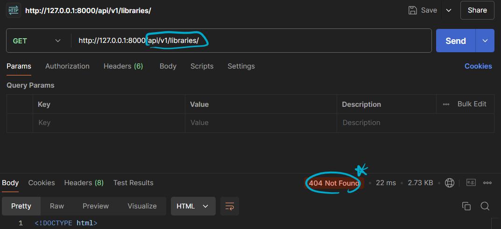

# [복습] DRF

날짜: 2024년 10월 16일

<aside>
💡

**직렬화 과정**

</aside>

1. 객체의 상태(필드 값들)를 가져옵니다.
2. 이 상태를 일련의 **바이트로 변환**합니다.
3. 이 바이트들을 파일에 저장하거나 **네트워크를 통해 전송**

| 특성 | ModelSerializer | 일반 Serializer |
| --- | --- | --- |
| 코드 간결성 | 높음 (자동 필드 생성)
→ 코드 적게 작성해도 됨 | 낮음 (수동 필드 정의)
→ 많은 코드 작성해야하지만,
    원하는대로 커스터마이즈 |
| 모델 연결 | **장고 모델과** `직접 연결` | `연결 없음` |
| create()/update() | 자동 구현 | 수동 구현 필요 |
| 유효성 검사 | `모델 기반 자동 적용`
→ 자동으로 serializer 필드 변환 | 수동 구현 필요
→ 직접 모든 필드 정의 |
| 유연성 | 낮음 | 높음 |
| 주요 사용 사례 | `모델 기반 CRUD 작업` | 복잡한 데이터 구조, 커스텀 로직 |
| 데이터 베이스 | 그대로 API 만들 때 사용 |  |

# ModelSerializer와 일반 Serializer의 차이

---

- 하기와 같은 장고모델이 있을 때 → book모델

```python
from django.db import models

class Book(models.Model):
    title = models.CharField(max_length=100)
    author = models.CharField(max_length=50)
    publication_date = models.DateField()
    price = models.DecimalField(max_digits=5, decimal_places=2)
```

## ModelSerializer 사용시

---

```python
from rest_framework import serializers
from .models import Book

class **BookModelSerializer(serializers.ModelSerializer)**:
    class Meta:
        model = Book
        fields = ['title', 'author', 'publication_date', 'price']
```

- ModelSerializer는 Book 모델의 필드를 자동으로 serializer 필드로 변환
- 간단한 CRUD 작업
- Book 모델의 모든 필드를 그대로 API로 노출시키고 싶을 때

## 일반 Serializer 사용 → 유연성이 장점

---

```python
from rest_framework import serializers

class BookSerializer(serializers.Serializer): #동일하게 코드를 작성해야하는 문제
    title = serializers.CharField(max_length=100)
    author = serializers.CharField(max_length=50)
    publication_date = serializers.DateField()
    price = serializers.DecimalField(max_digits=5, decimal_places=2)

    def create(self, validated_data): #그리고 관련 내부 데이터를 생성해야함
        return Book.objects.create(**validated_data)

    def update(self, instance, validated_data):
        instance.title = validated_data.get('title', instance.title)
        instance.author = validated_data.get('author', instance.author)
        instance.publication_date = validated_data.get('publication_date', instance.publication_date)
        instance.price = validated_data.get('price', instance.price)
        instance.save()
        return instance
```

- 일반 Serializer는 모든 필드를 직접 정의해야 하며, create()와 update() 메서드도 직접 구현
- 코드 세밀하게 직접 제어 가능
- 책 정보와 함께 재고 상태를 포함시키고 싶을 때

## Model Serialization 작동방식

---

- 작동 방식은 ModelForm과 매우 유사

[Book-model]

```python
class Book(models.Model):
    title = models.CharField(max_length=100)
    author = models.CharField(max_length=50)
    publication_date = models.DateField()
```

[ModelSerializer]

```python
class BookSerializer(serializers.ModelSerializer):
    class Meta:
        model = Book
        fields = ['title', 'author', 'publication_date']
```

# ArticleListSerializer() 이해하기

---

| **매개변수** | **의미** | **역할** |
| --- | --- | --- |
| instance | 직렬화할 모델 인스턴스나 쿼리셋 | 단일 객체 또는 여러 객체의 컬렉션을 직렬화 |
| data | **역직렬화할 데이터** | API 요청에서 받은 데이터를 검증하고 모델 인스턴스로 변환 |
| many | **여러 객체 처리 여부** | True로 설정 시 쿼리셋이나 객체 리스트를 처리 |
| context | 추가적인 컨텍스트 정보 | 직렬화 과정에서 추가 데이터 전달 |

## Serializer와 ModelForm 비교

---

<aside>
💡

**Serializer는 API 개발에 특화되어 있으며, 데이터의 직렬화와 역직렬화를 효과적으로 처리
ModelForm은 전통적인 웹 폼 처리에 더 적합**

</aside>

- Django 시리얼라이저(Serializer)의 주요 목적 중 하나는 Django 모델 인스턴스나 쿼리셋을 `JSON과 같은 형식으로 변환`

| **특성** | Serializer | ModelForm |
| --- | --- | --- |
| **용도** | **API 응답 생성, 데이터 JSON 변환** | HTML 폼 생성 및 처리 |
| **데이터 처리** | 복잡한 데이터 구조, 다양한 형식 변환 | 주로 HTML 폼 데이터 처리 |
| **유효성 검사** | API 요청 데이터 검증 | HTML 폼 입력 검증 |
| **출력 형식** | **JSON 등 API 형식** | **HTML 폼** |
| **사용 환경** | **RESTful API 개발** | **전통적인 Django 웹 애플리케이션** |

# serializer.data의 의미

---

```python
# 모델 인스턴스
article = Article.objects.get(id=1)

# Serializer 사용
serializer = ArticleSerializer(article)

# 직렬화된 데이터 접근
print(serializer.data)
# 출력: {'id': 1, 'title': '제목', 'content': '내용', ...}

# 모델 속성 직접 접근
print(article.pk)
# 출력: 1
```

**[data로 추출했을 때] : 딕셔너리 형태로 출력**

```python
{'id': 1, 'title': '제목', 'content': '내용'}
```

**[instance로 추출했을 때] :  참조하는 모델 인스턴스를 출력**

```python
Article: Article object (1)>
```

**[단순 serializer] : 객체 자체 출력시 필드 정의와 메타 데이터 표시**

```python
ArticleSerializer(<Article: Article object (1)>):
id = IntegerField(read_only=True)
title = CharField(max_length=100)
content = CharField(style={'base_template': 'textarea.html'})
```

# Response와 render HTTP응답 생성 & 동작방식

- 금번 json 파일을 사용할 때 templates를 사용할 필요가 없음

---

<aside>
💡

결론적으로, `HttpResponse`와 `render`는 모두 HTTP 응답을 생성
API 개발이나 특수한 응답이 필요한 경우 `HttpResponse`
일반적인 웹 페이지 렌더링에는 `render`를 사용하는 것이 일반적

</aside>

| **특성** | HttpResponse | render |
| --- | --- | --- |
| **주요 용도** | 단순한 텍스트 응답, **JSON 데이터 등** | **HTML 템플릿 렌더링** |
| **템플릿 사용** | **직접 사용 불가** | **자동으로 템플릿 렌더링** |
| **컨텍스트 데이터** | 직접 처리 필요 | 쉽게 전달 가능 |
| **유연성** | 더 높음 (**다양한 컨텐츠 타입**) | **HTML 응답에 최적화** |
| **사용 복잡도** | 상대적으로 더 복잡 | 간단하고 편리 |

# ModuleNotFoundErorr : No module name ‘api’

---

- Django 프로젝트에서 'api' 모듈을 찾을 수 없다는 것

[urls.py]

```python
from django.contrib import admin
from django.urls import path, include

urlpatterns = [
    path('admin/', admin.site.urls),
    path('api/v1/libraries/', include('api.v1.libraries.urls')),
]
```

[Home - Django REST framework](https://www.django-rest-framework.org/#)

→ 수정 [장고 내부 모듈에 따라서]

```python
urlpatterns = [
    path('admin/', admin.site.urls),
    path('api/v1/libraries/', include('rest_framework.urls')), #장고 프레임워크에 나온것처럼
]

```

# 404 not Found Error

---



```python
urlpatterns = [
    path('admin/', admin.site.urls),
    #path('api/v1/libraries/', include('rest_framework.urls')), #장고 프레임워크에 나온것처럼
    path('api/v1/libraries/', include('libraries.urls')), #장고 프레임워크에 나온것처럼
]

```

→ 장고 자체 rest_api_로그인 페이지 주소로 보내지던 문제 ⇒ 다시 urls 수정


⇒ urls 중복 문제 확인 (수정)


# AssertionError at /api/v1/libraries/

- .accepted_renderer not set on Response

---

- 조건이 거짓인 경우에 실행을 중단시키고 내는 에러


```
.accepted_renderer not set on Response
>> you forgot to add the @api_view and the@renderer_classes decorator to your view.
```

## AssertionError: @api_view expected a list of strings, received str

---

```python
from rest_framework.decorators import api_view #decorator

#여러개 조회
# Create your views here.
@api_view(['GET']) #여러 메서드를 받을 수 있음 -> 일단 단순 조회
```

→ serializers.py를 다시 확인하라고 되어있어서 다시 확인하고 ctrl+s만 했다.

```python
#직렬화라는 키워드를 기반으로 -> 검색 진행 중
#직렬화!
#전체는 list로 받고, 일부는 그냥 단순 요소로 받자
class BookListSerializers(serializers.ModelSerializer): #serializers.ModelSerializer
    #? 다시 저장을 하니까 작동이 된다.
    class Meta:
        model = Book #BOOK 모델 사용
        fields = "__all__" #모든 필드 포함
        
 -> 바꾼 내용은 없음
```


→ 원하는 모양으로 다시 받을 수 있게 되었다.


- 원하는 값을 찾을 수 있었음
- 제목만 추출할 수 있도록 한 번 더 수정

```python
class BookListSerializers(serializers.ModelSerializer): #serializers.ModelSerializer
    #? 다시 저장을 하니까 작동이 된다.
    class Meta:
        model = Book #BOOK 모델 사용
        fields = ('title', )#"__all__" #모든 필드 포함
```


⇒ 추가 상세 정보도 출력


# 나만의 API를 만드는 과정

---

- 주어진 지침에 따라 Django와 Django REST Framework(DRF)를 사용하여 간단한 API를 구축하는 프로젝트를 진행

<aside>
💡

**주요 단계**

</aside>

- **가상 환경 설정**: Python 가상 환경을 생성하고 Django를 설치합니다.
- **Django REST Framework 설치**: DRF를 설치하고 설정합니다.
- **프로젝트 및 앱 생성**: **`first_api_project`**라는 이름의 Django 프로젝트와 **`libraries`**라는 앱을 생성합니다.
- **모델 정의**: 책 정보를 저장할 **`Book`** 모델을 정의합니다.
- **데이터베이스 초기화**: **`book.json`** 파일의 데이터를 데이터베이스에 로드합니다.
- **API 엔드포인트 구현**:
    - 전체 도서 목록을 조회할 수 있는 엔드포인트
    - 특정 도서의 상세 정보를 조회할 수 있는 엔드포인트

# API 구축과 API 불러오기

---

<aside>
💡

- API 구축은 서버 측에서 인터페이스를 설계
- API 불러오기는 클라이언트 측에서 그 인터페이스를 사용하여 데이터를 가져오는 과정
</aside>

| **구분** | **API 구축** | **API 불러오기** |
| --- | --- | --- |
| **목적** | 서버에서 데이터를 제공하거나 기능을 수행할 수 있는 인터페이스를 만듭니다. | 클라이언트에서 서버에 요청을 보내고 데이터를 받아 
사용합니다. |
| **과정** | - `모델 정의`
- 엔드포인트 설정
- 데이터 처리
- JSON 응답 반환 | - HTTP 요청 전송
- JSON 데이터 수신
- 받은 데이터 처리 및 사용 |
| **역할** | 주로 백엔드 개발자가 담당합니다. | 주로 프론트엔드 개발자가 담당합니다. |

# Rest_Frame : 하나의 URL에서 여러 HTTP 메서드 처리

---

- **단일 URL로 처리**: Django REST Framework에서는 하나의 URL에서 여러 HTTP 메서드(**`GET`**, **`POST`** 등)를 처리할 수 있다.

<aside>
💡

- DRF는 라우터와 뷰셋을 통해 URL 패턴을 자동으로 생성하고 관리할 수 있어, 개발자가 수동으로 URL 패턴을 정의할 필요가 줄어든다.
</aside>

| **항목** | **설명** |
| --- | --- |
| **하나의 URL 사용** | `@api_view` 데코레이터를 사용하여 `GET`, `POST` 등 여러 메서드를 한 URL에서 처리합니다. |
| **HTTP 메서드 분기** | 요청의 메서드(`GET`, `POST`)에 따라 다른 로직을 실행합니다. |
| **장점** | 코드 중복을 줄이고 관리가 용이하며, 모든 관련 로직이 한 곳에 모여 있습니다. |
| **CRUD와 차이점** | REST API는 HTTP 메서드로 CRUD 작업을 매핑하여 `하나의 엔드포인트에서 처리`합니다. |
| **직렬화 및 유효성 검사** | 데이터를 직렬화하고, 유효성을 검사하여 `올바른 경우에만 데이터베이스에 저장`합니다. |

| **항목** | **Django REST Framework** | **일반 CRUD** |
| --- | --- | --- |
| **URL 구조** | 하나의 URL에서 여러 HTTP 메서드(`GET`, `POST`, `PUT`, `DELETE`)를 처리 | 각 작업(Create, Read, Update, Delete)에 대해 별도의 URL을 사용 |
| HTTP 메서드 분기 | 요청의 **메서드에 따라** 다른 로직을 실행하여 다양한 작업을 수행 | 각 URL이 특정 작업만 수행하도록 설계 |
| **장점** | **코드 중복을 줄이고,** 유지보수가 용이하며, 일관된 API 설계를 제공 | 명확한 URL 구조로 인해 각 작업이 독립적으로 관리 |
| **직렬화 및 유효성 검사** | 데이터를 직렬화하고 유효성을 검사하여 올바른 경우에만 데이터베이스에 저장 | 폼 데이터를 수동으로 처리하고 유효성을 검사 |

# POST 요청시 is_valid()의 False를 반환하는 케이스

---

1. **필수 필드 누락**: 모델에서 **`required=True`**로 설정된 필드가 POST 데이터에 없는 경우.
2. **데이터 타입 불일치**: 예를 들어, 정수 필드에 문자열이 전달된 경우.
3. **유효성 검사 실패**: 커스텀 유효성 검사 로직에 실패한 경우.
4. **고유성 제약 조건 위반**: 유니크 필드에 이미 존재하는 값이 전달된 경우.

```python
class Article(models.Model):
    title = models.CharField(max_length=100)
    content = models.TextField()
    published_date = models.DateField()

class ArticleSerializer(serializers.ModelSerializer):
    class Meta:
        model = Article
        fields = ['title', 'content', 'published_date']
```

1. **`{"content": "Some content"}`** # title 필드 누락
2. **`{"title": "Title", "content": "Content", "published_date": "not a date"}`** 
 # 잘못된 날짜 형식
3. **`{"title": "A" * 101, "content": "Content", "published_date": "2023-10-16"}`** 
 # title이 너무 김 이러한 경우들에서 serializer는 유효하지 않다고 판단하고, 적절한 오류 메시지를 반환

# API 응답은 일반적으로 단순한 딕셔너리가 아니라 구조화된 형태로 제공

---

1. **최상위 키**: 응답은 보통 "data", "results", "response" 등의 최상위 키로 감싸져 있다.
2. **메타데이터**: 많은 API는 응답에 메타데이터를 포함한다.
3. **중첩 구조**: 응답 내부에는 객체와 배열이 중첩되어 복잡한 구조를 형성할 수 있다.

```python
{
  "status": "success",
  "data": {
    "items": [
      {
        "id": 1,
        "name": "Item 1"
      },
      {
        "id": 2,
        "name": "Item 2"
      }
    ],
    "total": 2
  },
  "metadata": {
    "page": 1,
    "per_page": 10
  }
}
```

- "status"는 요청의 성공 여부
- "data"는 실제 응답 데이터를 포함
- "metadata"는 페이지네이션 정보 제공

# POST로 유효성 검증 진행

---

```python
    elif request.method == "POST":  #전체 만들기
        #data를 받아서 넣기
        serializer = BookSerializer(data=request.data, many=True) #데이터 확인
        #유효성 검사 진행
        if serializer.is_valid():
            serializer.save() #유효성 검증 진행
            return Response(serializer.data, status=status.HTTP_201_CREATED) #201 status 코드 반환
        return Response(serializer.data, status=status.HTTP_400_BAD_REQUEST)
```

→ 실제 테스트 과정


```python
{
    "fields": {
        "isbn": "K992834571",
        "author": "국립과천과학관 박은지 (지은이), 김정진 (그림)",
        "title": "과학이 톡톡 쌓이다! 사이다 7 - 시간×이상한 나라의 앨리스"
    }
}
```

→ 이런식으로 출력형식을 맞추어 줘야 함

**[postman에서 데이터 입력받기]**


# 삭제

---


- 삭제시 어떤 데이터에 접근해야하는지 알아야하기 때문에
    - view메서드를 호출하지 않을 시 발생하는 문제
        - `"DELETE /api/v1/libraries/1/ HTTP/1.1" 405 43`

## 상기 출력값 오류

---

- 원하는 번호가 나오는게 아니라 {}가 나옴
    - f-string 사용해서 해결

```python
    elif request.method == "DELETE":# 이전까지 게시글 삭제와 동일
        book.delete() #기존과 동일
        return Response(f'도서 고유번호 {book.isbn}번의 {book.title}을 삭제하였습니다' )
```