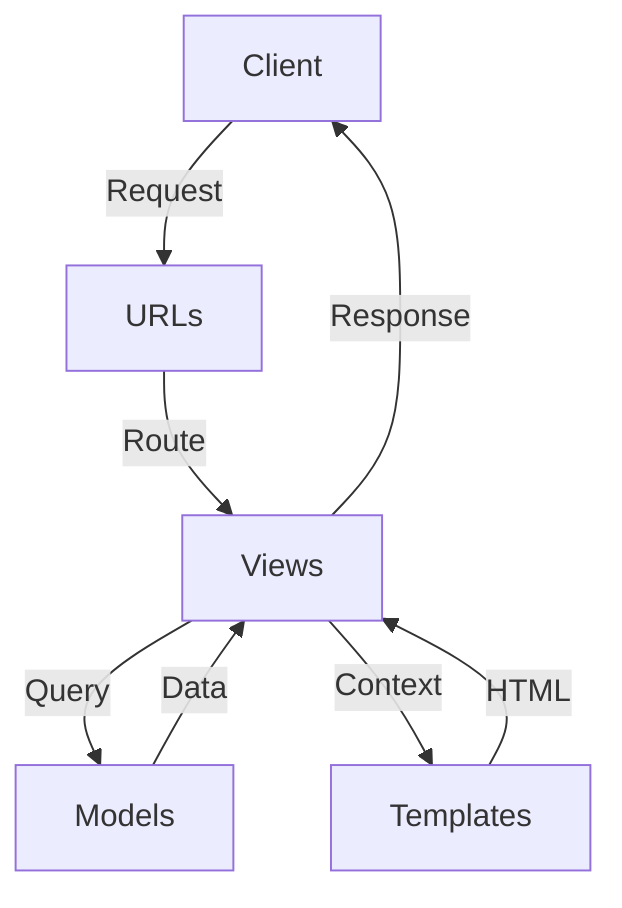
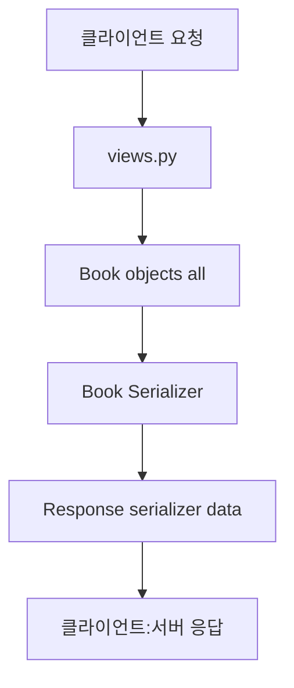
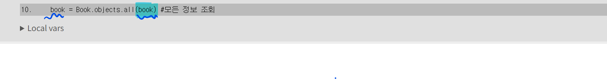

# [복습] DRF1 / 기존 Django와 API의 차이 이해하기

날짜: 2024년 10월 26일

[[복습] DRF](https://www.notion.so/DRF-121c4eca659c8089bcbffcd480dfe391?pvs=21)

[[복습] DRF2](https://www.notion.so/DRF2-122c4eca659c809c8e39d9ea46e9266a?pvs=21)

# 과거 view 로직 자체를 다시 한 번 더 이해해보기

---

## Django MTV 패턴 도식화

---



```
[Client] <--> [URLs] <--> [Views] <--> [Models]
                             ^
                             |
                             v
                        [Templates]
```

## Django CRUD 프로세스 표

---

| 단계 | 구성 요소 | 역할 |
| --- | --- | --- |
| 1. URL 정의 | [urls.py](http://urls.py/) | 사용자 요청 URL과 View 함수 매핑 |
| **2. 모델 정의** | [models.py](http://models.py/) | **데이터베이스 구조 정의 (ORM)** |
| 3. 폼 생성 | [forms.py](http://forms.py/) | 데이터 입력 및 유효성 검사 양식 정의 |
| **4. 뷰 로직 구현** | [views.py](http://views.py/) | **요청 처리, 모델-템플릿 연결, 비즈니스 로직** |
| 5. 템플릿 작성 | templates/*.html | 사용자에게 보여질 HTML 구조 정의 |
| **6. 데이터베이스 조작** | **ORM ([views.py](http://views.py/) 내)** | **모델을 통한 데이터 CRUD 작업** |

## Django CRUD 프로세스 개요

---

| 단계 | 구성 요소 | 주요 역할 | 관련 파일 |
| --- | --- | --- | --- |
| 1 | URL 설정 | • URL 패턴과 뷰 함수 매핑
• 사용자 요청 라우팅 | [urls.py](http://urls.py/) |
| 2 | 모델 정의 | **• 데이터베이스 스키마 설계**
• ORM을 통한 데이터베이스 추상화 | [models.py](http://models.py/) |
| 3 | 폼 생성 | • **데이터 입력 양식 정의**
• 입력 데이터 유효성 검사
⇒  `ModelForm은 모델을 기반으로 폼을 자동 생성` | [forms.py](http://forms.py/) |
| 4 | 뷰 로직 구현 | • HTTP 요청 처리 (GET, POST 등)
• 비즈니스 로직 수행
• **모델과 템플릿 연결** | [views.py](http://views.py/) |
| 5 | 템플릿 작성 | • 사용자 인터페이스 구조 정의
• 동적 데이터 렌더링 | templates/*.html |
| 6 | **데이터베이스 조작** | **• CRUD 작업 수행**
• 모델 인스턴스 생성, 조회, 수정, 삭제 | ORM ([views.py](http://views.py/) 내) |

## ⚠️ model과 modelform에 대한 로직 이해 그려보기

---

<aside>
💡

- Model은 데이터베이스 구조와 데이터를 관리
- ModelForm은 이 Model을 기반으로 사용자 입력을 받고 처리하는 인터페이스 역할
</aside>

- ModelForm은 Model의 필드를 기반으로 자동으로 폼을 생성
    - 데이터 생성/수정/삭제 작업을 더 쉽고 안전하게 수행할 수 있게 해준다.
    - 이는 데이터 유효성 검사와 저장 과정을 간소화하고, Model과 일관된 데이터 구조를 유지하는 데 도움을 준다.

**[데이터 베이스를 조회해야 무엇이 있는지 알고, 거기에 맞는 폼을 작성해야 추가/생성/삭제를 할 수 있음]**

## 기본 MTV 패턴 예시를 보고 뜯어서 이해해보기

- 블로그 포스트 생성 기능을 구현하는 django MTV패턴 예시

---

[urls.py]

```python
from django.urls import path
from . import views

urlpatterns = [
    path('create/', views.create_post, name='create_post'),
    path('', views.post_list, name='post_list'),
]
```

[models.py]

```python
from django.db import models

class Post(models.Model):
    title = models.CharField(max_length=200)
    content = models.TextField()
    created_at = models.DateTimeField(auto_now_add=True)

    def __str__(self):
        return self.title
```

[forms.py]

```python
from django import forms
from .models import Post

class PostForm(forms.ModelForm):
    class Meta:
        model = Post
        fields = ['title', 'content']
```

[views.py]

```python
from django.shortcuts import render, redirect
from .forms import PostForm
from .models import Post

def create_post(request):
    if request.method == 'POST':
    #이건 단순 데이터를 기록하는 것이기 때문에 데이터 조회가 필요 없음
        form = PostForm(request.POST) #post로 받은 내용 받아서
        if form.is_valid(): #유효성 검사
            form.save()
            return redirect('post_list')  # 포스트 목록 페이지로 리다이렉트
    else:
        form = PostForm() #양식 페이지만 전달
    return render(request, 'create.html', {'form': form})

def post_list(request):
    posts = Post.objects.all() #post 자체의 데이터 베이스 모두 조회
    return render(request, 'list.html', {'posts': posts})
```

[templates/create.html]

```python
<!DOCTYPE html>
<html>
<head>
    <title>Create New Post</title>
</head>
<body>
    <h1>Create New Post</h1>
    <form method="post">
        
        {{ form.as_p }}
        <button type="submit">Create Post</button>
    </form>
</body>
</html>
```

etc.. 기본적인 ⇒ 로그인/로그아웃/회원가입/팔로우/좋아요 기능/이미지 추가 기능도 있음

$\large\color{white}━━━━━━━━━━━━━━━━━━━━━━━━━━━━━━$

# 과거 view 함수와의 응답 데이터 비교

---

### 기존 뷰 방식(서버 사이드 렌더링)

---

[index.html]

```python
<!DOCTYPE html>
<html lang="ko">
<head>
    <meta charset="UTF-8">
    <meta name="viewport" content="width=device-width, initial-scale=1.0">
    <title>예전 뷰 방식</title>
</head>
<body>
    <h1>상품 목록</h1>
    <ul>
        <li>상품 1</li>
        <li>상품 2</li>
        <li>상품 3</li>
    </ul>
</body>
</html>
```

[views.py]

```python
# views.py
from django.shortcuts import render
from .models import Product

def product_list(request):
    products = Product.objects.all()
    context = {
    'products': products
    }
    return render(request, 'product_list.html', context)
```

### REST API방식

---

[index.json]

```python
{
    "products": [
        {"id": 1, "name": "상품 1"},
        {"id": 2, "name": "상품 2"},
        {"id": 3, "name": "상품 3"}
    ]
}
```

[views.py]

```python
from rest_framework.views import APIView
from rest_framework.response import Response #응답
from .models import Product #모델
from .serializers import ProductSerializer #serializer

class ProductListAPIView(APIView):
    def get(self, request):
        products = Product.objects.all() #model 자체에서 부름
        serializer = ProductSerializer(products, many=True) 
        # JSON으로 직렬화된 데이터 반환
        return Response(serializer.data)
```

→ Serializer를 통해 다시 JSON으로 변환하는 과정은 Django 애플리케이션과 클라이언트 사이의 
     데이터 교환을 표준화하고 최적화하는 중요한 단계

### 최종 차이점 비교

---

| 기준 | HTML 코드 | REST API 코드 | 변화 및 영향 |
| --- | --- | --- | --- |
| 데이터 형식 | **HTML** | **JSON** | 데이터와 표현의 분리. **클라이언트에서 더 유연한 데이터 처리 가능** |
| 구조 | 완성된 페이지 
구조 | 순수 데이터 | 서버의 역할 축소, 클라이언트의 역할 확대 |
| 확장성 | 제한적 | 높음 | 다양한 클라이언트(웹, 모바일 등)에서 동일한 API 사용 가능 |
| 서버 부하 | 높음 | 낮음 | **서버**에서 HTML 생성 작업 감소, **데이터만 전송** |
| 클라이언트 처리 | **최소한의 처리** | **데이터 처리 및 렌더링** | 클라이언트 측 JavaScript의 역할 증가 |
| 네트워크 부하 | 전체 페이지 전송 | 필요한 데이터만 전송 | 네트워크 트래픽 감소, 더 빠른 응답 시간 |

| 기준 | 기존 뷰 방식 | REST API 방식 | 변화 및 영향 |
| --- | --- | --- | --- |
| 데이터 처리 | **context 딕셔너리에 저장** | Serializer를 통해 처리 | 데이터 변환 및 유효성 검사가 더 체계적으로 이루어짐 |
| 응답 형식 | HTML 템플릿 렌더링 | **JSON 데이터 반환** | 클라이언트에서 더 유연한 데이터 활용 가능 |
| 뷰 로직 | 함수 기반 뷰 | 클래스 기반 뷰 (APIView) | HTTP 메서드에 따른 처리가 더 명확해짐 |
| 템플릿 사용 | 필수 | 불필요 | 서버 측 템플릿 렌더링 부하 감소 |
| 데이터 검증 | 수동으로 구현 | **Serializer를 통해 자동화** | 데이터 유효성 검사가 더 쉽고 일관성 있게 이루어짐 |
| 코드 재사용성 | 낮음 | 높음 (Serializer 재사용) | 동일한 모델에 대해 여러 API에서 Serializer 재사용 가능 |

# REST API

---

<aside>
💡

**REST 라는 설계 디자인 약속을 지켜 구현한 API
⇒ REST : API SERVER를 개발하기 위한 일종의 소프트웨어 설계 방법론**

</aside>

### REST API의 역할

---

- **백엔드와 프론트엔드의 명확한 분리**: REST API는 데이터를 JSON 형식으로 제공하여 프론트엔드가 자유롭게 UI를 구성할 수 있도록 한다.
- **데이터 설계도**: 서버는 데이터를 어떻게 제공할지 정의하고, 프론트엔드는 이를 받아 UI를 구성한다.
    - 예를 들어, 서버는 "사과, 바나나, 포도, 딸기"라는 데이터를 제공하고, 
    프론트엔드는 이를 화면에 표시하는 방식
    
    ```python
    - 서버: "우리는 사과, 바나나, 포도, 딸기라는 데이터를 가지고 있어.이 데이터를 JSON 형식으로 줄게."
    - 프론트엔드: "알겠어. 이 데이터를 받아서 멋진 UI로 보여줄게."
    ```
    

## ⚠️ 일반적 데이터의 흐름

---

1. **데이터 수집**: **외부 API**(예: 기상청)에서 JSON 데이터를 받아온다.
2. **역직렬화**: **받은 JSON 데이터를 Django 모델로 변환하여 저장한다.**
3. **데이터 제공**: 저장된 **데이터를 직렬화하여 JSON으로 변환하고, 클라이언트에게 제공한다.**

⇒ 이 과정은 서버가 데이터를 어떻게 처리하고 제공하는지를 명확히 보여준다.
     프론트엔드는 서버가 제공한 JSON 데이터를 사용하여 다양한 방식으로 사용자에게 표시할 수 있다.

## ⚠️ 직렬화와 역직렬화

---

1. **직렬화 (Serialization)**:
    - **Django 모델 데이터를 JSON으로 변환하여 클라이언트(프론트엔드)에게 전달**한다.
    - 예: 데이터베이스의 책 정보를 JSON으로 변환하여 API 응답으로 제공한다.
2. **역직렬화 (Deserialization)**:
    - 클라이언트(외부 API)로부터 받은 JSON 데이터를 Django 모델로 변환하여 데이터베이스에 
    저장한다.
    - 예: 클라이언트가 보낸 책 정보를 **데이터베이스에 저장하기 위해 모델 인스턴스로 변환**한다.



| 단계 | 설명 | 코드 |
| --- | --- | --- |
| 클라이언트 요청 | 클라이언트가 서버에 데이터 요청 | - |
| 데이터 조회 | 데이터베이스에서 모든 책 정보 조회 | `book = Book.objects.all()` |
| 직렬화 | **조회한 데이터를 JSON 형식으로 변환** | `serializer = BookSerializer(book, many=True)` |
| 응답 생성 | 직렬화된 데이터를 JSON으로 반환 | `return Response(serializer.data)` |
| 클라이언트 응답 | **클라이언트에게 JSON 데이터 전달** | - |

### 참고 : 프론트 엔드와의 백엔드의 동작, 그리고 어떤식으로 처리하는지에 대한 처리 방식

---

<aside>
💡

**[비유: 식당의 메뉴판]**

</aside>

- **백엔드 (주방)**: 다양한 요리(데이터)를 준비한다.
- **JSON 데이터 (메뉴판)**: 요리의 목록과 설명을 제공한다.
- **프론트엔드 (웨이터)**: 메뉴판을 손님에게 보여주고, 손님이 선택한 요리를 가져온다.

| 웹 개발 요소 | 레스토랑 비유 | 설명 |
| --- | --- | --- |
| 백엔드 | **주방/쉐프** | - 핵심 기능과 데이터 준비
- 다양한 **데이터와 기능 개발** |
| 프론트엔드 | **서빙/고객 경험** | - 백엔드에서 받은 데이터를 **사용자에게 제공**
- UI/UX 설계 및 구현 |
| API | **주방과 홀 사이의 소통** | - 백엔드와 프론트엔드 간 **의사소통 창구**
- 데이터 요청 및 응답 처리 |
| 핵심 데이터 | 메인 디쉬 | - 가장 중요한 데이터나 기능
- 사용자 경험의 중심이 되는 요소 |
| UI/UX | 그릇 | - 데이터를 표현하는 방식
- 사용자에게 정보를 효과적으로 전달 |
| 개발자 간 협업 | 마케팅팀 (중간 역할) | - API 설계에 대한 논의
- 중요 데이터와 표현 방식 결정 |

<aside>
💡

**[실제 활용] 쉽게 이해해보기**

</aside>

| **역할** | **레스토랑 비유** | **설명** |
| --- | --- | --- |
| **백엔드 (주방)** | 요리 준비 | 다양한 요리(데이터)를 준비하고, 요청에 따라 상세 정보를 제공. |
| **프론트엔드 (웨이터)** | 손님과의 소통 | 손님이 원하는 요리에 대한 정보를 요청하고, 이를 이해하기 쉽게 전달 |
| **초기 상태** | 메뉴판 제공 | 기본적인 책 목록을 보여준다. |
| **손님의 관심** | 특정 요리 선택 | **사용자가 특정 책을 클릭하여 상세 정보를 요청** |
| **웨이터의 행동** | 주방에 요청 | **백엔드에 해당 책의 상세 정보를 요청** |
| **주방의 응답** | 상세 정보 제공 | 백엔드가 요청된 책의 상세 정보를 JSON 형식으로 반환 |
| **웨이터의 설명** | 정보 전달 및 시각적 표현 | 받은 정보를 바탕으로 UI를 업데이트하여 사용자에게 보여줌 |
| **손님의 경험** | 자리에서 정보 확인 | 사용자는 페이지를 새로 고치지 않고도 원하는 정보를 확인 |
1. **데이터 제공**:
    - 백엔드는 데이터베이스에서 정보를 가져와 JSON 형식으로 직렬화한다.
        - 예: 책 목록을 JSON으로 변환하여 API 응답으로 제공한다.
2. **프론트엔드 처리**:
    - 프론트엔드는 이 JSON 데이터를 받아 화면에 표시한다.
        - 예: 책 제목과 저자를 웹 페이지에 리스트로 보여준다.
3. **인터랙션**:
    - 사용자가 특정 책을 클릭하면, 프론트엔드는 해당 책의 상세 정보를 요청할 수 있다.
    - 백엔드는 요청에 따라 추가 데이터를 JSON으로 제공하고, 
    프론트엔드는 이를 화면에 업데이트한다.

# 장고 view와 DRF를 이용한 view의 예시코드 비교

- serializer를 사용하는 동작 구조나 원리를 더 쉽게 하기 위한 정리

---

**[기존 django view]**

```python
# views.py
from django.shortcuts import render
from .models import Book

def book_list(request):
    books = Book.objects.all()
    return render(request, 'books/book_list.html', {'books': books})

def book_detail(request, pk):
    book = Book.objects.get(pk=pk)
    return render(request, 'books/book_detail.html', {'book': book})
```

**[DRF를 이용한 view]**

```python
# views.py
from rest_framework.views import APIView
from rest_framework.response import Response
from rest_framework import status
from .models import Book
from .serializers import BookSerializer

class BookListAPIView(APIView):
    def get(self, request):
        books = Book.objects.all()
        serializer = BookSerializer(books, many=True)
        return Response(serializer.data)

class BookDetailAPIView(APIView):
    def get(self, request, pk):
        try:
            book = Book.objects.get(pk=pk)
        except Book.DoesNotExist:
            return Response(status=status.HTTP_404_NOT_FOUND)
        
        serializer = BookSerializer(book)
        return Response(serializer.data)
```

============ 단계별로 이해해보기 ============

<aside>
💡

 Django REST Framework (DRF)를 사용하면 기존 Django view 로직이 약간 변경
⇒  JSON 데이터를 주고받는 API 중심의 구조로

</aside>

1. 모델 정의:
먼저 Book 모델이 정의되어 있다고 가정한다.

```python
# models.py
from django.db import models

class Book(models.Model):
    title = models.CharField(max_length=100)
    author = models.CharField(max_length=100)
    publication_date = models.DateField()
    # 기타 필드들...

```

1. Serializer 정의:
모델 데이터를 JSON으로 변환하기 위한 Serializer를 정의한다. 
→ 외부 API에서 전달받은 것을 장고 `자체 ORM에 저장하기 위함` 

```python
# serializers.py => 약간의 변환과정
from rest_framework import serializers
from .models import Book

class BookSerializer(serializers.ModelSerializer):
    class Meta:
        model = Book
        fields = ['id', 'title', 'author', 'publication_date']

```

1. View 로직:
이제 BookListAPIView와 BookDetailAPIView의 작동 방식 확인

```python
class BookListAPIView(APIView):
    def get(self, request):
        # 모든 Book 객체를 데이터베이스에서 가져온다.
        books = Book.objects.all()

        # BookSerializer를 사용하여 queryset을 JSON 형식으로 직렬화한다.
        # many=True는 여러 개의 객체를 직렬화한다는 의미.
        serializer = BookSerializer(books, many=True) #book에 있는 것들

        # 직렬화된 데이터를 Response 객체에 담아 반환.
        # 이 Response 객체는 DRF가 자동으로 JSON 응답으로 변환.
        return Response(serializer.data)

class BookDetailAPIView(APIView):
    def get(self, request, pk):
        try:
            # 주어진 pk에 해당하는 Book 객체를 가져온다.
            book = Book.objects.get(pk=pk)
        except Book.DoesNotExist:
            # 해당 객체가 없으면 404 에러를 반환.
            return Response(status=status.HTTP_404_NOT_FOUND)

        # 단일 Book 객체를 직렬화.
        serializer = BookSerializer(book)

        # 직렬화된 데이터를 Response 객체에 담아 반환.
        return Response(serializer.data)

```

1. URL 설정:
이 API View들을 URL에 연결

```python
# urls.py
from django.urls import path
from .views import BookListAPIView, BookDetailAPIView

urlpatterns = [
    path('books/', BookListAPIView.as_view(), name='book-list'),
    path('books/<int:pk>/', BookDetailAPIView.as_view(), name='book-detail'),
]

```

1. 클라이언트 측 상호작용:
**프론트엔드에서는 이제 이 API 엔드포인트로 요청을 보내 데이터를 받아올 수 있다.**

```jsx
// 예: 프론트엔드 JavaScript 코드
fetch('/api/books/')
    .then(response => response.json())
    .then(data => {
        // 여기서 받은 data는 모든 책의 리스트
        // 이 데이터를 사용하여 화면을 업데이트
    });

// 특정 책의 상세 정보를 가져오는 경우
fetch('/api/books/1/')
    .then(response => response.json())
    .then(data => {
        // 여기서 받은 data는 ID가 1인 책의 상세 정보
        // 이 데이터를 사용하여 화면을 업데이트
    });

```

- 기존 Django view에서 템플릿을 렌더링하던 방식에서 벗어나 JSON 데이터를 직접 전송하는 방식으로 변경
- 프론트엔드는 이 JSON 데이터를 받아 자유롭게 화면을 구성할 수 있게 됨
- 이는 **서버와 클라이언트의 역할을 명확히 분리하고**, 다양한 클라이언트(웹, 모바일 앱 등)에서 동일한 API를 사용할 수 있게 해준다.

# ⚠️ serializer 정의 : 직렬화 / 역직렬화 의미 모두 내포

---

**⇒  json → model로 변환 / model → json 변환**

<aside>
💡

**`API를 통해 데이터를 주고받을 때 매우 유용` → 데이터의 유효성 검증과 변환을 자동으로 처리**

</aside>

- **데이터 저장**: 클라이언트가 `JSON 형식`으로 데이터를 보내면, 이 데이터를 **`BookSerializer`**를 통해 역직렬화하여 **`Book`** 모델 인스턴스로 변환하고, 데이터베이스에 저장할 수 있음
- **데이터 전송**: 데이터베이스에서 **`Book`** 객체를 가져와 **`BookSerializer`**를 통해 직렬화하여 JSON 형식으로 클라이언트에게 전송함

```python
from rest_framework import serializers
from .models import Book

class BookSerializer(serializers.Serializer) : #serializers.Serializer 
    class Meta :
        model = Book #기존 modelForm을 작성하는 과정과 유사
        fields = "__al__" 
```

- **`BookSerializer`** 클래스는 **`serializers.ModelSerializer`**를 상속받고 있다.
- Django REST Framework에서 제공하는 기능으로, **Django 모델을 쉽게 JSON으로 변환하거나 JSON을 모델 인스턴스로 변환**한다.
- **`class Meta`** 내부에서 **`model = Book`**으로 설정하여, 이 직렬화기가 **`Book`** 모델과 연결되도록 한다.
- **`fields = "__all__"`**는 모든 필드를 직렬화 및 역직렬화에 포함하겠다는 의미

## 직렬화와 역직렬화

---

- **직렬화**: Django의 **`Book`** 모델 인스턴스를 `JSON으로 변환`한다.
    - API 응답으로 **데이터를 보낼 때 사용**된다.
- **역직렬화**: `JSON 데이터를` 받아서 **`Book`** 모델 인스턴스로 변환한다.
    - 주로 클라이언트로부터 데이터를 받아 **데이터베이스에 저장**할 때 사용됩니다.

## 직렬화 과정 심층 이해하기

---

- JSON은 클라이언트(주로 프론트엔드)와 서버 간의 데이터 교환 형식
- **HTML과 달리, JSON은 데이터만 전달하며, 프론트엔드에서 이 데이터를 사용하여 UI를 구성**

| **단계** | **설명** | **코드** |
| --- | --- | --- |
| 데이터 조회 | 데이터베이스에서 모든 책 정보 조회 | **`books = Book.objects.all()`** |
| 직렬화 | 조회한 데이터를 JSON 형식으로 변환 | **`serializer = BookSerializer(books, many=True)`** |
| 응답 생성 | 직렬화된 데이터를 JSON으로 반환 | **`return Response(serializer.data)`** |

<aside>
💡

- 기존 Django 뷰에서는 ModelForm을 사용하여 데이터 입력을 처리하고 **템플릿을 통해 데이터를 렌더링**
- **REST API**에서는 이러한 템플릿이 필요 없고, 대신 **데이터를 JSON 형식으로 주고받음**
</aside>

**[views.py]**

```python
from django.shortcuts import render
from .serializers import BookSerializer
from .models import Book
from rest_framework.response import Response

def index(request):
    # Book 모델의 모든 객체를 조회
    books = Book.objects.all()
    
    # 조회한 객체들을 직렬화
    serializer = BookSerializer(books, many=True)
    
    # 직렬화된 데이터를 JSON 형식으로 응답
    return Response(serializer.data)
```

**[serializers.py]**

```python
from rest_framework import serializers
from .models import Book

class BookSerializer(serializers.ModelSerializer):
    class Meta:
        model = Book
        fields = ['id', 'title', 'author', 'published_date']
```

# URL / HTTP requests method 설계

---

→ 기존 templates 랜더링과 약간 다른 주소들

| **HTTP Method** | **URL** | **설명** |
| --- | --- | --- |
| GET | /books/ | 모든 책 목록을 가져옵니다. |
| GET
→ detail page | /books/{id}/ | 특정 ID를 가진 책의 정보를 가져옵니다. |
| POST
→ 글 작성  | /books/
**⇒ 같은 url에서 동시 진행** | 새로운 책을 추가합니다. |
| PUT : 수정
→ 특정 게시글 | /books/{id}/ | 특정 ID를 가진 책의 정보를 업데이트합니다. |
| DELETE : 수정
→ 특정 게시글  | /books/{id}/ | 특정 ID를 가진 책을 삭제합니다. |

# API의 게시글과 일반 게시글의 공통 요소

---

<aside>
💡

**API의 HTTP 요청 메서드는 일반적인 게시글 관리와 매우 유사한 방식으로 설계**

</aside>

- **GET**: 데이터를 조회한다. 모든 게시글을 가져오거나 특정 게시글의 세부 정보를 가져올 때 사용된다.
- **POST**: 새로운 데이터를 생성한다. 새로운 게시글을 작성할 때 사용된다.
- **PUT**: 기존 데이터를 업데이트한다. 특정 게시글의 내용을 수정할 때 사용된다.
- **DELETE**: 데이터를 삭제합니다. 특정 게시글을 삭제할 때 사용된다.

# Rest_Frame : 하나의 URL에서 여러 HTTP 메서드 처리

---

- **단일 URL로 처리**: Django REST Framework에서는 하나의 URL에서 여러 HTTP 메서드(**`GET`**, **`POST`** 등)를 처리할 수 있다.

<aside>
💡

- DRF는 라우터와 뷰셋을 통해 URL 패턴을 자동으로 생성하고 관리할 수 있어, 개발자가 수동으로 URL 패턴을 정의할 필요가 줄어든다.
    
    ⇒ 내장된 시스템의 원리로 `자동 실행`
    
</aside>

| **항목** | **설명** |
| --- | --- |
| **하나의 URL 사용** | `@api_view` 데코레이터를 사용하여 `GET`, `POST` 등 여러 메서드를 한 URL에서 처리합니다. |
| **HTTP 메서드 분기** | 요청의 메서드(`GET`, `POST`)에 따라 다른 로직을 실행합니다. |
| **장점** | 코드 중복을 줄이고 관리가 용이하며, 모든 관련 로직이 한 곳에 모여 있습니다. |
| **CRUD와 차이점** | REST API는 HTTP 메서드로 CRUD 작업을 매핑하여 `하나의 엔드포인트에서 처리`합니다. |
| **직렬화 및 유효성 검사** | 데이터를 직렬화하고, 유효성을 검사하여 `올바른 경우에만 데이터베이스에 저장`합니다. |

| **항목** | **Django REST Framework** | **일반 CRUD** |
| --- | --- | --- |
| **URL 구조** | **하나의 URL에서 여러 HTTP 메서드(`GET`, `POST`, `PUT`, `DELETE`)를 처리** | **각 작업(Create, Read, Update, Delete)에 대해 별도의 URL을 사용** |
| HTTP 메서드 분기 | 요청의 **메서드에 따라** 다른 로직을 실행하여 다양한 작업을 수행 | 각 URL이 특정 작업만 수행하도록 설계 |
| **장점** | **코드 중복을 줄이고,** 유지보수가 용이하며, 일관된 API 설계를 제공 | 명확한 URL 구조로 인해 각 작업이 독립적으로 관리 |
| **직렬화 및 유효성 검사** | 데이터를 직렬화하고 유효성을 검사하여 올바른 경우에만 데이터베이스에 저장 | 폼 데이터를 수동으로 처리하고 유효성을 검사 |

# HttpResponse와 Render의 주요 차이점

---

### HttpResponse : 단순 HTML 텍스트 응답

---

```python
from django.http import HttpResponse

def index(request):
    return HttpResponse("Hello, world!")
```

- django.http 모듈에서 제공하는 `기본 응답` 클래스
- 단순한 `문자열 응답을 반환`할 때 주로 사용
- 컨텐츠 타입은 기본적으로 `text/html`

```python
return HttpResponse("안녕하세요, 오늘 날씨가 좋네요.")
# 손으로 직접 편지를 쓰는 것과 같다
# 말하고 싶은 내용을 그대로 적어 보냄
```

### render : templates 랜더링

---

```python
from django.shortcuts import render

def index(request):
    context = {'message': 'Hello, world!'}
    return render(request, 'index.html', context)
```

- django.shortcuts 모듈에서 제공하는 함수
- `템플릿을 렌더링`하여 HttpResponse 객체를 반환
- `컨텍스트 데이터를 템플릿에 전달`하기 쉬움

```python
context = {'weather': '좋'}
return render(request, 'letter.html', context) # 만들어진 편지 템플릿을 사용하는 것
#"안녕하세요, 오늘 날씨가 [ ]네요." 라는 템플릿에 "좋" 을 채워 넣는 것
```

# HttpResponse와 Rest framework Response 비교

---

<aside>
💡

**"스마트한" 응답 방식을 → Response ⇒ API 개발에 유용**

</aside>

### **HttpResponse (일반 식당)**

---

- 주문한 음식을 그대로 제공한다.
- 음식을 어떤 그릇에 담아 줄지 직접 지정한다.
    - 예: "스테이크를 접시에 담아주세요."

```python
return HttpResponse(json.dumps(data), content_type='application/json')
```

### **REST framework의 Response (스마트 뷔페)**

---

- 음식(데이터)만 준비하면 된다.
- 손님(클라이언트)의 요구에 맞춰 자동으로 적절한 그릇(형식)에 담아준다.
    - 예: 스테이크를 준비하면, 손님이 원하는 대로 접시나 도시락 통에 담아줍니다.

```python
return Response(data)
```

# UnboundLocalError at /libraries/

```
local variable 'book' referenced before assignment
```

- 할당 전에 참조되는 로컬변수 (변수가 전역으로 설정되었을 경우)

---

[수정전]

```python
from django.shortcuts import render
from rest_framework.response import Response
from .models import Book
from .seriallizers import BookSerializer

def index(request) : #request 
    book = Book.objects.all(book) #모든 정보 조회
    #북과 관련된 정보를 serilizer해야함
    serializer = BookSerializer(book, many=True) #많은 정보들을 => context로 templates 보낸 것을 여기서는 json으로 전달한다.
    return Response(serializer.data) #serializer내부에 이것저것있는데 우리가 원하는 것은 data의 일부임
    #일단 데이터를 보낸 것을 확인해본다.
```



→ 문제로 추정되는 것 확인할 수 있었음 :: O

# AssertionError at /libraries/

```python
.accepted_renderer not set on Response
#렌더러가 설정되지 않았음을 의미
#요청 처리 과정에서 렌더러 설정이 누락
```

---

- api_view를 작성하지 않아서 생긴 문제

```python
from django.shortcuts import render
from rest_framework.response import Response
from .models import Book
from .seriallizers import BookSerializer
#여기서는 api_view를 받아줘야한다
from rest_framework.decorators import api_view

#@api_view(['GET'])
def index(request) : #request 
    book = Book.objects.all() #모든 정보 조회
    #북과 관련된 정보를 serilizer해야함
    serializer = BookSerializer(book, many=True) #많은 정보들을 => context로 templates 보낸 것을 여기서는 json으로 전달한다.
    return Response(serializer.data) #serializer내부에 이것저것있는데 우리가 원하는 것은 data의 일부임
    #일단 데이터를 보낸 것을 확인해본다.
```

## api_view를 필수로 작성해야하는 이유?

---

| **이유** | **설명** |
| --- | --- |
| 요청 처리 간소화 | HTTP 메소드(GET, POST 등)를 지정하여 **특정 메소드만 처리하도록 제한.** |
| **요청 데이터 변환** | 기**본 `HttpRequest`를 REST Framework의 `Request` 객체로 변환**하여 접근 용이. |
| 응답 형식 통일 | 응답을 `Response` 객체로 쉽게 반환하여 다양한 형식 처리 가능. |
| 권한 및 인증 관리 | 기본적으로 인증 및 권한 검사를 포함하여 API 보안 강화. |
| 코드 재사용성 | 공통 로직을 쉽게 재사용하여 DRY 원칙 준수에 도움. |

# index로 get_list를 받아오는 과정에서 serializer.data?

---

- serializer.data가 아닌 seriallizer로만 받아온다면 어떻게 될지 궁금해짐

```python
@api_view(['GET'])
def index(request) : #request 
    book = Book.objects.all() #모든 정보 조회
    #북과 관련된 정보를 serilizer해야함
    serializer = BookSerializer(book, many=True) #많은 정보들을 => context로 templates 보낸 것을 여기서는 json으로 전달한다.
    return Response(serializer.data) 
```


## serializer만 받아왔을 때

---

- request로 요청받은 내용 자체가 → queryset으로 들어오는 것 볼 수 있음
- 우리가 입력값에 집어넣었던 bookserializer 자체가 출력됨
    - **`serializer`** 자체를 출력하면, **어떤 모델 필드가 직렬화되는지를 보여줌**

```python
BookSerializer(<QuerySet [<Book: Book object (1)>, <Book: Book object (2)>, <Book: Book object (3)>, <Book: Book object (4)>, <Book: Book object (5)>, <Book: Book object (6)>, <Book: Book object (7)>, <Book: Book object (8)>, <Book: Book object (9)>, <Book: Book object (10)>]>, many=True):
    id = IntegerField(label='ID', read_only=True)
    isbn = CharField(max_length=10)
    author = CharField(style={'base_template': 'textarea.html'})
    title = CharField(style={'base_template': 'textarea.html'}) 
```

## [serializer.data](http://serializer.data) 받아왔을 때

---

- 직렬화된 데이터의 실제 정보/내용
- **`serializer.data`를 호출하면, 쿼리셋이나 객체가 JSON 형식으로 변환된 결과를 반환**
    - 즉 json형태의 직렬화를 원하기 때문임

```python
[OrderedDict([('id', 1), ('isbn', 'K992834571'), ('author', '국립과천과학관 박은지 (지은이), 김정진 (그림)'), ('title', '과학이 톡톡 쌓이다! 사이다 7 - 시간×이상한 나라의 앨리스')]), 
OrderedDict([('id', 2), ('isbn', 'K092834570'), ('author', '김건희, 김지연 (지은이)'), ('title', '당신을 보면 이해받는 기분이 들어요')]), 
OrderedDict([('id', 3), ('isbn', 'K292834477'), ('author', '소피 비시에르 (지은이), 김이슬 (옮긴이)'), ('title', '기막힌 항해')]), 
OrderedDict([('id', 4), ('isbn', 'K902834476'), ('author', '김다은 (지은이)'), ('title', '촌캉스 - 스위스 보다 더 좋은 우리나라 시골 여행지')]), 
OrderedDict([('id', 5), ('isbn', 'K542834473'), ('author', '송희경 (지은이), 이소영 (그림)'), ('title', '화가의 집, 박노수미술관 - 동양화를 알려 주는 빨간 벽돌집과 비밀의 정원')]), 
OrderedDict([('id', 6), ('isbn', 'K932834470'), ('author', '헤이든 핀치 (지은이), 이은정 (옮긴이)'), ('title', '[세트] 게으른 완벽주의자를 위한 심리학 + 시작의 습관 - 전2권')]), 
OrderedDict([('id', 7), ('isbn', 'K302834479'), ('author', '마거릿 케네디 (지은이), 박경희 (옮긴이)'), ('title', '휴가지에서 생긴 일')]), 
OrderedDict([('id', 8), ('isbn', 'K632834771'), ('author', '이영훈, 최선미(메이) (지은이)'), ('title', '잘 먹어도  쏙 빠지는 초간단 키토 레시피 - 한국인 입맛에 딱 맞는 저탄수 다이어트 요리')]), 
OrderedDict([('id', 9), ('isbn', '8963475611'), ('author', '박노자, 김덕민, 사요네 마줌다르, 안잔 차크라바 티, 정성진, 권정임, 임춘성, 장대업, 에하라 케이, 사이토 고헤이, 사사키 류지, 한상원, 김현강 (지은이), 정성진 (엮은이), 김미경, 김민정, 김종현, 권오범 (옮긴이)'), ('title', '동아시아 마르크스주의 - 과거, 현재, 미래')]), 
OrderedDict([('id', 10), ('isbn', 'K662834771'), ('author', '김희순 (지은이)'), ('title', '라 프론테라 - 미국-멕시코 국경을 사이에 둔 두 세계의 조우')])]
```

## data로 받아오지 않고 serializer만 받아왔을 때
: TypeError at /libraries/

---

```
**Object of type ListSerializer is not JSON serializable**
```

⇒ 직렬화가 가능한 객체가 아니라는 의미 같음 

⇒ 상대경로로 import하면 문제가 발생할 수 있음 ⇒ 절대경로로 변경

### 오류가 떠서 내부 views.py에서 실행하려고 했는데 에러 발생 
: ImportError: attempted relative import with no known parent package

```
패키지 안에서 스크립트 파일(실행 파일)을 실행 시키려고 했을 때 발생하는 에러
```

---

- Django 프로젝트는 **`manage.py`**를 통해 실행해야 함
- 특정 코드를 테스트하려면 django shell을 이용한다

### 모듈과 패키지 이해하기

---

- 모듈 / 패키지는 모두 import를 불러와서 사용

<aside>
💡

`모듈` : 각종 변수, 함수, 클래스를 담고 있는 파일로 → 특정 기능을 `.py` 단위로 작성한 것

`패키지` : 여러 모듈을 묶은 것이며 패키지는 모듈에 네임스페이스를 제공

</aside>

# ⚠️ shell에서 출력하고 싶을 때?

---

1. **Django 쉘 실행**: 프로젝트 루트 디렉토리에서 Django 쉘을 실행
    
    ```bash
    python manage.py shell
    
    ```
    
2. **모델과 Serializer 임포트**: 쉘에서 필요한 모델과 Serializer를 임포트 ⇒ **필요한 모델만!!!**
    
    ```python
    #모델에서 한 것과 동일한 로직 쓰면 돼
    from libraries.models import Book
    from libraries.serializers import BookSerializer
    
    ```
    
3. **데이터 가져오기 및 직렬화**: 예를 들어, 모든 책을 가져와서 직렬화
    
    ```python
    books = Book.objects.all()
    serializer = BookSerializer(books, many=True)
    ```
    
4. **출력하기**:이제 `serializer`와 `serializer.data`를 출력
    
    ```python
    print(serializer, '일반 serializer')
    print(serializer.data)
    
    ```
    

# get_object_or_404(모델 클래스, 파라미터)

---

<aside>
💡

Django에서 제공하는 유용한 헬퍼 함수로, 특정 모델의 객체를 데이터베이스에서 검색하고, 
**해당 객체가 존재하지 않을 경우 자동으로 HTTP 404 오류**를 발생

</aside>

```python
get_object_or_404(ModelName, **query)
#book = get_object_or_404(Book, pk=book_pk)
```

- **ModelName**: 검색할 모델 클래스입니다.
- **query**: 모델의 필드와 그 값으로 이루어진 키워드 인수
    - 예를 들어, 기본 키(**`pk`**)를 사용하여 특정 객체를 찾을 수 있음

<aside>
💡

**[실사용 예시] ⇒ Book.objects.get()대신 사용**

</aside>

```python
@api_view(['GET'])
def detail(request, book_pk):
    book = get_object_or_404(Book, pk=book_pk)  # 객체가 없으면 Http404 발생
    serializer = BookSerializer(book)
    return Response(serializer.data)
    
 ---------------------------------------------------------
 #기존 코드
@api_view(['GET']) #정보 확인이 목적 == 정보 조회
def detail(request, book_pk):
    book = Book.objects.get(pk=book_pk) #book -> pk
    #같은 serializer을 사용하면 => 내가 원하는 4가지의 정보를 얻을 수 없음을 확인할 수 있음
    serializer = BookSerializer(book) #book에 대한 정보 serializer #단순 조회
    return Response(serializer.data)
```

# POST 구조 → 생성방식 : API로 이해하기

---

<aside>
💡

data = request.data

</aside>

- 클라이언트가 보낸 요청의 본문(body)에서 데이터를 추출하는 방법
- DRF는 **자동으로 JSON 형식의 데이터를 파싱하여 Python 딕셔너리 형태로 변환**해줌
    - 따라서, 별도로 Form을 만들 필요 없이 API 요청을 통해 직접 데이터에 접근할 수 있음

```python
from rest_framework import status
from rest_framework.response import Response
from rest_framework.views import APIView
from .serializers import BookSerializer

class BookAPIView(APIView):
    def post(self, request):
        # request.data에서 JSON 데이터를 가져옴
        serializer = BookSerializer(data=request.data)
        
        # 유효성 검사
        if serializer.is_valid(raise_exception=True):
            serializer.save()  # 데이터베이스에 저장
            return Response(serializer.data, status=status.HTTP_201_CREATED)  # 성공 응답
        
        # 유효하지 않은 경우 에러 응답
        return Response(serializer.errors, status=status.HTTP_400_BAD_REQUEST)
```

- 전통적인 Django에서 Form을 사용할 때, 사용자가 입력한 데이터를 처리하기 위해 `request.POST`를 사용합
    - 이 경우, 데이터는 HTML Form으로 전송되며, Django가 이를 `QueryDict` 형태로 변환
        - HTML Form에서 전송된 데이터에 국한
- 반면, Django REST Framework(DRF)에서는 JSON 형식으로 데이터를 전송할 수 있으며, 이 데이터는 `request.data`를 통해 접근할 수 있음
    - **DRF 사용 시**: 다양한 형식의 데이터를 처리할 수 있으며, JSON과 같은 비구조적 데이터도 쉽게 다룰 수 있다.

## request.POST와 data=serializer.data의 차이

---

<aside>
💡

- **`request.POST`는 전통적인 웹 애플리케이션에서 HTML 폼 데이터를 처리하는 데 적합하며**, 주로 POST 요청에만 사용된다.
- **`request.data`는 Django REST Framework에서 API 요청을 처리하는 데 더 유용하며**, 다양한 형식의 데이터를 지원하고 여러 HTTP 메서드에 적용될 수 있다.
</aside>

| Feature | `request.POST` | `request.data` |
| --- | --- | --- |
| **주 용도** | HTML 폼 데이터 처리 | API 요청 데이터 처리 |
| **지원 메서드** | POST만 지원 | POST, PUT, PATCH 모두 지원 |
| **데이터 형식** | **QueryDict 형태** | **다양한 형식(JSON, XML 등)
⇒ 데이터 response가 무엇인지 왜 그렇게 주는지 생각** |
| **유연성** | 제한적 | 매우 유연함 (다양한 콘텐츠 타입 지원) |

### 1. `request.POST`

- **용도**: Django의 전통적인 폼 데이터 처리에 사용
- **형식**: HTML **폼에서 전송된 데이터**를 다루며, 주로 POST 메서드에만 해당됨
- **데이터 형식**: `request.POST`는 `QueryDict` 형태로 데이터를 담고 있으며, 키-값 쌍으로 구성
- **예시**: 사용자가 HTML 폼을 통해 제출한 데이터에 접근할 때 사용

```python
if request.method == 'POST':
    **title = request.POST['title']  # 폼에서 'title' 필드의 값 가져오기**

```

### 2. `request.data`

- **용도**: Django REST Framework(DRF)에서 API 요청을 처리하는 데 사용
- **형식**: JSON, XML 등 다양한 형식의 데이터를 처리할 수 있으며, POST, PUT, PATCH 메서드에 모두 해당
- **데이터 형식: 요청 본문(body)에서 파싱된 데이터**로, 다양한 콘텐츠 유형을 지원
- **예시**: **JSON 형식으로 데이터를 전송할 때 사용**함

```python
if request.method == 'POST':
    serializer = SnippetSerializer(data=request.data)  # JSON 데이터로 serializer 생성

```

## 상태 코드 반환의 중요성

---

<aside>
💡

API에서는 클라이언트에게 요청의 결과를 명확하게 전달하는 것이 중요
⇒ 상태 코드는 요청이 성공했는지, 실패했는지를 나타내며, 
    클라이언트는 이를 통해 적절한 처리를 할 수 있다.

</aside>

- 상태 코드는 `API와 프론트엔드 간의 원활한 소통을 위해 필수`적
- 상태 코드는 클라이언트에게 요청의 결과를 명확하게 전달하는 역할
    - 프론트엔드는 이 상태 코드를 기반으로 사용자에게 보여줄 내용을 결정할 수 있다.

## 기존 Django views.py와 Rendering 이해하기

---

- 사용자의 요청을 계속해서 전달해주고, 그에 대한 응답을 생성하기 위해 `request`가 필요

```python
def my_view(request):
    if request.method == 'POST':
        form = MyForm(request.POST)  # 사용자 입력 데이터 받기 == 사용자가 제출한 데이터
        if form.is_valid():
            # 데이터 저장 및 처리
            return render(request, 'template.html', {'form': form})

#사용자의 요청이 있을 때, Django는 해당 요청을 처리하기 위해 적절한 view 함수를 호출
#view 함수 내에서 render() 함수를 호출하여 템플릿을 렌더링하고 응답을 생성
# 이때 request 객체를 전달하여 템플릿에서 필요한 정보를 사용할 수 있게 한다.

```

**[request는 사용자의 요청이 담겨있는 것 → 레스토랑의 주문서와 같다]**

→ 손님이 원하는 음식(데이터)와 관련된 모든 정보 전달

| 단계 | 설명 | 비유 |
| --- | --- | --- |
| **1. 사용자 요청** | 사용자가 서버에 요청을 보냄 | 손님이 메뉴에서 주문하기 |
| **2. 서버의 역할** | **서버가 요청을 받아 처리할 준비**를 함 | 웨이터가 주문을 듣고 주방에 전달 |
| **3. 요청 처리** | 서버가 `request` 객체를 사용하여 요청을 처리 | 주방에서 음식을 요리하기 |
| **4. 응답 생성** | 서버가 처리 결과를 사용자에게 반환 | 웨이터가 음식을 손님에게 가져다 줌 |
| **5. 템플릿 렌더링** | **`render()` 함수를 호출하여 응답 내용 준비** | 음식 플레이팅 후 서빙하기 |

⇒ 왜 `request`가 필요한가?

- **정보 전달**: `request` 객체는 사용자가 보낸 모든 정보를 담고 있어, 서버가 그 정보를 기반으로 적절한 응답을 생성할 수 있게 한다.
- **정확한 처리**: 서버는 `request`를 통해 사용자의 의도를 이해하고, 그에 맞는 작업을 수행할 수 있다.

```python
[사용자] 
   |
   v
[URL 요청] --> "게시글 작성 페이지"
   |
   v
[서버] (views.py)
   |
   v
[GET 요청 처리] --> "게시글 작성 폼 제공"
   |
   v
[사용자 입력]
   |
   v
[POST 요청] --> "게시글 내용 제출"
   |
   v
[서버] (views.py)
   |
   v
[POST 요청 처리] --> "데이터 검증 및 저장"
```

- **`요청`**: `사용자`가 서버에 무엇을 원하는지 전달 (주문하기)
- **처리**: 서버가 그 `요청을 이해하고 작업 수행` (주방에서 요리하기)
- **`응답`**: `서버`가 결과를 사용자에게 돌려줌 (음식 서빙하기)

[코드 예시] ⇒ 기존 장고 views :: `self binding`

```python
# views.py
from django.shortcuts import render, redirect
from .forms import PostForm  # 위에서 정의한 PostForm을 가져옵니다.

def create_post(request):
    # 1. GET 요청 처리 (빈 폼 제공)
    if request.method == 'GET':
        form = PostForm()  # 빈 폼 객체 생성
        return render(request, 'create_post.html', {'form': form})  # 템플릿에 빈 폼 전달

    # 2. POST 요청 처리 (사용자 데이터 제출)
    elif request.method == 'POST':
        form = PostForm(request.POST)  # 사용자가 제출한 데이터로 폼 객체 생성
        #데이터 바인딩: request.POST의 데이터를 self.data에 저장하여 폼 필드와 연결
        #사용자가 입력한 데이터를 바인딩하여 폼 객체를 생성 == 즉 인스턴스를 넣어서
        if form.is_valid():  # 데이터 유효성 검사
            post = form.save()  # 유효한 데이터로 모델 인스턴스 생성 및 저장
            return redirect('post_list')  # 성공적으로 저장 후 리다이렉트
            
    # 유효하지 않은 경우 다시 폼을 보여줌 (오류 메시지 포함)
    return render(request, 'create_post.html', {'form': form})
    # 템플릿에서 요청에 대한 정보를 사용할 수 있도록 하기 위함
    # 현재 로그인한 사용자 정보
    # 세션 데이터
    # CSRF 토큰 :웹 애플리케이션의 보안을 강화하기 위해 사용되는 중요한 요소 등
    # 공격자가 악의적인 요청을 보내는 것을 막기 위해, 서버는 요청에 포함된 CSRF 토큰이 
      #세션에 저장된 토큰과 일치하는지를 확인

```

```python
# models.py
from django.db import models #설계도 -> DB자체

class Post(models.Model):
    title = models.CharField(max_length=255)  # 제목 필드
    content = models.TextField()               # 내용 필드
    is_published = models.BooleanField(default=False)  # 게시 여부 필드

# forms.py
from django import forms
from .models import Post  # Post 모델을 가져옵니다.

class PostForm(forms.ModelForm):
    class Meta:
        model = Post  # 사용할 모델을 지정합니다.
        fields = ['title', 'content', 'is_published']  # 사용할 필드를 지정합니다.
```

```python
<form method="POST">
    <input type="text" name="title" value="My First Post">
    <textarea name="content">This is the content.</textarea>
    <input type="checkbox" name="is_published" checked>
    <button type="submit">Submit</button>
</form>
```

```python
#사용자가 제출한 데이터가 담겨 있는 객체로, Django의 QueryDict 형태
{
    'title': 'My First Post',
    'content': 'This is the content.',
    'is_published': 'on'  # 체크박스는 'on' 또는 아무 값도 없을 수 있다.
}

#결론적으로 form.cleaned_data['title']은 'My First Post'이 됩
```

**⇒ 이 과정에서 `PostForm`은 내부적으로 `self.data`에 `request.POST`의 데이터를 저장하고, 각 필드에 대한 유효성 검사를 수행할 준비**

# ⚠️ Request의 처리 과정 다시 이해하기

---

1. **사용자의 요청**:
    - 사용자가 웹 브라우저에서 특정 URL을 클릭하거나 폼을 제출
    - 이때 HTTP 요청이 Django 서버로 전송
2. **URL 디스패처**:
    - Django는 **요청된 URL을 분석하여, 해당 URL에 매핑된 view 함수를 찾는다**.
    - 예를 들어, `/create-post/`라는 URL이 요청되었을 때, **이 URL에 매핑된 `create_post_view` 함수가 호출**
3. **View 함수 실행**:
    - 호출된 **view 함수는 `request` 객체를 매개변수**로 받음
    - 이 `request` 객체는 사용자의 요청에 대한 모든 정보를 담고 있음

<aside>
💡

**request 객체의 구성 : 사용자가 가지고 있는 모든 정보가 들어있다
⇒ HTTP 메서드(GET, POST 등), URL 경로, 쿼리 파라미터, 본문 데이터** 

</aside>

- **HTTP 메서드**:
    - `request.method`를 통해 현재 요청의 메서드(GET, POST 등)를 확인할 수 있다.
        - 예: 사용자가 게시글 작성 페이지를 요청하면 `request.method`는 `'GET'`
- **URL 경로**:
    - 요청된 URL 경로에 대한 정보가 포함되어 있음.
    - 예: 사용자가 `/create-post/` URL을 요청했다면, 이 정보가 `request.path`에 담김
- **쿼리 파라미터**:
    - URL에 포함된 쿼리 문자열(예: `/search/?q=django`)에서 전달된 데이터
        - `request.GET`을 통해 접근할 수 있다.
- **본문 데이터**:
    - POST 요청 시, 사용자가 제출한 데이터가 포함
        - `request.POST`를 통해 접근할 수 있다.

# REST_API 삭제 메서드의 오류 → json형태가 아님

---

```python
@api_view(['GET', 'DELETE'])
def detail(request, book_pk):
    book = get_object_or_404(Book, pk=book_pk) #같이 사용할거니까 if 밖으로 일단 뺏고
    if request.method == "GET":
        serializer = BookSerializer(book)
        return Response(serializer.data)
    elif request.method == "DELETE": #delete일 때
        #message 삭제 -> 디테일한 것을 삭제해야함 => 기존 article을 제거했을 떄를 떠올려보면
        #특정 메서드 조회되면.. => 따라서 그 메서드의 유무 확인
        #단순히 삭제하려고 했는데.. seriliazer로 필요한 데이터를 역으로 뽑아와야 하기 떄문에 => 이거 삭제했다고 전달해줘야 하니까?
        #serializer = BookListSerializer(book)
        book.delete() #삭제하고-> 삭제했다고 나타냄 : 그냥 book자체를 삭제하는 것 
        return Response(f'도서 고유번호{book.isbn}번의 {book.title}을 삭제하였습니다.') #상태코드이야기 보다는 반환값을 주긴 함

```


# TypeError at /libraries/13
: 삭제 데이터 추가 방법

```
HTTP status code must be an integer.
```

---

- 상태코드는 반드시 integer여야 한다.

```python
    elif request.method == "DELETE": #delete일 때
        #message 삭제 -> 디테일한 것을 삭제해야함 => 기존 article을 제거했을 떄를 떠올려보면
        #특정 메서드 조회되면.. => 따라서 그 메서드의 유무 확인
        book.delete() #삭제하고-> 삭제했다고 나타냄 : 그냥 book자체를 삭제하는 것 
        #역직렬화로 보내주는 것보다 그냥 삭제 -> statuss
        #f-string없이
        serializer = BookSerializer(book)
        message = { #json 형식으로 만들어준다.
            "delete": f"도서 고유 번호 {book_pk}번의 '{book.title}'을 삭제하였습니다."
        }
        return Response(message, status=status.HTTP_200_OK)
```

**⇒ 커스텀 메시지**: DELETE 요청 후 `삭제된 항목에 대한 정보를 사용자에게 전달하기 위해 커스텀 메시지를 JSON 형식으로 반환`한다. 이는 사용자 경험을 개선하는 데 유용하다.

**⇒ 직렬화된 데이터 대신 메시지 반환**: DELETE 요청에서는 보통 삭제된 객체의 정보가 필요하지 않기 때문에, 직렬화된 데이터를 반환하는 대신 `삭제 확인 메시지를 반환`한다.

```python
jango REST Framework의 Response 객체는 
JSON 형식으로 직렬화할 수 있는 모든 데이터를 받을 수 있다.
```

# "detail": "Method \"PUT\" not allowed.”

---

- API_VIEW 확인 필요