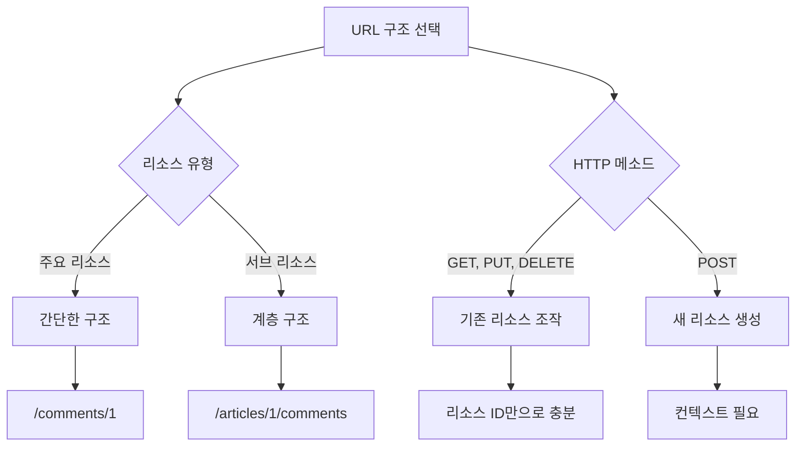
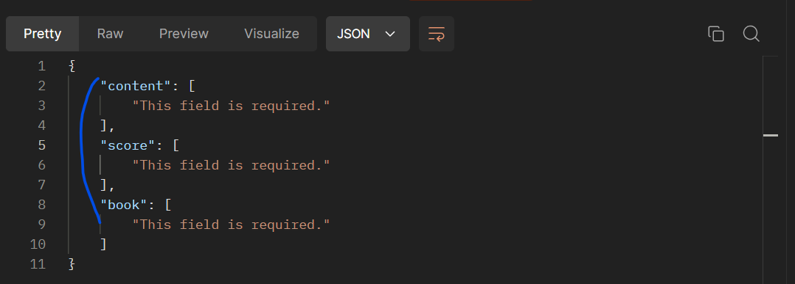

# [복습] DRF2 / N:1과 역참조

날짜: 2024년 10월 27일

[[복습] DRF](https://www.notion.so/DRF-121c4eca659c8089bcbffcd480dfe391?pvs=21)

[[복습] DRF2](https://www.notion.so/DRF2-122c4eca659c809c8e39d9ea46e9266a?pvs=21)

[Many to one relationships](https://www.notion.so/Many-to-one-relationships-11cc4eca659c80869474cbcc916202fa?pvs=21)

[Many to many relationships1](https://www.notion.so/Many-to-many-relationships1-11fc4eca659c8059a57de8236e1ba71f?pvs=21)

[Many to many relationships2](https://www.notion.so/Many-to-many-relationships2-120c4eca659c80eb8d59cdcfafe49788?pvs=21)

# URL 및 HTTP request method 구성

---

<aside>
💡

- **GET**: 댓글 리소스를 직접 조회
- **POST**: 특정 게시글에 댓글을 추가할 때 사용, **부모 리소스와의 관계를 명확히 표현**
- **PUT**: 댓글을 수정할 때 사용 (**댓글 ID**를 포함)
- **DELETE**: 댓글을 삭제할 때 사용 (**댓글 ID**를 포함)
</aside>

| **동작** | **URL** | **설명** |
| --- | --- | --- |
| **GET** | `/comments/1/` | 특정 댓글 조회 |
| **POST** | `/articles/1/comments` | 특정 게시글에 새 댓글 작성 |
| **PUT** | `/comments/1/` | 특정 댓글 수정 |
| **DELETE** | `/comments/1/` | 특정 댓글 삭제 |

## ⚠️ URL은 리소스간의 계층 관계를 반영해야 한다.

---

⇒ 때로는 통일성, 일관성도 좋지만 간단하게 만들 수 있을 경우  **`/comments/1`** 형태가 더 적합할 수 있음

<aside>
💡

RESTful 원칙:  API 설계 원칙에 따르면 리소스를 명사로 표현하고, HTTP 메소드로 동작을 나타냄

</aside>

1. 댓글 조회 시에는 **댓글 자체가 주요 리소스**이므로 /comments/로 시작
2. 새 댓글 작성 시에는 특정 게시글의 하위 리소스로 댓글을 생성하는 것이므로, /articles/1/comments 형태를 사용한다.  ⇒ `이는 "1번 게시글에 댓글 추가"라는 의미를 명확히 전달`한다.
3. 이 구조는 **`1:N 관계를 URL에 잘 반영`**하며, 리소스 간의 관계를 직관적으로 나타낸다.
4. **`POST 요청`의 경우 `새로운 리소스를 생성`하**므로, **부모 리소스(게시글)에 종속된 형태로 URL을 구성**하는 것이 RESTful 원칙에 부합한다.

# TypeError: review_create() got an unexpected keyword argument 'book_pk’

---

→ book_pk 키워드를 사용하지 않아서 발생한 에러로 확인됨

```python
@api_view(['POST'])
def review_create(request): #생성과 동일 => review는 필요없고 serializer만 맞게 점검하면 됨
    #data = request.data 기억하기!
    serializer = ReviewListSerializer(data=request.data) #data를 집어 넣으니까
    if serializer.is_valid(raise_exception=True):
        serializer.save()
        return Response(serializer.data, status=status.HTTP_201_CREATED)
```

---

### 1. 리소스 유형

---

| 리소스 유형 | 설명 | 예시 |
| --- | --- | --- |
| 주요 리소스 | 독립적으로 존재 가능 | 게시글, 댓글 |
| 서브 리소스 | **다른 리소스에 종속** | 특정 게시글의 댓글 |

### 2. HTTP 메소드별 URL 구조

| HTTP 메소드 | URL 구조 | 설명 |
| --- | --- | --- |
| GET | `/comments/1` | 특정 댓글 조회 |
| PUT | `/comments/1` | 특정 댓글 수정 |
| DELETE | `/comments/1` | 특정 댓글 삭제 |
| POST | `/articles/1/comments` | 특정 게시글에 새 댓글 추가
⇒ 생성 위치 `소속` 명확화 |

### 3. URL 구조 선택 이유



### ⚠️ 4. POST만 리소스 계층을 반영하는 이유

---

<aside>
💡

기존 생성된 자료들은 모두 `계층 구조를 가지고 있는 것`을 조회하기 때문이고
`POST`는 어떠한 곳과 연관된 리소스를 형성하는지에 대한 계층을 나타내기 위함

</aside>

- 새로 생성되는 리소스의 컨텍스트를 명확히 하여 API 사용자가 어떤 게시글에 댓글이 추가되는지를 
직관적으로 이해할 수 있게 한다.

<aside>
💡

**댓글 리소스 자체에 접근할 수 이유는 ? ⇒ 즉 단순 조회, 삭제, 수정이 가능한 이유는 
pk는 순서, 순번에 의해 `점진적으로 증가`하기 때문이다.**

</aside>

- 이미 존재하는 리소스를 다루기 때문에 리소스 ID만으로 충분히 특정할 수 있다.
    - 예를 들어, `/comments/1`은 특정 댓글을 명확히 지칭한다.
    - 하기 표를 보면 게시글의 위치가 달라도 `댓글 pk`는 연속적으로 증가하는 것을 볼 수 있다.
        - **연속적인 PK : 댓글과 대댓글의 pk는 게시글의 위치나 계층구조와 상관없이 연속적 증가**
        - **단일 테이블 구조임을 알 수 있음**
    
    | 댓글 PK | 내용 | (댓글) 부모 PK | 게시글 PK |
    | --- | --- | --- | --- |
    | 1 | 게시글 1의 댓글 1 | null | 1 |
    | 2 | 게시글 1의 댓글 2 | null | 1 |
    | 3 | 게시글 2의 댓글 1 | null | 2 |
    | 4 | 게시글 2의 댓글 2 | null | 2 |
    | 5 | 게시글 3의 댓글 1 | null | 3 |
    | 6 | 댓글 1의 대댓글 1 | 1 | 1 |
    | 7 | 댓글 1의 대댓글 2 | 1 | 1 |
    | 8 | 댓글 3의 대댓글 1 | 3 | 2 |
    | 9 | 댓글 5의 대댓글 1 | 5 | 3 |
    | 10 | 댓글 5의 대댓글 2 | 5 | 3 |
    
    ⇒ 해당 구조를 도식화
    
    ```
    게시글 1
    ├── 댓글 1 (PK: 1)
    │   ├── 대댓글 1 (PK: 6)
    │   └── 대댓글 2 (PK: 7)
    └── 댓글 2 (PK: 2)
    
    게시글 2
    ├── 댓글 1 (PK: 3)
    │   └── 대댓글 1 (PK: 8)
    └── 댓글 2 (PK: 4)
    
    게시글 3
    └── 댓글 1 (PK: 5)
        ├── 대댓글 1 (PK: 9)
        └── 대댓글 2 (PK: 10)
    ```
    
    # Foreign Key(외래키)란?
    
    ---
    
    <aside>
    💡
    
    **한 테이블의 필드(열) 중 다른 테이블의 기본 키(Primary Key)를 참조하는 키
    ⇒** `외래 키를 포함하는 테이블`을 `자식 테이블` 또는 참조 테이블이라고 하며, 
          `참조되는 테이블을 부모 테이블`이라고
    
    </aside>
    
    **[사용자 테이블 (Users)]**
    
    | 열 이름 | 데이터 타입 | 키 |
    | --- | --- | --- |
    | **user_id** | INT | **Primary Key** |
    | username | VARCHAR(50) |  |
    | email | VARCHAR(100) |  |
    
    **[주문 테이블 (Orders)]**
    
    | 열 이름 | 데이터 타입 | 키 |
    | --- | --- | --- |
    | order_id | INT | **Primary Key** |
    | user_id | INT | **Foreign Key** |
    | order_date | DATE |  |
    | total_amount | DECIMAL(10,2) |  |
    
    [관계 도식화]
    
    ```
    Users (부모 테이블)
    +----------+
    | user_id  |
    | username |
    | email    |
    +----------+
         ^
         |
         | Foreign Key
         |
    Orders (자식 테이블)
    +-------------+
    | order_id    |
    | user_id     |  # 'Users' 테이블의 'user_id'를 참조하는 외래 키
    | order_date  |  # 이 관계는 각 주문이 특정 사용자에게 속함을 나타낸다
    | total_amount|
    +-------------+
    
    ```
    

## ⚠️ 장고에서의 외래키란?

---

**[모델 정의]**

```python
class Article(models.Model): #부모 모델 == 테이블
    title = models.CharField(max_length=100)
    content = models.TextField()

class Comment(models.Model): #자식 모델 == 테이블
    article = models.ForeignKey(Article, on_delete=models.CASCADE) #외래키 
              #articles 테이블의 id를 참조함
              #참조할 친구 
    content = models.TextField()

```

# serializer.save()의 인스턴스 값을 넣어주는 이유는?

---

<aside>
💡

클라이언트가 몇번 게시글에 있는 게시글에 댓글을 작성할게요라고 게시글을 입력하진 않음 
**=> 따라서 그 역할을 `자연스럽게 수행할 수 있도록` book을 인스턴스로 저장해서 전달**

</aside>

| 항목 | 설명 | 예시 |
| --- | --- | --- |
| 모델 정의 | ForeignKey를 사용하여 관계 설정 | `book = models.ForeignKey(Book, on_delete=models.CASCADE)` |
| Serializer 정의 | book 필드를 제외하고 정의 | `fields = ['content', 'score']` |
| 뷰에서의 처리 | **book 인스턴스를 식별하고 save() 시 제공** | `serializer.save(book=book)` |
| save() 메서드 | **book 인스턴스를 인자로 받아 연결** | `save(book=book)` |
| 장점 | 1. 보안 강화
2. 데이터 일관성 유지
3. Serializer 재사용성
4. 뷰 레벨에서의 유연한 제어 | - URL에서 book_id 추출
- 권한 검사 후 book 연결
- 다양한 상황에서 동일한 Serializer 사용 |
| 데이터 흐름 | **1. 클라이언트 → 내용, 점수**
2. 서버 → book 인스턴스 식별
3. Serializer → 데이터 검증
4. save() → book 연결 및 저장 | `{"content": "좋은 책", "score": 5}` 
→ Serializer 
→ `Review(book=book, content="좋은 책", score=5)` |

```python
클라이언트 요청
       │
       ▼
  URL 파싱 (/posts/123/comments/)
       │
       ▼
게시글(Book) 인스턴스 조회 (ID: 123)
       │
       ▼
댓글(Review) 데이터 검증
       │
       ▼
댓글 생성 및 게시글 연결
(serializer.save(book=book))
       │
       ▼
  응답 반환클라이언트 요청
       │
       ▼
  URL 파싱 (/posts/123/comments/)
       │
       ▼
게시글(Book) 인스턴스 조회 (ID: 123)
       │
       ▼
댓글(Review) 데이터 검증
       │
       ▼
댓글 생성 및 게시글 연결
(serializer.save(book=book))
       │
       ▼
  응답 반환
```

1. save() 메서드에 book 인스턴스를 제공하는 이유:
    - 새로운 Review 인스턴스를 생성할 때, 이 Review가 어떤 Book에 속하는지 지정해야 합니다.
    - `serializer.save(book=book)`에서 book 인스턴스를 제공함으로써, 새로 생성되는 Review 인스턴스와 특정 Book 인스턴스를 연결합니다.
2. ReviewSerializer에서 book을 명시적으로 포함하지 않는 이유:
    - 일반적으로 클라이언트로부터 받는 데이터에 book ID를 포함시키지 않습니다. 대신, URL이나 뷰 로직에서 book을 식별합니다.
    - 이는 보안과 데이터 일관성을 위한 것입니다. 클라이언트가 임의로 book을 변경하는 것을 방지합니다.
3. save() 시점에 book을 제공하는 이점:
    - 뷰 레벨에서 book 인스턴스를 결정할 수 있습니다. (예: URL에서 book_id를 추출)
    - 동일한 serializer를 다양한 상황에서 재사용할 수 있습니다.
    - 필요한 경우 추가적인 로직이나 검증을 수행할 수 있습니다.

# TypeError: review_create() got an unexpected keyword argument 'book_pk

---

⇒ 매개변수로 book_pk : 즉 어떠한 게시글의 pk인지 받지 않음

**[수정 전 고민 단계] ⇒ 나의 고민** 

```python
#리뷰 생성 기능을 구현한다 => 즉 article의 정보를 받아서 
#그곳에 맞는 데이터를 넣겠다 => 1:N관계를 형성하겠다.
@api_view(['POST'])
def review_create(request, book_pk): #생성과 동일 => review는 필요없고 serializer만 맞게 점검하면 됨
    #data = request.data 기억하기!
    #그렇다면 이 book_Pk를 활용해야 함
    book = Book.objects.get(pk=book_pk) #book의 정보.. 
    #이전 수정에서는 instance, data=request.data, partial 을 했었는데,, 지금은 article이 무엇인지를 기반해서 review를 작성해야한다..? 
    serializer = ReviewListSerializer(data=request.data) #data를 집어 넣으니까
    if serializer.is_valid(raise_exception=True):
        serializer.save()
        return Response(serializer.data, status=status.HTTP_201_CREATED)
```

<aside>
💡

**수정 참고 블로그 및 ⇒ 수정 코드**

</aside>

[https://codinglarva.tistory.com/86](https://codinglarva.tistory.com/86)

```python
@api_view(['POST'])
def review_create(request, book_pk): #생성과 동일 => review는 필요없고 serializer만 맞게 점검하면 됨
    #data = request.data 기억하기!
    #그렇다면 이 book_Pk를 활용해야 함
    book = Book.objects.get(pk=book_pk) #book의 정보..
    serializer = ReviewListSerializer(data=request.data) #data를 집어 넣으니까 => 여기서 get을 사용하면 특정 review, many=True
    if serializer.is_valid(raise_exception=True):
        serializer.save(book=book) #book과 관련된 instance를 넣어 줘야한다 => 이부분 확인 필요
        return Response(serializer.data, status=status.HTTP_201_CREATED)
```

# POSTMAN → 필수 값 오류

---



**[serializers.py]**

```python
#review 전체 조회 기능 => content와 score정보만 제공
class ReviewPartSerializer(serializers.ModelSerializer):

    class Meta:
        model = Review
        fields = ("content", "score",) #book 외래키..
        #나머지는 자동 => 전체 나오는 것?

#review 생성
class ReviewListSerializer(serializers.ModelSerializer):
    
    class Meta:
        model = Review
        fields = "__all__" #book 외래키..
```

⇒ 여기서 all을 체크했기 떄문에 해당 문제가 나옴을 알 수 있었음! 

[views.py]

- book 인스턴스를 리뷰에 연결하는 것이 핵심

```python
#review 전체 출력
@api_view(['GET'])
def review_list(request):
    #리뷰 전체 조회 기능 => 기존과 상동
    if request.method == 'GET':
        reviews = Review.objects.all()
        serializer = ReviewPartSerializer(reviews, many=True)
        return Response(serializer.data) #review와 관련된 내용 모두 전체 조회
        #content와 score의 기능만 제공한다

#리뷰 생성 기능을 구현한다 => 즉 article의 정보를 받아서 
#그곳에 맞는 데이터를 넣겠다 => 1:N관계를 형성하겠다.
@api_view(['POST'])
def review_create(request, book_pk): #생성과 동일 => review는 필요없고 serializer만 맞게 점검하면 됨
    #data = request.data 기억하기!
    #그렇다면 이 book_Pk를 활용해야 함
    book = Book.objects.get(pk=book_pk) #book의 정보.. 
    #이전 수정에서는 instance, data=request.data, partial 을 했었는데,, 지금은 article이 무엇인지를 기반해서 review를 작성해야한다..? 
    #기존 api를 사용하지 않았던 장고 뷰에서는 어떻게 활용했을까? 
    serializer = ReviewListSerializer(data=request.data) #data를 집어 넣으니까 => 여기서 get을 사용하면 특정 review, many=True
    if serializer.is_valid(raise_exception=True):
        serializer.save(book=book) #book과 관련된 instance를 넣어 줘야한다 => 이부분 확인 필요
        return Response(serializer.data, status=status.HTTP_201_CREATED)
```

⇒ 따라서 listserializer에서 partserializer로 변경

## 정석적인 방법

- 상기처럼 작성할경우는 원하는 케이스로 만들어갈 수 없을 수 있기 때문에 정석적인 방법으로 진행

---

**[views.py]**

```python
@api_view(['POST'])
def review_create(request, book_pk):
    book = Book.objects.get(pk=book_pk) #book의 정보.. 
    #기존 api를 사용하지 않았던 장고 뷰에서는 어떻게 활용했을까? 
    serializer = ReviewPartSerializer(data=request.data)
    if serializer.is_valid(raise_exception=True):
        serializer.save(book=book)
        return Response(serializer.data, status=status.HTTP_201_CREATED)
```

**[serializers.py]**

```python
class ReviewListSerializer(serializers.ModelSerializer):
    
    class Meta:
        model = Review
        fields = "__all__" #book 외래키..
        read_only_fields = ("book",) #연결되는 것
```

# 의도적으로 POST를 구현할 때, 하나씩 비워보자

---

[기존 book == libraries를 생성할 때 처럼 동일한 구조를 만든다]

```python
#serializers.py
#review 생성
class ReviewListSerializer(serializers.ModelSerializer):
    
    class Meta:
        model = Review
        fields = "__all__" 
        #read_only_fields = ("book",) #model을 참고해서 외래키인 대상을 넣음

#views.py
api_view(['POST'])
def review_create(request, book_pk):
    #일단 생성 -> 한개만 있으니까
    book = Book.objects.get(pk=book_pk)
    serializer = ReviewListSerializer(data=request.data)
    if serializer.is_valid(raise_exception=True):
        serializer.save() #기존 post와 일단 동일하게 만들어보자
        return Response(serializer.data, status=status.HTTP_201_CREATED)
```

## Book_pk → field is required

---


⇒ read_only를 사용해야 함을 알 수 있음

## django.db.utils.IntegrityError: NOT NULL constraint failed: libraries_review.book_id

---

- null값이 있으면 안된다 ⇒ book_id에 대해서
    - 결론적으로 save할 때 book_id 즉 외래키에 대한 값을 전달해주어야 한다


# AssertionError: Expected a `Response`, `HttpResponse` or `HttpStreamingResponse` to be returned from the view, but received a `<class 'NoneType'>

---

⇒ 반환할 값이 없다는 메세지  : get메서드의 처리가 없는지 확인

[urls.py]

```python
    #특정 reviews에 접근해야하니까 또 다른 url을 만들어야함을 명심!!
    path('reviews/<int:review_pk>/', views.review_detail),
```

[views.py]

```python
#comments는 또 따로
@api_view(['GET', 'DELETE', 'PUT'])
def review_detail(request, review_pk):
    review = Review.objects.get(pk=review_pk) #특정 review
    if request.method == "DELETE":
        review.delete()
        return Response(status=status.HTTP_204_NO_CONTENT)
    elif request.method == "PUT": #기존 게시글 수정과 비슷함 
        serializer = ReviewPartSerializer(review, data=request.data, partial=True) #교재에서는 여기에 True가 아님
        if serializer.is_valid(raise_exception=True) : 
            serializer.save() #db에 저장 => 특정값에 저장
            return Response(serializer.data, status=status.HTTP_200_OK) #status도 안보냄
```

## Partial 파라미터 → 부분적 업데이트 허용 의미

---

**`partial=True`** 파라미터는 부분적인 업데이트를 허용한다는 의미

- **`partial=True`**일 경우: 요청에 포함된 필드만 업데이트된다. 나머지 필드는 그대로 유지
- **`partial=False`**일 경우 (기본값): 모든 필드가 요청에 포함되어야 하며, 그렇지 않으면 유효성 검사에서 실패한다.

# ⚠️ Readonly를 설정하고, save포인트에 instance를 넣는 이유

---

| **항목** | **설명** |
| --- | --- |
| **역직렬화 과정** | - `request.data`에는 사용자가 입력한 데이터가 포함됨
**- 사용자는 pk나 특정 게시글 정보를 입력하지 않음 (key point)** |
| **유효성 검사** | - `serializer.is_valid()`를 통해 입력된 데이터의 유효성을 검사
- 필드 타입, 길이 제한 등 기본 검증 수행. |
| **데이터 저장** | - `serializer.save(book=book)`에서 book 인스턴스를 전달하여 
   **리뷰가 어떤 책에 속하는지 명시 (db 저장을 위한 계층화 명시)**
- 특정 책에 대한 리뷰를 정확히 저장. |
| **ReadOnly 필드** | - pk와 같은 필드는 사용자가 입력하지 않으므로 `read_only=True`로 설정
- **해당 필드는 직렬화 시 포함되고, 역직렬화 시 무시됨** |
| **기존 Django 뷰와의 차이** | - DRF를 사용하지 않는 일반 Django 뷰에서는 form을 사용하여 유사 작업 수행
- 예: `form = ReviewForm(request.POST)`로 form 생성 후 유효성 검사 및 저장 |

⇒ 로직을 스스로 그려보면서 따라가면 이해할 수 있음 

# ⚠️ RESTAPI 구조가 아닌, 일반 Django의 1:N

---

- book 인스턴스를 리뷰에 연결하는 것이 핵심

**[[views.py](http://views.py/)]**

```python
from django.shortcuts import render, redirect, get_object_or_404
from django.contrib import messages
from .models import Book, Review
from .forms import ReviewForm

def review_create(request, book_pk):
    book = get_object_or_404(Book, pk=book_pk)

	if request.method == 'POST':
    # POST 요청일 경우, 사용자가 제출한 데이터로 폼을 생성합니다.
    form = ReviewForm(request.POST)
    if form.is_valid():
        # 폼 데이터가 유효하면 처리를 시작합니다.
        # commit=False로 저장하여 데이터베이스에 즉시 저장하지 않고 
        # Review 객체만 생성합니다.
        review = form.save(commit=False)
        # 생성된 review 객체에 현재의 book 인스턴스를 연결합니다.
        # 이는 외래 키 관계를 설정하는 부분입니다!!!!!!!
        review.book = book
        
        # 이제 모든 필요한 데이터가 설정되었으므로 
        # 데이터베이스에 review를 저장합니다.
        review.save(
        # 성공 메시지를 설정합니다.
        messages.success(request, '리뷰가 성공적으로 작성되었습니다.')
        # 리뷰 작성 후 해당 책의 상세 페이지로 리다이렉트합니다.
        return redirect('book_detail', pk=book_pk)
    else:
        form = ReviewForm() #reviewform을 받아서 => 입력데이터를 받고,

    context = {
        'form': form,
        'book': book
    }
    return render(request, 'reviews/review_form.html', context)

```

**[[forms.py](http://forms.py/)]**

```python
from django import forms
from .models import Review

class ReviewForm(forms.ModelForm):
    class Meta:
        model = Review
        fields = ['content', 'score']  # book 필드는 제외

```

**[[urls.py](http://urls.py/)]**

```python
from django.urls import path
from . import views

urlpatterns = [
    # ... 다른 URL 패턴들 ...
    path('books/<int:book_pk>/review/create/', views.review_create, name='review_create'),
]

```

**[templates/reviews/review_form.html]**

```html
<h2>{{ book.title }}에 대한 리뷰 작성</h2>
<form method="post">
    
    {{ form.as_p }}
    <button type="submit">리뷰 작성</button>
</form>

```

# ⚠️ 역참조

---

```python
class BookSerializer(serializers.ModelSerializer): #detail에서 지금 사용하고 있음 => 여기서 모든 리뷰의 정보를 제공하도록 serializer를 수정
    # 즉 여기에서 모든 리뷰의 정보가 나올 수 있도록 해줘야 함
    #book이 직접적으로 참조하고 있는게 아니기 떄문에 역참조를 해야하지 않는가?
    #따라서 거기에 맞는 instance를 넣어서 값이 나오게 해야함 => 즉 전체리스트가 나오도록
    review_set = ReviewListSerializer(many=True, read_only=True) #이친구가 들어갈 수 있도록
    #단일 게시글 댓글 목록

    class Meta:
        model = Book
        fields = '__all__'

```

## 역으로 참조하는 set의 이름을 바꾸고 싶을 경우

---

```python
class Review(models.Model):
    book = models.ForeignKey(Book, on_delete=models.CASCADE, related_name='reviews')
    # 다른 필드들...
```

## readonly True를 하는 이유

---

- read_only=True는 이 필드가 직렬화(serialization, 읽기)될 때만 포함되고, 
역직렬화(deserialization, 쓰기)될 때는 무시된다는 것을 의미
- **리뷰는 보통 책을 생성하거나 수정할 때 직접 추가/수정하지 않기 때문에** read_only=True로 설정
이렇게 하면 **BookSerializer를 통해 Book 객체를 생성하거나 수정할 때 reviews 필드를 입력받지 않아도 된다**.

<aside>
💡

결론적으로, `read_only=True`는 **Book 객체를 다룰 때 리뷰 정보는 읽기만 가능하고, 쓰기(생성/수정)는 불가능하게 만든다.** 이는 대부분의 경우 책과 리뷰를 별도로 관리하는 것이 더 적절하기 때문

</aside>

**→ 게시글은 게시글이고 댓글은 댓글이고 그 요소 자체는 묶여있긴 하지만 같이 띄워주긴하지만 실제로 각각
    독립적인 객체를 나타냄을 위함**

1. 일반적인 데이터 생성/수정 흐름:
    - **책을 생성할 때: 보통 책의 기본 정보(제목, 저자, 출판일 등)만 입력**
    - **리뷰를 작성할 때: 이미 존재하는 책에 대해 별도로 리뷰를 작성**
2. `read_only=True`의 역할:
    - 이 설정은 BookSerializer가 Book 객체를 생성하거나 수정할 때 **reviews 필드를 무시하도록 함.**
    - **즉, Book 객체를 만들거나 수정할 때 리뷰 정보를 함께 제공할 필요가 없다.**
3. 실제 예시:
    
    ```python
    # read_only=True가 없다면:
    book_data = {
        "title": "새로운 책",
        "author": "홍길동",
        "reviews": [  # 이 부분이 필요 없어짐
            {"content": "좋은 책이에요", "rating": 5},
            {"content": "재미있어요", "rating": 4}
        ]
    }
    
    # read_only=True를 사용하면: == 즉 책 정보만 다룰 떄 리뷰정보를 신경쓰지 않아도 됨
    book_data = {
        "title": "새로운 책",
        "author": "홍길동"
    }
    ```
    

# 시리얼라이저 컨텍스트

---

1. `serializers.IntegerField()` 사용 이유:
    - 이는 Django REST Framework의 시리얼라이저 필드.
    - **모델 필드가 아닌 계산된 값을 시리얼라이저에 추가**할 때 사용
    - 이 방식을 통해 **모델에 실제로 존재하지 않는 필드를 API 응답에 포함시킬 수 있**다.
2. 사용 사례:
    - **관련 객체의 수 계산 (예: 리뷰 수, 좋아요 수 등)**
    - 복잡한 계산 로직 (예: 평균 평점)
    - 조건부 필드 (특정 조건에 따라 값이 달라지는 필드)

```python
from rest_framework import serializers

class SomeModelSerializer(serializers.ModelSerializer):
    review_count = serializers.IntegerField(source="review_set.count", read_only=True)

    class Meta:
        model = SomeModel
        fields = ['id', 'name', 'review_count', ...]
```

1. 추가 데이터 전달: 시리얼라이저에 뷰나 **다른 소스에서 추가 정보를 전달할 때 사용**할 때 사용
2. 요청 정보 접근: 현재 HTTP 요청 객체에 접근하여 사용자 인증 정보나 쿼리 파라미터 등을 활용할 때 사용한다.
3. 조건부 필드: 특정 조건에 따라 필드를 포함하거나 제외할 때 컨텍스트 정보를 활용한다
4. 동적 데이터: 시리얼라이저 메서드 필드에서 동적으로 계산된 값을 반환할 때 **컨텍스트 정보를 사용할 수** 있다.

# AssertionError at /api/v1/libraries/1/

```
The field 'book' was declared on serializer ReviewListSerializer, but has not been included in the 'fields' option
```

---

- fields 옵션에 포함되지 않았다.. ⇒ fields에 내용 누락?

```python
    class Meta:
        model = Review
        fields = ('book', 'content', 'score',) #book을 누락해서 나타난 문제
```

# 원하는 출력값과 다른 값 출력될 경우

---


→ 해당 내용은 전체에서만 출력하고 싶을 때 

→ 리뷰 전체 조회리스트에서는 원하는 값만 출력되는 것을 확인할 수 있음

<aside>
💡

**오버라이딩을 통해 내부 내용 수정**

</aside>


```python
class BookSerializer(serializers.ModelSerializer): #detail에서 지금 사용하고 있음 => 여기서 모든 리뷰의 정보를 제공하도록 serializer를 수정
    # 즉 여기에서 모든 리뷰의 정보가 나올 수 있도록 해줘야 함
    #book이 직접적으로 참조하고 있는게 아니기 떄문에 역참조를 해야하지 않는가?
    #따라서 거기에 맞는 instance를 넣어서 값이 나오게 해야함 => 즉 전체리스트가 나오도록
    #이 친구 자체를 그대로 받았기 떄문에
    class ReviewListSerializer(serializers.ModelSerializer): #모든 리뷰의 정보가 나올 수 있도록 
        class Meta: #내부에서 오버라이딩!!
            model = Review
            fields = ('content', 'score',)
    review_set = ReviewListSerializer(many=True, read_only=True) #이친구가 들어갈 수 있도록 => book만 고려할 수 있도록 만들 수 있음
    #이름을 바꾸고 싶다면 => related_to에서 바꿔주면 된다.
    #역참조한 것들의 개수 -> 또 따로 국룰인 것 == 이것도 readonly
    review_count = serializers.IntegerField(source="review_set.count", read_only = True)
    #serializers.IntegerField는 시리얼라이저 필드 중 하나 => 정수값처리
    #시리얼 라이즈 한다
    #단일 게시글 댓글 목록
    class Meta:
        model = Book
        fields = '__all__'
```