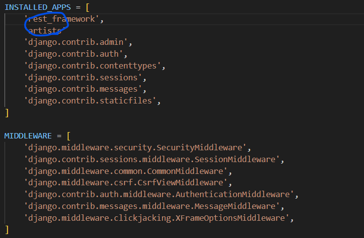

# Django_Error Log 8

날짜: 2024년 10월 27일

# Model class artists.models.Artist doesn't declare an explicit app_label and isn't in an application in INSTALLED_APPS.

---

- 설정 파일에 애플리케이션 이름을 입력하지 않았을 때
- **`__init__**.py` 를 삭제했으나 동일한 문제 발생



⇒ 최종적으로 확인된 문제는 installed apps에 등록해야하는 것을 `middleware`에 등록했음

# ModuleNotFoundError: No module named 'artistsdjango

---

```python
INSTALLED_APPS = [
    'rest_framework',
    'artists' #여기서 `,` 에러
    'django.contrib.admin',
    'django.contrib.auth',
    'django.contrib.contenttypes',
    'django.contrib.sessions',
    'django.contrib.messages',
    'django.contrib.staticfiles',
]
```

# django.db.utils.OperationalError: no such table: artists_artist

---


⇒ 파일도 없음


⇒ table이 만들어지지 않아 상기 오류 발생

<aside>
💡

**수정 코드 == 테이블이 생김을 확인함**

</aside>

→ 아까 init을 지우면서 생겼던 오류같음 : `model` 을 설정했음에도 마이그레이션이 먹히지 않는다?
    : 여기서 판단함

# RuntimeError: You called this URL via POST, but the URL doesn't end in a slash and you have APPEND_SLASH set. Django can't redirect to the slash URL while maintaining POST data. Change your form to point to 127.0.0.1:8000/api/v1/artists/ (note the trailing slash), or set APPEND_SLASH=False in your Django settings.

---

→ `end slash`를 붙여라

# Page not found (404)

---

[urls.py]

```python
urlpatterns = [
    path('artists/', views.artist_list_or_create), #name까지 만들 필요 없으니까
    path('artists/<int:artists_pk>', views.detail_or_sth),
]

```

[views.py]

```python
@api_view(['GET']) #어짜피 이것도전체 조회
def detail_or_sth(request, artists_pk):
    artist = Artist.objects.get(pk=artists_pk) #모든 artists
    serializer = ArtistSerializer(artist) #많은 정보들 조회
    return Response(serializer.data) #모든 정보
```

<aside>
💡

수정 사항 ⇒ urls.py에 `/` 누락

</aside>

```python
urlpatterns = [
    path('artists/', views.artist_list_or_create), #name까지 만들 필요 없으니까
    path('artists/<int:artists_pk>', views.detail_or_sth),
]

```

## Django에서 URL 패턴의 끝에 `/`를 붙이는 것은 중요한 이유

---

1. URL 정규화: Django는 기본적으로 URL 끝에 슬래시(`/`)를 붙인 형태를 선호합
    1. 이는 URL의 일관성을 유지하고 SEO에도 도움이 됨
2. 리다이렉션 방지: 슬래시가 없는 URL로 요청이 오면, **Django는 자동으로 슬래시가 있는 URL로 리다이렉션**한다.
    1.  이 리다이렉션을 방지하고 직접적인 매칭을 위해 슬래시를 포함시킨다.
3. 디렉토리와 파일 구분: 웹의 전통적인 규칙에서 **끝에 슬래시가 있으면 디렉토리를, 없으면 파일을 의미한**다. Django는 이 규칙을 따른다.
4. 일관성 유지: 모든 URL 패턴에 슬래시를 포함시켜 일관성을 유지하면 URL 관리가 더 쉬워진다.
5. 매칭 정확성: 슬래시를 포함하면 더 정확한 URL 매칭이 가능하다. 예를 들어, `artists`와 `artists/`는 다른 패턴으로 인식된다.

```python
urlpatterns = [
    path('artists/', views.artist_list_or_create),
    path('artists/<int:artists_pk>/', views.detail_or_sth),
]

```

# delete시 None type 반환 오류

---


```python
    elif request.method == "DELETE":
        artist.delete() #그냥 삭제하고 내보낸다
        message = {
            "delete" : f"등록 번호{artist.pk}번의 {artist.name}을 삭제하였습니다."
        }
        return Response(message, status=status.HTTP_204_NO_CONTENT) #204코드반환
        #여기 보면 serializer.data 자리에 위 dict를 넘겨줘서 필요한 데이터를 넘겨줄 수 있다고 적혀있다.
```

<aside>
💡

**수정 코드** ⇒ 메세지를 먼저 선언하고 삭제를 해서 해당 값에 대한 데이터가 완전히 담기도록 함

</aside>


```python
    elif request.method == "DELETE":
        message = {
            "delete" : f"등록 번호{artist.pk}번의 {artist.name}을 삭제하였습니다."
        }
        artist.delete() #그냥 삭제하고 내보낸다
        return Response(message, status=status.HTTP_204_NO_CONTENT) #204코드반환
        #여기 보면 serializer.data 자리에 위 dict를 넘겨줘서 필요한 데이터를 넘겨줄 수 있다고 적혀있다.
```