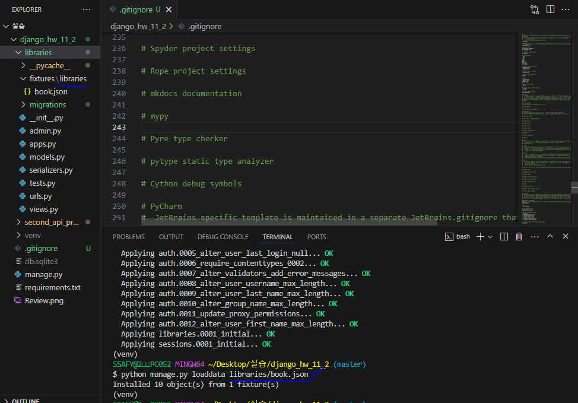

# [복습] DRF2

날짜: 2024년 10월 17일

# load data 접근하기

---



# Article & comment save의 차이

---

| **특성** | **게시글(Article) 생성** | **댓글(Comment) 생성** |
| --- | --- | --- |
| **사용 방식** | `serializer.save()` | `serializer.save(article=article)` |
| **데이터 출처** | 모든 데이터가 `request.data`에 포함 | 일부 데이터(article)는 서버에서 제공 |
| **관계 설정** | 독립적인 엔티티로 생성 | 특정 게시글과의 관계 설정 필요 |
| **보안 고려사항** | 클라이언트 데이터만으로 충분 | **서버에서 추가 정보(article) 제공 필요** |
| **데이터 무결성** | 자체 데이터로 완결 | 게시글과의 연결 필요 |
| **코드 명확성** | 기본적인 저장 방식 | 관계 설정이 명시적으로 표현됨 |
| **시리얼라이저 동작** | 기본 필드만 처리 | 추가 필드(article) 처리 |

# GET : 서버 상태 변경X, POST : 서버 상태 변경 O

---

<aside>
💡

**차이점 요약**

</aside>

| 측면 | GET 요청 | POST 요청 |
| --- | --- | --- |
| **목적** | 데이터 조회 | 데이터 생성/업데이트 |
| **데이터 위치** | URL (보이는 상태) | 요청 본문 (숨겨진 상태) |
| **보안** | 덜 안전함 | 더 안전함 |
| **데이터 처리** | `데이터베이스`에서 조회 | `request.data`로부터 받아서 처리 |

[GET 요청]

- **목적**: 서버에서 데이터를 조회합니다.
- **데이터 처리**: `books = Book.objects.all()`을 통해 데**이터베이스에서 모든 책 정보를 가져온다**.
    - 가져온 데이터를 `BookListSerializer`를 사용해 직렬화하고, 
    이를 JSON 형식으로 변환하여 클라이언트에 반환
- **사용 예시**: 데이터를 조회할 때 사용

[POST 요청]

- **목적**: 서버에 데이터를 보내 **새로운 리소스를 생성**하거나 기존 리소스를 업데이트합니다.
- **데이터 처리**: 클라이언트에서 보낸 데이터를 `request.data`로 받아온다
    - 이 데이터를 `BookSerializer`에 전달하여 직렬화하고, 유효성 검사를 통과하면 데이터베이스에 
    저장
- **사용 예시**: 새로운 책 정보를 추가할 때 사용

## 데이터 처리 방식

---

| 요청 방식 | 데이터 처리 방식 | 설명 |
| --- | --- | --- |
| **GET** | `books = Book.objects.all()` | 데이터베이스에서 모든 책 객체를 가져옵니다. |
|  | `serializer = BookListSerializer(books, many=True)` | 가져온 객체들을 직렬화하여 클라이언트에 반환할 준비를 합니다. |
| **POST** | `serializer = BookSerializer(data=request.data)` | 클라이언트로부터 받은 데이터를 직렬화하여 유효성을 검사하고 저장할 준비를 합니다. |
- GET 요청에서는 **데이터베이스**에서 객체를 가져와 직렬화
- POST 요청에서는 **클라이언트의 데이터를** 받아 직렬화

# 댓글 생성시 → save() 인스턴스 이해하기

---

- `serializer.save(book=book)`는 Django REST framework에서 직렬화된 데이터를 저장할 때 특정 필드를 추가로 지정하는 방법
- 외래 키 관계를 처리할 때 유용

| 방식 | 설명 |
| --- | --- |
| **commit=False** | 객체를 데이터베이스에 저장하기 전에 수정할 수 있도록 임시 객체를 반환 |
| **save(book=book)** | 즉시 데이터베이스에 저장하며, 추가로 지정한 필드를 설정 / 외래 키 등 관계 설정에 유용 |
- **외래 키 설정**: `book=book`은 `Review` 모델의 외래 키 필드인 `book`에 특정 `Book` 인스턴스를 지정하는 것
    - 이는 리뷰가 어떤 책에 속해 있는지를 명시한다.
- **자동 저장**: `serializer.save()`는 직렬화된 데이터를 데이터베이스에 저장한다.
    - 여기서 추가로 제공한 `book=book`은 저장 시 해당 필드에 값을 설정하는 역할을 합니다.

```python
- views.py`에서 외래 키를 설정하는 것은 레고 조각을 맞추는 것과 비슷하다

`serializer.save(book=book)`는 `Review` 모델의 외래 키 필드인 
`book`에 특정 `Book` 인스턴스를 연결해주는 역할을 한다.
이는 리뷰가 어떤 책에 속하는지를 명확히 지정하는 것

이렇게 하면 데이터베이스에 저장될 때, 각 리뷰가 올바른 책과 연결되어 저장됨
따라서 외래 키 관계를 통해 데이터 간의 연관성을 유지할 수 있음 
```

# 읽기 전용과 관련된 로직 이해하기

---

[serializers.py]

```python
#리뷰 생성 기능 구현
#model form처럼 -> review라는 모델을 기반으로 만들어지는 것?
class ReviewListSerializer(serializers.ModelSerializer):
    class Meta:
        model = Review
        fields = "__all__" #all이라서 여기에 작성된 필드는 모두 유효성 검사가 일어남 => 외래키의 여부
        read_only_fields = ("book",) #외래키가 있는 모델 -> 그 인스턴스를 지칭하는 필드 == book 이 부분을 읽기전용으로 해줘야 함
        #결과 데이터엔 포함하고 싶으나, 유효성 검사는 제외하게 된다. 
        #즉 == 클라이언트가 직접 수정할 수 없지만, 서버 측에서 값을 지정
```

[views.py]

```python
@api_view(['POST']) #리뷰 생성
def review_create(request, book_pk): #특정 게시글에 리뷰를 작성해야 함 -> 특정 게시글 참조
    book = Book.objects.get(pk=book_pk) #특정게시글
    serializer = ReviewListSerializer(data=request.data) #받아서 생성 == 사실상 리뷰와 관련된 네용
    if serializer.is_valid(raise_exception=True): #exception == True #그리고 외래키를 -> 있는지 확인을 이곳에서 함
        serializer.save(book=book) #리뷰 생성
        #즉 특정 책과 리뷰를 연결하는 것
        #review model에 있는 book인스턴스에 특정 게시글이 무엇인지에 대한 것을 대입
        #즉 외래키 데이터 입력 후 저장
        #설계도상 참조값을 넣는 곳? Q?
        return Response(serializer.data, status=status.HTTP_201_CREATED) #아니면 404반환,, -> raise_Exception
```

<aside>
💡

**과정 설명**

</aside>

1. **읽기 전용 설정**:
    - **`read_only_fields = ("book",)`**: 외래 키 필드를 읽기 전용으로 설정
    - 이는 클라이언트가 이 필드를 직접 수정할 수 없도록 하는 것
2. **유효성 검사**:
    - **`serializer.is_valid(raise_exception=True)`**: 데이터의 유효성을 검사
    - 외래 키와 관련된 기본적인 검증도 이 단계에서 이루어짐
3. **외래 키 할당 및 저장**:
    - **`serializer.save(book=book)`**: 읽기 전용으로 설정된 외래 키 필드에 서버 측에서 특정 인스턴스를 지정하여 저장
    

# AttributeError at /api/v1/libraries/1/

```
Got AttributeError when attempting to get a value for field `content` on serializer `ReviewListSerializer`.
The serializer field might be named incorrectly and not match any attribute or key on the `RelatedManager` instance.
Original exception text was: 'RelatedManager' object has no attribute 'content'.
```

---

[serializers.py]

```python
class ReviewListSerializer(serializers.ModelSerializer): #여기서 -> RELATEMANGER
    #리뷰 전체 조회에서 -> 리뷰가 참조하는 도서의 isbn 정보를 제공 == isbn
    class BookIsbnSerializer(serializers.ModelSerializer):
        class Meta:
            model = Book
            fields = ("isbn", ) #자신이 참조하는 도서의 isbn 값을 제공

    class Meta:
        model = Review
        fields = ('content', 'score',)

class BookSerializer(serializers.ModelSerializer): #얘가 참조하는 모든 리뷰의 정보 제공 -> content / score
    class Meta:
        model = Book
        fields = '__all__'
    #리뷰 정보를 제공한다? => book과 연결된 review를 건들인다.
    #book에 리뷰?
    #일단 Book이 1, review가 N => 얘가 foreignkey를 가지고 있음 == book을 참조
    
    #리뷰 정보를 book에서 받아오려면? -> 지금 클래스 주체가 누구인가?
    #book.review_set.all()
    review_set = ReviewListSerializer() #이 친구를 받아서 덮어씌우기 == overriding #리뷰 정보 제공
    #리뷰의 총 수도 보여줘야 함
    review_count = serializers.IntegerField(source="review_set.count", read_only=True)
    #이것은 serializer에 접근해서 -> integerfield하고 -> readonly해야함
    #이 뜻?
```

⇒ 해당 오류는 `many`의 문제

```python
review_set = ReviewListSerializer(many=True, read_only=True) #로 변경해주기
```

# 상세 정보 페이지에서 모든 리뷰 정보 제공 과정
→ read_only 사용

---

`read_only=True`를 사용하는 이유는 데이터의 흐름과 검증 방식에 따라 달라짐

**1. `read_only_fields = ('book',)`**

- **목적**: 특정 필드를 클라이언트가 수정하지 못하도록 한다.
- **사용 상황**: **클라이언트가 직접 입력하거나 수정할 필요가 없는 필드**에 사용한다.
    - 예를 들어, `book` 필드는 서버 측에서 설정되므로 클라이언트가 변경할 수 없도록 읽기 전용으로 
    설정

1. **`review_set = ReviewListSerializer(many=True, read_only=True)`**
- **목적**: **관계된 객체(리뷰 목록)를 읽기 전용으로** 직렬화한다.
- **사용 상황**: `Book` 객체를 조회할 때, 관련된 모든 리뷰를 포함하여 반환하지만, 이 리뷰들을 클라이언트가 직접 수정하지 못하게 하려는 경우에 사용한다.
    - 이는 데이터베이스의 무결성을 유지하면서도 관련 데이터를 제공하기 위함.

## 관계된 객체도 왜 읽기 전용으로 직렬화해야하나?

---

<aside>
💡

데이터의 무결성을 유지하면서 관련 데이터를 안전하게 제공하기 위함

</aside>

1. **데이터 보호**: 클라이언트가 관계된 데이터를 직접 수정할 수 없도록 하여, 데이터베이스의 무결성을 보호
2. **안전한 데이터 제공**: 조회 시 관련 데이터를 포함하여 반환하지만, **수정은 서버 측에서만 가능**하게 함
3. **명확한 책임 분리**: 데이터 생성 및 수정은 별도의 API 엔드포인트에서 처리하고, 조회는 읽기 전용으로 안전하게 제공

# 개수 세기

---

```python
serializers.IntegerField(source="review_set.count", read_only=True)
#이는 정수 값을 나타내는 직렬화 필드
# 모델의 IntegerField와 유사하지만, 직렬화를 위한 것
# 이 필드는 모델에 실제로 존재하는 필드가 아니라, 
# 직렬화 과정에서 동적으로 계산되어 추가되는 필드
```

1. **`read_only=True`**: 이 필드는 읽기 전용
    - 이 값은 계산된 값이므로 사용자가 직접 설정할 수 없음
    - 데이터베이스에 실제로 저장되는 필드가 아니라, 관련 객체의 수를 동적으로 계산한 결과

# 읽기 전용

---

<aside>
💡

따라서 `read_only=True`로 설정된 필드는 데이터베이스에서 정보를 가져와 보여주는 용도로만 
사용되며, 사용자나 클라이언트로부터의 어떠한 수정 시도도 허용하지 않는다.

</aside>

1. 데이터 조회만 가능: 이 필드의 값은 조회(읽기)할 수 있지만, 수정(쓰기)은 할 수 없다.
2. 사용자 입력 방지: 클라이언트나 사용자가 이 필드에 대해 값을 제공하거나 수정하려고 해도, 그 시도는 무시된다.
3. 자동 계산 값: 주로 다른 필드들을 기반으로 자동으로 계산되거나 생성되는 값들에 사용된다.
4. API 응답에만 포함: GET 요청 시 API 응답에는 포함되지만, POST나 PUT 요청 시에는 이 필드를 통해 데이터를 받지 않는다.
5. 유효성 검사 제외: 읽기 전용 필드는 데이터 유효성 검사 과정에서 제외된다.

예를 들어, 블로그 포스트의 조회수나 생성 시간 같은 필드들은 일반적으로 읽기 전용으로 설정된다. 

이런 값들은 시스템에 의해 자동으로 관리되며, 사용자가 임의로 수정해서는 안 되는 정보들이다.

# 전체 리뷰 데이터에서 북에 대한 일부 정보 출력

---

```python
class ReviewListSerializer(serializers.ModelSerializer): 
    class BookIsbnSerializer(serializers.ModelSerializer):
        class Meta:
            model = Book
            fields = ("isbn", ) #isbn

    # #book에 대한 isbn 정보? -> review
    # book = BookIsbnSerializer()
    class Meta:
        model = Review
        fields = ('content', 'score',)
```

# AssertionError at /api/v1/reviews/

```
The field 'book' was declared on serializer ReviewListSerializer, but has not been included in the 'fields' option.
```

---

[수정전]

```python
class ReviewListSerializer(serializers.ModelSerializer): 
    class BookIsbnSerializer(serializers.ModelSerializer):
        class Meta:
            model = Book
            fields = ("isbn", ) #isbn

    # #book에 대한 isbn 정보? -> review
    #Review가 Book을 참조하는 방식으로 book 필드를 사용
    # Review에서 book 필드(인스턴스 보유) 를 통해 직접적으로 Book 모델의 정보를 가져올 수 있다.
    #book = BookIsbnSerializer(read_only=True) #조회 시에만 사용하도록 -> read_only사용
    class Meta:
        model = Review
        fields = ('content', 'score',)
```

[수정]

```python
class ReviewListSerializer(serializers.ModelSerializer): 
    class BookIsbnSerializer(serializers.ModelSerializer):
        class Meta:
            model = Book
            fields = ("isbn", ) #isbn

    # #book에 대한 isbn 정보? -> review
    #Review가 Book을 참조하는 방식으로 book 필드를 사용
    # Review에서 book 필드(인스턴스 보유) 를 통해 직접적으로 Book 모델의 정보를 가져올 수 있다.
    book = BookIsbnSerializer(read_only=True) #조회 시에만 사용하도록 -> read_only사용
    class Meta:
        model = Review
        fields = ('book', 'content', 'score',) #book필드 추가 해주기
```

## 전체 코드 수정 → 중첩과 관련하여

---

<aside>
💡

**특히 동일한 모델에 대해 다양한 필드 구성을 사용해야 할 때 유용
중첩된 직렬화 클래스는 해당 컨텍스트에서만 사용되므로, 다른 곳에서의 사용에 영향을 주지 않음**

</aside>

```python
class ReviewListSerializer(serializers.ModelSerializer): 
    class BookIsbnSerializer(serializers.ModelSerializer):
        class Meta:
            model = Book
            fields = ("isbn", ) #isbn

    # #book에 대한 isbn 정보? -> review
    #Review가 Book을 참조하는 방식으로 book 필드를 사용
    # Review에서 book 필드(인스턴스 보유) 를 통해 직접적으로 Book 모델의 정보를 가져올 수 있다.
    book = BookIsbnSerializer(read_only=True) #조회 시에만 사용하도록 -> read_only사용
    class Meta:
        model = Review
        fields = ('book', 'content', 'score',)

class BookSerializer(serializers.ModelSerializer): #상세 정보 페이지에서 도서를 참조하고 있는 모든 리뷰의 정보를 제공할 수 있도록
    class Meta:
        model = Book
        fields = '__all__'
    review_set = ReviewListSerializer(many=True, read_only=True) #관계된 객체를 읽기 전용으로 직렬화
    review_count = serializers.IntegerField(source="review_set.count", read_only=True) #이미 계산된 값이므로 사용자가 직접 설정할 수 없음
    #이는 정수 값을 나타내는 직렬화 필드
    #integerfield와 유사
```

[수정 코드]

```python
class ReviewListSerializer(serializers.ModelSerializer): 
    class BookIsbnSerializer(serializers.ModelSerializer):
        class Meta:
            model = Book
            fields = ("isbn", ) #isbn

    # #book에 대한 isbn 정보? -> review
    #Review가 Book을 참조하는 방식으로 book 필드를 사용
    # Review에서 book 필드(인스턴스 보유) 를 통해 직접적으로 Book 모델의 정보를 가져올 수 있다.
    book = BookIsbnSerializer(read_only=True) #조회 시에만 사용하도록 -> read_only사용
    class Meta:
        model = Review
        fields = ('book', 'content', 'score',)

class BookSerializer(serializers.ModelSerializer): #상세 정보 페이지에서 도서를 참조하고 있는 모든 리뷰의 정보를 제공할 수 있도록
    class ReviewListSerializer(serializers.ModelSerializer): 
        class Meta:
                model = Review
                fields = ('content', 'score',)

    class Meta:
        model = Book
        fields = '__all__'
    review_set = ReviewListSerializer(many=True, read_only=True) #관계된 객체를 읽기 전용으로 직렬화
    review_count = serializers.IntegerField(source="review_set.count", read_only=True) #이미 계산된 값이므로 사용자가 직접 설정할 수 없음
    #이는 정수 값을 나타내는 직렬화 필드
    #integerfield와 유사
```

- 해당 직렬화 클래스에서만 필요한 필드를 사용