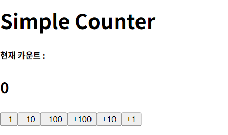

# [React] inferan 6

날짜: 2024년 12월 2일

# [문제] 요구 사항대로 출력물, UI는 만들었으나 기능적 동작 구현에 대한 접근 어려움

---



⇒ 생각나는대로 기능 구현은 했으나 동작하지 않음

**[App.jsx]**

```jsx
import { useState } from 'react'
import Viewer from './components/Viewer'
import Controller from './components/Controller'
import './App.css'
import './index.css'

function App() {
// viewer로 쪼갰는데 어떻게 count..
// props값을 내려준다?
  const [count, setCount] = useState(0) //초기값 설정 오류
  //setCount를 통해서 click이벤트 발동하니까.. name의 있는 key값으로 설정해서 동작하면 되지 않을까? 
  //controller 클릭하면, setCount가 발동됨

  const onClickButton = function(e) {
    //이에 걸맞는 setCount가 실행됨.. => 키 값으로
    //computed property
    //name
    // const [name] : name
    [e.target.name] = parseInt(e.target.value)
    setCount(count + [e.target.name]) //-인자
  }

  return (
    <div className="myBody">
     <h1>Simple Counter</h1>
     <Viewer 
     name={count}/>
     {/* 버튼 6개  */}
    <div>
     <Controller
      name="-1"
      onClick={onClickButton}
     />
      <Controller
      name="-10"
      onClick={onClickButton}
      />
      <Controller
      name="-100"
      onClick={onClickButton}
      />
      <Controller
      name="+100"
      onClick={onClickButton}
      />
      <Controller
      name="+10"
      onClick={onClickButton}
     />
      <Controller
      name="+1"
      onClick={onClickButton}
      />
    </div>
    </div>
  )
}

export default App

```

**[Viewer.jsx]**

```jsx
import { useState } from "react"

//이거 0을 props로 바꾸면 안되는가?

//count로 받아서 오류 => name값인데!! => 들어오는 값 자체로 받았어야하는데 name으로 받고, count라는 변수로 표기를 하니까 undefined
const Viewer = ({name}) => {
  //useState로 인해서 변경되는 값?
  // const [count, setCount] = useState(0) //ref같은 반응형 
  //count자체에 초기값 설정 useState로 변경시킬 것
  // console.log(name, '이 count는 안되나? == undefined')
  return (
    <div>
      <h5>현재 카운트 : </h5>
      <h2>{name}</h2>
      {/* 일단 setCount관련 반영 보류 */}
    </div>
  )
}

export default Viewer
```

**[Controller.jsx]**

```jsx
//props를 받아서 => 단순 props로 받으면 오류 발생
const Controller = ({name}) => {
  // console.log(name) //props에 뭐 들어있었더라

  return(
    <>
    {/* /태그로 감싼 것 해제해서 통일*/}
      <button>
        {name}
      </button>
    </>
  )
}

export default Controller
```

# 컴포넌트 데이터 전달 : State Lifting (State끌어올리기)

---


⇒ 생각한 방식과 동일 : 부모에서 자식으로 내려주기 
     (형제 관계X)

# [궁금한점]

---

## 1. App 컴포넌트에서 Controller를 6개로 만드는 것에 대해:

- 이론적으로는 가능하지만, 실제로는 비효율적입니다.
- 각 Controller에 동일한 state와 함수를 전달해야 하므로 코드가 반복됩니다.
- 또한 상태 관리가 복잡해질 수 있어 유지보수가 어려워질 수 있습니다.
- 현재 구조가 더 간결하고 관리하기 쉽습니다.

<aside>
💡

**[컴포넌트의 재사용성과 로직의 중앙화를 고려해야할 때]**

1. 동일한 로직을 가진 컴포넌트를 `여러 번 반복`하는 경우
2. `상태`나 함수를 `여러 컴포넌트에 개별적으로 전달`하는 경우
3. 컴포넌트 내부 로직을 변경할 때 여러 곳을 `수정`해야 하는 경우
4. `새로운 기능 추가` 시 기존 코드를 크게 수정해야 하는 경우
</aside>

## 현재 구조 (Controller 1개)

```jsx
function App() {
  const [count, setCount] = useState(0);
  const onClickButton = (value) => {
    setCount(count + value);
  };

  return (
    <div className='App'>
      <Viewer count={count} />
      <Controller onClickButton={onClickButton} />
    </div>
  );
}

```

## Controller 6개를 사용한 구조

```jsx
function App() {
  const [count, setCount] = useState(0);
  const onClickButton = (value) => {
    setCount(count + value);
  };

  return (
    <div className='App'>
      <Viewer count={count} />
      <Controller onClickButton={() => onClickButton(-1)} buttonText="-1" />
      <Controller onClickButton={() => onClickButton(-10)} buttonText="-10" />
      <Controller onClickButton={() => onClickButton(-100)} buttonText="-100" />
      <Controller onClickButton={() => onClickButton(100)} buttonText="+100" />
      <Controller onClickButton={() => onClickButton(10)} buttonText="+10" />
      <Controller onClickButton={() => onClickButton(1)} buttonText="+1" />
    </div>
  );
}

```

이 두 구조를 표로 비교해보겠습니다:

| 특성 | 현재 구조 (Controller 1개) | Controller 6개 구조 |
| --- | --- | --- |
| 코드 길이 | **짧고 간결함** | 길고 반복적임 |
| 유지보수 | 쉬움 (한 곳에서 관리) | 어려움 (여러 곳에서 관리) |
| 확장성 | 높음 (버튼 추가/삭제 용이) | **낮음 (매번 App 컴포넌트 수정 필요)** |
| 성능 | 좋음 (컴포넌트 적음) | 상대적으로 낮음 (컴포넌트 많음) |
| 재사용성 | **높음 (Controller 컴포넌트 재사용)** | 낮음 (각 Controller가 특정 기능에 종속) |

주요 차이점:

1. **코드 중복: Controller 6개 구조에서는 비슷한 코드가 반복**됩니다.
2. 유지보수: **버튼 동작을 변경할 때**, 현재 구조는 Controller 컴포넌트만 수정하면 되지만, 6개 구조는 App 컴포넌트의 **여러 곳을 수정해야 합니다.**
3. 확장성: 새 버튼을 추가하거나 제거할 때, 현재 구조는 **Controller 내부만 수정**하면 되지만, 6개 구조는 App 컴포넌트를 수정해야 합니다.
4. 성능: React는 각 컴포넌트를 별도로 렌더링하므로, **컴포넌트가 많을수록 잠재적으로 성능에 영향을 줄 수 있습니다.**

이러한 이유로 현재의 구조가 더 효율적이고 관리하기 쉽습니다.

## 2. 버튼을 배열로 생성하는 방법

- React에서도 반복적인 요소를 배열로 생성할 수 있습니다.
1. 버튼 데이터를 배열로 만드는 이유:
    - 반복적인 요소를 효율적으로 관리하기 위함입니다.
    - **데이터와 UI를 분리하여 유지보수를 쉽게** 만듭니다.
2. **객체 형태로 만드는 이유:**
    - **각 버튼마다 여러 속성(value, text 등)이 필요하기 때문입니다.**
    - 객체를 사용하면 **관련 데이터를 함께 그룹화**할 수 있습니다.

구체적인 예시를 보여드리겠습니다:

```jsx
const Controller = ({ onClickButton }) => {
  const buttons = [
    { value: -100, text: "-100" },
    { value: -10, text: "-10" },
    { value: -1, text: "-1" },
    { value: 1, text: "+1" },
    { value: 10, text: "+10" },
    { value: 100, text: "+100" }
  ];

  return (
    <div>
      {buttons.map((button) => (
        <button
          key={button.value}
          onClick={() => onClickButton(button.value)}
        >
          {button.text}
        </button>
      ))}
    </div>
  );
};

```

이렇게 하면:

1. 버튼 추가/삭제/수정이 쉬워집니다 (buttons 배열만 수정하면 됨).
2. 코드 중복이 줄어듭니다.
3. 버튼의 속성을 쉽게 확장할 수 있습니다 (예: 색상, 크기 등 추가 가능).

이 방식은 데이터 주도적 접근법으로, UI를 데이터에 따라 자동으로 생성하게 됩니다.

### Q2-1. map 함수에서 () vs {} vs ({}) 사용:

<aside>
💡

 map 함수는 원본 배열의 각 요소를 변환하여 새로운 배열을 반환

</aside>

- **() : 암시적 반환을 위해 사용합니다. 단일 표현식이나 JSX 요소를 바로 반환**할 때 사용합니다.
- {} : 함수 본문을 나타냅니다. **여러 줄의 코드나 명시적 return이 필요할 때** 사용합니다.
- **({}) : 객체를 암시적으로 반환할 때 사용**합니다.

예시:

```jsx
// () 사용: 단일 JSX 요소 반환
{btns.map((btn) => (
  <button key={btn.value}>{btn.text}</button>
))}

// {} 사용: 여러 줄의 코드나 로직이 필요할 때
{btns.map((btn) => {
  const style = btn.value > 0 ? { color: 'green' } : { color: 'red' };
  return <button style={style} key={btn.value}>{btn.text}</button>;
})}

// ({}) 사용: 객체를 반환할 때
const btnObjects = btns.map((btn) => ({
  element: <button key={btn.value}>{btn.text}</button>,
  value: btn.value
}));

```

### Q2-1-1. `JSX 자체의 반환 규칙`에 따른 () vs {} vs ({}) 더 이해해보기

| 구분 | 사용 시기 | 코드 예시 |
| --- | --- | --- |
| () | 간단한 표현식이나 **JSX를 바로 반환**할 때 | `(x) => (x + 1)` |
| {} | **여러 줄의 코드나 로직이 필요**할 때 | `(x) => { let y = x + 1; return y; }` |
| ({}) | **객체를 바로 반환**할 때 | `(x) => ({ value: x })`  |

<aside>
💡

1. 한 줄로 표현 가능한 간단한 반환은 () 를 사용합니다.
예: `() => (<div>Hello</div>)`
2. 두 줄 이상이거나 로직이 필요한 경우 {} 를 사용합니다.
예:
    
    ```jsx
    () => {
      const name = "John";
      return <div>Hello, {name}</div>;
    }
    
    ```
    
3. ({}) 는 객체를 즉시 반환할 때만 특별히 사용됩니다.
</aside>

실제 React 컴포넌트에서의 예시:

1. () 사용 (**간단한 JSX 반환**):

```jsx
const SimpleList = ({ items }) => (
  <ul>
    {items.map((item) => (
      <li key={item.id}>{item.name}</li>
    ))}
  </ul>
);

```

1. {} 사용 (**복잡한 로직**):

```jsx
const ComplexList = ({ items }) => {
  return (
    <ul>
      {items.map((item) => {
        let style = item.isSpecial ? { color: 'red' } : {};
        return <li key={item.id} style={style}>{item.name}</li>;
      })}
    </ul>
  );
};

```

1. ({}) 사용 (객체 반환):

⇒ 배열의 각 요소를 변환하여 객체로 만들 때

```jsx
const data = ['A', 'B', 'C'];
const objList = data.map((item, index) => ({
  id: index,
  value: item
}));
// objList는 [{id: 0, value: 'A'}, {id: 1, value: 'B'}, {id: 2, value: 'C'}]가 됩니다.

```

⇒ 키-값 쌍의 객체를 반환할 때

```jsx
const getName = (firstName, lastName) => ({ first: firstName, last: lastName });
```

## Q2-2. key 속성 설정 이유:

- React에서 key는 **리스트 아이템의 안정적인 ID를 제공**하기 위해 사용됩니다. 주요 이유는:
    - 성능 최적화: React가 리스트 아이템의 **변경, 추가, 제거를 효율적으로 파악**할 수 있게 합니다.
    - 컴포넌트 상태 유지: key를 통해 각 아이템의 ID를 유지하여 불필요한 리렌더링을 방지합니다.
    - **리스트 순서 변경 시 정확성 유지:** 아이템 순서가 바뀌어도 아이템을 올바르게 식별할 수 있습니다.

key는 형제 요소들 사이에서 고유해야 하며, 변하지 않는 값을 사용하는 것이 좋습니다. 여기서는 btn.value가 고유하고 안정적이므로 key로 사용되었습니다.

이러한 방식들은 React의 효율적인 렌더링과 상태 관리를 위해 중요한 역할을 합니다.
⇒ `즉 vue에서 v-for를 할 때 key값을 주는 것` 과 유사함

## 3. e.target.value 사용에 대해:

- button 요소의 value 속성은 문자열이므로, 숫자로 변환이 필요합니다.
- 현재 방식이 더 명확하고 오류 가능성이 적습니다.
- 그러나 필요하다면 이렇게 할 수도 있습니다:

```jsx
<button value="-1" onClick={(e) => onClickButton(parseInt(e.target.value))}>
  -1
</button>

```

| 특성 | **직접 값 전달 방식** | e.target.value 사용 방식 |
| --- | --- | --- |
| 코드 예시 | `onClick={() => onClickButton(-1)}` | `onClick={(e) => onClickButton(parseInt(e.target.value))}` |
| 타입 안정성 | **높음 (항상 숫자 타입)** | 낮음 (문자열을 숫자로 변환 필요) |
| 코드 명확성 | **높음 (값이 즉시 보임)** | 낮음 (값이 HTML에 있음) |
| 유지보수 | **쉬움 (직접 값 수정)** | 상대적으로 어려움 (HTML과 JS 모두 수정 필요) |
| 성능 | **좋음 (추가 처리 없음)** | 약간 떨어짐 (DOM 접근 및 파싱 필요) |
| 유연성 | 낮음 (정적 값) | 높음 (동적 값 사용 가능) |

이 표를 통해 대부분의 경우 직접 값을 전달하는 방식이 더 유리하다는 것을 알 수 있습니다. 하지만 동적으로 값을 생성해야 하는 특별한 상황에서는 e.target.value 방식이 유용할 수 있습니다.

### Q3-1. 동적으로 값을 생성해야 하는 상황(실시간으로 변하는 경우)

1. 사용자 입력에 따라 버튼 값이 변하는 경우:
    
    ```jsx
    const [buttonValue, setButtonValue] = useState("1");
    
    return (
      <>
        <input
          type="number"
          value={buttonValue}
          onChange={(e) => setButtonValue(e.target.value)}
        />
        <button
          value={buttonValue}
          onClick={(e) => onClickButton(parseInt(e.target.value))}
        >
          Click me
        </button>
      </>
    );
    
    ```
    
    여기서는 사용자가 입력한 값에 따라 **버튼의 value가 동적으로 변합니다.**
    
2. 서버에서 받아온 데이터로 버튼 값을 설정하는 경우:
    
    ```jsx
    const [buttonValues, setButtonValues] = useState([]);
    
    useEffect(() => {
      // 서버에서 데이터를 받아오는 가정의 함수
      fetchButtonValues().then(values => setButtonValues(values));
    }, []);
    
    return (
      <>
        {buttonValues.map(value => (
          <button
            key={value}
            value={value}
            onClick={(e) => onClickButton(parseInt(e.target.value))}
          >
            {value}
          </button>
        ))}
      </>
    );
    
    ```
    
    이 경우, 서버에서 받아온 데이터에 따라 버튼들이 동적으로 생성됩니다.
    

이러한 상황에서는 e.target.value를 사용하는 것이 더 유연하고 효율적일 수 있습니다. 버튼의 값이 동적으로 변하더라도, **onClick 핸들러를 수정할 필요 없이 항상 현재 버튼의 값을 정확히 가져올 수 있기 때문**입니다.

## 4. onClick에서 직접 실행하는 것에 대해

- `onClick={onClickButton}`처럼 사용하면 클릭 이벤트 객체가 자동으로 전달됩니다.
**(따라서 특정 값을 전달할 수 없음)**
- 특정 값을 전달하려면 화살표 함수를 사용해야 합니다:
`onClick={() => onClickButton(-1)}`
- 이렇게 하면 원하는 인자를 정확히 전달할 수 있습니다.

이러한 방식들은 각각 장단점이 있으며, 상황에 따라 적절한 방법을 선택하면 됩니다.

### Q4-1. onClickButton(-1)은 안되는 이유

1. 즉시 실행 문제:
    - `onClick={onClickButton(-1)}`은 렌더링 시점에 즉시 함수를 실행합니다.
    - **이는 클릭 이벤트가 발생하기 전에 함수가 실행되어 버립니다.**
2. 반환값 할당:
    - 위 방식은 onClickButton(-1)의 **실행 결과를 onClick에 할당하게 됩니다.**
    - 대부분의 경우 이 함수는 아무것도 반환하지 않아 onClick에 undefined가 할당됩니다.
3. 올바른 사용법:
    - `onClick={() => onClickButton(-1)}`
    - 이 방식은 클릭 시점에 함수를 실행하도록 새로운 함수를 만듭니다.
4. 차이점 예시:
    
    ```jsx
    // 잘못된 방식 (즉시 실행)
    <button onClick={console.log('Clicked!')}>Click me</button>
    
    // 올바른 방식 (클릭 시 실행)
    <button onClick={() => console.log('Clicked!')}>Click me</button>
    
    ```
    

따라서 `onClick={() => onClickButton(-1)}`을 사용하여 **클릭 시점에 원하는 인자와 함께 함수를 실행**할 수 있습니다.