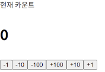

# [React] Counter APP 복습

날짜: 2024년 12월 2일

# [에러] Uncaught SyntaxError: The requested module '/src/components/Viewer.jsx?t=1733139245935' does not provide an export named 'default' (at App.jsx:3:8)

---

```
//viewer.jsx

const Viewer = () => {
  return (
    <h1>Viewer</h1>
  )
}

export default Viewer
```

⇒ 새로고침 : 제대로 export default 값이 반영되지 않았음

# [반응 없음] margin auto 값 설정해도 설정에 변동없는 이유

---



```jsx
.App {
  margin: 0 auto;
  display: flex;
  flex-direction: column;
  gap: 10px; 
  /* 서로 간격 : gap */
  /* margin: 0 auto; :: 이거 해도 안먹음 */
}
```

**[작동하지 않는 원인]**

1. **Flex Container의 특성** `flex container는 기본적으로 전체 너비를 차지`하므로(width: 100%), margin: auto가 적용될 여백 공간이 없습니다[2](https://stackoverflow.com/questions/4955122/what-exactly-is-needed-for-margin-0-auto-to-work)[6](https://www.reddit.com/r/Frontend/comments/13pjdgc/difference_bw_marginauto_and_flex_box/).
2. **너비 지정 필요**margin: 0 auto가 작동하려면 요소에 명시적인 width가 지정되어 있어야 합니다

<aside>
💡

flex layout에서는 margin: auto 대신 flexbox의 정렬 속성(justify-content, align-items)을 
사용하는 것이 더 권장됩니다

</aside>

# [오류] 출력값이 변동되지 않고, Object로 출력되는 문제

---


[Controller.jsx]

```jsx
const Controller = ({onClickCount}) => {
  //현재 button 여러개
  //state는 APP에서 총괄 => 따라서 state를 중앙에서 관리할 수 있도록 내부 선언
  const btns = [ //여러 btn 똑같은 내용을 반복적으로 활용
    {data : -1, text : '-1'},
    {data : -10, text : '-10'},
    {data : -100, text : '-100'},
    {data : 100, text : '+100'},
    {data : 10, text : '+10'},
    {data : 1, text : '+1'},
  ]

  //onClickCount를 받음
  //이걸 어떻게 활용할 것인가? => 그대로 사용 => 지금 onClickCount는 setValue 도와주는 애
  const onClickBtn = (data) => { //Btn을 누르면 onClickCount가 실행된다.
    //e.target => 동적일때 유용한데,, 
    onClickCount(data) //data를 전달해줌
  }

  return (
    // 큰 묶음으로 하나 사용
    <div>
       {/*jsx연산자 임을 기억*/}
       {/* 새로운 요소로 하나씩 반환 => 그런데 지금은 button자체에 값을 넣는게 아니니까 forEach로 하면 안되나? */}
      {btns.map((btn) => ( //map을 객체로 반환할 필요가 없음 => 단순 데이터만 활용할 것
        <button
        onClick={onClickBtn}
        key={btn.data}> 
          {/* 실제 값을 넘겨주는 것 보류 */}
          {btn.text} 
          {/* btn의 텍스트만 활용 */}
        </button>
      ))}

    </div>
  )
}

export default Controller
```

⇒ 디버깅


⇒ 매개변수로 전달하는 값이 없음

```jsx
 onClick={onClickBtn(btn.data)}
```


⇒ 이건 또 호출방식이 잘못됨

```jsx
<button
// 그래서 지금 생각난 것은 onClick 눌리면 onClickBTN실행 == 오 이게 맞나..?
onClick={() => onClickBtn(btn.data)}
```

# ⚠️OnClick 이벤트 동작

---

**`화살표 함수를 사용한 경우`**:

```jsx
onClick={() => onClickBtn(btn.data)}

```

- **버튼을 클릭할 때만 onClickBtn 함수가 실행됩니다**.
- btn.data를 매개변수로 전달할 수 있습니다.

**직접 함수를 호출한 경우**:

```jsx
onClick={onClickBtn(btn.data)}

```

- 컴포넌트가 렌더링되는 `즉시` 함수가 실행됩니다.
- 클릭 이벤트에 대한 핸들러로 작동하지 않습니다.

## 매개변수 전달

**화살표 함수를 사용하는 방식이 필요한 주요 이유:**

- 매개변수를 이벤트 핸들러에 전달할 수 있습니다.
- **클릭 시점에 현재 값을 전달할 수 있습니다].**
- **함수의 실행을 클릭 순간까지 지연시킬 수 있습니다.**

이러한 패턴은 특히 목록이나 반복되는 요소에서 각 항목의 고유한 데이터를 처리할 때 매우 유용합니다.

## ⚠️ `화살표 함수`가 이러한 동작을 가능케하는 이유

---

## 클로저(Closure)와 `함수 래핑`

**기본 원리**

```jsx
// 일반적인 직접 호출
onClick={doSomething(param)}  // 즉시 실행됨

// 화살표 함수로 래핑
onClick={() => doSomething(param)}  // 클릭 시 실행됨

```

**화살표 함수는 `새로운 함수를 생성`하여 원래 함수를 감싸는(`래핑`하는**) 역할을 합니다. 이 과정에서:

1. **함수 실행 지연**
    - 화살표 함수는 새로운 함수를 만들어 반환합니다
    - 이 새 함수는 `클릭 이벤트가 발생할 때까지 실행되지 않습`니다
2. **클로저 생성**
    - 화살표 함수는 클로저를 형성하여 매개변수의 현재 값을 "기억"합니다
    - 클릭 시점에 저장된 값을 사용할 수 있게 됩니다
3. **컨텍스트 유지**
    - `화살표 함수는 자신이 생성된 시점의 컨텍스트를 유지`합니다
    - 이를 통해 매개변수와 함께 필요한 모든 정보를 클릭 시점까지 보존할 수 있습니다

이러한 메커니즘 덕분에 클릭 이벤트가 발생하는 시점에 정확한 값을 전달하고 실행할 수 있게 됩니다.

# [놓친 부분] Background color 동시적용

---

- component 자체에 불가능 하기 때문에 각 영역을 나눠서 적용할 수 있도록 변경
    - ex) section으로 묶어서 관리