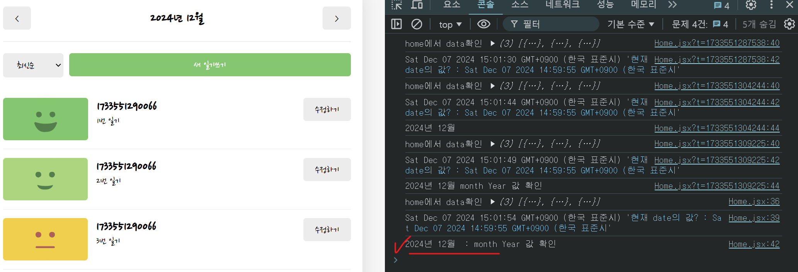

# [React] 감정 일기장 복습3

날짜: 2024년 12월 7일

# ⚠️ 이전 DiaryList, DiaryListItem Css 구조 접근
⇒ CSS 구조 및 DIV Tag 작성/사용법에 대한 피드백

---

1. HTML 구조의 일관성:
    - 문제: div와 section 태그를 혼용하고 있어 구조가 일관적이지 않습니다.
    - 개선: **의미적으로 적절한 태그를 선택하고, 일관성 있게 사**용하세요. 예를 들어, 모두 div를 사용하거나 모두 section을 사용하세요.
2. 클래스 이름 규칙:
    - 문제: 클래스 이름이 일관성이 없고, 때로는 누락되어 있습니다.
    - 개선: **BEM 같은 명명 규칙을 사용하여 일관된 클래스 이름**을 만드세요. 예: `diary-list__menu-bar`, `diary-list-item__img-section` 등
3. CSS 구조화:
    - 문제: CSS 속성의 순서가 일관적이지 않고, 불필요한 주석이 많습니다.
    - 개선: **CSS 속성을 그룹화하고 일관된 순서로 정렬**하세요. 예: 레이아웃 > 크기 > 간격 > 스타일 > 기타
4. Flexbox 사용:
    - 문제: Flexbox를 사용하고 있지만, 완전히 이해하지 못한 것 같습니다.
    - 개선: **Flexbox의 기본 개념** (main axis, cross axis, flex-grow 등)을 학습하고 연습하세요.
5. **반응형 디자인:**
    - 문제: 고정 크기(px)를 많이 사용하고 있어 반응형이 아닙니다.
    - 개선: 상대 단위(%, em, rem)를 더 많이 사용하고, 미디어 쿼리를 통해 반응형 레이아웃을 구현하세요.

개선을 위한 단계별 접근:

1. **HTML 구조 재검토**:
    - 각 요소의 의미를 고려하여 적절한 태그 선택
    - 중첩 구조를 단순화하고 일관성 있게 만들기
2. CSS 클래스 이름 재정의:
    - BEM 같은 명명 규칙 학습 및 적용
    - 모든 요소에 적절한 클래스 이름 부여
3. CSS 스타일 정리:
    - 속성 그룹화 및 일관된 순서로 정렬
    - 불필요한 스타일 제거 및 중복 최소화
4. **Flexbox 심화 학습:**
    - **Flexbox 튜토리얼 완료 (예: Flexbox Froggy)**
    - 실제 프로젝트에 다양한 Flexbox 기능 적용
5. 반응형 디자인 적용:
    - 고정 크기를 상대 단위로 변경
    - 미디어 쿼리를 사용하여 다양한 화면 크기 대응

이러한 단계를 통해 점진적으로 개선해 나가면, 더 체계적이고 유지보수가 용이한 코드를 작성할 수 있을 것입니다. 꾸준한 연습과 실제 프로젝트 적용을 통해 스킬을 향상시키세요.

# ⚠️ 이전 파트 CSS 학습 내용

---

## 1. BEM (Block Element Modifier) 명명 규칙:

---

- BEM은 CSS 클래스 이름을 체계적으로 만드는 방법입니다.
    - Block: 독립적인 컴포넌트 (예: `.card`)
        - Block: 큰 레고 블록이라고 생각하세요.
        - 예를 들어, 전체 다이어리 리스트를 'diary-list'라고 부를 수 있어요.
    - Element: Block의 일부 (예: `.card__title`)
        - Element: 큰 블록 안에 있는 작은 부분들이에요.
        - 예를 들어, 다이어리 리스트 안의 버튼은 'diary-list__button'이 될 수 있어요.
    - Modifier: Block이나 Element의 변형 (예: `.card--large`)
        - Modifier: 같은 블록이나 요소지만 조금 다른 버전이에요. 예를 들어, **큰 버튼은 'diary-list__button--large**'가 될 수 있어요.

예시: `<div class="card card--large"><h2 class="card__title">제목</h2></div>`

## 2. CSS 속성 그룹화 및 정렬:

---

- 일반적인 순서는 다음과 같습니다:
    1. 레이아웃 (display, position, float 등)
    2. 크기 (width, height 등)
    3. 간격 (margin, padding 등)
    4. 테두리 (border 등)
    5. 배경 (background 등)
    6. 글꼴/텍스트 (font, text-align 등)
    7. 기타 (opacity, cursor 등)

CSS를 쓸 때는 마치 사람을 꾸미는 것처럼 생각해보세요.

```css
.diary-item {
  /* 1. 어디에 둘지 (레이아웃) */
  display: flex;
  position: relative;

  /* 2. 얼마나 크게 할지 (크기) */
  width: 100%;
  height: 80px;

  /* 3. 얼마나 떨어뜨릴지 (간격) */
  margin: 10px 0;
  padding: 5px;

  /* 4. 테두리를 어떻게 할지 */
  border: 1px solid #ccc;

------------------------------------------ 치장 ↓

  /* 5. 배경은 어떻게 할지 */
  background-color: #f9f9f9;

  /* 6. 글씨는 어떻게 할지 */
  font-size: 16px;
  color: #333;

  /* 7. 기타 */
  cursor: pointer;
}

```

이렇게 하면 CSS를 읽을 때 위에서부터 아래로 자연스럽게 이해할 수 있어요.

## 3. Flexbox 기본 개념:

---

| 개념 | 설명 | 예시 |
| --- | --- | --- |
| Main Axis | 주축, flex-direction에 따라 결정 | `flex-direction: row;` |
| Cross Axis | 교차축, 주축과 수직 | `align-items: center;` |
| flex-grow | 남은 공간을 차지하는 비율 | `flex-grow: 1;` |

예시:

```css
.container {
  display: flex;
  justify-content: space-between;
}
.item {
  flex-grow: 1;
}

```

## 4. 반응형 디자인:

---

- **px: 고정 크기 단위, 화면 크기에 따라 변하지 않음**
- **%: 부모 요소에 대한 상대적 크기**
- **em: 현재 폰트 크기**에 대한 상대적 크기
- **rem: 루트 요소의 폰트** 크기에 대한 상대적 크기

**미디어 쿼리: 화면 크기에 따라 다른 스타일을 적용하는 CSS 기술**

예시:

```css
@media (max-width: 600px) {
  .container {
    flex-direction: column;
  }
}

```

이러한 개념들을 이해하고 적용하면 더 유연하고 유지보수가 쉬운 CSS를 작성할 수 있습니다.

## 5. HTML 구조 재검토:

- HTML을 만들 때는 마치 레고 블록을 쌓는 것처럼 생각하세요.
    - **큰 블록(컨테이너)부터 시작해서 작은 블록(내용)**을 넣어가는 거예요.

예시:

```html
<div class="diary-list">
  <div class="diary-list__header">
    <select class="diary-list__select">...</select>
    <button class="diary-list__button">...</button>
  </div>
  <div class="diary-list__items">
    <div class="diary-item">...</div>
    <div class="diary-item">...</div>
  </div>
</div>

```

이렇게 하면 구조가 깔끔하고 이해하기 쉬워져요.

# ⚠️ React와 컴포넌트 설계 이해하기

---

<aside>
💡

이를 개선하기 위한 접근 방법:

1. 작은 단위로 시작하기: 먼저 **작은 컴포넌트(예: Button)부터 만들고 점진적으로 확장**하세요.
2. **컴포넌트 트리 그리기:** 앱의 구조를 시각화하여 컴포넌트 간의 관계를 이해하세요.
3. 상태 흐름 파악하기: 어떤 데이터가 어디서 필요한지 파악하고, 그에 따라 **상태 위치를 결정**하세요.
4. 리팩토링 연습: 코드를 작성한 후 더 나은 구조로 개선할 방법을 고민해보세요.
5. 실제 프로젝트 경험: 다양한 프로젝트를 해보면서 패턴을 익히세요.
</aside>

1. 컴포넌트의 `책임` 정의:
    - **각 컴포넌트가 하나의 주요 기능만 담당**하도록 합니다.
    - 예: Home은 **전체 레이아웃과 상태 관리**, Header는 단순 표시 역할
2. `상태 관리` 위치 결정:
    - 데이터를 사용하는 컴포넌트들의 **가장 가까운 공통 부모에 상태**를 둡니다.
    - 예: **날짜 상태는 여러 컴포넌트에서 사용되므로 Home에서 관리**
3. `Props` 설계:
    - 컴포넌트가 필요로 하는 **최소한의 데이터만 props로 전달**합니다.
    - `예`: Header에는 text, leftChild, rightChild만 전달
4. 재사용성 고려:
    - 컴포넌트를 가능한 한 일반적으로 만들어 여러 상황에서 사용할 수 있게 합니다.
    - 예: Button 컴포넌트를 만들어 여러 곳에서 재사용

놓친 부분:

- 컴포넌트의 **재사용성과 유연성**
- **상태 관리**의 중앙화 (Home 컴포넌트에서 관리)

앞으로 문제에 접근할 때:

1. **전체 앱의 구조를 먼저 생각**해보세요.
2. 각 컴포넌트의 **역할을 명확히 정의**하세요.
3. 데이터 흐름을 고려하여 **상태 관리 위치를 결정**하세요.
4. 컴포넌트를 최대한 **재사용 가능하게 설계**하세요.

이러한 접근 방식을 꾸준히 연습하면, 시간이 지남에 따라 더 나은 컴포넌트 구조를 설계할 수 있게 될 것입니다.

# ⚠️ 단일 진실 공급원(Single Source of Truth) 원칙

---

| 구분 | 단일 진실 공급원(Single Source of Truth) 원칙 |
| --- | --- |
| 정의 | 애플리케이션의 **각 데이터 조각이 한 곳에서만 관리**되어야 함 |
| 목적 | - 데이터 일관성 유지
- 상태 관리 단순화
- 버그 발생 가능성 감소 |
| React 적용 예시 | - 상위 컴포넌트에서 상태 관리
- Props를 통해 하위 컴포넌트에 전달
**- Redux, Context API 활용** |
| 장점 | - 데이터 흐름 예측 용이
**- 상태 변경 추적 용이**
- 컴포넌트 간 데이터 동기화 문제 방지 |
| 주의사항 | - 과도한 중앙 집중은 오히려 복잡성 증가
- 적절한 상태 관리 범위 고려 필요 |

```jsx
const Home = () => {
const [date, setDate] = useState(new Date());
// 날짜 상태를 Home에서 관리
return (
<Header
text={date}
onDateChange={setDate}
/>)}
```

# Home 페이지 구현하기

---

## 날짜 데이터 범위 뽑기 + 날짜 형식 변경하기

---

[[Javascript] 자바스크립트 Date 기간 조회하는 법 (+ 주의사항)](https://beforb.tistory.com/23)

[[JavaScript]자바스크립트 날짜 계산 방법 총정리: 특정 날짜 차이 계산](https://winkitee.tistory.com/114)

## [궁금한점] 날짜 형식 변환 ⇒ 처음~마지막

---

<aside>
💡

1. **`getMonth()`**로 0~11 값을 얻음
2. 사람이 이해하기 쉽도록 1을 더해 1~12로 변환
3. **`new Date()`**를 사용할 때 다시 1을 빼서 0~11로 되돌림
</aside>

```jsx
// 특정 월의 첫번쨰 날짜, 마지막 날짜 구하기
const getFirsLast = (date) => {
  //date를 받아와서 year, month 추출
  const year = date.getFullYear()
  const month = date.getMonth() + 1

  let firstDay = new Date(year, month-1, 1)
  let nextMonth = new Date(year, month, 1) //다음 달의 첫번쨰 날짜
  nextMonth.setDate(nextMonth.getDate()-1) //일자로 환산해서 -1시키고
  //Q. setDate의 의미??
  let lastDay = nextMonth
  //해당 date가 범위에 있으면 반환 filter로 
}
```

- 2번 블로그 활용하여 코드를 작성했는데 해당 코드 구조나 활용 이유가 궁금해짐
1. new Date(year, month, day)의 의미:
맞습니다. new Date()에 년, 월, 일을 지정하면 해당 날짜의 Date 객체를 생성합니다.
2. month - 1을 하는 이유:
**JavaScript의 Date 객체에서 월(month)은 0부터 시작**합니다. 즉, 1월은 0, 2월은 1, ... 12월은 11입니다.
따라서 **우리가 일반적으로 사용하는 월 표기(1~12)를 Date 객체에 넣을 때는 1을 빼줘야** 합니다.
    
    예: 2월을 나타내려면 new Date(year, 1, 1)로 해야 합니다.
    
3. nextMonth.setDate()의 의미:
**setDate() 메서드는 Date 객체의 '일(day)' 부분을 설정합**니다.
**nextMonth.getDate()는 현재 '일'을 가져오고,** 여기서 1을 빼는 것은 이전 달의 마지막 날을 구하기 위함입니다.
    
    예를 들어, 3월 1일에서 하루를 빼면 2월의 마지막 날(28일 또는 29일)이 됩니다.
    

이 함수의 로직을 단계별로 설명하면:

1. 입력받은 date에서 년도와 월을 추출합니다.
2. firstDay는 해당 월의 1일로 설정합니다.
3. nextMonth는 다음 달의 1일로 설정합니다.
4. nextMonth에서 하루를 뺌으로써 현재 월의 마지막 날을 구합니다.

이렇게 하면 윤년 등을 고려하지 않고도 정확한 월의 첫날과 마지막 날을 구할 수 있습니다.

## 날짜를 title props에 전달해서 화면에 실시간 렌더링 하기

---

- 새로운 `state 생성`

```jsx
// 보면 header에서 text를 전달해줘야해서 실제적으로 여기서 진행할 것
// 그리고 diary의 date의 처음년도, 마지막년도를 알아야 filter를 통해 가져올 수 있음 
// 그럼 해당 데이터를 받아오고 => 해당 내용이 mount 되었을 때 년도 필터링해서 해당되는 데이터 반환
// data에 맞는 내용이 있을떄마다 => 날짜가 바뀔떄마다 function이 실행되어야 함
// 근데 한번만 mount되면 됨 왜냐면 12월 page에 올때마다 해당 함수를 mount 할 필요가 없기 때문에 => 연도가 바뀌면 모를까
// 새로고침마다 실행할 필요없음 

//다시 아니라고 생각한게 이게 배열로 12월도 있을수도 있고, 11월도 있을 수가 있음.. 
//그래서 state별로 동작을 진행해야하는데.. == 지금 117123125 이러한 형식으로 되어있어서 이것부터 고쳐야 함
```

- 생각을 못했지만 → 흐름 상 늦게나마 가이드는 잡았던 부분

## 날짜를 title props에 전달하기 위한 과정 고민하기 
⇒ [에러] Uncaught (in promise) TypeError: date.getMoth is not a function at dateFormatter (Home.jsx:25:22) at Home

---

```jsx
// 일단 dateformate을 변경해야함
const dateFormatter = (date) => {
  const year = date.getFullYear()
  const month = date.getMoth() + 1 //month는 +1을 해줘야 함
  const day = date.getDate() //날짜는 getDate 

  //지금 반환하고 싶은 것은 year-month만 
  //다같이 반환도 가능 => 이런식으로 데이트를 반환
  return `${year}년 ${month}월`
}

const Home = () => {
  const data = useContext(DiaryStateContext) //받아온 data => date와 일치여부 판단 진행할 것
  console.log('home에서 data확인', data)
  //일단 현재날짜로 초기 설정을 해줘야 함 => 왜냐면 지금 다이어리도 현재 날짜 기준 
  const [date, setDate] = useState(new Date()) //useState값이 없기 때문 -> 지금 바로 date => dateFormatter Error 발생
  //date가 계속해서 바뀌고 랜더링 되기 때문에..
  //해당 데이터의 형식이 어떤지?
  //그럼 이건 지금 될까?
  const monthYear = dateFormatter(date) // 가질 수 없다고 함
```

⇒ 일단 date를 뽑아올 수 없는 것 같은데 해당 내역 다시 확인 ⇒ useState에 있는 date부터 확인해보자

## [에러] date.getMoth is not a function

---

- getMonth가 아닌가? 메서드 부터 다시 확인 == 오타가 있는 것을 확인할 수 있음 ⇒ `해결`

[Date.prototype.getMonth() - JavaScript | MDN](https://developer.mozilla.org/ko/docs/Web/JavaScript/Reference/Global_Objects/Date/getMonth)



```jsx
  const [date, setDate] = useState(new Date()) //useState값이 없기 때문 -> 지금 바로 date => dateFormatter Error 발생
  console.log(date, '현재 date의 값? : Sat Dec 07 2024 14:59:55 GMT+0900 (한국 표준시')

  const monthYear = dateFormatter(date) // 오타 문제
  console.log(monthYear, ' : month Year 값 확인')
```

## 날짜에 한달 전, 한달 후 더하기

---

[[Javascript] new Date() 날짜(일 / 월 / 년), 증가/감소.](https://im-first-rate.tistory.com/150)

## 날짜 부여에 대한 방향성 상실..

---

[Header.jsx]

```jsx
import Button from './Button'
import './Header.css'

// 일단 dateformate을 변경해야함
const dateFormatter = (date) => { //Home에 있는 내용을 Header로 옮겨와서 문제 없음
  const year = date.getFullYear()
  const month = date.getMonth() + 1 //month는 +1을 해줘야 함
  const day = date.getDate() //날짜는 getDate 

  //지금 반환하고 싶은 것은 year-month만 
  //다같이 반환도 가능 => 이런식으로 데이트를 반환
  return `${year}년 ${month}월`
}

// 특정 월의 첫번쨰 날짜, 마지막 날짜 구하기
const getFirsLast = (date) => {
  //date를 받아와서 year, month 추출
  const year = date.getFullYear()
  const month = date.getMonth() + 1

  let firstDay = new Date(year, month-1, 1)
  let nextMonth = new Date(year, month, 1) //다음 달의 첫번쨰 날짜
  nextMonth.setDate(nextMonth.getDate()-1) //일자로 환산해서 -1시키고
  //Q. setDate의 의미??
  let lastDay = nextMonth
  //해당 date가 범위에 있으면 반환 filter로 
  return [firstDay, lastDay]
}

// Q. props의 키 값을 기준으로 받아오는 것인지?
const Header = ({text}) => { 
  const monthYear = dateFormatter(text) // 오타 문제 => Header와 관련된 날짜 문제
  //text받아와서 진행..
  //text에 현재의 date를 받아왔는지에 대해 확인해보기
  console.log('날짜 값을 받아왔습니다 : ', text)
  //왼쪽으로 갈때 date 감소
  //오른쪽 갈떄 date 증가

  //근데 중요한 것은 이렇게 해도 state가 선언되어 있지 않기 때문에 동작 랜더링이 되지 않을 것..
  //clickEvent로 달력 날짜 조정 => 지금 근데 lastMonth에서 조정을 해야하는데 Home에서 날짜 formatt을 변환하는 것은 아닌 것 같음 
  //근데 이것자체가 filter를 했을떄의 전제,,
  const onClickLastMonth = (text) => { //지금 date의 month -1 ..?
    //daetFormatter로 넘기면 되는데 여기서 어떻게 값을 하나 더 증가시킨..
    const lastMonth = new Date(text).addMonth(-1)

  }
  const onClickNextMonth = (text) => { //지금 date의 month + 1
    const nextMonth = new Date(text).addMonth(1)
  }

  return (
    <div className='Header'> 
      <div className="header_left">
        <Button text={"<"}
        onClick={onClickLastMonth}/>
      </div>
      <div className="header_title">{`${monthYear}의 일기`}</div>
      <div className="header_right">
        <Button text={">"}
        onClick={onClickNextMonth}/>
      </div>
    </div>
  )
}

export default Header
```

## 다시 원점으로 Home Component

---

[지금 판단한 상황]

```jsx
[판단한 지금 상황]

1. 날짜 date 가 필요한 상황
2. Home Component == 결론적으로 Home Component에 `state 부여`
	2-1. Header : 자체적으로 날짜를 `동적` 변경해야 한다.
	ex) 2024년 12월, 2024년 11월, 2025년 1월..
	2-2. DiaryList
	2-3. DiaryListItem : 자체적으로 날짜를 동적 변경할 일은 딱히 없다.
		≫ 자체적으로 내부에 있는 값만 화면에 뿌려주면 됨
		※ 단 주의할점은 `Header`에서 진행되는 동적변경에 따라 `필터링`이 진행되어야 한다.
		ex) todoList check 연동처럼..
```

## 날짜 필터링, 날짜 범위, 날짜 형식화

---

- 다 원하는 값으로 나오긴 함.. 원하는 값을 다 뽑음

```jsx
//일단 여기서 확인해본다면?
//특정 월의 첫번쨰 날짜, 마지막 날짜 구하기
const getFirsLast = (date) => {
  const year = date.getFullYear()
  const month = date.getMonth() + 1
  let firstDay = new Date(year, month-1, 1)
  let nextMonth = new Date(year, month, 1) //다음 달의 첫번쨰 날짜
  nextMonth.setDate(nextMonth.getDate()-1) //일자로 환산해서 -1시키고
  //Q. setDate ??
  let lastDay = nextMonth
  //해당 date가 범위에 있으면 반환 filter로 
  return [firstDay, lastDay]
}

// 일단 dateformate을 변경해야함 == formatter
const dateFormatter = (date) => {
  const year = date.getFullYear()
  const month = date.getMonth() + 1 //month는 +1을 해줘야 함
  const day = date.getDate() //날짜는 getDate 

  //지금 반환하고 싶은 것은 year-month만 
  //다같이 반환도 가능 => 이런식으로 데이트를 반환
  return `${year}년 ${month}월`
}

const Home = () => {
  const data = useContext(DiaryStateContext) //받아온 data => date와 일치여부 판단 진행할 것
  console.log('home에서 data확인', data)
  console.log(data[0].createdDate, '17...값을 바꾸기')
  console.log(new Date(data[0].createdDate).getMonth() + 1, '월 받아오기')

  const [date, setDate] = useState(new Date()) 
  //date는 계속 바뀔 것..
  console.log(date, '현재 date 확인')
  const monthYear = dateFormatter(date)
  console.log('monthYear 형식 반환', monthYear)

  //날짜 범위 추출
  const dateLange = getFirsLast(date)
  console.log('날짜 범위 : ', dateLange) //범위 추출은 완료됨

  //여기 해당 되는 dictionary 값이 있는지 확인 == 범위 안의 다이어리 값 찾아올 수 있음
  const rangeDiary = data.filter((item) => String(new Date(item.createdDate).getMonth()+1) === String(date.getMonth()+1))
  console.log(rangeDiary, '범위안의 다이어리 값')

...
  // 년도 계산으로 버튼 눌렀을 때 진행
  return (
    // Header 컴포넌트 생성필요
    <div>
      {/* 여기서도 state로 동적으로 바뀔친구  */}
      <Header text={date}/> 
      {/* 데이터 정보전달 */}
      {/* <DiaryList data={rangeDiary}/> */}
      {/* 여기서 데이터는 동적으로 : context 바뀔 친구 */}
      <DiaryList data={data}/>
    </div>
  )
}
```

⇒ 또 생각이 드는게 props로 내려주기 때문에 정말 변환과 관련된 것은 Header와 List or ListItem에서 하면 안될까..??

## “<” click btn과 관련된 에러
[에러] Header.jsx:35 Uncaught TypeError: (intermediate value).addMonth is not a function

---

```jsx
  const onClickLastMonth = (text) => { //지금 date의 month -1 ..?
    //daetFormatter로 넘기면 되는데 여기서 어떻게 값을 하나 더 증가시킨..
    const lastMonth = new Date(text).addMonth(-1)
    console.log(lastMonth)

  }
```

- 블로그 보고 했는데 틀림

```jsx
  const onClickLastMonth = (text) => { //지금 date의 month -1 ..?
    //daetFormatter로 넘기면 되는데 여기서 어떻게 값을 하나 더 증가시킨..
    const lastMonth = new Date(text).getMonth() - 1 //NAN
    console.log(lastMonth)
  }
```

[JavaScript 날짜 계산 방법(어제, 한달 전, 일년 전, 내일, 한달 후, 일년 후 구하기, 날짜 더하기, 날짜 빼기)](https://jsikim1.tistory.com/103)

## 강의 보고 수정 진행

---

## Home Component의 Header 부분 ⇒ 직접적인 Header

---

[Home Component에 Header 선언]

```jsx
 <Header text={`${pivotDate.getFullYear()}년
      ${pivotDate.getMonth()+1}월`}
      rightChild={<Button
      text={">"}/>}
      leftChild={<Button 
      text={"<"}/>}/> 
```

<aside>
💡

이러한 구조를 만들기 위한 접근 방법:

1. 컴포넌트의 책임 정의: 각 컴포넌트가 무엇을 해야 하는지 명확히 합니다.
2. 상태 관리 위치 결정: 어느 컴포넌트가 상태를 관리해야 가장 효율적인지 고려합니다.
3. Props 설계: 컴포넌트간 데이터와 함수 전달을 위한 props를 설계합니다.
4. 재사용성 고려: 컴포넌트를 최대한 범용적으로 만들어 재사용성을 높입니다.

이러한 접근 방식은 코드의 유지보수성과 확장성을 높이는 데 도움이 됩니다.

</aside>

1. 컴포넌트 구조와 책임 분배:
    - 선생님의 코드: Home 컴포넌트가 `날짜 관리와 버튼 생성의 책임`을 갖습니다. **Header는 단순히 받은 props를 렌더링합니다**.
    - 당신의 코드: Header 컴포넌트가 날짜 관리와 버튼 생성의 책임을 갖습니다.
    
    이유: 선생님의 접근 방식은 "**단일 책임 원칙"과 "관심사의 분리"**를 더 잘 따릅니다. H**ome 컴포넌트가 전체 앱의 상태를 관리하고**, Header는 순수하게 UI를 표시하는 역할만 합니다.
    
2. 재사용성과 유연성:
    - 선생님의 코드: **Header 컴포넌트가 더 유연하고 재사용 가능합니다**. leftChild와 rightChild props를 통해 **다양한 컨텐츠를 받을 수 있습니다**.
    - 당신의 코드: Header 컴포넌트가 **특정 기능(월 이동)에 더 특화**되어 있습니다.
    
    이유: 선생님의 접근 방식은 **Header 컴포넌트를 더 범용적으로 만들어, 다른 상황에서도 재사용**할 수 있게 합니다.
    

<aside>
💡

상기 내용을 읽고 판단한 내용

</aside>

- home에서 날짜 관련 상태 컴포넌트를 관리함
    - 날짜가 변동됨에 따라 내부 값도 바뀜 따라서 상태 관련 변경 내용은 home 내부에서 모두 관리해야 함
    - 버튼을 눌렀을때 == 날짜 변동
        - 결론적으로 이것 역시 날짜가 바뀌는 state를 건들이는 것이기 때문에 Header가 아닌 Home의 button에서 관리하고, header는 관련 props만 내리는 것
- `key`는 바로 `상태 변경이` 어디에서 진행되느냐? 어떤 기능을 건들였을 때 진행되느냐의 문제 같음

```jsx
1. 상태 관리의 중앙화:
   - Home 컴포넌트에서 날짜 관련 상태를 관리하는 것이 맞습니다.
   - 이는 "단일 진실 공급원(Single Source of Truth)" 원칙을 따르는 것입니다.

2. 데이터 흐름:
   - `상태 변경이 필요한 기능(예: 날짜 변경)은 상태가 있는 컴포넌트(Home)에서 처리`해야 합니다.
   - 하위 컴포넌트(Header)는 단순히 props를 받아 표시하는 역할만 합니다.

3. 컴포넌트 책임 분리:
   - Home: 전체적인 상태 관리 및 로직 처리
   - Header: 받은 props를 표시하는 프레젠테이션 컴포넌트

4. 재사용성과 유연성:
   - Header에 leftChild와 rightChild props를 전달함으로써, 
     더 유연하고 재사용 가능한 컴포넌트가 되었습니다.
```

## Header의 기능 관리

---

- 원하는 값 도출해보기 실패

## [문제] getMonth() ⇒ 12월에 +1 을 했는데 왜 1월이 아닌 13이 도출되는가?

---

```jsx
  //이전 이후값 확인 => 어떤 값을 기준으로? pivotDate값을 기준으로
  const onClickBeforeDate = (pivotDate) => {
    //얘가 가진 날짜 한달 전
    const before = pivotDate.getMonth() //지금 getMonth자체로 반환
    console.log(before)
  }

  const onClickAfterDate = (pivotDate) => {
    const after = pivotDate.getMonth() + 2 //원래 +1, 그리고 그다음 +1
    console.log(after) //month인데 13으로 찍힌다..?
  }
```

<aside>
💡

문제 사항에 대한 답변

</aside>

- Date 객체에서 getMonth()와 setMonth() 메서드는 0부터 11까지의 값을 사용합니다 (0이 1월, 11이 12월).

**getMonth()로 얻은 값에 단순히 숫자를 더하는 것은 날짜 객체 자체를 변경하지 않습니다.** 따라서 13이 출력되는 것입니다.

**자동으로 다음 해로 넘어가게 하려면 `setMonth()` 메서드를 사용**해야 합니다. 예를 들어:

```jsx
const onClickAfterDate = (pivotDate) => {
    pivotDate.setMonth(pivotDate.getMonth() + 1);
    console.log(pivotDate.getMonth()); // 이제 자동으로 다음 해의 월로 조정됩니다.
}

```

이렇게 하면 12월에서 1월로 자동으로 넘어가고, 연도도 함께 증가합니다.
단, 원본 Date 객체를 직접 수정하므로, 필요하다면 `새 Date 객체를 생성하여 사용`하는 것이 좋습니다:

```jsx
const onClickAfterDate = (pivotDate) => {
    const newDate = new Date(pivotDate);
    newDate.setMonth(newDate.getMonth() + 1);
    console.log(newDate.getMonth());
    return newDate; // 새로운 Date 객체 반환
}

```

이렇게 하면 원본 객체를 변경하지 않고 새로운 날짜 객체를 생성할 수 있습니다.

## 최종 Header Component 변경

---

## Header 이전 월, 이후 월 확인

---

```jsx
  const onClickBeforeDate = (pivotDate) => {
    // 내코드
    const newDate = new Date(pivotDate)
    newDate.setMonth((newDate.getMonth() -1)) 
    setPivotDate(newDate)

    //  선생님 코드
    setPivotDate(new Date(pivotDate.getFullYear(), pivotDate.getMonth()+1))
  }

```

1. 당신의 방식:
    
    ```jsx
    const newDate = new Date(pivotDate)
    newDate.setMonth((newDate.getMonth() -1))
    setPivotDate(newDate)
    
    ```
    
    - 기존 Date 객체를 복사하여 새로운 객체를 만듭니다.
    - setMonth()를 사용해 월을 변경합니다.
    - 년도를 명시적으로 설정하지 않아도, **필요시 자동으로 조정됩니다.**
2. 선생님의 방식:
    
    ```jsx
    setPivotDate(new Date(pivotDate.getFullYear(), pivotDate.getMonth()+1))
    
    ```
    
    - 새로운 Date 객체를 직접 생성합니다.
    - **년도와 월을 명시적으로 지정합니다.**

| 특성 | 당신의 방식 | 선생님의 방식 |
| --- | --- | --- |
| 명시성 | 낮음 (년도를 명시적으로 지정하지 않음) | 높음 (년도와 월을 직접 지정) |
| 안정성 | 보통 (**자동 년도 조정에 의존**) | 높음 (모든 값을 명시적으로 설정) |
| 간결성 | 높음 (코드가 더 짧고 간단함) | 보통 (코드가 약간 더 길지만 명확함) |
| 예상치 못한 동작 가능성 | **약간 높음 (드물게 발생 가능)** | 낮음 (명시적 설정으로 방지) |
| 의도의 명확성 | 보통 | **높음 (코드로 의도가 명확히 드러남)** |

이 표를 통해 두 방식의 주요 차이점을 한눈에 비교할 수 있습니다.

실제로 두 방식 모두 대부분의 경우 동일하게 작동할 것입니다. 년도를 명시적으로 지정하지 않아도 JavaScript가 알아서 처리해주기 때문입니다. 하지만 매우 드물게 날짜 변경 시 예상치 못한 동작이 발생할 수 있으므로, 중요한 애플리케이션에서는 **선생님의 방식처럼 모든 값을 `명시적`으로 지정하는 것이 더 안전**할 수 있습니다.

## 범위 내 데이터 추출

---

1. 귀하의 코드 방식:
    
    ```jsx
    const rangeDiary = data.filter((item) => String(new Date(item.createdDate).getMonth()+1) === String(pivotDate.getMonth()+1))
    
    ```
    
    이 방식도 동작은 합니다. 하지만 몇 가지 고려해야 할 점이 있습니다:
    
    - 년도를 고려하지 않습니다. 같은 월이라도 **다른 년도의 데이터가 포함될 수** 있습니다.
    - 매번 **new Date 객체를 생성**하므로 성능상 비효율적일 수 있습니다.
    - 문자열 비교를 사용하고 있어, 약간의 오버헤드가 있을 수 있습니다.
2. 선생님의 코드 방식:
    
    ```jsx
    const beginDate = new Date(pivotDate.getFullYear(), pivotDate.getMonth(), 1, 0, 0, 0).getTime()
    const endDate = new Date(pivotDate.getFullYear(), pivotDate.getMonth()+1, 0, 23, 59, 59).getTime()
    return data.filter((item) => beginDate <= item.createdDate && item.createdDate <= endDate)
    
    ```
    
    이 방식의 장점:
    
    - **년도까지 정확히 고려합니다.**
    - 타임스탬프를 사용하여 더 정확하고 효율적인 비교가 가능합니다.
    - **월의 첫 날부터 마지막 날까지 정확히 계산합니다.**

## 궁금한 점

---

## 1. .getTime()으로 타임 스탬프를 사용하는 이유

---

- 타임스탬프 형태로 변환하여 비교하는 것이 더 정확하고 효율적
- 또한 mockData값이 getTime() 타임스탬프로 설정되어 있음

```jsx
//언제마다 점검? => click할떄마다 
const getMonthlyData = (pivotDate, data) => {
  const beginDate = new Date(pivotDate.getFullYear(), pivotDate.getMonth(), 1, 0, 0, 0).getTime() //0시 0분 0초
  const endDate = new Date(pivotDate.getFullYear(), pivotDate.getMonth()+1, 0, 23, 59, 59).getTime() //0으로 설정하면 => -1일 마지막 값이 됨 => 따라서 마지막 날 시분초 조심
  return data.filter((item) => beginDate <= item.createdDate && item.createdDate <= endDate) //해당 값에 해당된다면 return 가능
}
```

## 2. pivotDate 자체가 state로 관리되는 동적요소이기 때문에 새로운 메서드는 새로운 결과값을 반환하는가?

---

```jsx
  const filterDiaryData = getMonthlyData(pivotDate, data) 
  console.log(filterDiaryData)
```

- pivotDate는 `state로 관리되는 동적 요소`이기 때문에, 이 **`값이 변경될 때마다 getMonthlyData 함수가 새로운 결과를 반환`**하게 됩니다. 이는 React의 리렌더링 메커니즘과 연관되어 있습니다.
- 컴포넌트 `외부에 선언된 함수는 리렌더링 시 재생성`되지 않습니다. 하지만 **`이 함수가 state나 props를 사용한다면, 해당 값들이 변경될 때마다 함수를 다시 호출해야 최신 값을 반영`**할 수 있습니다.
    - 함수 선언은 외부에 있지만, 호출은 컴포넌트 내에서 이루어집니다. 이는 매 렌더링마다 실행되지만, 함수 자체는 재생성되지 않아 성능상 이점이 있습니다

### 2-1. 무한 루프가 여기서는 발생하지 않는 이유

---

- getMonthlyData 함수는 **state를 직접 변경하지 않고, 단순히 주어진 데이터를 필터링하여 새로운 배열을 반환**합니다.
- 무한 루프는 주로 **컴포넌트 내에서 직접 setState를 호출할 때 발생**합니다.

### 2-2. 무한루프가 발생하는 경우, 하지 않는 경우 예시

---

<aside>
💡

**핵심은 렌더링 과정에서 직접 state를 변경하지 않는 것입니다.
대신 이벤트 핸들러나 useEffect 같은 곳에서 state를 변경해야 합니다.**

</aside>

1. 무한 루프가 발생하는 경우 (하지 말아야 할 예):

```jsx
function Counter() {
  const [count, setCount] = useState(0);

  // 이렇게 하면 안됩니다!
  setCount(count + 1);

  return <div>{count}</div>;
}

```

이 코드는 컴포넌트가 렌더링될 때마다 `setCount`를 호출하여 state를 변경합니다.
state가 변경되면 다시 렌더링이 일어나고, 또 `setCount`가 호출되는... 이런 식으로 계속 반복됩니다.

1. 올바른 사용 예시:

```jsx
function Counter() {
  const [count, setCount] = useState(0);

  // 버튼 클릭 시에만 state를 변경합니다
  const handleClick = () => {
    setCount(count + 1);
  };

  return (
    <div>
      <p>카운트: {count}</p>
      <button onClick={handleClick}>증가</button>
    </div>
  );
}

```

- 이 코드에서는 버튼을 클릭할 때만 `setCount`가 호출됩니다. 렌더링 중에는 state를 변경하지 않으므로 무한 루프가 발생하지 않습니다.

## 3. getMonthlyData = 외부 vs 내부 함수 선언

---

```jsx
  const filterDiaryData = getMonthlyData(pivotDate, data) 
  console.log(filterDiaryData)
```

- getMonthlyData와 같은 `순수 함수는 컴포넌트 외부에 정의`하는 것이 좋습니다.
- 이는 불필요한 재생성을 방지하고 코드의 가독성을 높입니다.

### ⚠️ 3-1. 리렌더링마다 함수를 호출해야 하는 경우

---

- 함수가 **컴포넌트의 state나 props를 사용**할 때
- 함수의 결과가 **렌더링에 직접적으로 영향**을 미칠 때
- 함수가 **side effect를 포함할 때 (예: API 호출)**

### ⚠️ 3-2. 순수 함수란

---

- **같은 입력에 대해 항상 같은 출력을 반환**하는 함수
- **외부 상태를 변경하지 않는 함수**
    - 함수가 자신의 스코프 밖에 있는 어떤 값도 변경하지 않는다는 의미입니다.
        - 오직 입력값에만 의존하여 결과를 반환합니다.
        - 예를 들어, **전역 변수를 수정하거나, DOM을 직접 조작하거나**, API 호출을 하는 함수는 순수 함수가 아닙니다
- 예: getMonthlyData는 pivotDate와 data를 입력받아 항상 같은 결과를 반환하므로 순수 함수입니다.

### 3-3. 외부 함수 예시

---

- 이런 함수들은 컴포넌트의 **state나 props에 의존하지 않으므로** 외부에 선언하는 것이 좋습니다.
    - 날짜 `포맷팅`함수
    - 수학 `계산` 함수
    - 데이터 `변환` 함수예:
    
    ```jsx
    const formatDate = (date) => {
      return date.toLocaleDateString('ko-KR');
    }
    ```
    

## 4. Header 내용 기반 필터링
[에러] React limits the number of renders to prevent an infinite loop.

---

```jsx
  //여기 해당 되는 dictionary 값이 있는지 확인 == 범위 안의 다이어리 값 찾아올 수 있음
  const rangeDiary = data.filter((item) => String(new Date(item.createdDate).getMonth()+1) === String(pivotDate.getMonth()+1))
  console.log(rangeDiary, '범위안의 다이어리 값')
  setDiary(rangeDiary) // rangeDiary값을 넣어주고
  console.log(diary, 'diary가 필터링되고 있는지 확인해보기')
  //rangeDiary값도 계쏙해서 바껴야하지 않을까? => 얘도 state로 관리해야한다고 생각함
```

- setDiary를 컴포넌트 본문에서 직접 호출하면 무한 루프가 발생합니다.
- 이는 `state 변경이 리렌더링을 유발하고, 리렌더링이 다시 state 변경을 유발하기 때문`입니다.

### 4-1. state 변경하는 함수를 본문에 직접 호출한다면?

---

- state를 변경하는 함수를 컴포넌트 본문에 직접 호출하면 무한 루프가 발생합니다. 대신 이벤트 핸들러나 useEffect 내에서 호출해야 합니다.

## 5.useEffect 사용

---

- 기존 접근 방식

```jsx
   const rangeDiary = data.filter((item) => String(new Date(item.createdDate).getMonth()+1) === String(pivotDate.getMonth()+1))
   console.log(rangeDiary, '범위안의 다이어리 값')
   setDiary(rangeDiary) // rangeDiary값을 넣어주고
   console.log(diary, 'diary가 필터링되고 있는지 확인해보기')
   useEffect(()=>{
     const rangeDiary = data.filter((item) => String(new Date(item.createdDate).getMonth()+1) === String(pivotDate.getMonth()+1))
     setDiary(rangeDiary)
     console.log(diary, 'diary 필터링 여부')
  },[]) //diary값이 바뀔때만
```

- useEffect를 사용한 접근은 올바른 방향입니다. 하지만 dependency array를 비워두면 ([]) 컴포넌트가 마운트될 때만 실행됩니다.
- 대신 [pivotDate, data]를 dependency로 추가하여 이 값들이 변경될 때마다 실행되도록 해야 합니다.
    - pivotDate나 data가 변경될 때마다 필터링된 데이터를 다시 계산해야 하므로, 이 두 값을 dependency로 추가하는 것이 적절합니다.

## 6. nav에서 () ⇒ {} 구조를 사용하는 이유

---

```jsx
onClick={() => nav(`/diary/${id}`)}>
```

1. 파라미터 전달: `nav` 함수에 `id`를 포함한 경로를 전달해야 합니다. 단순히 `onClick={nav(`/diary/${id}`)}` 라고 쓰면, **이는 즉시 실행되어 버립니다.**
2. 지연 실행: 화살표 함수를 사용함으로써, **클릭 이벤트가 발생할 때까지 `nav` 함수의 실행을 지연**시킵니다.
3. 이벤트 핸들러 규칙: React에서 이벤트 핸들러는 함수여야 합니다. 화살표 함수를 사용하면 이 규칙을 만족시킬 수 있습니다.

만약 `onClick={nav(`/diary/${id}`)}` 처럼 작성하면, **컴포넌트가 렌더링될 때 즉시 `nav` 함수가 실행되어 버립니다. 이는 원하는 동작이 아니며, 클릭 이벤트 발생 시에만 실행**되어야 합니다.

따라서 `() => nav(`/diary/${id}`)` 형태로 작성하여 클릭 시에만 함수가 실행되도록 합니다.

<aside>
💡

지피티의 제안 팁

</aside>

1. getMonthlyData 함수를 그대로 사용하되, useEffect 내에서 호출하세요.
2. useEffect의 dependency array에 pivotDate와 data를 포함시키세요.
3. 필터링된 결과를 state로 관리하여 리렌더링을 최적화하세요.

예시 코드:

```jsx
const Home = () => {
  const data = useContext(DiaryStateContext);
  const [pivotDate, setPivotDate] = useState(new Date());
  const [filteredDiary, setFilteredDiary] = useState([]);

  useEffect(() => {
    const filtered = getMonthlyData(pivotDate, data);
    setFilteredDiary(filtered);
  }, [pivotDate, data]);

  // ... 나머지 코드
}

```

이렇게 하면 pivotDate나 data가 변경될 때마다 자동으로 필터링이 적용되며, 불필요한 리렌더링도 방지할 수 있습니다.

## 날짜 정렬_최신순 / 오래된 순

---

[Array.prototype.toSorted() - JavaScript | MDN](https://developer.mozilla.org/ko/docs/Web/JavaScript/Reference/Global_Objects/Array/toSorted)

```jsx
const sortedValues = values.toSorted((a, b) => a - b);
console.log(sortedValues); // [1, 2, 10, 21]
console.log(values); // [1, 10, 21, 2]
```

⇒ `(a,b) => a-b` 의 의미

- 이는 오름차순 정렬을 위한 비교 함수입니다.
- **`a - b`**가 음수면 a가 b보다 앞에 위치, 양수면 b가 a보다 앞에 위치하게 됩니다.

## [에러] C:\React\ONEBITE-REACT\emotionDiary\src\components\DiaryList.jsx: Unexpected token, expected "{" (14:32)

---

```jsx
const sortData = function(data) => {
  // 원본 배열에 영향 미치면 안됨 => sort X, sorted? 이런것
  const newData = data.toSorted()
  //값만 다시확인해볼까?
  console.log(newData) 
}
```

- function 이중 선언

## [오류] 값이 바뀌지 않음

---

```jsx

const sortData = (data) => {
  // 원본 배열에 영향 미치면 안됨 => sort X, sorted? 이런것
  const newData = data.toSorted((a, b) => a-b)
  //값만 다시확인해볼까?
  console.log(data, 'sort 전')
  console.log(newData, 'sort완료?') 
}
```

[자바스크립트 배열 정렬: sort()와 toSorted() 함수](https://www.daleseo.com/js-sort-to-sorted/)

## [에러] REACT\emotionDiary\src\components\DiaryList.jsx: Unexpected token, expected ","

---

```jsx
const sortData = (data) => {
  // 원본 배열에 영향 미치면 안됨 => sort X, sorted? 이런것
  //a, b라고 하니까 값을 못 알아먹는 것 같음
  const newData = data.toSorted((a, b) 
  => a.createdDate - b.createdDate)
  //값만 다시확인해볼까?
  console.log(data, 'sort 전')
  console.log(newData, 'sort완료?') 
}

```


[[JavaScript] 배열 안에 객체를 날짜 순으로 정렬하는 방법](https://velog.io/@haha-rumi/JavaScript-%EB%B0%B0%EC%97%B4-%EC%95%88%EC%97%90-%EA%B0%9D%EC%B2%B4%EB%A5%BC-%EB%82%A0%EC%A7%9C-%EC%88%9C%EC%9C%BC%EB%A1%9C-%EC%A0%95%EB%A0%AC%ED%95%98%EB%8A%94-%EB%B0%A9%EB%B2%95)

⇒ 날짜 형식으로 비교하려 했으나 `yyyy-mm-dd` 구조가 아닌 것을 깨닫음

따라서 이부분에서 getTIme()으로 있는 구조를 yyyy-mm-dd로 바꿔야 함

[동일 오류]

```jsx
const changeDateFormatter = (data) => {
  //배열메서드로 돌려서 모두 통일화 하는게 맞다는 의미? => 배열 메서드로 돌리면 안될 것 같음 ..
  //만약에 date안에 한개만 있다고 치자
  const year = date.getFullYear()
  const month = date.getMonth()
  const day = date.getDate()
  //여기에 대한 형식 변환 : 이렇게 반환해주면 형식별로 받을 수 있음
  return `${year}-${month}-${day}`
}

const sortData = (data, value) => {
  if (value === "latest") {
    const latestDate = data.toSorted((a, b) 
    => changeDateFormatter(new Date(a.createdDate)) - changeDateFormatter(new Date(b.createdDate)))
    console.log(latestDate)
  } else {

  }
}
```

[2차 시도]

```jsx
const changeDateFormatter = (date) => {
  console.log(date)
  const newDate = new Date(date)
  //배열메서드로 돌려서 모두 통일화 하는게 맞다는 의미? => 배열 메서드로 돌리면 안될 것 같음 ..
  //만약에 date안에 한개만 있다고 치자
  const year = newDate.getFullYear()
  const month = newDate.getMonth()
  const day = newDate.getDate()
  //여기에 대한 형식 변환 : 이렇게 반환해주면 형식별로 받을 수 있음
  return `${year}-${month}-${day}`
}

const sortData = (formatData) => {
  // 원본 배열에 영향 미치면 안됨 => sort X, sorted? 이런것
  //a, b라고 하니까 값을 못 알아먹는 것 같음
  // console.log(formatData)

  // 정렬이 안됨 : 단순 a-b
  const latestDate = formatData.toSorted((a, b) =>
     new Date(a) - new Date(b))
  // console.log(latestDate, 'latesDate')

  //객체 형태일 때
  // const latestDate = formatData.toSorted((a, b) 
  // => new Date(a.createdDate) - new Date(b.createdDate))
  // console.log(latestDate)

  //내가 배열형태로 바꿈
  // console.log(sortData)
  // console.log('내부 실행')
  return latestDate
  // if (value === "latest") {

  // } else {

  // }
}

const DiaryList = ({data}) => {
  const [sortDate, setSortDate] = useState(new Date()) //date는 최신순 => 일단 오늘 기준 : 매일 오늘이 최신이니까
  console.log('DiaryList', data) //어떠한 값이 있는지 나타내는 == data
  //즉 여기에 나오는 DiaryList에 createdDate를 활용해야함 => 그런데 여러개니까 배열 안에서
  const formatData = data.map((item) => changeDateFormatter(item.createdDate))
  // console.log(formatData, 'format 내용')

  console.log(formatData, '기존 배열')
  const result = sortData(formatData)
  console.log(result, 'result 값?')
```

<aside>
💡

힌트

</aside>

1. `changeDateFormatter` 함수:
    - 날짜 형식을 일관되게 만드는 것은 좋은 접근입니다.
    - 하지만 월(month)이 0부터 시작하는 점을 고려해야 합니다.
2. `sortData` 함수:
    - `toSorted`를 사용한 것은 좋습니다. 원본 배열을 변경하지 않습니다.
    - 날짜 비교 시 `new Date()`를 사용하는 것은 올바른 접근입니다.
3. `DiaryList` 컴포넌트:
    - `formatData`를 만드는 방식은 좋습니다.
    - 하지만 원본 데이터의 구조를 완전히 바꾸는 것보다, 원본 데이터의 구조를 유지하면서 정렬하는 것이 더 유용할 수 있습니다.

주요 고려사항:

- 날짜 형식이 일관되게 유지되는지 확인하세요.
- 정렬 시 원본 객체 구조를 유지하면서 날짜를 기준으로 정렬하는 방법을 고려해보세요.
- `console.log`를 적절히 사용하여 각 단계의 결과를 확인하세요.

[다시 하니까 되었따..? 3차 시도]

```jsx

const sortData = (data) => {
  const latestDate = data.toSorted((a, b) =>
     new Date(a.createdDate) - new Date(b.createdDate))
  return latestDate
}
```

⇒ 아까 return 값을 하지 않아서 오류가 발생했었던 것 같음

## [에러] ReferenceError: value is not defined at onClick

---

```jsx
      <select onClick={() => sortData(data, value)}>
        <option value={"latest"}>최신순</option>
        <option value={"oldest"}>오래된 순</option>
      </select>
```

- 값을 선택하지도 않았는데 onClick이 발생해서 에러가 터진 것 같음

```jsx
      <select>
        <option value={"latest"} onClick={() => sortData(data, value)}>최신순</option>
        <option value={"oldest"} onClick={() => sortData(data, value)}>오래된 순</option>
      </select>
```

⇒ 하다보니까 value값을 못받는 것은 동일해 보임

⇒ 결론적으로 이것도 유동적으로 바뀌는 state로 선언을 해서 값을 넣어줘야하지 않을까 라는 생각이 듬
   : 즉 버튼 클릭시마다 set이벤트 발동

## 클릭시 마다 변경 확인

---

```jsx
const DiaryList = ({data}) => {
  const [dateStatus, setDateStatus] = useState("latest")
  console.log('클릭시마다 변경 확인', dateStatus)
	...
      <select>
        <option value={"latest"} onClick={() => setDateStatus("latest")}>최신순</option>
        <option value={"oldest"} onClick={() => setDateStatus("oldest")}>오래된 순</option>
      </select>
```

⇒ `input` 태그의 특성을 이용하지 않음 ⇒ 실제 변경의 모호

1. **`onClick` 이벤트의 동작 방식:**
    - 현재 코드에서는 **`<option>`** 태그에 **`onClick`** 이벤트를 사용하고 있습니다. 이 경우, **클릭 이벤트가 발생하면 선택된 값이 변경되기 전에 `setDateStatus`가 호출됩니다.**
    - **그러나 `<select>` 요소에서 옵션을 선택할 때는 `onChange` 이벤트를 사용하는 것이 일반적**입니다. **`onChange`**는 사용자가 실제로 선택한 값이 변경될 때 발생하여, 더 정확하게 동작합니다.
2. **불완전한 선택 로직:**
    - **`onClick`** 이벤트가 발생한 후 **`setDateStatus`**가 호출되는데, 이때 **`<select>`** 요소의 선택 상태가 아직 업데이트되지 않았습니다. 원래의 선택 상태가 유지되면서 상태가 변경되지 않거나 원하는 결과를 가져오지 않을 수 있습니다.
    - 만약 사용자가 "최신순"을 클릭한 후 "오래된 순"을 클릭하더라도 **`onClick`**이 우선적으로 실행되므로 잘못된 상태값이 **`dateStatus`**에 저장될 수 있습니다.
3. **`value` 속성과의 불일치:**
    - 선택된 값이 **`select`의 `value` 속성과 동기화되지 않게 됩니다.** 이로 인해 UI와 상태가 불일치하게 되고, 사용자가 선택한 옵션이 올바르게 표시되지 않을 수 있습니다

<aside>
💡

지피티 코드 추천

</aside>

- **`<select>`** 요소에 **`onChange`** 이벤트 핸들러를 설정하는 것이 맞습니다. 이 핸들러는 사용자가 선택한 옵션이 변경될 때 호출됩니다.

```jsx
const DiaryList = ({ data }) => {
  const [dateStatus, setDateStatus] = useState("latest"); // 최신순 기준
  console.log('클릭시마다 변경 확인', dateStatus); // 현재 선택된 정렬 기준

  // select의 값이 변경될 때 호출되는 함수
  const handleChange = (event) => {
    setDateStatus(event.target.value); // 선택된 값으로 상태 변경
  };

  return (
    <div>
      <select onChange={handleChange} value={dateStatus}>
        <option value="latest">최신순</option>
        <option value="oldest">오래된 순</option>
      </select>

      {/* 선택된 정렬 기준에 따라 데이터 정렬 및 렌더링 */}
      {/* filterDiaryData 같은 함수를 사용하여 데이터 정렬 */}
      {/* 예: const sortedData = sortData(data, dateStatus); */}
    </div>
  );
};
```

## select 태그 전체가 반환되는 문제

---


```jsx
      <select onChange={onChangeStatus} value={dateStatus}>
        <option value={"latest"} >최신순</option>
        <option value={"oldest"} >오래된 순</option>
      </select>
```

⇒ vlaue에 접근하는 것이니까 `e.target.value`로 하면됨

## [에러] chunk-MVRAC76T.js?v=2b17de0d:9979 Uncaught Error: Objects are not valid as a React child (found: object with keys {id, createdDate, emotionId, content}). If you meant to render a collection of children, use an array instead.

---

```jsx
const onChangeStatus = (e) => {
    //e.target.value 확인 => onCHange의 경우 value도 넣어줘야 확인 가능
    console.log(e.target.value)
    setDateStatus(e.target.value) // 값을 바꿔준다.
  }
  
  if (dateStatus === "oldest") {
    const oldestDate = data.toSorted((a, b) =>
       new Date(a.createdDate) - new Date(b.createdDate))
    // 더 작은 값이 먼저 온다.
    console.log(oldestDate, '오래된 순 : 정렬 값')
    return oldestDate
  } else {
    const latestDate = data.toSorted((a, b) =>
      new Date(b.createdDate) - new Date(a.createdDate))
    console.log(latestDate, '최신순 : 정렬값')
    return latestDate
  }
```

⇒ if 태그 때문

- 이 경우, **`return`** 문에서 정렬된 배열을 직접 반환하려고 시도하기 때문에 문제가 발생

## 상태 전반 업데이트 방향성..

---

```jsx
const changeDateFormatter = (date) => {
  console.log(date)
  const newDate = new Date(date)
  const year = newDate.getFullYear()
  const month = newDate.getMonth() + 1
  const day = newDate.getDate()
  return `${year}-${month}-${day}`
}

const sortData = (data, dateStatus) => {
  if (dateStatus === "oldest") {
    const oldestDate = data.toSorted((a, b) =>
       new Date(a.createdDate) - new Date(b.createdDate))
    // 더 작은 값이 먼저 온다.
    console.log(oldestDate, '오래된 순 : 정렬 값')
    // return oldestDate
    setSortDate(oldestDate) //이거 컴포넌트 내부로?
  } else {
    const latestDate = data.toSorted((a, b) =>
      new Date(b.createdDate) - new Date(a.createdDate))
    console.log(latestDate, '최신순 : 정렬값')
    // return latestDate
    setSortDate(latestDate) //이거 컴포넌트 내부로?
  }
}

const DiaryList = ({data}) => {
  const [dateStatus, setDateStatus] = useState() //최신순 기준?
  const [sortDate, setSortDate] = useState(new Date()) 
  // 아직 sesortDate 사용하진 않음
  // console.log('DiaryList', data) 
  const formatData = data.map((item) => changeDateFormatter(item.createdDate))

  // console.log('클릭시마다 변경 확인', dateStatus) //oldest는 확인할 수 없나..? 
  //변경이 안되는건가?
  const onChangeStatus = (e) => {
    //e.target.value 확인 => onCHange의 경우 value도 넣어줘야 확인 가능
    console.log(e.target.value)
    setDateStatus(e.target.value) // 값을 바꿔준다.
    //이떄 같이
    sortData(data, dateStatus)
  }

```

## **주요 문제점**

1. **상태 업데이트 로직**:
    - **`setSortDate(oldestDate)`** 또는 **`setSortDate(latestDate)`**를 호출하는 위치가 맞지 않습니다. 상태를 변경할 때는 현재 **`dateStatus`**가 아닌, 사용자가 선택한 바로 그 값을 기준으로 정렬된 데이터를 설정해야 합니다.
2. **상태 변경 시 정렬 함수 호출**:
    - **`onChangeStatus`**에서 **`setDateStatus(e.target.value)`**를 호출한 다음, 상태가 업데이트되기 전에 **`sortData(data, dateStatus)`**를 호출하고 있습니다. 이 때문에 **`dateStatus`**의 이전 값이 사용되고 있습니다.

## [궁금한점] 선생님과 내 코드를 비교했을 때

---

### 1. Date vs Number로 정렬할 때

- **Date 객체**: `new Date()`를 사용하여 **날짜를 다루는 것은 직관적이고 명확**합니다. 날짜의 연산이나 비교를 쉽게 할 수 있으며, JavaScript에서 날짜 관련 메서드를 사용할 수 있습니다.
- **타임스탬프(숫자)**: **Date 객체를 숫자로 변환(`getTime()` 사용)하면 계산이 약간 더 빨라질** 수 있습니다. 하지만 JavaScript에서 날짜를 다룰 때는 `Date` 객체를 사용하면 코드가 더 읽기 쉽고 유지보수가 용이합니다.
- 보편적으로는 `Date` 객체를 사용하는 것이 더 일반적이지만, 상황에 따라 숫자를 사용할 수도 있습니다. 일반적으로는 `Date`가 더 편리합니다.

### 2. sortData 함수를 컴포넌트 내부와 외부에 선언하기

- **내부 선언**: sortData를 컴포넌트 내부에 두면, 상태(`dateStatus`)에 직접 접근할 수 있어 상태에 따라 정렬된 데이터를 쉽게 계산할 수 있습니다.
- **외부 선언**: 만약 외부에 있을 경우, `dateStatus`를 인자로 받아야 하므로 이 상태를 관리하기 위해 매번 인자를 전달해야 합니다. 즉, 정렬 기능이 변경될 때마다 인자 값을 유지할 수 있도록 관리해야 합니다.
- 따라서, **매우 복잡한 로직이 아니라면 상태에 직접 접근할 수 있는 컴포넌트 내부에서 선언하는 것이 더 직관적이고 간단합니다.**

### 3. onChangeStatus와 sortData의 관계 : `state 영향을 생각하고 순서 생각`

- `onChangeStatus`에서 `setDateStatus(e.target.value)`를 호출하면 상태가 변경됩니다. **상태가 변경되면 React는 해당 컴포넌트를 재렌더링하고, 그 과정에서 `sortData()`를 호출하**여 상태에 기반하여 정렬된 데이터를 새로 계산할 수 있습니다.
- 따라서, `const resultSortDate = sortData()`를 사용하여 정렬된 데이터를 가져와야 합니다. **상태에 따라 변동이 있을 때 항상 정렬된 데이터를 업데이트할 수 있도록 하는 것이 중요합니다.**

### 4. 최종 비교 및 조언

- **선생님 코드**: **컴포넌트 내부의 상태를 직접 참조하고, `sortData`를 상태에 따라 자동으로 호출**합니다. 이 방식이 간단하고 명확합니다.
- **당신의 코드**: 상태에 따라 정렬된 데이터를 외부의 `sortData` 함수에 전달하는 접근 방식입니다. 그러나 상태가 변경될 때마다 이를 처리해줄 필요가 있고, 중복 코드가 발생할 수 있습니다.

### 개선 방향

- **상태 관리 개선**: `setSortDate`를 사용하는 대신, 정렬된 값을 `resultSortDate`로 저장하고 이를 렌더링하는 방식으로 개선할 수 있습니다.
- **코드 중복 제거**: `sortData`에서 공통적인 정렬 논리를 함수 내로 통합하는 방법으로 중복을 없애고 가독성을 높일 수 있습니다.
- **`useEffect` 활용**: 상태가 변경될 때마다 자동으로 정렬하는 방법을 `useEffect`와 함께 사용할 수 있습니다.

### 예시 개선 코드

```jsx
const DiaryList = ({ data }) => {
  const [dateStatus, setDateStatus] = useState("latest");
  const [sortedData, setSortedData] = useState([]);

  const sortData = (data) => {
    return data.toSorted((a, b) => {
      if (dateStatus === 'oldest') {
        return new Date(a.createdDate) - new Date(b.createdDate);
      } else {
        return new Date(b.createdDate) - new Date(a.createdDate);
      }
    });
  };

  useEffect(() => {
    setSortedData(sortData(data));
  }, [dateStatus, data]); // dateStatus 또는 data가 변경될 때마다 실행
  //date가 변경할떄마다 실행, 불필요한 반복 제거
  //정렬 로직 == 사용자가 정렬 기준을 변경할때만 정렬을 다시 수행

  const onChangeStatus = (e) => {
    setDateStatus(e.target.value);
  };

  return (
    <div>
      <select onChange={onChangeStatus} value={dateStatus}>
        <option value="latest">최신순</option>
        <option value="oldest">오래된 순</option>
      </select>

      <div>
        {sortedData.map((item) => (
          <div key={item.id}>
            <p>일기 ID: {item.id}</p>
            <p>작성일: {item.createdDate}</p>
            <p>감정 ID: {item.emotionId}</p>
            <p>내용: {item.content}</p>
          </div>
        ))}
      </div>
    </div>
  );
};

```

이렇게 개선할 경우 가독성이 높아지고, 명확하게 상태에 따라 정렬된 데이터를 얻을 수 있습니다.

### 전반적 피드백

---

네, 당신의 코드를 보면 전반적인 흐름을 잘 이해하고 있는 것으로 보입니다! 다음과 같은 점에서 긍정적인 요소가 있습니다:

1. **상태 관리 이해**:
    - `useState`를 사용하여 날짜 정렬 기준을 관리하고, 상태 변경을 사용하는 적절한 방식으로 접근하고 있습니다.
2. **함수적 프로그래밍 접근**:
    - `sortData`와 같은 함수를 만들고, 이를 통해 데이터를 정렬하려는 시도는 함수형 프로그래밍 패러다임을 잘 따르는 것입니다.
3. **상태 기반 로직**:
    - 사용자가 선택한 정렬 기준에 따라 데이터를 정렬하려는 예시는 React의 컴포넌트 내에서 상태에 따라 동적으로 반응하는 로직을 잘 구현하려고 노력한 결과입니다.

### 개선할 점

- **코드 단순화**: 현재 **`sortData` 함수에서 `dateStatus`를 직접 참조하여 정렬하는 방식은 좋은 접근이지만, 이 상태에 따라 정렬된 데이터를 가져오는 방식을 `useEffect`와 함께 사용하는 것이 더 효율적**일 수 있습니다.
- **렌더링 최적화: 불필요한 렌더링을 방지하고,** 정렬된 데이터를 상태로 저장하여 렌더링하는 접근 방식을 고려하세요.

### 전반적으로

흐름을 잘 따라가고 있으며, 비즈니스 로직을 구현하는 데 필요한 기본 개념을 잘 이해하고 있습니다. 코드를 조금씩 다듬고, 각 함수의 역할과 상태 변화에 대한 이해를 넓히면 더욱 발전할 수 있을 것입니다. 계속해서 궁금한 점이 있다면 질문해 주세요!