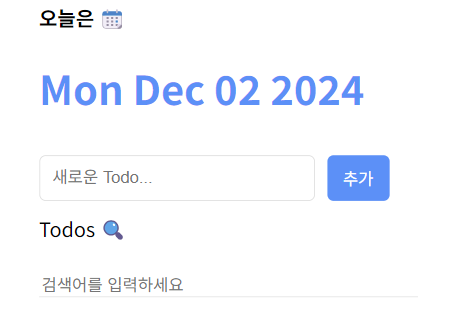

# [React] TodoList 복습

날짜: 2024년 12월 2일

# [에러] Functions are not valid as a React child. This may happen if you return a Component instead of <Component /> from render. Or maybe you meant to call this function rather than return it. Error Component Stack

---

[Header.jsx]

```jsx
const Header = () => {
  return (
    <div>
      <h4>오늘은 📆</h4>
      <h1>{new Date().toLocaleDateString}</h1>
    </div>
  )
}

export default Header 
```

⇒ `Functions are not valid as a React child` : 함수가 제대로 닫히지 않았을 때 발생

```jsx
 <h1>{new Date().toLocaleDateString()}</h1>
```

### 자바 스크립트 Date() 함수

---

[[JS] 📚 자바스크립트 Date 메소드 💯 총정리](https://inpa.tistory.com/entry/JS-%F0%9F%93%9A-Date-%EB%A9%94%EC%86%8C%EB%93%9C-%EC%A0%95%EB%A6%AC)

[Date.prototype.toDateString() - JavaScript | MDN](https://developer.mozilla.org/ko/docs/Web/JavaScript/Reference/Global_Objects/Date/toDateString)

# [오류] 값이 출력되지 않는 문제

---



[List.jsx]

```jsx
import './List.css'

const List = () => {
  const todos = [
    {id : 0, isDone : false, title:'REACT 공부하기', date:new Date().getDate().toString()},
    {id : 1, isDone : false, title:'빨래 널기', date:new Date().getDate().toString()},
    {id : 2, isDone : false, title:'노래 연습하기', date:new Date().getDate().toString()}
  ]

  return (
    <div className="List">
      <div>Todos 🔍</div>
      <div className="ListSearch">
        <input type="text" 
        placeholder="검색어를 입력하세요" />
      </div>
      <div className="ListInput">
        {/* filter는 안되는지? */}
        {/* 또 헷갈리는 ({}) */}
        {todos.map((todo) => {
          <div>
            <input type="checkbox"
            checked={todo.isDone}/>
            <h4>{todo.title}</h4>
            <h5>{todo.date}</h5>
            <button>삭제</button>          
          </div>
        })}
      </div>
    </div>
  )
}

export default List 
```

⇒ map의 `{}` , `()` 의 문제

# [오류] 값의 디자인이 이상하게 출력됨

---


```jsx
import './List.css'

const List = () => {
  const todos = [
    {id : 0, isDone : false, title:'REACT 공부하기', date:new Date().getDate().toString()},
    {id : 1, isDone : false, title:'빨래 널기', date:new Date().getDate().toString()},
    {id : 2, isDone : false, title:'노래 연습하기', date:new Date().getDate().toString()}
  ]

  return (
    <div className="List">
      <div>Todos 🔍</div>
      <div className="ListSearch">
        <input type="text" 
        placeholder="검색어를 입력하세요" />
      </div>
      <div className="ListInput">
        {/* filter는 안되는지? */}
        {/* 또 헷갈리는 ({}) */}
        {/* ()로는 원하는게 나오는데 {}로는 안나옴*/}
        {todos.map((todo) => (
          <div className='ListDetail'
          key={todo.id}>
            <input type="checkbox"
            checked={todo.isDone}/>
            <h4>{todo.title}</h4>
            <h5>{todo.date}</h5>
            <button>삭제</button>          
          </div>
        ))}
      </div>
    </div>
  )
}

export default List 
```

[List.css]

```css
.List {
  display: flex;
  flex-direction: column;
  gap: 20px;
}

.ListSearch > input{
  width: 300px;
  border: none;
  border-bottom: 1px solid rgb(227,227,227);
}

.ListInput {
  display: flex;
  flex-direction: ;
  gap: 10px;
}
```

<aside>
💡

수정 사항

</aside>

```css
.ListInput {
  display: flex;
  flex-direction: column;
  gap: 10px;
}

.ListDetail {
  display: flex;
  align-items: center; 
  /* 새로 중앙 정렬  == 삭제 사이즈 동일화 */
  gap: 10px;
}
```

# [에러] provided a `checked` prop to a form field without an `onChange` handler. This will render a read-only field. If the field should be mutable use `defaultChecked`

---

```jsx
import './List.css'

const List = () => {
  const todos = [
    {id : 0, isDone : false, title:'REACT 공부하기', date:new Date().getDate().toString()},
    {id : 1, isDone : false, title:'빨래 널기', date:new Date().getDate().toString()},
    {id : 2, isDone : false, title:'노래 연습하기', date:new Date().getDate().toString()}
  ]

  return (
    <div className="List">
      <div>Todos 🔍</div>
      <div className="ListSearch">
        <input type="text" 
        placeholder="검색어를 입력하세요" />
      </div>
      <div className="ListInput">
        {/* filter는 안되는지? */}
        {/* 또 헷갈리는 ({}) */}
        {/* ()로는 원하는게 나오는데 {}로는 안나옴*/}
        {todos.map((todo) => (
          <div className='ListDetail'
          key={todo.id}>
            <input type="checkbox"
            checked={todo.isDone}/>
            <h4>{todo.title}</h4>
            <h5>{todo.date}</h5>
            <button>삭제</button>          
          </div>
        ))}
      </div>
    </div>
  )
}

export default List 
```

⇒ 일단 checked 관련 제거

# [궁금한점] CSS 관련

---

## 기본 `레이아웃` 속성

**박스 모델**

- margin: 요소의 바깥쪽 여백 (다른 요소와의 간격)
- padding: 요소의 안쪽 여백 (내용물과 테두리 사이 간격)
- border: 요소의 테두리
- width/height: 요소의 크기

## 자주 사용되는 `정렬` 방법

**Flex 레이아웃**

```css
.container {
  display: flex;           /* 플렉스 박스 시작 */
  justify-content: center; /* 가로 정렬 */
  align-items: center;     /* 세로 정렬 */
  gap: 10px;              /* 요소들 사이 간격 */
}

```

## 선택자 차이 설명

1. **직계 자식 선택자 (>)**

```css
h1 > input { }  /* h1 바로 밑에 있는 input만 선택 */

```

예시:

```html
<h1>
  <input> <!-- 선택됨 -->
</h1>

```

1. **자손 선택자 (공백)**

```css
h1 input { }    /* h1 안에 있는 모든 input 선택 */

```

예시:

```html
<h1>
  <div>
    <input> <!-- 선택됨 -->
  </div>
  <input> <!-- 선택됨 -->
</h1>

```

## 자주 사용되는 스타일링 팁

**`중앙 정렬`**

```css
.center {
  /* 가로 중앙 정렬 */
  margin: 0 auto;     /* 블록 요소 중앙 정렬 */
  text-align: center; /* 텍스트 중앙 정렬 */
}

```

**반응형 크기**

```css
.responsive {
  width: 100%;        /* 전체 너비 */
  max-width: 1200px;  /* 최대 너비 제한 */
  min-width: 320px;   /* 최소 너비 제한 */
}

```

**그림자 효과**

```css
.shadow {
  box-shadow: 0 2px 4px rgba(0,0,0,0.1); /* 부드러운 그림자 */
}

```

## 고급 CSS 기술

### CSS Grid

Flexbox와 함께 사용하면 강력한 레이아웃 시스템을 구축할 수 있습니다. 2차원 레이아웃에 특히 유용합니다.

```css
.container {
  display: grid;
  grid-template-columns: repeat(3, 1fr);
  gap: 20px;
}

```

## CSS Grid 기본 개념

| 속성 | 설명 | 예시 |
| --- | --- | --- |
| display: grid | 그리드 컨테이너 생성 | `display: grid` |
| grid-template-columns | 열(세로줄) 정의 | `grid-template-columns: 200px 200px 200px` |
| grid-template-rows | 행(가로줄) 정의 | `grid-template-rows: 100px 100px` |
| gap | 그리드 간격 설정 | `gap: 20px` |
| fr (fraction) | 비율 단위 | `grid-template-columns: 1fr 2fr` (1:2 비율) |

## 그리드 시스템 설명

그리드는 엑셀 시트처럼 웹페이지를 행과 열로 나누는 2차원 레이아웃 시스템입니다

1. **컨테이너와 아이템**
    - 그리드 컨테이너: 부모 요소
    - 그리드 아이템: 자식 요소들
2. **레이아웃 구성**

```css
.container {
  display: grid;
  grid-template-columns: 1fr 1fr 1fr; /* 3개의 동일한 열 */
  gap: 20px; /* 간격 */
}

```

1. **fr 단위 활용**
    - 1fr: 사용 가능한 공간의 1부분
    - 2fr: 사용 가능한 공간의 2부분
2. **자동 배치**
    - 기본적으로 왼쪽에서 오른쪽, 위에서 아래로 배치
    - grid-auto-flow로 배치 방향 조절 가능

그리드는 복잡한 레이아웃을 쉽게 만들 수 있게 해주며, 반응형 디자인에도 매우 유용합니다.

### CSS 변수 (Custom Properties)

재사용 가능한 값을 정의하여 유지보수성을 높입니다.

```css
:root {
  --main-color: #3498db;
}

.button {
  background-color: var(--main-color);
}

```

## CSS 선택자와 변수 정리

| 선택자/기호 | 의미 | 예시 |
| --- | --- | --- |
| : | **가상 클래스/요소 선택자** | :hover, :root, :first-child |
| :: | 가상 요소 선택자 | ::before, ::after |
| -- | **CSS 변수 선언** | --main-color: blue |
| > | 직계 자식 선택자 | div > p |
| 공백 | 자손 선택자 | div p |

## 자주 사용되는 가상 클래스 예시

```css
/* 마우스 호버 시 */
.button:hover {
  background-color: blue;
}

/* 첫 번째 자식 요소 */
li:first-child {
  font-weight: bold;
}

/* 체크박스가 체크된 상태 */
input:checked {
  border-color: green;
}

/* 전역 변수 설정 */
:root {
  --primary-color: #3498db;
  --spacing: 20px;
}

/* 링크 방문 전/후 */
a:link { color: blue; }
a:visited { color: purple; }

```

이미지에서 보이는 것처럼 체크박스나 버튼 등의 상태에 따른 스타일링을 할 때 이러한 가상 클래스 선택자들이 매우 유용하게 사용됩니다.

### CSS 애니메이션

부드러운 전환 효과를 만들 수 있습니다.

```css
@keyframes slide-in {
  from { transform: translateX(-100%); }
  to { transform: translateX(0); }
}

.element {
  animation: slide-in 0.5s ease-out;
}

```

## @keyframes

- 애니메이션의 단계별 변화를 정의하는 규칙
- 시작(from)부터 끝(to)까지의 변화를 설정
- slide-in은 사용자가 정의한 애니메이션의 이름

## transform

- 요소를 변형시키는 CSS 속성
- 회전, 크기 조절, 기울이기, 이동 등이 가능
- 성능이 좋고 부드러운 애니메이션 구현 가능

## translateX

- transform의 이동 함수
- X축(가로)방향으로 요소를 이동
- 100%는 요소의 너비만큼 왼쪽으로 이동
- 0은 원래 위치

## animation 속성 설명

```css
animation: slide-in 0.5s ease-out;

```

- slide-in: 애니메이션 이름
- 0.5s: 애니메이션 지속 시간
- ease-out: 애니메이션 가속도 효과
    - 시작은 빠르게, 끝은 천천히 감속

이러한 속성들을 조합하면 요소가 왼쪽에서 오른쪽으로 부드럽게 슬라이드하는 효과를 만들 수 있습니다.

## CSS 꿀팁

1. **BEM 명명 규칙**: 클래스 이름을 구조화하여 가독성과 유지보수성을 높입니다.
2. **미디어 쿼리 사용**: 반응형 디자인을 위해 다양한 화면 크기에 대응합니다.
3. **CSS Reset 사용**: 브라우저 간 일관된 스타일을 위해 기본 스타일을 초기화합니다.
4. **Flexbox 정렬 트릭**: `margin: auto`를 사용하여 flex 아이템을 쉽게 정렬할 수 있습니다.

## flex: 1 설명

`flex: 1`은 `flex-grow: 1`, `flex-shrink: 1`, `flex-basis: 0%`의 축약형입니다.

- **flex-grow: 1**: 남은 공간을 채우도록 아이템이 늘어납니다.
- **flex-shrink: 1**: 필요시 아이템이 축소될 수 있습니다.
- **flex-basis: 0%**: 아이템의 초기 크기를 0으로 설정합니다.

이 설정은 flex 컨테이너 내의 모든 아이템이 동일한 크기로 늘어나거나 줄어들게 만듭니다. **컨테이너의 남은 공간을 균등하게 분배하여 채우게 됩니다**.

# [궁금한 점]

---

## 1. 자바스크립트에서 Date 객체 생성:

반드시 `new Date()`를 사용해야 합니다. **`Date()`는 생성자 함수이므로,** `new` 키워드 없이 호출하면 Date 객체가 아닌 **문자열을 반환**합니다.

## 2. forEach vs map in React:

**React에서는 주로 `map`을 사용**합니다. 이유는:

- `map`은 새로운 배열을 반환하여 렌더링에 적합합니다.
- **`forEach`는 반환값이 없어 JSX에서 직접 사용하기 어렵습니다.**

## ⚠️ 3. map에서의 (), {}, ({}) 사용:

<aside>
💡

- 1번은 단순 출력에 적합합니다.
- 2번은 데이터 가공이나 추가 로직이 필요할 때 사용합니다.

단순 출력은 `()`  , 추가 로직이나 데이터 가공이 필요하면 `{}` 를 사용하는 것이 일반적입니다.

</aside>

- `() => ()`: 암시적 반환. **JSX를 바로 반환할 때 사용.**

```jsx
{todos.map((todo) => (
  <div key={todo.id}>{todo.title}</div>
))}

```

- **`() => {}`: 함수 본문. 추가 로직이 필요할 때 사용.**

```jsx
{todos.map((todo) => {
  const upperTitle = todo.title.toUpperCase();
  return <div key={todo.id}>{upperTitle}</div>;
})}

```

- **`({})`: 객체 리터럴을 반환할 때 사용. JSX에서는 잘 사용되지 않습니다.**

### Q3-1. 조금 더 쉽게 이해해보기

---

### `() => ()` : 암시적 반환

- JSX를 바로 반환할 때 사용합니다.
- **괄호 `()`안에 있는 내용을 그대로 반환합니다.**
- 주로 간단한 JSX를 반환할 때 사용합니다.

### `() => {}` : 명시적 반환

- 함수 본문을 작성할 때 사용합니다.
- 중괄호 `{}`안에 **여러 줄의 코드를 작성**할 수 있습니다.
- **`return` 키워드를 사용해야 값을 반환합니다.**

### 왜 `()` 를 사용하나요?

1. **간결성**: JSX를 바로 반환할 때는 `()`가 더 간결합니다.
2. **가독성**: **여러 줄의 JSX를 묶어 반환할 때 `()`**가 더 읽기 쉽습니다.
3. **자동 반환**: `return` 키워드 없이 결과를 반환합니다.

```jsx
// () 사용 (암시적 반환)
{todos.map((todo) => (
  <div key={todo.id}>
    <h4>{todo.title}</h4>
    <h5>{todo.date}</h5>
  </div>
))}

// {} 사용 (명시적 반환)
{todos.map((todo) => {
  const formattedDate = formatDate(todo.date);
  return (
    <div key={todo.id}>
      <h4>{todo.title}</h4>
      <h5>{formattedDate}</h5>
    </div>
  );
})}

```

`{}`는 **추가 로직이 필요할 때 사용**하고, 단순히 JSX를 반환할 때는 `()`를 사용하는 것이 더 간단하고 일반적입니다.

## ⚠️ 4. TodoListItem 컴포넌트 분리 이유:

**컴포넌트를 분리하는 이유:**

- **재사용성 향상**
- 코드 가독성 개선
- 유지보수 용이성
- 성능 최적화 (개별 항목만 리렌더링 가능)

TodoListItem을 분리함으로써, **각 할 일 항목의 로직과 표현을 독립적으로 관리할 수 있습니다.** 이는 React의 컴포넌트 기반 아키텍처의 장점을 활용하는 방법입니다.

### Q4-1. 컴포넌트 분리 이유 예시

---

### 컴포넌트 분리의 간단한 규칙

1. 반복되는 코드가 있을 때
    - 같은 구조의 코드가 여러 번 사용된다면, 그것을 컴포넌트로 만들어 재사용할 수 있습니다.
2. 기능이 독립적일 때
    - 특정 부분이 자체적으로 동작하고 관리될 수 있다면, 별도의 컴포넌트로 만들 수 있습니다.
3. **코드가 너무 길어질 때**
    - 한 컴포넌트가 너무 길고 복잡해지면, 더 작은 컴포넌트들로 나눌 수 있습니다.

### TodoListItem 예시

TodoList에서 TodoListItem을 분리하는 이유:

1. **반복**: 각 할 일 항목은 같은 구조를 가지고 반복됩니다.
2. **독립성**: 각 항목은 자체적인 상태(완료 여부 등)와 동작(삭제, 수정 등)을 가질 수 있습니다.
3. **관리 용이성**: 항목 관련 로직을 한 곳에서 관리할 수 있어 유지보수가 쉬워집니다.

### 실제 사용 예

```jsx
// TodoList.js
const TodoList = ({ todos }) => {
  return (
    <div>
      {todos.map(todo => (
        <TodoListItem key={todo.id} todo={todo} />
      ))}
    </div>
  );
};

// TodoListItem.js
const TodoListItem = ({ todo }) => {
  return (
    <div>
      <input type="checkbox" checked={todo.isDone} />
      <span>{todo.title}</span>
      <button>삭제</button>
    </div>
  );
};

```

이렇게 분리하면 TodoListItem에 **관련된 로직(예: 체크박스 상태 변경, 삭제 기능)을 독립적으로 관리**할 수 있어 코드가 더 깔끔해지고 관리하기 쉬워집니다.

# Todos에 대한 상태와 상태 변형을 위해 AppComponent로 이동시키고, 수정하는 행위 진행

---

[App.jsx]


[List.jsx]


# [에러] 'todos' is missing in props validation

---

- `'react/prop-types': 'off'` 누락으로 발생
- eslint에서 `type을 지정하라고 하는` 에러 ⇒ 실행 이상없음


# [에러] ‘sth’ is declared but its value is never read.

---

- 선언한 메서드를 return에 적지 않아서 발생하는 문제
- 'name'을 정의했는데 사용하지 않았다.
- `'no-unused-vars': 'off',` 누락으로 발생

# [에러] C:\React\ONEBITE-REACT\todoListApp\src\components\TodoItem.jsx: Support for the experimental syntax 'doExpressions' isn't currently enabled (14:18):

---


- 변수 확인

# [오류] 추가가 되지 않는 문제 ⇒ state 자체 변동도 없고, btn도 클릭되지 않음

---

- 공백도 push가 안되는 것으로 봤을때 값이 이상하게 담길 위험이 있음


⇒ 먼저 근본적인 Editor 코드 부터 확인

```jsx
import { useState } from 'react'
import './Editor.css'

const Editor = ({onClickAddBtn}) => {
  //바로 onClickAddBtn을 하면 원하는 값을 전달하지 못하는 문제
  const [input, setInput] = useState() //state선언
  //input에 원하는 값들이 담김

  //Q. 매개변수에 인자값이 없어도 상기에 언급한 내용을 넣어도 돌아가는지?

  const onChangeInput = () => {
    //onChangeInput이 발생하면? onChange되어서 setInput에 값이 들어간다.
    setInput(input) //일단 input값이 뭐가 들어갈 때 마다
  }

  //그리고 실제 clickEvent 발생을 위한 command 작성
  const onClickBtn = () => {
    //이걸 하면 onClickAddBtn이 작동된다.
    //그럼 무엇을 전달?
    onClickAddBtn(input)
  }

  return (
    <div className="Editor">
      <input type="text"
      value={input}
      onChange={onChangeInput}
      placeholder="새로운 Todo..."/>
      <button
      // 클릭을 해야 onClick이 실행된다.
      onClick={()=> {
        onClickBtn
      }}>추가</button>
    </div>
  )
}

export default Editor 
```

⇒ 디버깅 1차 해당 함수 실행되지 않은 것 확인됨

```jsx
  const onClickBtn = () => {
    //이걸 하면 onClickAddBtn이 작동된다.
    //그럼 무엇을 전달?

    //클릭은 잘되는지 디버깅
    console.log('클릭됨')
    onClickAddBtn(input)
    console.log('onClickAddBtn 전달될 것', input, '얘는 인풋값')
  }

```

```jsx
  return (
    <div className="Editor">
      <input type="text"
      value={input}
      onChange={onChangeInput}
      placeholder="새로운 Todo..."/>
      <button
      // 클릭을 해야 onClick이 실행된다.
      onClick={()=> {
        onClickBtn
      }}>추가</button>
    </div>
  )
}
```

⇒ 그냥 onClick을 하면 onClickBtn이 실행되도록.. 다시

⇒ 클릭은 확인이 됨

# [파생된 에러] Uncaught TypeError: Cannot read properties of undefined (reading 'title')

---


⇒ undefined로 확인됨, 그리고 title값을 받아올 수 없는 것으로 확인함
    : 즉 객체형태로 동일하게 바꿔줘야 한다는 의미 같음

```jsx
const Editor = ({onClickAddBtn}) => {
  //바로 onClickAddBtn을 하면 원하는 값을 전달하지 못하는 문제
  const [input, setInput] = useState() //state선언
  //input에 원하는 값들이 담김

  //Q. 매개변수에 인자값이 없어도 상기에 언급한 내용을 넣어도 돌아가는지?

  const onChangeInput = () => {
    //onChangeInput이 발생하면? onChange되어서 setInput에 값이 들어간다.
    setInput(input) //일단 input값이 뭐가 들어갈 때 마다
  }

  //그리고 실제 clickEvent 발생을 위한 command 작성
  const onClickBtn = (input) => { //input값을 받았고
    //이걸 하면 onClickAddBtn이 작동된다.
    //그럼 무엇을 전달?

    //클릭은 잘되는지 디버깅
    console.log('클릭됨')
    console.log('onClickAddBtn 전달될 것', input, '얘는 인풋값')
    // onClickAddBtn(input) : 이거전달 나중에
  }

  return (
    <div className="Editor">
      <input type="text"
      value={input}
      onChange={onChangeInput}
      placeholder="새로운 Todo..."/>
      <button
      // 클릭을 해야 onClick이 실행된다.
      //매개 변수 받을 수 있도록 다시 수정 (수정)
      onClick={() => onClickBtn(input)}>추가</button>
    </div>
  )
}
```

- 생각한 방향대로 onClickEvent를 걸고 input 값을 넣었지만, onClickBtn을 봤을때 `undefined`로 뜨는 것을 볼 수 있음


# [발견 오류] onChange가 문제가 있다고 판단해서 onChange를 건들였더니 여기가 문제가 있음이 맞음

---


```jsx
      onChange={() => onChangeInput(input)}
```

```jsx
  const onChangeInput = () => {
    //onChangeInput이 발생하면? onChange되어서 setInput에 값이 들어간다.
    console.log('input 값이 들어갔나요?', input)
    setInput(input) //일단 input값이 뭐가 들어갈 때 마다
  }
```

⇒ 근데 동일함 : 생각해보니까 이건,, `e.target으로 접근`해야 함

<aside>
💡

수정 사항

</aside>

```jsx
 const onChangeInput = (e) => {
    // console.log('input 값이 들어갔나요?', e)
    // console.log(e.target, '타겟')
    // console.log(e.target.value, '타겟 value')
    setInput(input) //일단 input값이 뭐가 들어갈 때 마다 이거 확인
  }
	...
  <input type="text"
      value={input}
      onChange={onChangeInput}
      placeholder="새로운 Todo..."/>
```

# [발견 오류] Click Event 값 전달 문제

---


```jsx
  const onChangeInput = (e) => {
    // console.log('input 값이 들어갔나요?', e)
    // console.log(e.target, '타겟')
    console.log(e.target.value, '타겟 value')
    //근본적인 문제는 setInput에 이상한 값을 넣고있었다..!
    setInput(e.target.value)
    //setInput(input) //일단 input값이 뭐가 들어갈 때 마다 이거 확인
  }

```

⇒ setInput에 이상한값을 계속 집어넣고 있어서 `undefined`가 떳던것..

## [해당 부분을 진행하면서 궁금한 점]

## 1. onClickBtn에 매개변수 input 값을 넣지 않아도 되는 이유

---

1. **클로저(Closure)**: React 함수형 컴포넌트에서 정의된 함수들은 해당 컴포넌트의 **스코프에 있는 모든 변수에 접근할 수 있습니다.** 이는 JavaScript의 클로저 특성 때문입니다.
2. **상태 접근**: `input` 값은 이미 **컴포넌트의 상태(state)로 관리**되고 있습니다. 따라서 `onClickBtn` 함수 내에서 직접 `input` 상태 값에 접근할 수 있습니다.
3. **이벤트 핸들러 특성**: React에서 **이벤트 핸들러로 전달되는 함수는 기본적으로 이벤트 객체를 첫 번째 인자로 받습니다**. 매개변수로 `input`을 명시하면, 이 이벤트 객체가 `input`으로 전달되어 원하는 동작을 하지 않을 수 있습니다.

## 1-0. 클로저 핵심 정리

---

<aside>
💡

- React의 구조는 **클로저의 특성을 활용**하여 상태와 변수를 관리합니다.
- 각 컴포넌트는 **자신만의 스코프를 가지며**, 이 안에서 정의된 모든 변수와 함수는 
서로 접근할 수 있습니다.
- **React 컴포넌트를 이해하는 것은 클로저 개념을 이해하는 것과 밀접한 관련이 있습니다.**
</aside>

React와 클로저의 관계를 이해하는 것은 매우 중요합니다. React 컴포넌트가 함수로 구성되어 있기 때문에, 클로저는 React에서 자연스럽게 발생합니다. 클로저는 함수가 자신이 생성된 환경의 변수를 기억하고 접근할 수 있게 해주는 JavaScript의 기능입니다. 이를 통해 React 컴포넌트는 상태(state)와 props에 접근할 수 있습니다.

| **특성** | **React** | **클로저** |
| --- | --- | --- |
| **구조** | 함수형 컴포넌트 | 함수 내에서 생성된 함수 |
| **상태 관리** | `useState`, `useReducer` 등을 통해 상태 관리 | 함수가 생성된 환경의 변수를 기억하고 접근 |
| **이벤트 핸들링** | 이벤트 핸들러는 컴포넌트의 상태와 props에 접근 가능 | 이벤트 핸들러가 생성될 때의 환경을 기억 |
| **사용 목적** | UI 렌더링, 상태 변경 반영 | 데이터 은닉, 상태 유지 |
| **예시** | `const Component = () => { const [count, setCount] = useState(0); const handleClick = () => setCount(count + 1); return <button onClick={handleClick}>Increment</button>; }` | `function makeCounter() { let count = 0; return function() { count += 1; return count; }; }` |

### React에서의 클로저

1. **상태 유지**: React 컴포넌트 내에서 선언된 함수들은 그 `컴포넌트의 상태와 props를 클로저를 통해 기억`합니다. 이는 컴포넌트가 다시 렌더링될 때도 최신 상태와 props에 접근할 수 있게 해줍니다.
2. **이벤트 핸들러**: 이벤트 핸들러는 컴포넌트 내에서 정의되며, 이 역시 클로저를 형성하여 상태와 props에 접근합니다. 예를 들어, 버튼 클릭 시 상태를 업데이트하는 함수는 그 상태를 클로저를 통해 기억하고 있습니다.
3. **비동기 작업**: 비동기 작업에서도 클로저가 중요한 역할을 합니다. 예를 들어, `setTimeout`이나 `fetch` 같은 비동기 작업 내에서 사용되는 변수들은 클로저를 통해 그 당시의 값을 기억하고 사용할 수 있습니다.

결론적으로, `React는 클로저를 활용하여 컴포넌트의 상태와 이벤트 핸들링을 효과적으로 관리`합니다. 이는 `클로저가 JavaScript의 기본 특성이기 때문에 가능한 것`입니다. React 개발자는 이 특성을 이해하고 활용하여 더 효율적이고 유지보수 가능한 코드를 작성할 수 있습니다.

## 1-1. 상태 접근과 클로저 더 알아보기

---

### 상태(State) 접근

React 함수형 컴포넌트에서 선언된 **상태(state)는 해당 컴포넌트 내의 모든 함수에서 접근 가능**합니다. 이는 **JavaScript의 스코프와 클로저 특성** 때문입니다.

```jsx
function MyComponent() {
  const [count, setCount] = useState(0);

  const incrementCount = () => {
    setCount(count + 1); // count 상태에 직접 접근
  };

  const logCount = () => {
    console.log(count); // 여기서도 count 상태에 접근 가능
  };

  return (
    <div>
      <p>Count: {count}</p>
      <button onClick={incrementCount}>Increment</button>
      <button onClick={logCount}>Log Count</button>
    </div>
  );
}

```

**이 예시에서 `incrementCount`와 `logCount` 함수 모두 `count` 상태에 접근**할 수 있습니다.

### 클로저(Closure)

클로저는 함수와 그 함수가 선언된 렉시컬 환경의 조합입니다. 간단히 말해, **함수가 자신이 생성될 때의 환경을 기억하는 것입니다.**

예시:

```jsx
function outerFunction(x) {
  let y = 10;
  function innerFunction() {
    console.log(x + y);
  }
  return innerFunction;
}

const closure = outerFunction(5);
closure(); // 출력: 15

```

이 예시에서 `innerFunction`은 `outerFunction`의 `x`와 `y` 변수에 접근할 수 있습니다. 
이것이 클로저입니다.

React 컴포넌트에서 클로저는 다음과 같이 작동합니다:

```jsx
function Counter() {
  const [count, setCount] = useState(0);

  const increment = () => {
    setCount(count + 1); // 클로저를 통해 count에 접근
  };

  return (
    <div>
      <p>Count: {count}</p>
      <button onClick={increment}>Increment</button>
    </div>
  );
}

```

여기서 `increment` 함수는 클로저를 형성하여 `count` 상태에 접근합니다.

### **클로저와 React 상태의 관계**

1. 클로저 덕분에 컴포넌트 내의 모든 함수가 상태와 props에 접근할 수 있습니다.
2. 이를 통해 React는 함수형 프로그래밍 패러다임을 효과적으로 구현할 수 있습니다.
3. **클로저는 React의 훅(Hooks)이 작동하는 핵심 메커니즘입니다.**

결론적으로, 클로저의 특성 덕분에 React 컴포넌트 내의 모든 함수가 해당 컴포넌트의 상태와 props에 쉽게 접근할 수 있는 것입니다. 이는 React의 선언적이고 함수형인 특성을 가능하게 하는 중요한 요소입니다.

## 1-2. 스코프와 클로저 비교해보기

---

### 스코프와 클로저 비교

| 특성 | 스코프 | 클로저 |
| --- | --- | --- |
| 정의 | 변수의 접근 범위 | 함수와 그 함수가 선언된 환경의 조합 |
| 목적 | 변수 충돌 방지, 코드 구조화 | 데이터 은닉, 상태 유지 |
| 생성 시점 | **코드 작성** 시 | **함수 생성 시** |
| 접근 가능 범위 | 정의된 **블록 내부** | **외부 함수의 변수**에 접근 가능 |

### 스코프 예시

```jsx
let globalVar = "전역 변수";

function exampleFunction() {
  let localVar = "지역 변수";
  console.log(globalVar);  // 출력: "전역 변수"
  console.log(localVar);   // 출력: "지역 변수"
}

console.log(globalVar);    // 출력: "전역 변수"
console.log(localVar);     // 오류: localVar is not defined

```

여기서 `globalVar`는 어디서나 접근 가능하지만, **`localVar`는 `exampleFunction` 내부에서만 접근 가능**합니다.

### 클로저 예시

```jsx
function makeCounter() {
  let count = 0;  // 비밀 변수

  return function() {
    count += 1;
    return count;
  }
}

let counter = makeCounter();
console.log(counter());  // 출력: 1
console.log(counter());  // 출력: 2
console.log(counter());  // 출력: 3

```

이 예시에서 `counter` 함수는 `makeCounter` 함수의 `count` 변수에 계속 접근할 수 있습니다. 이것이 클로저입니다.

## React에서의 응용

React 컴포넌트에서는 이 개념들이 다음과 같이 적용됩니다:

```jsx
function Counter() {
  const [count, setCount] = useState(0);  // 상태 변수

  function increment() {
    setCount(count + 1);  // 클로저를 통해 count에 접근
  }

  return (
    <div>
      <p>카운트: {count}</p>
      <button onClick={increment}>증가</button>
    </div>
  );
}

```

여기서 `increment` 함수는 클로저를 형성하여 `count` 상태에 접근합니다. 이는 마치 비밀 상자 안의 숫자를 계속 기억하고 변경할 수 있는 것과 같습니다.

## 1-3. 클로저 파괴하기

---

```
makeCounter 함수 (마법 상자)
┌───────────────────────────┐
│                           │
│   let count = 0;          │   ← 비밀 숫자
│   ┌───────────────────┐   │
│   │ function() {      │   │   ← 요정 (반환되는 함수)
│   │   count += 1;     │   │
│   │   return count;   │   │
│   │ }                 │   │
│   └───────────────────┘   │
│                           │
└───────────────────────────┘
        │
        │ 반환
        ▼
let counter = makeCounter();
        │
        │ counter 호출
        ▼
console.log(counter()); // 1
console.log(counter()); // 2
console.log(counter()); // 3

```

1. `makeCounter` 함수는 `count` 변수와 익명 함수를 포함하는 환경을 만듭니다.
2. 이 익명 함수(요정)는 `count`에 접근할 수 있습니다.
3. `makeCounter`가 이 익명 함수를 반환하면, 이 함수는 여전히 `count`에 접근 가능합니다.
4. `counter`를 호출할 때마다, 이 함수는 `count`를 증가시키고 반환합니다.

클로저를 사용하는 이유:

1. **상태 유지**: 함수가 자신의 상태를 가질 수 있습니다.
2. **정보 은닉**: `count` 변수는 외부에서 직접 접근할 수 없습니다.
3. **모듈화**: 관련 기능을 하나의 단위로 묶을 수 있습니다.

이렇게 클로저를 사용하면, **함수가 자신만의 "기억"을 가질 수 있어 더 유연하고 강력한 프로그래밍이 가능**해집니다.

### 1-3-1. 클로저 예시

---

1. 먼저, **JavaScript에서 함수는 '자신이 만들어진 환경'을 기억합니다. 이것이 클로저의 핵심**입니다.
2. `makeCounter` 함수 안에서 만들어진 익명 함수는 **`count` 변수가 있는 환경에서 태어났습니다.** 그래서 이 익명 함수는 `count`를 '기억'하고 사용할 수 있습니다.
3. `makeCounter`가 이 익명 함수를 반환하면, 이 함수는 여전히 `count`를 기억하고 있습니다. 마치 고향을 떠나도 고향을 기억하는 것과 비슷합니다.
4. `counter`를 호출할 때마다, 이 기억된 `count`를 사용하고 변경합니다.

간단한 예를 들어보겠습니다:

```jsx
function makeGreeter(name) {
  return function() {
    console.log("안녕, " + name + "!");
  };
}

let greetAlice = makeGreeter("Alice");
let greetBob = makeGreeter("Bob");

greetAlice(); // 출력: 안녕, Alice!
greetBob();   // 출력: 안녕, Bob!

```

여기서 `greetAlice`와 `greetBob`은 각각 다른 `name`을 기억하고 있습니다. 이것이 클로저의 동작 방식입니다.

| 특성 | 스코프 | 클로저 |
| --- | --- | --- |
| 정의 | 변수의 접근 가능한 범위 | 함수와 그 함수가 선언된 환경의 조합 |
| 생명주기 | 함수 실행 종료 시 소멸 | 함수가 반환된 후에도 유지 |
| 접근 범위 | 현재 실행 컨텍스트 내 | 원래의 선언 환경에 계속 접근 가능 |
| 주요 용도 | 변수 충돌 방지, 코드 구조화 | 데이터 은닉, 상태 유지, 모듈화 |
| 메모리 관리 | 자동으로 관리됨 | 수동 관리 필요 (메모리 누수 주의) |
| 예시 | 지역 변수, 전역 변수 | 함수 팩토리, 비공개 변수 |

이 표를 통해 스코프와 클로저의 주요 차이점을 한눈에 볼 수 있습니다. 클로저는 스코프의 개념을 확장하여, 함수가 자신의 선언 환경을 '기억'하고 계속 접근할 수 있게 해주는 강력한 기능입니다.

## 2. onClick={onClickBtn}의 의미

---

1. **함수 참조 전달**: `onClickBtn` 함수 자체가 이벤트 핸들러로 전달됩니다. 이는 React에서 이벤트를 처리하는 올바른 방법입니다.
2. **실행 시점**: **버튼이 클릭될 때 `onClickBtn` 함수가 실행**됩니다. 함수를 직접 호출하는 것(`onClick={onClickBtn()}`)이 아니라, 함수 참조를 전달하는 것입니다.
3. **이벤트 객체 접근**: 필요한 경우, `onClickBtn` 함수 내에서 이벤트 객체에 접근할 수 있습니다. 예: `const onClickBtn = (e) => { ... }`

이전에 이 방식이 안 된다고 하신 것은 아마도 다른 부분에서 문제가 있었을 가능성이 높습니다. 예를 들어, `input` 상태가 제대로 업데이트되지 않았거나, 콘솔 로그를 확인하는 위치가 잘못되었을 수 있습니다.

결론적으로, 현재의 코드 구조에서는 **`onClick={onClickBtn}`이 정확한 방식**이며, `onClickBtn` 함수 내에서 직접 `input` 상태 값을 사용할 수 있습니다.

# [복습하면서 궁금한 점]

---

## 1. [e.target](http://e.target) 사용시기

- `e.target.value`는 주로 **사용자의 실시간 입력을 처리할 때 사용**됩니다. 이는 Vue의 v-model과 유사한 역할을 합니다. 주요 사용 상황은 다음과 같습니다:
1. **텍스트 입력 필드(input, textarea)의 값 변경 추적**
2. **선택 박스(select)의 선택된 옵션 값 가져오기**
3. **체크박스나 라디오 버튼의 상태 변경 감지**

React에서는 이벤트 핸들러를 통해 이러한 변경을 감지하고 처리합니다. **`onChange` 이벤트**와 함께 주로 사용되며, 사용자가 입력 필드의 값을 변경할 때마다 이벤트가 발생합니다.

예를 들어:

```jsx
const handleInputChange = (e) => {
  setInputValue(e.target.value);
};

return (
  <input
    type="text"
    value={inputValue}
    onChange={handleInputChange}
  />
);

```

이 방식은 React의 '제어 컴포넌트' 패턴의 일부로, 폼 요소의 상태를 React 컴포넌트의 state로 관리합니다. 이를 통해 **사용자 입력에 즉시 반응하거나, 입력값을 검증하거나, 조건에 따라 다른 UI 요소를 변경**하는 등의 동적인 상호작용을 구현할 수 있습니다.

### 1-1. e.target.value 사용에 대해

---

- 입력 필드의 값을 읽을 때 사용합니다
- **이벤트 핸들러 내에서 현재 입력값에 접근할 때 활용**합니다
- 예시 상황:
    - 텍스트 입력 필드의 값 변경 추적
    - 선택 박스의 선택된 옵션 값 가져오기
    - 체크박스의 체크 상태 확인

```jsx
const handleInputChange = (e) => {
  setInputValue(e.target.value);
};

const handleSelectChange = (e) => {
  setSelectedOption(e.target.value);
};

const handleCheckboxChange = (e) => {
  setIsChecked(e.target.checked);
};

```

이벤트 객체를 통해 다양한 정보에 접근할 수 있으므로, 필요에 따라 적절히 활용하면 됩니다

### 1-2. onChange와 e.target.value

---

`onChange` 이벤트와 `e.target.value`는 React에서 입력 필드를 다룰 때 매우 일반적으로 사용되는 패턴입니다. 이를 거의 공식처럼 알고 계셔도 좋습니다.

주요 사용 케이스:

1. 텍스트 입력 필드 (input type="text", textarea)
2. 숫자 입력 필드 (input type="number")
3. 선택 박스 (select)
4. 체크박스 (input type="checkbox")
5. 라디오 버튼 (input type="radio")

기본 패턴:

```jsx
const [value, setValue] = useState('');

const handleChange = (e) => {
  setValue(e.target.value);
};

return <input value={value} onChange={handleChange} />;

```

이 패턴은 **React의 '제어 컴포넌트' 개념의 핵심이며, 폼 요소의 값을 React state로 관리**합니다. 이를 통해 입력값을 쉽게 조작하고, 검증하며, 다른 컴포넌트와 상호작용할 수 있습니다.

다만, 체크박스의 경우 **`e.target.checked`를 사용한다는 점**만 주의하세요:

```jsx
const [isChecked, setIsChecked] = useState(false);

const handleCheckboxChange = (e) => {
  setIsChecked(e.target.checked);
};

return <input type="checkbox" checked={isChecked} onChange={handleCheckboxChange} />;

```

이 패턴을 기본으로 알고 계시면, React에서 대부분의 폼 처리를 효과적으로 할 수 있습니다.

## 2. form vs input+button:

---

| 특성 | form 사용 | 컴포넌트 분리 |
| --- | --- | --- |
| 복잡도 | 간단한 입력 구조 | 복잡한 입력 구조 |
| 데이터 처리 | 서버로 직접 전송 | 상태 관리 후 처리 |
| UI 변화 | 정적인 폼 | **동적으로 변하는 폼** |
| 재사용성 | 낮음 | 높음 |
| 예시 | **로그인, 간단한 문의 폼** | 다단계 설문, 동적 필드가 있는 주문 폼 |
1. form 사용 예시:
    - 로그인 폼: 이메일과 비밀번호만 입력받는 간단한 구조
    - 간단한 문의 폼: 이름, 이메일, 문의 내용을 입력받는 정적 구조
2. 컴포넌트 분리 예시:
    - 다단계 회원가입 폼: 개인정보, 주소, 선호도 등 여러 단계로 구성된 복잡한 구조
    - 동적 주문 폼: 사용자 선택에 따라 추가 입력 필드가 나타나는 구조

결론적으로, 폼의 복잡도, 재사용 필요성, UI의 동적 변화 여부에 따라 적절한 방식을 선택하면 됩니다. 간단하고 정적인 폼은 단일 form 태그로, 복잡하고 동적인 폼은 여러 컴포넌트로 분리하여 구현하는 것이 일반적입니다.

### form 사용

- 간단한 폼 구조일 때
- 기본적인 HTML 폼 기능(예: **엔터키 제출**)이 필요할 때
- 접근성이 중요한 경우
- **서버 사이드 렌더링이 필요한 경우**

### 컴포넌트 분리

- 복잡한 폼 구조나 다수의 입력 필드가 있을 때
- **폼 로직을 재사용해야 하는 경우**
- **동적으로 폼 필드를 추가/제거해야 할 때**
- 커스텀 유효성 검사나 복잡한 상태 관리가 필요한 경우

### 2-1. form과 컴포넌트 사용 예시

---

form을 사용하는 경우:

- **간단한 정보를 모을 때 사용해요.**
- 예를 들어, 친구의 이름과 나이만 물어보는 경우입니다.

```jsx
function FriendForm() {
  return (
    <form>
      <input type="text" placeholder="친구 이름" />
      <input type="number" placeholder="친구 나이" />
      <button>저장하기</button>
    </form>
  );
}

```

컴포넌트를 나누는 경우:

- **복잡한 정보를 모을 때 사용해요.**
- 예를 들어, 학급 전체 친구들의 정보를 모으는 경우입니다.

```jsx
function ClassForm() {
  const [friends, setFriends] = useState([]);

  const addFriend = () => {
    setFriends([...friends, { name: '', age: '' }]);
  };

  return (
    <div>
      {friends.map((friend, index) => (
        <FriendInfo key={index} friend={friend} />
      ))}
      <button onClick={addFriend}>친구 추가</button>
    </div>
  );
}

function FriendInfo({ friend }) {
  return (
    <div>
      <input type="text" placeholder="친구 이름" value={friend.name} />
      <input type="number" placeholder="친구 나이" value={friend.age} />
    </div>
  );
}

```

이렇게 나누면, **친구를 계속 추가할 수 있고, 각 친구의 정보를 따로 관리**할 수 있어요. 간단한 경우에는 form을 쓰고, 복잡하고 여러 개를 다룰 때는 컴포넌트로 나누는 게 좋아요.

## ⚠️ 3. OnClick 이벤트 핸들링 이해하기

---

1. ⚠️ `onClick={onClickBtn}`
    - 이것은 "버튼아, **클릭되면 onClickBtn이라는 일을 해줘**"라고 말하는 거예요.
    - **버튼이 클릭될 때만 onClickBtn 함수가 실행**돼요.
    - 가장 간단하고 일반적인 방법이에요.
2. ⚠️ `onClick={() => onClickBtn()}`
    - 이건 "버튼아, 클릭되면 **새로운 일꾼을 만들어서 그 일꾼에게 onClickBtn 일을 시켜줘**"라고 말하는 거예요.
    - 클릭할 때마다 새로운 함수(일꾼)가 만들어져요.
    - 이 방법은 **onClickBtn에 추가 정보를 전달**하고 싶을 때 사용해요.
3. `onClick={() => onClickBtn}`
    - 이건 오류예요! "새 일꾼을 만들긴 했는데, 그 일꾼이 아무 일도 안 해"라고 말하는 것과 같아요.
    - onClickBtn 함수가 실행되지 않고 그냥 참조만 돼요.

언제 어떤 방법을 쓸까요?

- 대부분의 경우 `onClick={onClickBtn}`를 사용하세요. 간단하고 효율적이에요.
- **함수에 추가 정보를 전달해야 할 때 `onClick={() => onClickBtn(추가정보)}`를 사용하세요.**

예를 들어:

```jsx
function TodoList() {
  const deleteTodo = (id) => {
    // id를 이용해 할 일 삭제
  };

  return (
    <ul>
      {todos.map(todo => (
        <li key={todo.id}>
          {todo.text}
          <button onClick={() => deleteTodo(todo.id)}>삭제</button>
        </li>
      ))}
    </ul>
  );
}

```

여기서는 `() => deleteTodo(todo.id)`를 사용했어요. 왜냐하면 각 할 일의 id를 deleteTodo 함수에 전달해야 하기 때문이에요.

## 3-1. `() => {세부정보}` 사용 상황

---

1. 함수에 인자를 전달할 때:
    
    ```jsx
    <button onClick={() => handleClick(id)}>클릭</button>
    
    ```
    
2. **여러 작업을 수행**해야 할 때:
    
    ```jsx
    <button onClick={() => {
      handleClick(id);
      setIsOpen(false);
    }}>클릭</button>
    
    ```
    
3. **이벤트 객체와 추가 정보를 함께 전달할 때:**
    
    ```jsx
    <button onClick={(e) => handleClick(e, id)}>클릭</button>
    
    ```
    

이 방식은 클릭 이벤트가 발생할 때 특정 컨텍스트나 데이터를 함수에 전달해야 하는 경우에 유용합니다. 하지만 단순히 함수만 호출하는 경우라면 `onClick={handleClick}`처럼 직접 함수 참조를 전달하는 것이 더 효율적입니다.

## 4. 배열 업데이트

---

1. React에서 상태 업데이트와 불변성:
    - **React는 상태가 변경되었을 때 화면을 다시 그립니다.**
    - 하지만 배열이나 객체를 직접 수정하면(예: push 사용) React가 변화를 감지하지 못합니다.
    - 그래서 새로운 배열을 만들어 상태를 업데이트해야 합니다.
2. 스프레드 연산자 사용:
    
    ```jsx
    setTodo([...todo, newTodo]);
    
    ```
    
    - `...todo`는 기존 todo 배열의 모든 항목을 펼쳐놓습니다.
    - 그 뒤에 `newTodo`를 추가하여 새로운 배열을 만듭니다.
    - 이렇게 하면 기존 배열은 그대로 두고, 새로운 항목이 추가된 새 배열이 만들어집니다.
3. 일관성 있는 이름 사용:
    - `todos`와 `todo`처럼 비슷한 이름을 사용하면 혼란스러울 수 있습니다.
    - **예를 들어, `todoList`와 `setTodoList`로 통일하여 사용하는 것이 좋습니다:**
    
    ```jsx
    const [todoList, setTodoList] = useState([]);
    
    const addTodo = (newTodo) => {
      setTodoList([...todoList, newTodo]);
    };
    
    ```
    

이렇게 하면 코드를 읽고 이해하기가 더 쉬워집니다.

# [오류] 값이 1개만 들어가는 문제 및 출력값은 담기나 랜더링의 문제

---

⇒ 현재 랜더링은 변화를 준 내용이 없으나, 값이 1개만 들어가는 문제 해결해야 함

```jsx
 A component is changing an uncontrolled input to be controlled. 
 This is likely caused by the value changing from undefined to a defined value, 
 which should not happen. Decide between using a controlled or
  uncontrolled input element for the lifetime of the component. More info:
```


⇒ 데이터가 없어서 undefined : 즉 상기에서 언급했던 값과 양식이 맞지 않아서 생긴 문제

⇒ 출력 문제는 해결했으나 아직 상기와 동일한 오류 발생 및 값이 추가되지 않음

```jsx
  const [todo, setTodo] = useState(todos) 
  const num = useRef(3) //3부터 시작
  //QQid의 순서는 계속해서 바뀌어야 한다. ref 일반 let? state값이 바뀔떄마다 반응? QQ?

  const onClickAddBtn = (input) => {
    //input 데이터를 받아서 보완한다.
    //새로운 객체로 만들어져야 함 => 이것도 어떻게보면 반응형으로 해줘야하는 요소인지? QQ?
    //지금 보면 키값이 명확하게 설정되지 않음 => 일반 객체로 만들면
    // {id : num, isDone:false, title:input, date:'Date'}
    //새로운 객체..?

    //일단 input이 맞게 들어오지는가?
    const newTodo = { //새로운 객체 하나 => ()과 ({})의 차이 QQ?
      id : num.current, //객체 자체이기 떄문에
      isDone : false,
      title : input,
      date : 'Date'
    }

    setTodo( 
      [newTodo, ...todos] 
    )
  }

```

<aside>
💡

**“제어되지 않은 입력”에서 “제어된 입력”으로 변경된 상황에서 발생**

</aside>

이 에러는 "제어되지 않은 입력"에서 "제어된 입력"으로 변경되는 상황에서 발생합니다. 주요 원인과 해결 방법은 다음과 같습니다:

1. 원인:
`useState()`를 사용할 때 초기값을 지정하지 않아 `input`의 초기값이 `undefined`입니다. React는 `undefined` 값을 가진 입력을 "제어되지 않은" 상태로 간주합니다.
2. 해결 방법:
`useState`에 초기값을 제공하여 `input`이 항상 정의된 값을 가지도록 합니다.

```jsx
const [input, setInput] = useState('');  // 빈 문자열로 초기화

```

## [근본적 문제] 1개이상 값이 추가되지 않는 문제

---

- 문제의 원인은 **`App`** 컴포넌트에 있습니다. **`setTodo`** 함수를 사용할 때 이전 상태를 고려하지 않고 있어서 발생하는 문제

```jsx
  const onClickAddBtn = (input) => {
    //input 데이터를 받아서 보완한다.
    //새로운 객체로 만들어져야 함 => 이것도 어떻게보면 반응형으로 해줘야하는 요소인지? QQ?

    //일단 input이 맞게 들어오지는가?
    //input값으로 새로들어왔는데
    const newTodo = { //새로운 객체 하나 => ()과 ({})의 차이 QQ?
      id : num.current++, //객체 자체이기 떄문에
      isDone : false,
      title : input,
      date : 'Date'
    }

    //이전 상태를 고려하지 않음?
    setTodo( 
      [newTodo, ...todos] 
    )
  }
```

<aside>
💡

**수정 사항**

</aside>

```jsx
    setTodo( 
      [newTodo, ...todo]  //todos가 아닌 변경된 값이 있는 todo를 사용해야 함
    )
```

1. `todo`를 사용하는 이유:
    - `todo`는 현재의 상태를 나타냅니다. `useState(todos)`로 초기화되었지만, **이후에는 `todo`가 실시간으로 업데이트되는 상태**입니다.
    - `todos`는 초기 데이터일 뿐이며, 이후의 변경사항을 반영하지 않습니다.
2. `todos` 대신 `todo`를 사용했을 때의 문제:
    - `setTodo([newTodo, ...todos])`를 사용하면, 초기 `todos` 배열만을 참조하게 됩니다.
    - 이로 인해 새로 추가된 항목들이 사라지고, 항상 초기 상태로 돌아가는 문제가 발생합니다.

결론적으로, `todo`를 사용하는 것이 React의 상태 관리 원칙에 부합하며, 항상 최신 상태를 유지할 수 있게 해줍니다. 이는 React의 불변성 원칙을 지키면서 상태를 올바르게 업데이트하는 방법입니다.

```jsx
    setTodo(prevTodo => {
      const updatedTodo = [...prevTodo, newTodo]
      console.log("업데이트된 할 일 목록:", updatedTodo)
      return updatedTodo //return?
    })
```

1. `prevTodo`의 의미:
    - `prevTodo`는 `setTodo` 함수가 호출되기 직전의 `todo` 상태를 나타냅니다.
    - 이는 이전의 모든 `todo` 항목을 포함하는 전체 배열입니다.
    - `newTodo`는 아직 포함되지 않은 상태입니다.
2. `setTodo`와 `prevTodo`의 관계:
    - React의 `setState` 함수(여기서는 `setTodo`)는 **콜백 함수**를 인자로 받을 수 있습니다.
    - **이 콜백 함수의 첫 번째 매개변수는 자동으로 이전 상태를 나타냅니다.**
    - 따라서 `setTodo(prevTodo => ...)`에서 `prevTodo`는 **자동으로 이전 상태를 참조합니다.**
3. `return`의 역할:
    - **콜백 함수에서 반환된 값이 새로운 상태가 됩니다.**
    - `return updatedTodo`는 새로 만든 배열을 새로운 `todo` 상태로 설정합니다.
    - React는 이 반환값을 사용하여 **상태를 업데이트하고 컴포넌트를 다시 렌더링**합니다.
4. 작동 과정:
    - `setTodo` 호출 → React가 이전 상태를 콜백 함수에 전달
    - 콜백 함수 실행: 새 항목 추가 및 로그 출력
    - 업데이트된 배열 반환 → React가 이를 새로운 상태로 설정
    - 컴포넌트 리렌더링 → 새 상태로 UI 업데이트

이 방식은 항상 최신 상태를 기반으로 업데이트를 수행하므로, 여러 상태 업데이트가 연속으로 발생하더라도 안전하게 처리할 수 있습니다.

# OnkeyDown Error

---

- `input` 에 활용해야 하는 것을 btn에 넣어서 에러발생

# [궁금한점]

---

`useRef`와 `ref` 속성을 사용하여 DOM 요소에 직접 접근하는 방식은 React에서 특정 상황에 유용한 패턴입니다. 이 코드의 동작 원리는 다음과 같습니다:

1. `const inputRef = useRef()`: 이는 `inputRef`라는 ref 객체를 생성합니다. 초기값을 지정하지 않았으므로 `current` 속성은 `undefined`입니다.
2. `ref={inputRef}`: 이 속성을 **input 요소에 추가하면, React는 해당 DOM 요소를 `inputRef.current`에 할당합니다.**
3. `inputRef.current.focus()`: 이 코드는 `inputRef.current`가 참조하는 DOM 요소(여기서는 input)에 `focus()` 메서드를 호출합니다.

이 방식을 사용하는 이유는 다음과 같습니다:

1. DOM 직접 조작: React의 선언적 패러다임을 벗어나 필요할 때 DOM을 직접 조작할 수 있습니다.
2. 렌더링 최적화: ref를 변경해도 컴포넌트가 다시 렌더링되지 않습니다.
3. 명령형 동작 구현: 포커스 설정과 같은 명령형 동작을 쉽게 구현할 수 있습니다.

이 패턴은 폼 유효성 검사나 사용자 경험 개선에 자주 사용됩니다. 입력값이 비어있을 때 경고를 표시하고 input에 포커스를 주는 것은 사용자에게 즉각적인 피드백을 제공하는 좋은 방법입니다.

## 더 알아보기

---

React에서 ref와 useRef의 동작 방식에 대해 설명드리겠습니다:

1. useRef의 기본 동작:
    - useRef는 { current: initialValue } 형태의 객체를 반환합니다.
    - **이 객체는 컴포넌트의 전체 생명주기 동안 유지됩니다.**
2. DOM 요소와 ref 연결:
    - JSX에서 ref 속성에 **`useRef`로 생성한 객체를 할당하면, React가 자동으로 해당 `DOM` 요소를 ref.current에 연결**합니다.
    - 예: <input ref={inputRef} />
3. React의 내부 동작:
    - 컴포넌트가 마운트될 때, React는 ref.current에 실제 DOM 요소를 할당합니다.
    - 이는 React의 내부 메커니즘으로, 개발자가 직접 할 필요가 없습니다.
4. ref.current 사용:
    - **ref.current를 통해 연결된 DOM 요소에 직접 접근할 수 있습니다.**
    - 예: inputRef.current.focus()로 input 요소에 포커스를 줄 수 있습니다.

이러한 방식으로 **React는 선언적인 방식을 유지하면서도, 필요할 때 DOM에 직접 접근할 수 있는 방법**을 제공합니다. ref는 렌더링에 영향을 주지 않으면서 DOM 조작이 필요한 경우에 유용하게 사용됩니다.