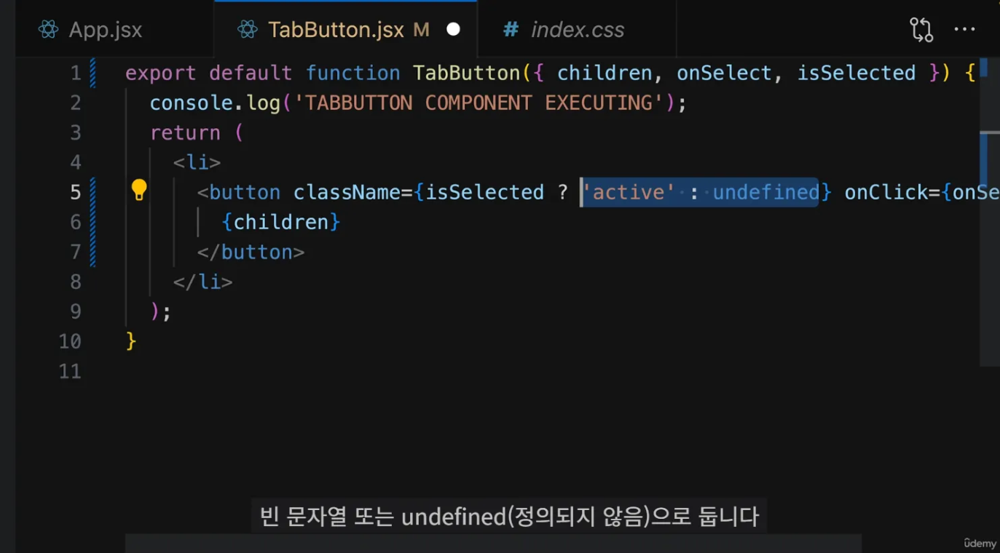
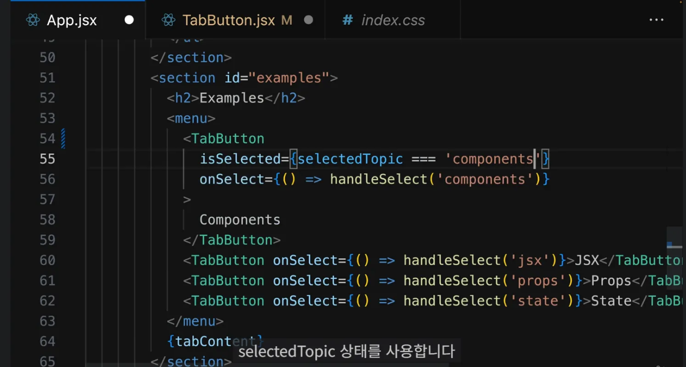
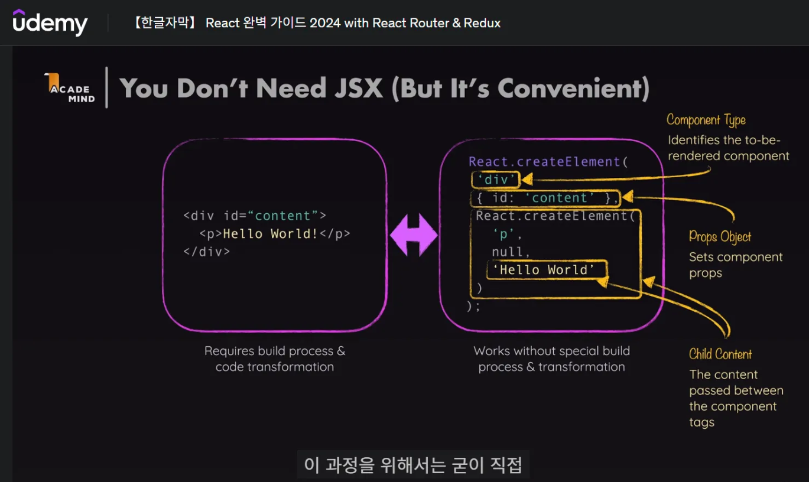
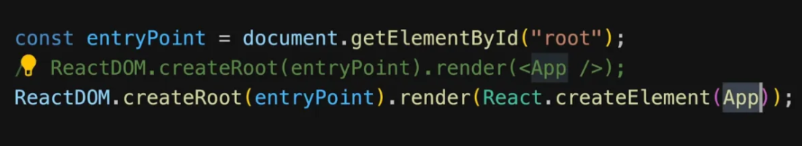

# [강의] 추가 학습 놓친 POINT

날짜: 2024년 12월 10일

# CSS 스타일링 및 동적 스타일

---

- `삼항 연산자`를 이용한 할당



⇒ 선택되었따면 활성화 : 아니라면 undefined

- 또한 state 자체 내부 값을 활영한 삼항 연산자 활용도 가능



# JSX를 꼭 사용하지 않아도 되는 이유

---

- 하지만 사용하는게 좋다 : 직관적, 편의성, 가독성





# Fragments(프래그먼트) 사용법과, Fragment란?

---

<aside>
💡

**React에서 Fragment는 부모 요소 없이 여러 자식 요소를 그룹화할 수 있게 해주는 기능입니다.**

- <Fragment>와 <> </>는 동일한 기능을 수행하지만, 사용 상황에 따라 선택할 수 있습니다.
- key가 필요한 경우에는 <Fragment>를, 그렇지 않은 경우에는 간단한 <> </>를 사용할 수 있습니다.
</aside>

1. Fragment의 정의:
    - Fragment는 DOM에 별도의 노드를 추가하지 않고 여러 자식 요소를 그룹화하는 React 컴포넌트입니다.
    - 불필요한 래퍼 요소(예: div)를 사용하지 않고도 여러 요소를 반환할 수 있게 해줍니다.

1. **Fragment** 사용 방법:
    - <React.Fragment> 태그 사용:
        
        ```jsx
        <React.Fragment>
          <ChildA />
          <ChildB />
          <ChildC />
        </React.Fragment>
        
        ```
        
    - **단축 구문 <> </> 사용:**
        
        ```jsx
        <>
          <ChildA />
          <ChildB />
          <ChildC />
        </>
        
        ```
        
2. <Fragment>와 <> </> 비교:
    - <Fragment>와 <> </>는 기능적으로 동일합니다.
    - <> </>는 JSX의 단축 구문으로, 별도의 import 없이 사용할 수 있습니다.
    - **<Fragment>를 사용하려면 'react'에서 import 해야 합니다: import { Fragment } from 'react'.**
    - **<> </>는 key나 속성을 지원하지 않지만, <Fragment>는 key 속성을 지원합니다**

1. Fragment 사용 이유:
    - DOM에 불필요한 노드를 추가하지 않고 여러 요소를 그룹화할 수 있습니다.
    - 코드의 가독성과 구조를 개선하며, 불필요한 div 태그 사용을 줄일 수 있습니다.

# JSX 슬롯

---

- JSX 슬롯은 React 컴포넌트에서 **특정 위치에 다른 컴포넌트나 콘텐츠를 삽입**할 수 있게 해주는 패턴입니다. 이 패턴의 주요 특징은 다음과 같습니다:

<aside>
💡

단순한 props가 아니라, 컴포넌트의 특정 위치에 삽입될 수 있는 콘텐츠를 정의

</aside>

```jsx
// Card 컴포넌트 정의
function Card({ header, content, footer }) {
  return (
    <div className="card">
      <div className="card-header">{header}</div>
      <div className="card-content">{content}</div>
      <div className="card-footer">{footer}</div>
    </div>
  );
}

// Card 컴포넌트 사용
function App() {
  return (
    <Card
      header={<h2>카드 제목</h2>}
      content={<p>이것은 카드의 내용입니다.</p>}
      footer={<button>자세히 보기</button>}
    />
  );
}

```

이 예제에서:

1. `Card` 컴포넌트는 `header`, `content`, `footer`라는 세 개의 슬롯(구멍)을 가지고 있습니다.
2. 각 슬롯에는 원하는 내용을 넣을 수 있습니다.
3. **`App` 컴포넌트에서 `Card`를 사용할 때, 각 슬롯에 원하는 내용을 넣어줍니다.**

이렇게 하면 `Card` 컴포넌트의 구조는 그대로 유지하면서, 내용을 자유롭게 바꿀 수 있습니다. 예를 들어:

```jsx
<Card
  header={<h2>새로운 제품</h2>}
  content={}
  footer={<button>구매하기</button>}
/>

```

이렇게 같은 `Card` 컴포넌트를 사용하지만, 내용을 완전히 다르게 구성할 수 있습니다. 이것이 JSX 슬롯의 유연성과 재사용성입니다.

1. **레고 블록 놀이 상상하기**
    - JSX 슬롯은 특별한 레고 블록 놀이판과 같아요.
    - 이 놀이판에는 여러 모양의 구멍이 있어요.
2. **구멍에 맞는 블록 끼우기**
    - 각 구멍에는 특정 모양의 블록만 들어갈 수 있어요.
    - **예를 들어, 동그란 구멍에는 동그란 블록, 네모난 구멍에는 네모난 블록을 끼워요.**
3. **블록 바꿔 끼우기**
    - **언제든 구멍에 끼운 블록을 다른 블록으로 바꿀 수 있어요.**
    - **하지만 구멍의 모양은 그대로 유지돼요.**
4. **실제 코드에서는**
    
    ```jsx
    <놀이판>
      <구멍 이름="머리"> <동그란블록 /> </구멍>
      <구멍 이름="몸통"> <네모난블록 /> </구멍>
      <구멍 이름="다리"> <긴블록 /> </구멍>
    </놀이판>
    
    ```
    
    - 여기서 '놀이판'은 전체 컴포넌트예요.
    - '구멍'은 각각의 슬롯이에요.
    - 각 구멍 안에 들어가는 블록들은 우리가 원하는 대로 바꿀 수 있어요.

이렇게 하면, 놀이판의 모양은 그대로 유지하면서도 다양한 블록을 끼워 넣어 여러 가지 모양을 만들 수 있어요. 이게 바로 JSX 슬롯의 핵심이에요!

# ⚠️ JSX 슬롯 예시

---

Header 컴포넌트에서:

1. `leftChild`: 왼쪽 영역의 slot
2. `text`: 중앙 제목 영역의 slot
3. `rightChild`: 오른쪽 영역의 slot

이렇게 세 개의 slot을 정의하고 있습니다.

<aside>
💡

**이처럼 미리 정의된 `위치(slot)`에 원하는 내용을 삽입할 수 있게 하는 이 패턴이 바로 React에서의 slot 구현 방식입니다.**

</aside>

이 방식의 장점은:

1. **유연성: Header의 구조는 유지하면서 각 영역의 내용을 자유롭게 변경할 수 있습니다.**
2. 재사용성: 다양한 상황에서 같은 Header 구조를 재사용할 수 있습니다.
3. 명확성: 각 영역의 역할이 명확하게 정의되어 있어 코드의 가독성이 높아집니다.

사용 예시를 보면:

```jsx
<Header
  text={"새 일기 쓰기"}
  leftChild={<Button text={"< 뒤로가기"} onClick={() => nav(-1)}/>}
/>

```

여기서 `text`와 `leftChild` slot을 채우고 있습니다. `rightChild`는 생략되어 있어 비어있게 됩니다.

# 조건부 렌더링

---

- 조건부 콘텐츠 렌더링은 React에서 사용자 인터페이스(UI)의 일부를 동적으로 변경할 수 있는 강력한 기능입니다.
- 이 기능의 주된 목적은 특정 조건에 따라 사용자에게 보여줄 콘텐츠를 결정하는 것입니다.

## 조건부 콘텐츠 렌더링의 이유

1. **동적 사용자 경험**: **사용자 상호작용이나 애플리케이션의 상태에 따라 다른 콘텐츠를 보여줄 수 있어**, 더욱 직관적이고 적응형의 사용자 경험을 제공합니다.
2. **상태 기반 표시**: 애플리케이션의 **상태가 변함에 따라 UI가 자동으로 업데이트**되므로 유지 보수와 관리가 용이합니다. **예를 들어, 로딩 상태, 오류 처리, 사용자 인증 여부**에 따라 다른 화면을 보여줄 수 있습니다.

## 장점

1. **유연성**: 조건에 따라 다양한 콘텐츠를 렌더링할 수 있어, 애플리케이션의 유연성이 높아집니다. 예를 들어, 사용자 권한에 따라 다른 버튼이나 메뉴를 표시할 수 있습니다.
2. **코드 가독성**: 명확한 조건부 렌더링을 사용하면 코드의 가독성이 향상됩니다. 특정 조건에 따라 분기된 코드가 명확하게 작성되므로, 다른 개발자들이 이해하기 쉬운 구조로 만들어집니다.
3. **비용 절감**: 필요하지 않은 요소를 렌더링하지 않음으로써 메모리와 성능을 최적화할 수 있습니다. 이는 특히 복잡한 UI 또는 대규모 애플리케이션에서 중요합니다.

## 활용 예시

**조건부 콘텐츠 렌더링**은 다양한 상황에서 유용하게 활용될 수 있습니다. 다음은 몇 가지 예시입니다:

1. **로그인 상태 확인**:
    - 사용자가 로그인했는지 여부에 따라 다른 콘텐츠를 렌더링할 수 있습니다.
    
    ```jsx
    function UserGreeting({ isLoggedIn }) {
      return (
        <div>
          {isLoggedIn ? <WelcomeMessage /> : <LoginPrompt />}
        </div>
      );
    }
    
    ```
    
2. **로딩 상태 처리:**
    - 데이터 요청 중에 로딩 스피너를 표시하거나, 데이터가 로드되었을 때의 콘텐츠를 보여줄 수 있습니다.
    
    ```jsx
    function DataDisplay({ isLoading, data }) {
      return (
        <div>
          {isLoading ? <LoadingSpinner /> : <DataList data={data} />}
        </div>
      );
    }
    
    ```
    
3. **오류 처리**:
    - API 요청이 실패했을 때 사용자에게 오류 메시지를 보여줄 수 있습니다.
    
    ```jsx
    function ApiResponse({ error }) {
      return (
        <div>
          {error ? <ErrorMessage /> : <SuccessMessage />}
        </div>
      );
    }
    
    ```
    
4. **권한 기반 UI**:
    - 사용자 역할에 따라 다른 메뉴를 표시합니다.
    
    ```jsx
    function AdminPanel({ isAdmin }) {
      return (
        <div>
          {isAdmin ? <AdminControls /> : <UserControls />}
        </div>
      );
    }
    
    ```
    

### 결론

조건부 콘텐츠 렌더링은 사**용자의 경험을 향상시키고 애플리케이션의 동작을 더 직관적으로 만들어주는 매우 중요한 기술**입니다. 이 기술을 적절히 활용하면, 복잡한 사용자 인터페이스를 관리하고 사용자 상호작용에 맞춰 UI를 동적으로 조정할 수 있습니다. 언제 어떤 조건부 렌더링을 사용할지는 애플리케이션의 요구 사항과 사용자 경험에 따라 달라질 수 있습니다. 추가로 궁금한 부분이 있으면 언제든지 말씀해 주세요!

# ⚠️불변 객체로 State 업데이트하기

---

<aside>
💡

React는 **객체의 참조값(메모리 주소을 비교**하여 상태 변화를 감지합니다

</aside>

**핵심 개념**

- State를 직접 수정하지 않고 새로운 객체를 생성하여 업데이트
- 불변성 유지를 통한 상태 관리의 예측 가능성 향상

```jsx
// 잘못된 방법
const handleClick = () => {
  user.name = 'John';  // 직접 수정 ❌
}

// 올바른 방법
const handleClick = () => {
  setUser({...user, name: 'John'}); // 새로운 객체 생성 ✅
}

```

- 불변 객체로 State를 업데이트한다는 것은 기존 객체를 직접 수정하지 않고, 새로운 객체를 생성하여 상태를 변경하는 것을 의미합니다.

```jsx
// ❌ 잘못된 방법 (직접 수정)
const user = { name: 'John' };
user.name = 'Sally';  // 기존 객체를 직접 수정

// ✅ 올바른 방법 (불변성 유지)
const [user, setUser] = useState({ name: 'John' });
setUser({ ...user, name: 'Sally' });  // 새로운 객체 생성

```

이렇게 불변성을 유지하면서 상태를 업데이트하는 것이 React의 권장 방식입니다. 이는 다음과 같은 이점이 있습니다:

- 상태 변화를 예측 가능하게 만듭니다
- 리액트의 렌더링 최적화에 도움이 됩니다
- 버그 발생 가능성을 줄여줍니다
- **상태 변화 추적이 용이해집니다**

# ⚠️**State 끌어올리기 : Props-Drilling 야기**

---

- 이는 자식 컴포넌트들이 같은 데이터를 공유해야 할 때 사용하는 패턴입니다.
    - 여러 컴포넌트가 동일한 상태를 공유해야 할 때 사용
- 가장 가까운 공통 부모 컴포넌트로 상태를 이동

```jsx
*// 부모 컴포넌트*
function DiaryApp() {
  const [diaryData, setDiaryData] = useState({
    todayDate: changeFormatter(new Date()),
    todayDiary: '',
    todayEmotion: []
  });

  return (
    <>
      <DiaryInput diaryData={diaryData} setDiaryData={setDiaryData} />
      <DiaryPreview diaryData={diaryData} />
    </>
  );
}
```

- `DiaryInput`, `DiaryPreview` 컴포넌트가 같은 데이터를 공유하고 동기화된 상태를 유지할 수 있습니다.

## Props Drilling 문제

---

- 여러 단계의 컴포넌트를 거쳐 데이터를 전달할 때 발생하는 문제:

```jsx
// Props Drilling 예시
function GrandParent() {
  const [data, setData] = useState();
  return <Parent data={data} setData={setData} />
}

function Parent({ data, setData }) {
  return <Child data={data} setData={setData} />
}

function Child({ data, setData }) {
  return <GrandChild data={data} setData={setData} />
}

```

## Context API로 해결

---

```jsx
// Context 사용 예시
const DataContext = createContext();

function GrandParent() {
  const [data, setData] = useState();
  return (
    <DataContext.Provider value={{ data, setData }}>
      <Parent />
    </DataContext.Provider>
  );
}

// 중간 컴포넌트들은 props를 전달할 필요가 없음
function Parent() {
  return <Child />
}

function Child() {
  const { data, setData } = useContext(DataContext);
  // 직접 데이터 사용 가능
}

```

Context를 사용하면 중간 컴포넌트들을 거치지 않고도 필요한 컴포넌트에서 직접 데이터에 접근할 수 있어 코드가 더 깔끔해지고 유지보수가 쉬워집니다.

# ⚠️ State를 끌어올리지 않아도 되는 경우

---

| **상황** | **설명** |
| --- | --- |
| **로컬 상태가 충분할 때** | 상태가 해당 컴포넌트 내에서만 필요하고, 다른 컴포넌트와 공유할 필요가 없는 경우. |
| **렌더링 최적화** | 상태를 끌어올리면 하위 컴포넌트가 **상태 업데이트에 따라 재렌더링되어 불필요한 렌더링**이 발생할 수 있음. |
| **코드 복잡성 증가** | 상태를 끌어올리면 컴포넌트 간의 데이터 흐름이나 의존성이 복잡해져 관리가 어려워질 수 있음. |
| **라이프사이클 관리 문제** | **부모 컴포넌트의 상태 변화가 하위 컴포넌트의 동작에 악영향을 미칠 수 있으며,** 상태 초기화 문제가 발생할 수 있음. |
| **상태 관리 도구 사용** | 상태를 전역적으로 관리할 필요가 있는 경우 Context API 또는 Redux 등 다른 상태 관리 솔루션을 사용하는 것이 더 적절함. |

# ⚠️ 객체로 상태 그룹화

```jsx
// 연관된 데이터를 하나의 객체로 관리
const [input, setInput] = useState({
  todayDate: changeFormatter(new Date()),
  todayDiary: '',
  todayEmotion: []
})

```

- 이것은 단순히 관련된 데이터를 **하나의 객체로 묶어서 관리하는 방식**입니다.


## 컨텍스트 API & useReducer

---

- React에서 상태 관리와 전역 상태를 공유하기 위해 자주 사용되는 패턴 중 하나는 **Context API**와 **useReducer** 훅의 조합입니다
- 이 두 가지를 함께 사용하면 컴포넌트 간에 상태를 효율적으로 공유하고 관리할 수 있습니다.

# ⚠️ useReducer 훅 : 복잡한 상태 관리

---

- `useReducer` 훅은 컴포넌트의 상태를 업데이트하는 방법으로, 주로 복잡한 상태 로직을 처리할 때 유용합니다.
- Redux의 리듀서와 유사한 개념으로**, 액션에 따라 상태를 변경하는 함수(리듀서)를 사용**합니다.

## 예시

---

```jsx
import React, { useReducer } from 'react';

// 초기 상태
const initialState = { count: 0 };

// 리듀서 함수
function reducer(state, action) {
    switch (action.type) {
        case 'increment':
            return { count: state.count + 1 };
        case 'decrement':
            return { count: state.count - 1 };
        default:
            throw new Error();
    }
}

// 컴포넌트
function Counter() {
    const [state, dispatch] = useReducer(reducer, initialState);

    return (
        <div>
            Count: {state.count}
            <button onClick={() => dispatch({ type: 'increment' })}>+</button>
            <button onClick={() => dispatch({ type: 'decrement' })}>-</button>
        </div>
    );
}

```

- `useReducer`는 두 개의 인자를 받습니다: 리듀서 함수와 초기 상태입니다.
- **리듀서 함수는 현재 상태와 액션을 받아 새로운 상태를 반환합니다.**
- **`dispatch` 함수는 액션을 전달하여 상태를 업데이트합니다.**

# ⚠️ 컨텍스트 API

---

<aside>
💡

특히 컴포넌트 트리 구조가 깊어질 때 유용합니다. 

</aside>

- React의 Context API는 컴포넌트 트리에서 전역 상태를 쉽게 공유할 수 있는 메커니즘을 제공합니다.
- React 애플리케이션의 깊은 하위 컴포넌트에 props를 전달하지 않고도 데이터를 제공할 수 있습니다.

## 예시

---

```jsx
import React, { createContext, useContext, useReducer } from 'react';

// 컨텍스트 생성
const CountContext = createContext();

// 리듀서 및 초기 상태 정의
const initialState = { count: 0 };

function reducer(state, action) {
    switch (action.type) {
        case 'increment':
            return { count: state.count + 1 };
        case 'decrement':
            return { count: state.count - 1 };
        default:
            throw new Error();
    }
}

// 컨텍스트 공급자
function CountProvider({ children }) {
    const [state, dispatch] = useReducer(reducer, initialState);

    return (
        <CountContext.Provider value={{ state, dispatch }}>
            {children}
        </CountContext.Provider>
    );
}

// 소비자 컴포넌트
function Counter() {
    const { state, dispatch } = useContext(CountContext);

    return (
        <div>
            Count: {state.count}
            <button onClick={() => dispatch({ type: 'increment' })}>+</button>
            <button onClick={() => dispatch({ type: 'decrement' })}>-</button>
        </div>
    );
}

// 최상위 컴포넌트
function App() {
    return (
        <CountProvider>
            <Counter />
        </CountProvider>
    );
}

```

- `createContext()`를 사용하여 컨텍스트를 생성합니다.
- `CountProvider`는 상태와 `dispatch` 함수를 제공하는 공급자 역할을 합니다.
- `useContext` 훅을 사용하여 필요한 컴포넌트에서 컨텍스트에 접근합니다.

# Refs와 Portals 활용

---

- React에서 `refs`는 컴포넌트에서 **DOM 요소나 다른 React 컴포넌트에 직접 접근**할 수 있게 해주는 방법입니다.
- 이 기능은 특정 작업에 대해 효율적인 접근이 필요할 때 유용합니다.
- **또한, React의 `Portals`를 사용하면 컴포넌트를 부모 DOM 트리의 자식으로 렌더링할 수 있습니다**

## refs로 HTML 요소 연결 및 DOM 접근

---

- `refs`를 사용하면 React 컴포넌트에서 DOM 요소에 직접 접근할 수 있습니다.
    - 예를 들어, input 요소에 대해 포커스를 주거나, DOM의 특정 속성을 변경하는 등의 작업을 수행할 수 있습니다.

## 예제

---

```jsx
const MyComponent = () => {
    const inputRef = useRef();

    const handleFocus = () => {
        inputRef.current.focus();
    };

    return (
        <div>
            <input ref={inputRef} type="text" />
            <button onClick={handleFocus}>Focus Input</button>
        </div>
    );
};

```

# ⚠️ref vs state

---

| **특징** | **Refs** | **State** |
| --- | --- | --- |
| **접근 방식** | **DOM 요소에 직접 접근 가능** | 컴포넌트의 상태를 관리 |
| **렌더링 영향** | **변경 시 렌더링을 트리거하지 않음** | 상태 변경 시 컴포넌트가 다시 렌더링됨 |
| **주 사용 용도** | UI의 특정 요소에 대한 직접적인 조작 | 데이터 상태 관리 및 UI 업데이트 |
| **성능** | 성능상 유리할 수 있음 | **JSX에 기반하여 상태 변화에 따른 렌더링이 필요함** |
| **사용 사례** | **포커스, 텍스트 선택 등 UI 조작** | 사용자 입력, 데이터 피드백 등 **상태 변화 관리** |