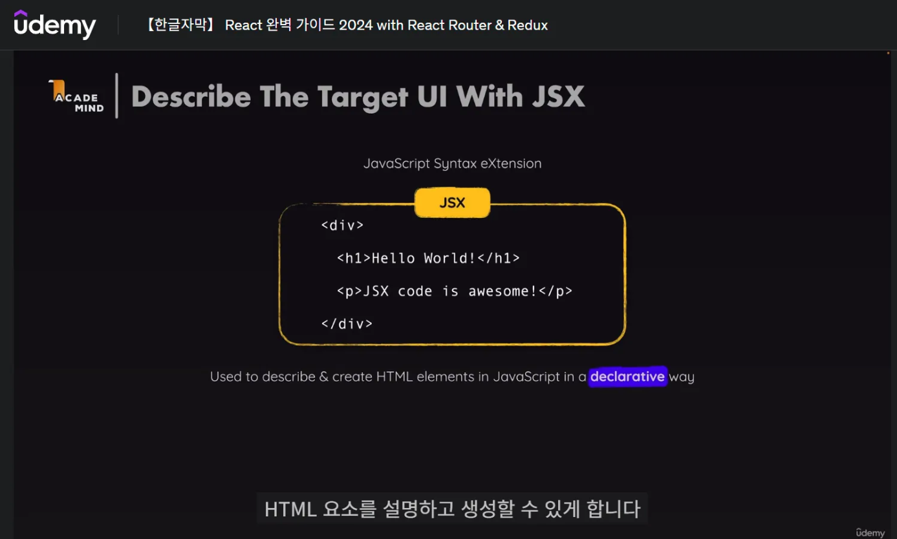
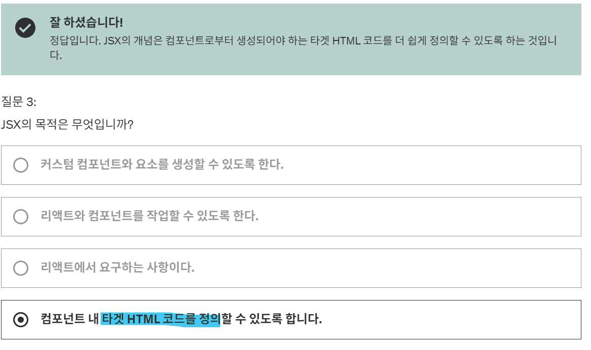
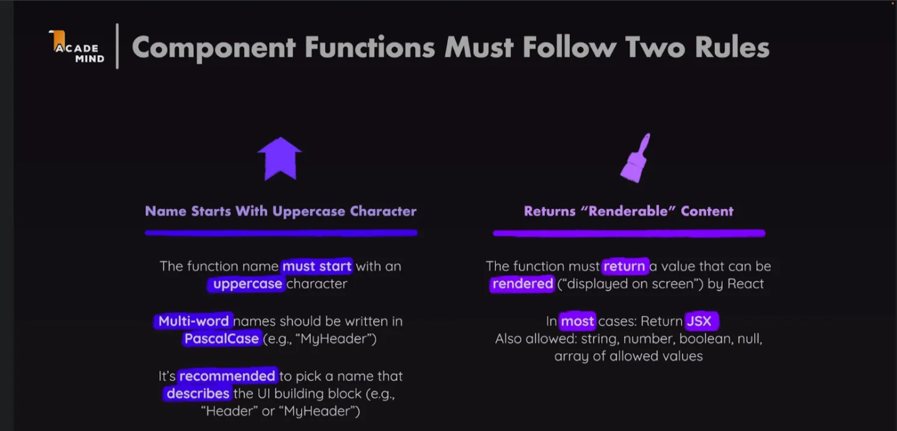

# [강의] JSX와 리액트 컴포넌트 : 핵심개념

날짜: 2024년 12월 10일

# JSX란?

---

- 비표준 자바스크립트 표준을 사용 == .jsx를 사용함
- (즉 JS 문법 확장자) jsx라는 자바스크립트 문법을 사용한다.
    - **HTML 마크업 코드를 작성하여 HTML 요소를 설명하고 생성할 수 있게 한다.**
- 그러나 `브라우저` 자체에서는 사용이 불가하다.
    - component의 내용은 브라우저에 도달하기 전에 **개발 서버에서 변환**된다.

JSX의 주요 특징과 컴포넌트들의 역할을 표로 정리하면 다음과 같습니다:

## JSX의 주요 특징 : 타겟 UI/UX HTML 코드를 정의

- HTML 코드를 설명할 수 있게 만듬

| 특징 | 설명 |
| --- | --- |
| JavaScript와 HTML의 결합 | JavaScript 내에서 HTML과 유사한 구문을 사용 가능 |
| React 엘리먼트 생성 | React.createElement() 함수 호출로 변환되어 React 엘리먼트 생성 |
| 컴포넌트 기반 | **재사용 가능한 UI 컴포넌트를 쉽게 정의** |
| 표현식 삽입 | 중괄호 {}를 사용하여 JSX 내에 JavaScript 표현식 삽입 가능 |

## JSX 코드에서 사용된 컴포넌트들의 역할

- 컴포넌트는 DOM을 업데이트 하기 위함

| 컴포넌트 | 역할 |
| --- | --- |
| App | 애플리케이션의 최상위 컴포넌트로, 전체 UI 구조를 정의 |
| Greeting | 사용자에게 인사 메시지를 표시하는 컴포넌트 |
| Welcome | props를 통해 전달된 이름을 사용하여 환영 메시지를 표시 |
| List | 순서 없는 목록(ul)을 생성하고 목록 항목(li)을 포함 |

# 컴포넌트란?

---

- 첫번쨰 문자를 대문자로 작성해야 하며
- 함수에서 `렌더링 가능한 값`이 반환되어야 함
    - HTML로 변환할 것

# 컴포넌트 구축의 장점 : 재사용성

---

# 커스텀 컴포넌트는 어디에든 정의할 수 있다.

---

