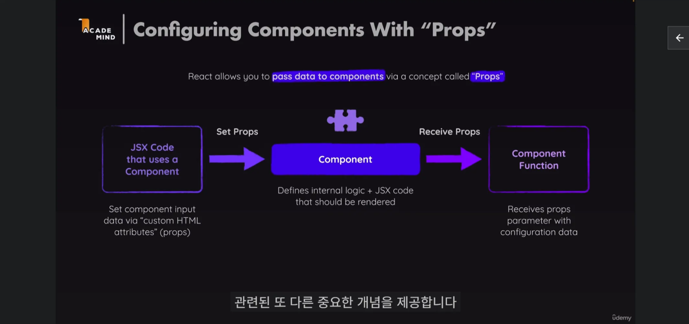
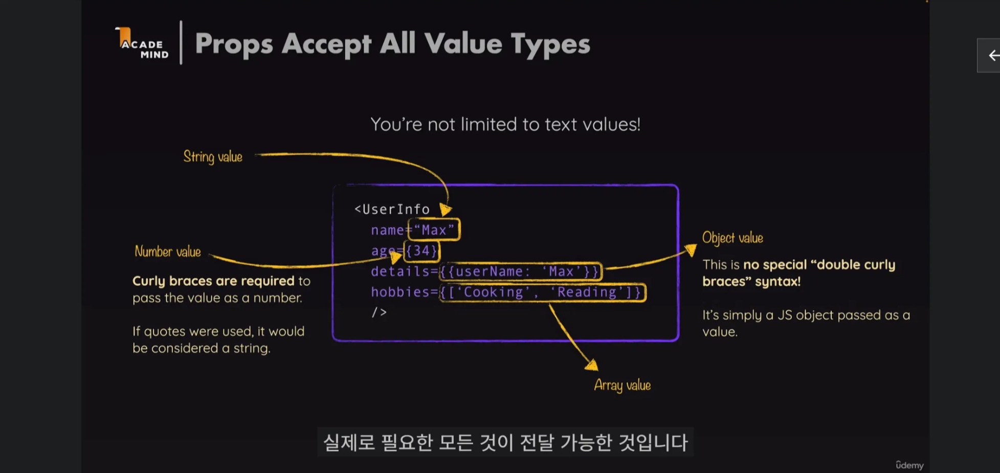
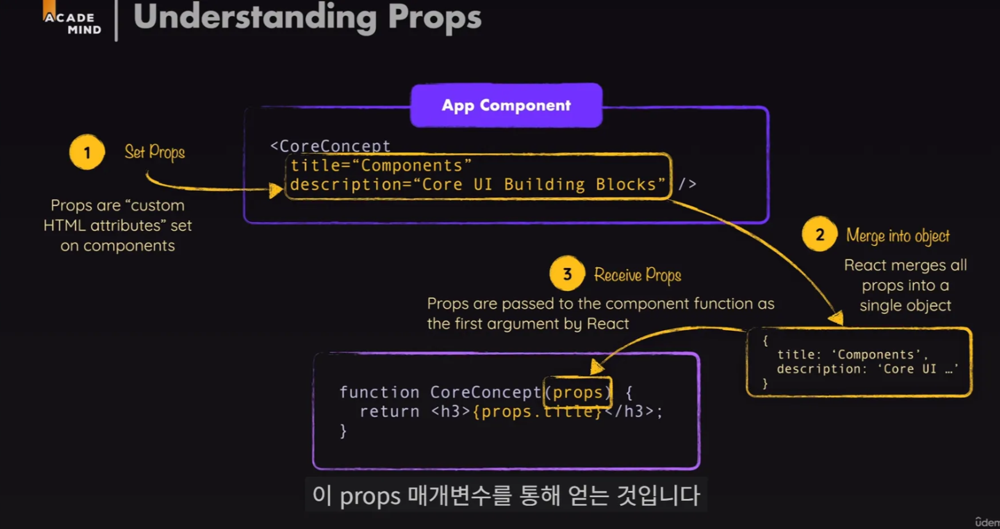
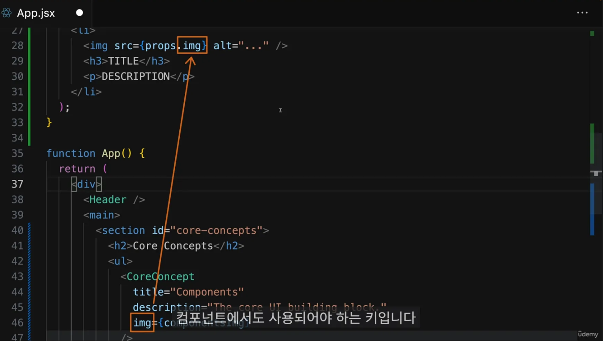
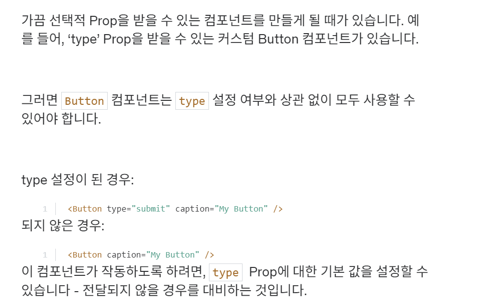
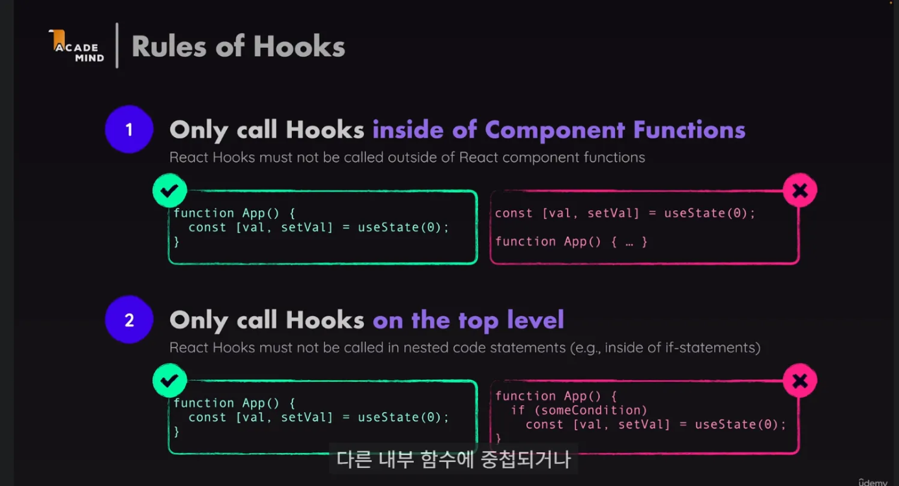

# [강의] Props, Hooks : 핵심개념

날짜: 2024년 12월 10일 → 2024년 12월 10일

# 그 전 각 컴포넌트의 특징

---

- 데이터를 컴포넌트로 전달하고 그 데이터를 그 곳에 사용할 수 있다는 것
    - 사용할 때 마다 다른 데이터를 전달할 수 있음
    - 즉 재사용성을 높여주는 것

- 커스텀 컴포넌트에 커스텀 속성을 정할 수 있음
    
    ⇒ 개발자의 몫이기 때문에 개발자 마음대로 정할 수 있음
    

# Props란? : 컴포넌트를 설정하는 개념  ⇒ 핵심 UI 빌딩블록

---

- 문자열 or 숫자열 모든 것을 사용할 수 있음
- 즉 props의 매개변수는 리액트에 의해 설정된다. ⇒ 컴포넌트 함수를 직접 코드에 호출하는 것X
    - **HTML 요소로 사용하는 것 : 실제로는 리액트가 실제 함수를 부르는 것**



- 컴포넌트를 설정하는 개념을 `props`라고 부른다.

```
      <Header title={"hello"} leftChild={<Button 
      text={"< 뒤로가기"}/>}/>
```

⇒ 여기서 보면 `title`과 `leftChild` 가 Props가 된다.



- 또한 Props로 내려준 입력 값을 받아들이고 사용하기 위해 `매개변수를` 추가한다.
    - 매개 변수에 대해 일반적으로 선택되는 이름

```jsx
  //여기서 text, children
  const Button = ({text, color = 'blue', children}) => {
    console.log(text, color)
    const onClickButton = (e) => {
      console.log(e) 
      console.log(text, "click event 발동")
    }

```

## 쉽게 이해하기

---

## Props란?

Props는 `속성`이라고 생각하면 됩니다. 레고 블록을 상상해보세요. 레고 블록에는 여러 가지 `색깔, 크기, 모양`이 있죠? 이런 특징들이 바로 레고 블록의 '속성'입니다. React에서 Props는 이와 비슷한 역할을 합니다.

### 비유: 레고 블록 놀이

1. **레고 블록 = React 컴포넌트**
    - 레고 블록을 조립해서 집이나 자동차를 만들 듯, React 컴포넌트를 조립해서 웹페이지를 만듭니다.
2. **`블록의 특징 = Props`**
    - **빨간 2x4 블록, 파란 1x2 블록처럼** 각 블록의 특징이 Props입니다.
3. **조립 설명서 = 컴포넌트 사용법**
    - 레고 조립 설명서처럼, 각 컴포넌트를 어떻게 사용할지 알려줍니다.

## 실제 예시

레고 집을 만드는 것처럼 간단한 웹페이지를 만들어봅시다.

```jsx
// 벽돌 컴포넌트
const Brick = ({ color, size }) => {
  return <div style={{ backgroundColor: color, width: size, height: '20px' }}>벽돌</div>;
};

// 지붕 컴포넌트
const Roof = ({ color }) => {
  return <div style={{ backgroundColor: color, width: '100px', height: '50px' }}>지붕</div>;
};

// 집 컴포넌트
const House = () => {
  return (
    <div>
      <Roof color="brown" />
      <Brick color="red" size="100px" />
      <Brick color="red" size="100px" />
      <Brick color="red" size="100px" />
    </div>
  );
};

```

이 예시에서:

- `Brick`과 `Roof`는 레고 블록 같은 기본 컴포넌트입니다.
- **`color`와 `size`는 Props로, 각 블록의 특징을 정의합니다.**
- `H**ouse` 컴포넌트는 이 블록들을 조립해서 집을 만듭니다.**

이렇게 Props를 사용하면, 같은 컴포넌트(레고 블록)를 다양한 방식으로 재사용할 수 있습니다. 빨간 벽돌, 파란 벽돌, 큰 벽돌, 작은 벽돌 등 원하는 대로 조합해서 다양한 집을 만들 수 있는 것처럼요!

# 객체가 되는 과정

---



## Props의 객체화 과정

1. JSX에서 컴포넌트에 속성을 전달합니다.
2. React는 이 속성들을 하나의 객체로 모읍니다.
3. 이 객체가 컴포넌트 함수의 첫 번째 매개변수로 전달됩니다.



## Props 사용 방법

| 방법 | 설명 | 예시 |
| --- | --- | --- |
| 객체 구조 분해 | 함수 매개변수에서 필요한 props만 추출 | `function Welcome({ name, age }) { ... }` |
| props 객체 그대로 사용 | 전체 props 객체를 받아 사용 | `function Welcome(props) { return <h1>Hello, {props.name}</h1>; }` |
| 중첩된 구조 분해 | 복잡한 props 구조에서 특정 값만 추출 | `function Profile({ user: { name, age } }) { ... }` |

## 예시와 설명

```jsx
// JSX에서 props 전달
<Welcome name="Alice" age={30} />

// 컴포넌트 정의
function Welcome(props) {
  return <h1>Hello, {props.name}! You are {props.age} years old.</h1>;
}

// 구조 분해를 사용한 컴포넌트
function Welcome({ name, age }) {
  return <h1>Hello, {name}! You are {age} years old.</h1>;
}

```

이 예시에서:

1. JSX에서 `name`과 `age`를 props로 전달합니다.
2. React는 이를 `{ name: "Alice", age: 30 }` 형태의 객체로 변환합니다.
3. 이 객체가 `Welcome` 함수의 `props` 매개변수로 전달됩니다.
4. **컴포넌트 내에서는 `props.name`과 `props.age`로 값에 접근하거나, 구조 분해를 통해 직접 `name`과 `age`를 사용할 수 있습니다.**

```jsx
props를 사용할 때 키값으로 접근해야 하는지는 선택한 방법에 따라 다릅니다. 
객체 구조 분해를 사용하면 `직접 변수명`으로 접근할 수 있고, 
props 객체를 그대로 사용하면 `키`값으로 접근해야 합니다. 

두 방법 모두 유효하며, 상황과 개인 선호에 따라 선택할 수 있습니다.
```

### ⚠️ 놓친 포인트 : 구조 분해 할당으로 받을 것이 아니면 묶어서 하나로 받을 수 있음
⇒ 하지만 `권장 사항`은 아님

---

props를 하나의 객체로 받아 사용할 수 있습니다. 이 방식을 사용하면 모든 props를 하나의 매개변수로 받게 됩니다. 예를 들면 다음과 같습니다:

```jsx
function Welcome(props) {
  return <h1>Hello, {props.name}! You are {props.age} years old.</h1>;
}

```

이 방식의 장단점을 표로 정리해보겠습니다:

| 특징 | 설명 |
| --- | --- |
| 장점 | 1. 모든 props를 한 번에 받을 수 있어 유연성이 높습니다. |
|  | 2. 전달받은 props의 수나 이름이 변경되어도 함수 선언부를 수정할 필요가 없습니다. |
|  | 3. 추가적인 props를 쉽게 전달하고 사용할 수 있습니다. |
| 단점 | 1. 코드에서 어떤 props를 사용하는지 명확하게 보이지 않을 수 있습니다. |
|  | 2. 타입 체크나 자동 완성 기능을 사용하기 어려울 수 있습니다. |
|  | 3. 필요하지 않은 props도 모두 전달받게 되어 메모리 사용이 비효율적일 수 있습니다. |

실제 사용 예시:

```jsx
function UserProfile(props) {
  return (
    <div>
      <h1>{props.name}</h1>
      <p>Age: {props.age}</p>
      <p>Email: {props.email}</p>
      {props.isAdmin && <p>Admin User</p>}
    </div>
  );
}

// 사용
<UserProfile name="Alice" age={30} email="alice@example.com" isAdmin={true} />

```

이 방식은 특히 많은 props를 전달받거나, 동적으로 props가 변경될 수 있는 경우에 유용합니다. 하지만 코드의 가독성과 유지보수성을 위해 **구조 분해 할당을 사용하는 것이 일반적으로 권장**됩니다.

# 더 다양한 Prop(속성) 문법

---




## 기본 Prop 값 설명

상상해보세요. 여러분이 레고 블록으로 자동차를 만들고 있어요. 이 자동차에는 여러 가지 부품이 필요합니다.

1. **자동차 본체** (꼭 필요한 부분)
2. **바퀴 색깔** (있어도 되고 없어도 되는 부분)

여러분의 친구가 "자동차 만들어줘!"라고 할 때, 두 가지 경우가 있을 수 있어요:

1. "빨간 바퀴로 자동차 만들어줘!"
2. 그냥 "자동차 만들어줘!" (바퀴 색깔은 말하지 않음)

두 번째 경우, 바퀴 색깔을 뭘로 해야 할까요? 이럴 때 우리는 "기본값"을 정해둡니다. 예를 들어, "아무 말 없으면 검은색 바퀴를 쓰자"라고요.

## React에서의 예시

React에서도 비슷해요. Button이라는 컴포넌트(레고 블록)를 만든다고 생각해봐요.

```jsx
function Button({ caption, type = "submit" }) {
  return <button type={type}>{caption}</button>;
}

```

여기서:

- `caption`은 꼭 필요한 부분이에요 (자동차 본체와 같아요).
- **`type`은 있어도 되고 없어도 돼요 (바퀴 색깔과 같아요).**
    - 만약 `type`을 지정하지 않으면, 자동으로 "submit"이 됩니다.

사용 예:

1. `type`을 지정한 경우:
    
    ```jsx
    <Button caption="클릭하세요" type="reset" />
    
    ```
    
    이건 "빨간 바퀴로 자동차 만들어줘!"와 같아요.
    
2. `type`을 지정하지 않은 경우:
    
    ```jsx
    <Button caption="클릭하세요" />
    
    ```
    
    이건 그냥 "자동차 만들어줘!"와 같아요. 이때 `type`은 자동으로 "submit"이 됩니다.
    

이렇게 **기본값을 설정해두면, 버튼을 만들 때마다 모든 세부사항을 일일이 지정하지 않아도 되어 편리해요**. 꼭 **필요한 부분만 지정하고, 나머지는 기본값을 사용**할 수 있답니다.

============================================================

# 리액트 훅 : `use`로 시작하는 모든 함수

<aside>
💡

- 특이한 점 : 다른 리액트 Hooke안에서 호출되어야 함
- 다른 내부 함수에 중첩되거나 if/else 조건문 사용도 안됨
</aside>

