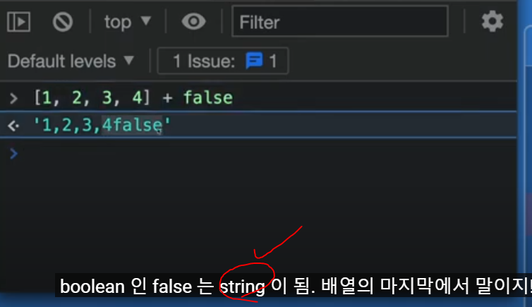

# Overview Of Typescript(1/2)

날짜: 2024년 10월 23일



→ 런타임 에러가 일어날거라는 경고문 자체를 보내지 않는 문제 : 이부분을 해결할 수 있는게 Ts?

- 타입스크립트 작성 → 해당 코드를 컴파일(유/무) → 일반적인 오류가 발생하지 않는 js코드가 됨

# 명시적 표현 최소한 사용

---

객체 => dict?

1. 타입 추론 방법
ex) let a = "hello"
2. 다른 하나는 조금 더 구체적으로 하는 것
ex) (let b : boolean = false) >> 타입을 정해주는 것
       **== (let b = false) → 이건 가독성이 좋아져**
3. 배열의 타입 지정 


## 타입 스크립트 사용해보기

---

```jsx
//타입스크립트가 추론해주는 것
let a = 'hello' //TS는 타입 추론 가능
a = 'bye' //string -> string으로 변경함
//a = 1 //Type 'number' is not assignable to type 'string

-----------------------------------------------------
//typescript와 소통하는 방식
let b :boolean = true 
//let c :boolean = 'x' //Type 'string' is not assignable to type 'boolean'.

----------------------------------------------------
//배열
let c = [1,2,3]
//c.push("3") //'string' is not assignable to parameter of type 'number'
--------------------------------------------------------------------

//그런데 간혹 빈 배열이 있음 => 그럴 때 타입을 미리 설정해놓는 것
//그리고 TS가 추론할 수 있도록 하는 것이 좋긴 함
let d :number[] = []
d.push(4)
console.log(d) //배열 4가 맞게 출력되는 것을 볼 수 있음
```

# 직접 코드 쳐보면서 Error 확인하기

---

## Block-scoped variable 'dict' used before its declaration. 에러

---

- **사용전에 `변수를 선언` 해야한다**
    - 변수를 선언하기 전에 사용하려고 할 때 발생
    - let'과 'const'로 선언된 변수는 호이스팅되지 않는다.
        - 따라서 반드시 선언 후에 사용해야 한다.

```jsx
let c : number[] = []
c.push('1')

let a = 'hello'
let b = false
a = 32

person = {
    'dict' : dict
}
//Block-scoped variable 'dict' used before its declaration.

let dict : person = { //person을 먼저 선언해야 하나?
   'name' : name
}
```

<aside>
💡

**수정하기**

</aside>

```jsx
const person = { //const로 변수선언
    'dict' : 'dict' //문자열 타입 => 문자열 타입에 맞게 감싸주어야 함
    //단순 dict 선언시 에러발생
}
```

## Cannot redeclare block-scoped variable 'name'.

---

- 동일한 블록 범위 내에서 **`let`** 또는 **`const`**를 사용하여 동일한 이름의 변수를 선언하려고 할 때 발생
- 같은 범위내에서 다시 재선언할 수 없음

```jsx
let name = "John" //Cannot redeclare block-scoped variable 'name'.
//재선언시 이러한 문제가 발생할 수 있음

---------------------

let name = "John";
let name = "Doe"; // 오류: Cannot redeclare block-scoped variable 'name'.
```

→ **`name`**이 이미 사용 중이거나 예약된 식별자 :: 예약어

## deprecated

---

- 여전히 사용 가능하지만, 더 이상 권장되지 않는다는 의미 == deprecated

## Generic type 'Array<T>' requires 1 type argument(s).

---

<aside>
💡

**배열을 선언할 때는 항상 배열이 포함할 요소의 타입을 명시해야 한다.**

</aside>

- 요소 타입을 지정해야 한다는 점이 중요

```jsx
**//변수명 : 타입**

let pig :Array [] = [];
//Generic type 'Array<T>' requires 1 type argument(s).

let imPig : String[] = [];
//error발생이 없음
```

1. **`let pig: Array[] = [];`에서의 오류**:
    - TypeScript에서 제네릭 타입 `Array<T>`를 사용할 때는 각괄호 안에 배열이 포함할 요소의 타입을 명시해야 한다.
        - `Array[]`에 이 타입 인수가 빠져 있기 때문에 발생
        - 배열이 어떤 타입의 요소를 포함할지를 명시해야 한다.
            - 예를 들어 `Array<string>`, `Array<number>` 등으로 지정해야 합니다.
2. **`let imPig: String[] = [];`에서 오류가 없는 이유**:
    - `let imPig: String[] = [];` 선언은 올바르다.
        - 여기서 `String[]` 구문을 사용하여 배열의 요소 타입을 명시하고 있다.
        - 이 구문은 `Array<string>`과 동일하며, TypeScript에게 `imPig`가 문자열 배열임을 정확히 알려준다.

## 자바 변수 배열

---


# 자바스크립트 배열

---


# 자바 스크립트에서의 객체란?

---

<aside>
💡

**객체의 정의**

</aside>

- 이름(또는 `키)과 값으로 구성된 프로퍼티의 집합`
- 이러한 프로퍼티는 다양한 데이터 타입을 가질 수 있으며, 함수도 포함될 수 있다.
- `함수가 객체의 프로퍼티로 포함`되면 이를 `메소드라`고 부릅니다

<aside>
💡

**객체 생성 방법**

</aside>

[객체 리터럴] : 중괄호 `{}` 를 사용하여 직접 객체 정의

```jsx
const person = {  //이 객체가 인스턴스, 즉 클래스 같은 개념인건지? 
  name: "John",
  age: 30
};
```

[object 생성자] : `new object()` 를 사용하여 객체를 생성할 수 있음

```jsx
const person = new Object();
person.name = "John"; //인스턴스에 직접 접근해서 생성
person.age = 30;
```

→ 여기서 궁금한게 .name을 기존에 부여한 값에 대해 넣는 것인지?

## ⚠️ 주의할 점 ⇒ 자바스크립트는 클래스 기반의 언어가 아니다?!

---

- JavaScript는 클래스 기반 언어가 아니지만, `ES6부터 클래스 문법이 도입`되어 객체 지향 프로그래밍을 지원
- 클래스는 객체를 생성하기 위한 템플릿 역할을 하며, 여러 인스턴스를 만들 수 있다.

```jsx
class Person {
  constructor(name, age) { //생성자
    this.name = name;
    this.age = age;
  }
}

const tom = new Person("Tom", 23);
```

## ES6 이전에는 클래스 문법이 없었기 때문에 객체 생성방법이 달랐다?!

---

- ES6 이전에는 객체를 생성하고 관리하는 데 주로 **객체 리터럴**이나 **생성자 함수**를 사용

**[객체 리터럴 예시]**

```jsx
const person = {
  name: 'name',
  age: 'age'
};

```

**[생성자 함수 예시]**

```jsx
function Person(name, age) {
  this.name = name;
  this.age = age;
}

const tom = new Person("Tom", 23);
```

## 원시타입을 제외한 모든 것이 객체 == JS, JAVA

---

- 함수, 배열, 날짜 등 다양한 데이터 구조가 모두 객체로 취급

## ⚠️ Python dictionary와 js의 객체

---

<aside>
💡

Python의 딕셔너리와 유사하지만 더 많은 기능적 확장을 제공

</aside>

- Python의 딕셔너리와 JavaScript의 객체는 모두 키-값 쌍으로 데이터를 저장한다는 점에서 유사
- JavaScript에서는 함수도 값으로 저장할 수 있어 메소드로 활용할 수 있으며, 이는 Python의 클래스 메소드와 유사한 역할

| **특징** | **JavaScript 객체 ⇒ dictonary보다 더 광범위한 용어** | **Python 딕셔너리** |
| --- | --- | --- |
| **키의 타입** | 문자열, 숫자, 심볼만 사용 가능 | 불변(immutable) 타입이면 무엇이든 가능 |
| **메소드 추가 가능성** | 함수를 값으로 가질 수 있어 메소드로 사용 가능 | 메소드를 직접 포함할 수 없음 |
| **접근 방식** | 점 표기법(`x.key`)과 대괄호 표기법(`x["key"]`) 사용
⇒ 인스턴스의 개념적 접근 | 대괄호 표기법(`x["key"]`) 사용, 
키가 없으면 오류 발생 |
| **기본 제공 타입** | "딕셔너리"라는 별도의 타입이 아님, 객체(Object) 사용 | 딕셔너리라는 특정 데이터 타입 제공 |
- **JavaScript 객체**는 문자열, 숫자, 심볼을 키로 사용할 수 있으며, 함수도 값으로 포함할 수 있어 메소드로 활용 가능하다.
    - 점 표기법과 대괄호 표기법 모두로 접근할 수 있으며, 존재하지 않는 키에 접근하면 `undefined`를 반환한다.
- **Python 딕셔너리**는 불변 타입을 키로 사용할 수 있으며, 메소드를 직접 포함할 수는 없다.
    - 대괄호 표기법으로만 접근 가능하며, 존재하지 않는 키에 접근하면 오류가 발생한다.

## JavaScript vs Java: 클래스 비교

---

| **특징** | **JavaScript** | **Java** |
| --- | --- | --- |
| **클래스 정의** | `class` 키워드를 사용하여 정의 | `class` 키워드를 사용하여 정의 |
| **생성자** | `constructor` 메소드를 사용하여 초기화 | 클래스 이름과 동일한 메소드로 초기화 |
| **인스턴스 생성** | `new` 키워드를 사용하여 인스턴스를 생성 | `new` 키워드를 사용하여 인스턴스를 생성 |
| **속성 접근** | `this.propertyName`을 사용하여 속성에 접근 | `this.propertyName`을 사용하여 속성에 접근 |
| **메소드 정의** | 클래스 내에서 함수 형태로 정의 | 클래스 내에서 메소드 형태로 정의 |
- JavaScript의 클래스는 사실 프로토타입 기반의 객체 지향 모델 위에 얹혀진 문법적 설탕(syntactic sugar)
    - 즉, 내부적으로는 여전히 프로토타입 체인을 활용하지만, 개발자가 보다 직관적으로 객체 지향 프로그래밍을 할 수 있도록 돕는다 (`ES6`부터 업데이트)
    - 반면, Java는 전통적인 클래스 기반 객체 지향 언어로, 모든 것이 명확한 클래스 구조를 통해 이루어짐

# 객체 타입에 선언하기

---

→ 자바를 떠올리자 : 파이썬 딕셔너리에 매몰되지 말자

→ 일반적인 dictionary와 다르다


객체 리터럴

[자바 사용 예시]


```jsx
**//주로 타입 변수명**

public class Cat {
    // 멤버 변수(인스턴스 변수)
    String name;
    int age;
    String color;
    
    // 생성자(Constructor)
    public Cat(String name, int age, String color) {
        this.name = name;
        this.age = age;
        this.color = color;
    }
    
    // 메서드(Method)
    public void meow() {
        System.out.println("냐옹");
    }
}
```

# 부분적으로 변수를 가지고 싶을 때 : sth`?`

---

```jsx
//객체 리터럴

const player : { //player에 대한 type을 알려줄 것임
    name :string, //각각 요소가 가져야할 type
    age? :number //?는 (property) age?: number | undefined => 가진 것을 볼 수 있음
    //즉 age가 없을 수도 있다는 말
} = {
    name : 'hello', //실제 내용도 적어줄 것
    //age : 23 //age를 선택적으로 만들고 싶음
    
//해당 js는 .으로 접근 가능 => why? 객체 :리터럴 이니까
if (player.age < 10) { //'player.age' is possibly 'undefined'.

}
```


## 'player.age' is possibly 'undefined'.

---

→ 해당 내역의 가능성이 있기 때문에 undefined가 올 수 있는 공간을 만들어준다고 생각

```jsx
if (player.age && player.age < 10) { //'player.age' is possibly 'undefined'.

}
```

# type ⇒ `Alias` 알아보기

---

```jsx
//특히 Alias는 object에만 유용한게 아님 => age에도 사용 가능
//반복 제거를 위해 type of ==> 그니까 player 이름을 계속 만들어낼 수 없으니까
type Age = number
type Name = string
type Player = { //이게 Alias 타입 => 이런식으로 사용하면 클래스의 느낌인건가?
    name : Name //string,
    age? : Age //number
}

const nico : Player = { //player라는 class를 가져다 쓰는 것과 같다
    //따라서 내부에 name, age가 선언이 되어있고 => 그게 palyer고
    name : 'nico'
}

```

⇒ Q. 궁금한 것 : 이런식으로 사용하면 클래스의 느낌인지 의문이 생김

### ⚠️ **자바스크립트에서의 클래스와 타입 시스템**

---

- 기존의 프로토타입 기반 상속을 보다 직관적으로 사용할 수 있도록 설계된 것
    - 타입스크립트에서는 → `type`이나 `interface`를 사용하여 객체의 구조를 정의할 수 있음
    - 결론적으로 궁금했던 자바의 클래스와 비슷하게 동작 ⇒ 컴파일 타임에만 존재하는 타입 검사 도구

- **`type`과 `interface`**: 타입스크립트에서 **`type`**과 **`interface`**는 객체의 구조를 정의하는 데 사용됩니다. 이는 자바의 클래스처럼 데이터 타입을 지정하는 데 유용하지만, **런타임에는 존재하지 않는다.**
    - 즉, 코드가 실행될 때는 타입 정보가 사라진다.

# return type을 알고, 자동완성과 보호 장치를 넣기

---

→ 함수 : type

```jsx
//함수가 return 하는 type이 무엇인지 알면 더 멋진 자동완성과 보호장치를 얻을 수 있다.
//일단 해당 함수는 player의 object를 만들고 결과로 player를 반환할 것

//매개변수 == string type으로 설정
function playerMaker(name:string): Player  { //playermaker라는것 자체에 주는 것
    return { //return 자체의 type을 반환하는 것이니까 => 객체 리터럴과 비슷하게
        name : name //그냥 name만 써도 됨
    }
}

//class라는 type을 지정해주는 거랑 같은 느낌아닌가? Q.
const nico = playerMaker("nico") //매개변수가 없을 때 : n argument for 'name' was not provided.
//age추가
nico.age = 12  //'age' does not exist on type '{ name: string; }'. => 타입이 존재하지 않음
//새로운 player라는 타입을 지정해줌으로써 문제해결
//instance가 없을 때 age라는 값을 넣고 싶으면 저렇게 하면 되는가? Q.
```

⇒ Q. 궁금한 것 : 리터럴 객체에 새로운 프로퍼티 추가가 가능한지 궁금해짐

- **객체 생성**: **`playerMaker`** 함수는 이름을 받아서 **`Player`** 타입의 객체를 반환
- **인스턴스 생성**: **`nico`**는 **`playerMaker`** 함수를 통해 생성된 객체
    - 이는 클래스 인스턴스를 생성하는 것과 유사하지만, 함수로 객체를 반환하는 방식

### ⚠️ **리터럴 객체에 새로운 프로퍼티 추가**

---

- 자바스크립트에서는 런타임 시점에 객체에 새로운 프로퍼티를 추가할 수 있습니다.
    - 타입스크립트에서는 타입 시스템이 이를 제한합니다.
- **런타임 추가**: 자바스크립트에서는 문제없이 새로운 프로퍼티를 추가할 수 있습니다.

```jsx
javascriptnico.phoneNumber = "010-xxxx-xxxx"; *// 자바스크립트에서는 가능*
```

- **타입스크립트 제한: 타입스크립트에서는 정의되지 않은 프로퍼티에 접근하거나 추가하려고 하면 오류가 발생합니다. 이를 해결하려면 타입 정의에 해당 프로퍼티를 추가해야 한다.**

```jsx
typescripttype Player = {
    name: string;
    age?: number;
    phoneNumber?: string; *// 선택적 프로퍼티로 추가*
}
```

### 화살표 함수에도 동일하게 적용해보기

---

```jsx
//화살표 함수로 playermake를 만든다면?
//또 다른 {}가 있을 때 ()로 감싸준다 => 그리고 player type을 준다
const playerMaker2 = (name:string) : Player => ({name : name})
```