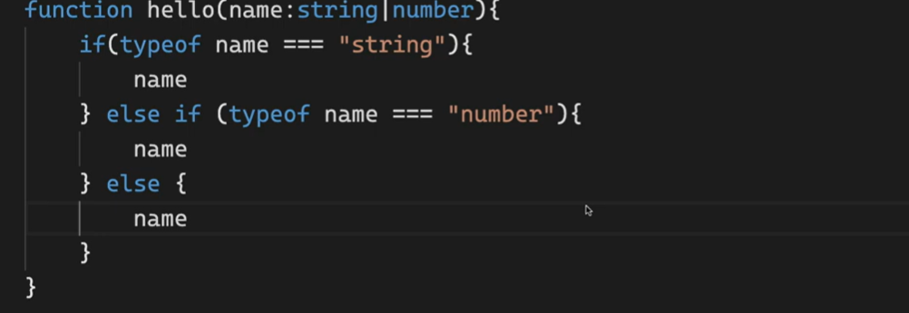

# Overview Of Typescript(2/2)

날짜: 2024년 10월 24일

# Readonly 이해하기

---

- **불변 객체 속성:** 객체의 속성이 초기화된 후 변경되지 않도록 보장하고 싶을 때 사용
    - 이는 부작용을 피하기 위해 불변성을 선호하는 함수형 프로그래밍 패러다임에서 특히 유용하다.
- **타입 안전성:** 애플리케이션이나 함수 실행 동안 일정하게 유지되어야 하는 객체를 실수로 수정하지 않도록 방지하여 타입 안전성을 유지한다.

**[전체 코드]**

```jsx
//readonly => 변수명, type명
//일단 readonly를 js에서 봤을 때 단순 array인 것을 확인할 수 있음 => 어떠한 속성도 붙지 않음
//근데 정확하게 어떨 떄를 사용하는 것인지? == 보니까 const로 선언을 해도 바꿀 수 있는데
//그 내부배열자체를 바꾸지 않기 위해 사용하는것인지?

//배열의 경우
//1. 숫자
const numbers: readonly number[] = [1,2,3,4]
numbers.push(1) //Property 'push' does not exist on type 'readonly number[]'.ts(2339)

//2. 문자열
const stirngType : readonly string[] = ['1','2','3','4']
stirngType.push('5') //Property 'push' does not exist on type 'readonly string[]'.ts(2339)
//filter과 map은 가능 => array를 바꾸지 않기 떄문 
//Q. 궁금한게 push 자체를 해도 주소값은 바뀌지 않고 배열자체가 바뀌는것이라서 뭔가 push를 해도 상관없는 것으로 아는데
//readonly도 비슷한게 아닌가? 그리고, const랑 전반적으로 무슨차이가 있는지 궁금함 

//기존 배열
const existArray :number[] = [1,2,3]

//정해진 개수 요소, 정해진 타입을 넣고자 할 떄 설정할 수 있음
const player = readonly [string, number, boolean] = ["nico", 1, true]
//그런데 만약 0번째 요소에 1을 넣고 싶다? => 타입이 string인데 될까?
player[0] = 1 //Type 'number' is not assignable to type 'string'.(2322)
player[0] = "hi"

let a :undefined = undefined //선택
let b :null = null

//any == 비어있는 값들을 쓰면 기본값이 any
//any는 typescript로 빠져나오고 싶을 때 == 아무거나 사용할 수 있음 
//typescript -> 보조장치를 잃어버림
let c = [] // any[]
//any 사용을 막기위해 추가할 수 인쓴 몇가지 규칙 
//any는 모든 것을 비활성화시킴
const d : any [] = [1,2,3,4]
const e : any = true
d+e //허용
```

## **[배열의 케이스] ⇒ `readonly` 타입 배열**

---

→ 1. 숫자 : `readonly` `타입` `배열` 

```jsx
//1. 숫자
const numbers: readonly number[] = [1,2,3,4]
numbers.push(1) //Property 'push' does not exist on type 'readonly number[]'.ts(2339)
```

→ 2. 문자열 : `readonly` `타입` `배열` 

```jsx
//2. 문자열
const stirngType : readonly string[] = ['1','2','3','4']
stirngType.push('5') //Property 'push' does not exist on type 'readonly string[]'.ts(2339)
//filter과 map은 가능 => array를 바꾸지 않기 떄문 
//Q. 궁금한게 push 자체를 해도 주소값은 바뀌지 않고 배열자체가 바뀌는것이라서 뭔가 push를 해도 상관없는 것으로 아는데
//readonly도 비슷한게 아닌가? 그리고, const랑 전반적으로 무슨차이가 있는지 궁금함 
```

- 배열의 요소를 변경하는 것 (예: **`arr = 5;`**)
- 새로운 요소를 추가하는 것 (예: **`arr.push(5);`**)
- 요소를 제거하는 것 (예: **`arr.pop();`**)
- 배열 자체를 다른 배열로 재할당하는 것도 불가능

## 정해진 요소, 정해진 개수, 정해진 타입을 넣고자할 때

---

- Type 'number' is not assignable to type 'string'.(2322)
- `readonly` `타입` `배열` 로 설정 ⇒ **`readonly` `[타입]`**

```jsx
//기존 배열
const existArray :number[] = [1,2,3]

//정해진 개수 요소, 정해진 타입을 넣고자 할 떄 설정할 수 있음
const player = readonly [string, number, boolean] = ["nico", 1, true]
//그런데 만약 0번째 요소에 1을 넣고 싶다? => 타입이 string인데 될까?
player[0] = 1 //Type 'number' is not assignable to type 'string'.(2322)
player[0] = "hi"
```

# Any : typescript를 빠져나오고 싶을 때

---

- 타입 스크립트의 보조장치를 잃어버림

```jsx
let a :undefined = undefined //선택
let b :null = null
```

- 단순 비어있는 값을 쓰면 기본값이 애니로 적용됨

```jsx
let c = [] // any[]
//any 사용을 막기위해 추가할 수 인쓴 몇가지 규칙 
//any는 모든 것을 비활성화시킴
const d : any [] = [1,2,3,4]
const e : any = true
d+e //허용
```

→ 기존 JS에서 동작되고, 타입으로 막을 수 있는 것을 막지 않는다는 뜻 

## const와 readonly 차이점

---

| **측면** | **`const`** | **`readonly`** |
| --- | --- | --- |
| **범위** | 변수 선언 | 객체 내 속성 선언 |
| **변경 가능성** | 변수 자체의 재할당을 방지 | 속성 값의 수정을 방지 |
| **사용 맥락** | 변수에 사용 | 객체 속성에 사용 |
| **동작** | 변경 가능한 객체를 포함할 수 있음 | 초기화 후 속성은 불변 |
- **`const`:** 변수의 재할당을 방지하기 위해 사용된다. 그러나 변수가 객체나 배열을 담고 있는 경우, 그 내용은 여전히 수정 가능한다. 예를 들어, **`const`** 배열에 새로운 요소를 추가하는 것은 참조를 변경하지 않기 때문에 가능하다.

```jsx
javascriptconst numbers = [1, 2, 3];
numbers.push(4); *// 허용됨, 배열 내용을 수정하지만 참조는 변경하지 않음*
```

- **`readonly`:** TypeScript에서는 객체의 속성 변경을 방지한다. 속성이 **`readonly`**로 표시되면 직접 변경할 수 없다.

```jsx
typescriptconst readonlyArray: ReadonlyArray<number> = [1, 2, 3];
*//readonlyArray.push(4); // 오류: 'push' 속성이 'readonly number[]' 타입에 존재하지 않습니다.*
```

## 개체 속성을 사용한다는 것은?

---

- 객체의 `속성(property)을 변경하거나 추가`하는 것을 의미
- **`const`** 키워드로 선언된 객체는 다른 값으로 재할당할 수 없지만, 객체의 속성은 변경할 수 있다.
⇒ 참조하는 메모리 주소를 막기 위해

```jsx
const obj = { a: 1, b: 2 };
obj.c = 3; // 새로운 속성 추가
obj.a = 4; // 기존 속성 값 변경
console.log(obj); // { a: 4, b: 2, c: 3 }

```

# Unkwon : 어떤 타입을 받을지 모르는 변수 → 사용 多

---

- 어떤 작업을 하려면 이 변수의 타입을 먼저 확인해야 하는 방식
    - 그리고 계산

```jsx
//어떤 타입인지 모르는 변수
//ex) api응답 => 모르때 unkwon
let a : unknown //어떤 작업을 하려면 이 변수의 타입을 먼저 확인해야 하는 방식
//let b = a + 1 //a가 unknown이기 떄문에 작동안됨 -- 'a' is of type 'unknown'.(18046)

//따라서 type of a 가 number인지 확인해본다면?
if (typeof a ==='number') { //범위가 숫자니까 된다
    let b = a + 1 
}
//각 타입에 맞게 확인되고 -> 변환하는 과정을 거칠 수 있음 
if (typeof a === 'string') {
    let b = a.toUpperCase() 
}
```

# void : 비어있음을 의미 → 사용 多

---

```jsx
function hello() { //void를 굳이 사용할 필요가 없음 => (method) Console.log(...data: any[]): void
    console.log('x')
}
const a = hello
a.toUpperCase() //Property 'toUpperCase' does not exist on type '() => void'.(2339)
//즉 void에 이러한 내용이 존재하지 않는다는 의미
//즉 void는 비어있음을 의미
```

# never : 함수가 절대 return하지 않음

---

```tsx
//never은 함수가 절대 return하지 않음을 의미
function hello(name:string|number):never{
    throw new Error("XXX") //오류 발생
    //type이 string이거나 number일때를 사용할 수 있음 
}
```

