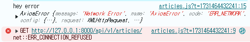
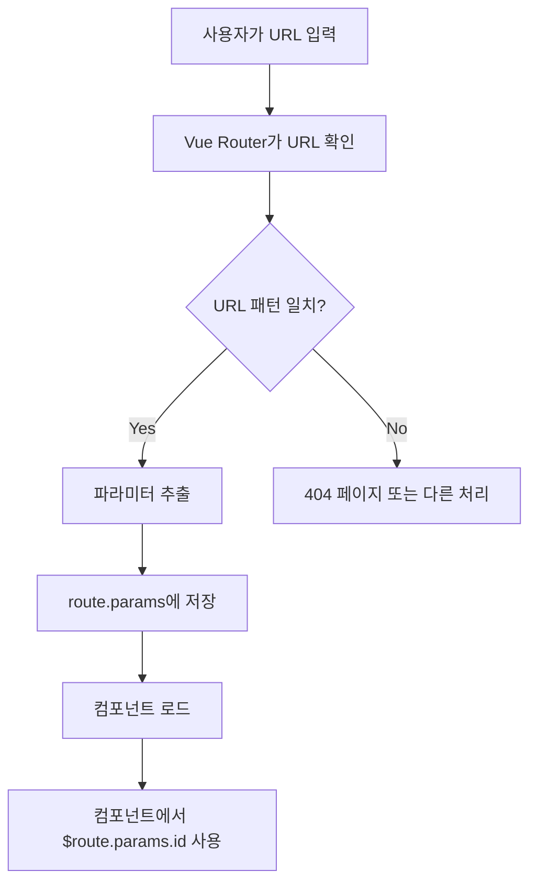
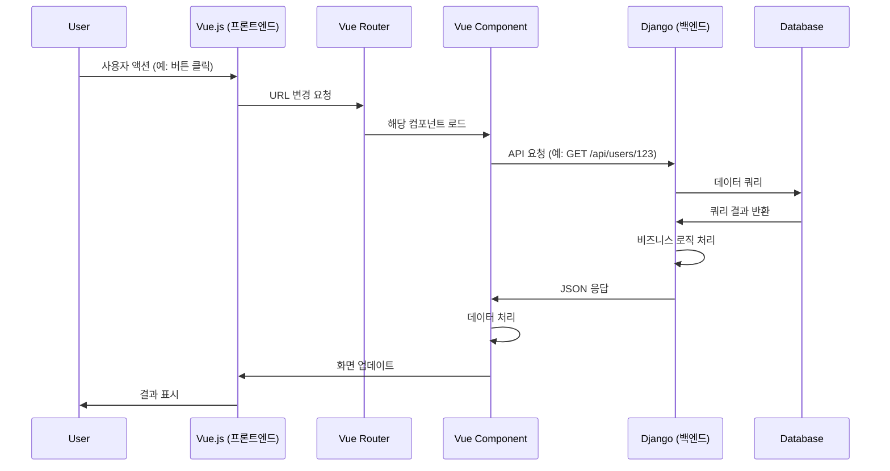

# [실습] Vue with DRF1

날짜: 2024년 11월 13일

## (구)CORS_ORIGIN_WHITELIST vs (신)CORS_ALLOWED_ORIGINS

---

CORS_ORIGIN_WHITELIST는 django-cors-headers 라이브러리의 이전 버전에서 사용되던 설정입니다. **최신 버전에서는 CORS_ALLOWED_ORIGINS로 이름이 변경**되었지만, 이전 버전과의 호환성을 위해 CORS_ORIGIN_WHITELIST도 여전히 지원됩니다.

## CORS_ALLOWED_ORIGINS 설정

귀하의 CORS_ALLOWED_ORIGINS 설정은 다음과 같습니다:

```python
CORS_ALLOWED_ORIGINS = [
    "<http://127.0.0.1:8000>",  # Django 서버 링크
    "<http://localhost:5173>"   # 프론트엔드 개발 서버 링크
]

```

이 설정에 대해 설명하겠습니다:

1. "[http://127.0.0.1:8000](http://127.0.0.1:8000/)": 이는 Django 개발 서버의 기본 주소
2. "[http://localhost:5173](http://localhost:5173/)": 이 주소는 일반적으로 Vite.js와 같은 프론트엔드 개발 도구에서 사용하는 기본 주소
    - localhost:5173은 Vite.js의 기본 개발 서버 주소 ⇒ `필요에 따라 변경 가능`

## 주의사항

1. localhost와 127.0.0.1은 기술적으로 같은 것을 가리키지만, CORS 정책에서는 다른 오리진으로 취급됩니다. 따라서 두 주소를 모두 허용하려면 둘 다 명시해야 한다.
2. CORS_ALLOW_ALL_ORIGINS = True 설정을 사용하면 모든 오리진을 허용할 수 있지만, 보안상 위험할 수 있으므로 주의

[CORS_ALLOWED_ORIGINS is allowing every localhost port](https://forum.djangoproject.com/t/cors-allowed-origins-is-allowing-every-localhost-port/21280)

# GET [http://127.0.0.1:8000/api/v1/articles/](http://127.0.0.1:8000/api/v1/articles/) net::ERR_CONNECTION_REFUSED

---



⇒ Django를 키지 않아서 에러 발생

⇒ data를 받아오지 않았으면 fixture 확인할 것

# pk값이 없으면?

---


⇒ index값 자체를 자식에게 내려줌으로써 문제 해결

```jsx
<template>
  <div>
    <button @click="moveLink">게시글 생성</button> <!--link-->
    <!--이거 linkto로 ?-->
    <ArticleListItem
    v-for="(article, index) in store.articles"
    :key="article.title"
    :article="article"
    :index="index + 1"
    />
  </div>
</template>
```

# 헷갈리는 용어 정리

---

## Axios

---

- Axios는 브라우저와 Node.js에서 사용할 수 있는 Promise 기반 HTTP 클라이언트 라이브러리
- data 값 전송:
    - P**OST, PUT 등의 요청에서 서버로 보내는 데이터를 지정할 때 사용**
    - 주로 폼 제출이나 API에 데이터를 보낼 때 사용
    - GET 요청의 경우 params로 쿼리 파라미터를 전달

<aside>
💡

**Axios는 웹 브라우저나 Node.js 환경에서 서버와 데이터를 주고받을 수 있게 해주는 도구**

</aside>

- **Axios는 마치 레스토랑에서 주문을 하고 음식을 받는 과정과 비슷**
    1. 주문(요청): 손님(클라이언트)이 웨이터(Axios)에게 음식(데이터)을 주문합니다.
    2. 전달: 웨이터가 주방(서버)에 주문을 전달합니다.
    3. 준비: 주방에서 음식을 준비합니다.
    4. 서빙(응답): 웨이터가 준비된 음식을 손님에게 가져다 줍니다.
    5. 약속(Promise): 웨이터는 음식이 준비되면 반드시 가져다주겠다고 약속합니다.

## Router 사용

---

- Vue Router를 설치하고 앱에 등록하면 전역적으로 사용 가능
- 컴포넌트 내에서 $router로 접근하거나 useRouter() 컴포저블을 사용할 수 있다.

## useRouter vs useRoute

---

- useRouter(): **라우터 인스턴스에 접근. 프로그래밍 방식의 내비게이션(push, replace 등)에 사용.**
- **useRoute(): 현재 라우트 정보에 접근. 현재 경로, 파라미터, 쿼리** 등을 가져올 때 사용.

# 출력값 오류

---


⇒ return 값으로 돌려주지 않아서 에러가 발생함

## API 서버 요청시 사용될 BASE_URL

---

- django 기본 세팅 `cros` 값 설정하기

# DetailView.vue:5 Uncaught (in promise) TypeError: Cannot read properties of null (reading 'id')

---

- null값을 먼저 읽게 되는 경우

```jsx
    <h1>할 일 상세</h1>
    <!-- <div v-if="todo"> -->
      <p>할 일 번호 : {{ todo.id }}</p>
      <p>할 일 제목 : {{ todo.work }}</p>
      <p>할 일 내용 : {{ todo.content }}</p>
      <p>할 일 상태 : {{ todo.is_completed }}</p>
      <p>할 일 생성일 : {{ todo.created_at }}</p>
    <!-- </div> -->
```

⇒ `v-if`를 통해서 문제 해결

## Route.params.id

---

- Vue Router는 라우팅 정보를 관리하는 객체를 제공하며, **이를 통해 현재 라우트의 파라미터에 접근할 수 있다.**
- `route` 객체는 Vue 컴포넌트 내에서 `$route`로 접근 가능하며, 라우트 파라미터, 쿼리 문자열, 해시 등의 정보를 포함한다.

<aside>
💡

**Route.params.id를 이해하기**

</aside>

1. **사용자가 브라우저**에서 URL을 입력하거나 **링크를 클릭 (예: '/users/123')**
2. **Vue Router가 이 URL을 확인**
3. Router는 정의된 라우트 중에서 이 URL과 일치하는 패턴을 찾음 (예: '/users/:id')
4. **URL의 일부분(여기서는 '123')을 파라미터로 인식**
5. **Router는 이 파라미터 값을 `route` 객체의 `params` 속성에 저장**
6. 해당 라우트에 연결된 컴포넌트가 로드
7. 컴포넌트 내에서 `$route.params.id`를 통해 이 값에 접근



1. 당신이 큰 호텔에 도착했습니다. (브라우저에 URL 입력)
2. 호텔 안내 데스크에 가서 방 번호를 말합니다. (Vue Router가 URL 확인)
3. 안내원이 방 번호를 확인합니다. (Router가 URL 패턴 확인)
4. 안내원이 당신의 방 번호를 기억합니다. (파라미터 추출 및 저장)
5. 안내원이 당신을 방으로 안내합니다. (컴포넌트 로드)
6. 방에 도착하면, 방 번호가 문에 적혀 있습니다. (컴포넌트에서 $[route.params.id](http://route.params.id/) 사용 가능)

**⇒ 특별히 무언가를 "내려받는" 과정 없이, Router가 이 정보를 자동으로 처리함**

## 즉 백엔드와 프론트 엔드는 어떻게 상호작용하는 걸까??

---

### Django (백엔드) 역할:

1. 데이터베이스 관리
2. API 엔드포인트 제공
3. 비즈니스 로직 처리
4. 데이터 유효성 검사 및 보안

### Vue.js (프론트엔드) 역할:

1. 사용자 인터페이스 렌더링
2. 사용자 입력 처리
3. 라우팅 (Vue Router)
4. 상태 관리 (Vuex)

### 상호작용 흐름:

1. 사용자가 Vue.js 애플리케이션에서 액션을 취함 **(예: 버튼 클릭)**
2. **Vue Router가 해당 액션에 맞는 컴포넌트를 로드**
    1. `detail page를 보여주거나 전체 list page를 보여주거나..`
3. 컴포넌트가 필요한 데이터를 Django API에 요청
    1. `페이지를 그리기 위해`선 데이터가 필요하기 때문에 그러한 부분을 요청
4. Django가 요청을 받아 처리 (데이터베이스 조회, 비즈니스 로직 실행 등)
    1. 따라서 상기 작업을 진행하기 위해서 `내부적으로 비즈니스 로직 실행`
5. Django가 처리된 데이터를 **JSON 형태로 Vue.js에 응답**
6. **Vue.js 컴포넌트가 받은 데이터를 처리하고 화면에 표시**

이를 mermaid 다이어그램으로 표현하면 다음과 같습니다:



### 핵심 포인트:

1. **분리된 책임**: **Django는 데이터 처리와 비즈니스 로직을, Vue.js는 사용자 인터페이스와 상호작용**을 담당합니다.
2. **API 기반 통신**: 두 시스템은 HTTP를 통해 JSON 형식으로 통신합니다.
3. **비동기 처리**: **Vue.js는 Django에 비동기적으로 데이터를 요청하고, 응답을 기다리는 동안 다른 작업을 수행**할 수 있다.
4. **상태 관리**: Vue.js는 Vuex를 통해 프론트엔드의 상태를 관리하며, 필요할 때 Django에 데이터를 요청
5. **라우팅**: Vue Router는 프론트엔드의 라우팅을 담당하며, Django는 `API 엔드포인트`를 제공
⇒ **서버가 클라이언트와 소통할 수 있는 특정 "접점"을 만들어 제공한다는 의미**

이 구조에서 **`route.params.id`는 Vue Router가 관리하는 파라미터로, Django에 요청을 보낼 때 사용되는 식별자 역할**을 합니다. 예를 들어**, '/users/123'이라는 URL에서 '123'은 `route.params.id`로 접근** 가능하며, **이 값을 사용해 Django API에 특정 사용자의 데이터를 요청**할 수 있습니다.

이렇게 Django와 Vue.js는 각자의 역할을 명확히 분리하면서도 효율적으로 상호작용하여 완전한 웹 애플리케이션을 구성합니다.

## store를 언제 사용하면 좋을까?

---

- **스토어(Store)는 여러 컴포넌트에서 공유해야 하는 상태를 관리할 때 주로 사용**
- Vuex나 Pinia 같은 상태 관리 라이브러리를 통해 구현되며, 애플리케이션의 전역 상태를 중앙집중식으로 관리할 수 있게 해준다.

## sop(same-origin-policy)란?

---

- SOP(Same-Origin Policy)는 웹 브라우저 보안 메커니즘으로, **한 출처(origin)에서 로드된 문서나 스크립트가 다른 출처의 리소스와 상호작용하는 것을 제한**
- 출처는 프로토콜, 도메인, 포트의 조합으로 정의
- 이 정책은 잠재적으로 악의적인 문서를 격리하여 공격 벡터를 줄이는 데 도움을 준다.

## lifecycle hook을 언제사용하면 좋을까?, 이는 무엇일까?

---

- 라이프사이클 훅은 Vue 컴포넌트의 생명주기 동안 **특정 시점에 자동으로 호출되는 함수**
- 주요 훅으로는 **`created`(컴포넌트가 생성된 후), `mounted`(DOM에 삽입된 후),** `updated`(데이터가 변경되어 DOM이 업데이트된 후), `unmounted`(컴포넌트가 제거된 후) 등이 있습니다. 이를 통해 개발자는 컴포넌트의 특정 단계에서 코드를 실행할 수 있다.

## 컴포넌트 구조화를 조금 더 이해해보기

---

- 단일 책임 원칙: **각 컴포넌트는 하나의 주요 기능에 집중**해야 합니다.
- 데이터 흐름: 부모에서 자식으로 props를 통해 데이터를 전달하고, 자식에서 부모로는 이벤트를 통해 통신합니다.
- 재사용성: 가능한 한 재사용 가능한 컴포넌트를 만들어야 합니다.
- **컨테이너/프레젠테이션 패턴: 데이터 관리와 UI 렌더링을 분리**합니다.

페이지의 메인 컴포넌트는 주로 데이터 fetching과 전체적인 레이아웃을 담당하고, 하위 컴포넌트들은 특정 UI 부분을 렌더링하는 식으로 구조화할 수 있습니다. 구체적인 구조는 애플리케이션의 복잡성과 요구사항에 따라 달라질 수 있다. ⇒ 즉 해보면서 감을 잡는게 중요