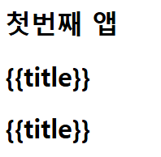

# [실습] Vue3 기본 실습

날짜: 2024년 10월 31일

[Vue.js](https://vuejs.org/)

# 페이지가 사라지는 이슈

---

```jsx
    const {createApp, ref} = Vue
    const app = createApp({
      setup() {
        //점수표 문자열 할당
        //h1에 ? 
        const title = ref('점수표')
        const avgScore = ref(null) //null할당
        const scores = [10, 20, 30, 40, 50] //임의 요소라흔ㄴ 배열 할당
        const is_vacation = ref(false) // 변수 상태 정보 담고 있음
        //키의 status값은 boolean??? => 이건 뭐임 
        const cal_average = ref(0)
        for (score of scores) {
          cal_average += score //score 등록하고
        }
        cal_average = (cal_average/scores.length) //평균 값
        return {
          title,
          avgScore,
          scores,
          is_vacation,
          cal_average //클릭하면 나오게 한다
        }
      }
    })
    app.mount('#app') //app 등록
```

## [Vue warn]: Unhandled error during execution of setup function

⇒ Uncaught TypeError: Assignment to constant variable.

---

```jsx
    const {createApp, ref} = Vue
    const app = createApp({
      setup() {
        //점수표 문자열 할당
        //h1에 ? 
        const title = ref('점수표')
        const avgScore = ref(null) //null할당
        const scores = [10, 20, 30, 40, 50] //임의 요소라흔ㄴ 배열 할당
        const is_vacation = ref(false) // 변수 상태 정보 담고 있음
        //키의 status값은 boolean??? => 이건 뭐임 
        let cal_average = function () {
          for (score of scores) {
            cal_average += score //score 등록하고
          }
          cal_average = (cal_average/scores.length) //평균 값
        } 

        return {
          title,
          avgScore,
          scores,
          is_vacation,
          cal_average //클릭하면 나오게 한다
        }
      }
    })
    app.mount('#app') //app 등록
```

⇒ 변수 할당 문제 해결했으나 값이 나오지 않음

## 평균 점수 계산 뜨지 않음

---

```jsx
    const {createApp, ref} = Vue
    const app = createApp({
      setup() {
        //점수표 문자열 할당
        //h1에 ? 
        const title = ref('점수표')
        let avgScore = ref(null) //null할당
        const scores = [10, 20, 30, 40, 50] //임의 요소라흔ㄴ 배열 할당
        const is_vacation = ref(false) // 변수 상태 정보 담고 있음
        //키의 status값은 boolean??? => 이건 뭐임 
        const cal_average = function () {
          for (score of scores) {
            avgScore += score //score 등록하고
          }
          avgScore = (avgScore/scores.length) //평균 값
          console.log(avgScore)
        } 
        return {
          title,
          avgScore,
          scores,
          is_vacation,
          cal_average //클릭하면 나오게 한다
        }
      }
    })
    app.mount('#app') //app 등록
```

<aside>
💡

**수정 사항**

</aside>

- `.value` 의 문제

```jsx
    const {createApp, ref} = Vue
    const app = createApp({
      setup() {
        //점수표 문자열 할당
        //h1에 ? 
        const title = ref('점수표')
        let avgScore = ref(null) //null

        const scores = ref([10, 20, 30, 40, 50]) //임의 요소라흔ㄴ 배열 할당
        const is_vacation = ref(false) // 변수 상태 정보 담고 있음
        //키의 status값은 boolean??? => 이건 뭐임 
        const cal_average = function () {
          let total = 0
          for (const score of scores.value) {
            total += score //score 등록하고
          }
          avgScore.value = (total/scores.value.length) //평균 값 => 평균 값 value자체에 대입해야한다!!!
          console.log(avgScore.value)
        }
        return {
          title,
          avgScore,
          scores,
          is_vacation,
          cal_average //클릭하면 나오게 한다
        }
      }
    })
    app.mount('#app') //app 등록
```

⇒ f12로 에러 확인하고, `value값` 확인

# vue `객체` 선언 구조 이해하기

---

<aside>
💡

1. `const {createApp, ref} = Vue`를 처음에 쓰는 이유
</aside>

- **Vue 객체**에서 `createApp`과 `ref` 함수를 구조 분해 할당으로 추출하는 것
    - 이렇게 하면 `Vue.createApp` 대신 `createApp`으로, `Vue.ref` 대신 `ref`로 간단히 사용

<aside>
💡

**`createApp`이 div에 실행 되는지에 대한 질문**

</aside>

- `createApp`은 Vue 애플리케이션 **인스턴스를 생성하는 함수**
- 이 시점에서는 아직 특정 DOM 요소에 연결되지 않는다.
- **실제로 DOM에 연결되는 것은 `mount` 메서드를 호출할 때**

<aside>
💡

`app.mount('#app')`에서 `#app`이 가리키는 것

</aside>

- `#app`은 id가 'app'인 DOM 요소를 선택하는 CSS 선택자
- 이 명령은 Vue 애플리케이션을 해당 DOM 요소에 마운트(연결)한다.

<aside>
💡

`setup()` 함수는 Vue 3의 Composition API의 일부로, 컴포넌트의 로직을 정의하는 곳

</aside>

- 이 코드는 기본적인 Vue 3 애플리케이션을 설정하고, 반응형 메시지를 생성한 후, 이를 DOM에 마운트하는 과정을 보여준다.
- `ref`는 반응형 참조를 생성하는 함수
    - `message`는 반응형 변수가 되어, 값이 변경될 때 자동으로 뷰를 업데이트한다.
- `return { message }`는 템플릿에서 사용할 수 있도록 `message`를 노출시킨다.

# Vue ⇒ Const 내부 변수 값 변경

---

```jsx
    const { createApp, ref } = Vue
    //정수가 0을 가지고 있는 반응형 변수 count를 선언ㅇ
    const app = createApp({
      setup() {
        const count = ref(0) // 정수 0을 가지는 반은형 변수 count => let선언 여부?
        console.log(count) //일단 이것 확인하고
        //h1의 콘텐츠로 랜더링 된다.
        //함수 increment선언
        const increment = function () { //함수 선언 : 이벤트함수같은 것
          //+ 버튼을 누르면 호출된다. => BUTTON이 2개  
          count.value += 1 //count가 증가 한다.
        } 
```

## `const` 사용 이유

---

<aside>
💡

 `ref`로 생성된 **객체는 내부 값(`value` 속성)을 추적**하고, 이 값이 변경될 때 
관련된 컴포넌트를 자동으로 업데이트

</aside>

- `count`는 `ref` **객체 자체를 참조하는 변수**
- 이 참조는 변경되지 않기 때문에 `const`로 선언한다. ⇒ 변수 자체는 바뀌지 않음**(x001 : 주소값)**
    - **하지만 참조값은 변경할 수 있음 ⇒ `ref` 객체 자체는 변경되지 않기 때문에 내부 값만 변경**

```jsx
const count = ref(0)
console.log(count.value) // 0 출력
count.value++ // 값 증가
console.log(count.value) // 1 출력

```

이 방식은 Vue 3의 반응형 시스템의 핵심 개념

# vue.global.js:2260 [Vue warn]: Unhandled error during execution of render function at <App>

---

```jsx
  <div id="app">
    <h1>User Profile</h1>
    <p>Name: {{user.value.name}}</p>
    <p>Age: {{user.value.age}}</p>
    <button>Change Name</button>
    <button>Change Age</button>
  </div>
```

```jsx
    const app = createApp({ 
      setup() {
        const user = ref({ //ref 자체가 객체일 것 
          name: 'Alice',
          age: 30
        })
        console.log(user) // RefImpl => refer type 객체를 가리키는 것인가?
        console.log(user.value) //proxy => proxy가 뭔지?
        console.log(user.value.name)
        return {
          user
        }
      }
    })
```

⇒ 단순 [user.name](http://user.name) 출력시 문제해결 가능

# vue.global.js:2260 [Vue warn]: Wrong type passed as event handler to onClick - did you forget @ or : in front of your prop? Expected function or array of functions, received type string. at <App>

---

⇒ 이벤트 바인딩에 `@` 또는 `:` 접두사를 사용하지 않았을 수 있다는 것

```jsx
  <div id="app">
    <h1>User Profile</h1>
    <p>Name: {{user.name}}</p> <!--궁금한게 여기서는 refertype user로 보냇는데
    왜 그냥 바로 값이 나와지는 것인지 궁금함-->
    <p>Age: {{user.age}}</p>
    <button v-on:click="clientText">Change Name</button> <!--버튼을 누르면 호출됨-->
    <button v-on:click="">Change Age</button>
  </div>
```

```jsx
    const { createApp, ref } = Vue

    const app = createApp({ 
      setup() {
        const user = ref({ //ref 자체가 객체일 것 
          name: 'Alice',
          age: 30
        })
        //자체적으로 값은 나오는데 
        // console.log(user) // RefImpl => refer type 객체를 가리키는 것인가?
        // console.log(user.value) //proxy => proxy가 뭔지?
        // console.log(user.value.name)
        //v.onclick을 누르면 사용자가 텍스트를 입력할 수 있도록 안내하는 메세지 창을 띄움
        
        const clientText = prompt('Enter new name:')
        const message = ref({ //refer 자체가 객체니까..
          
        })
        return {
          user,
          clientText
        }
      }
    })
    app.mount('#app')
```

⇒ Vue에서 발생한 경고 메시지는 이벤트 핸들러를 잘못 설정했다는 것

⇒  Vue에서 이벤트 핸들러는 메서드나 인라인 함수

## 인라인 함수란? ⇒ JS, python에서 명시적인 인라인 함수는 X

---

- 함수 호출 시 별도의 점프 없이 호출 부분에 함수 코드 전체가 삽입되어 컴파일되는 것

### 자바스크립트 예시

---

```jsx
// 일반적인 함수 정의
function normalAdd(a, b) {
    return a + b;
}

// 인라인 함수와 유사한 개념 **(화살표 함수 사용)**
const inlineAdd = (a, b) => a + b;

console.log(normalAdd(5, 3));  // 출력: 8
console.log(inlineAdd(5, 3));  // 출력: 8

```

### 파이썬 예시

---

```python
# 일반적인 함수 정의
def normal_add(a, b):
    return a + b

# 인라인 함수와 유사한 개념 (lambda 함수 사용)
inline_add = lambda a, b: a + b

print(normal_add(5, 3))  # 출력: 8
print(inline_add(5, 3))  # 출력: 8

```

## vue에서 사용하는 이벤트 핸들러 이해하기
⇒ `@click` Vs `v-on:click`

---

1. **@click (단축 문법) : 현대적인 Vue 코드에서 더 흔하게 사용**
    
    ```jsx
    <button @click="handleClick">클릭하세요</button>
    
    ```
    
2. v-on:click (전체 문법)
    
    ```jsx
    <button v-on:click="handleClick">클릭하세요</button>
    
    ```
    

# Vue 템플릿 → `ref` 언래핑

---

| 특성 | 템플릿 (HTML) | 스크립트 (JavaScript) |
| --- | --- | --- |
| 접근 방식 | `user.name` | `user.value.name` |
| `.value` 사용 | **자동 언래핑 (불필요)** | **명시적으로 필요** |
| 이유 | 편의성, 가독성 향상 | JavaScript의 일반적인 동작 유지 |
| 반응성 | 자동으로 추적 | 수동으로 `.value` 사용하여 접근 |
| 적용 범위 | **`최상위` 속성에만 적용** | **모든 `ref` 사용에 적용** |
- 템플릿에서는 편의성을 위해 자동 언래핑이 이루어진다.
- 스크립트에서는 명시적으로 `.value`를 사용해야 한다.

## 템플릿에서의 ref 동작

---

Vue 템플릿에서는 `ref`로 감싼 값을 자동으로 "언래핑(unwrapping)"한다. 

이는 템플릿에서 `ref` 값에 접근할 때 `.value`를 사용할 필요가 없다는 것을 의미한다.

```html
<p>Name: {{user.name}}</p>
<p>Age: {{user.age}}</p>
```

위의 코드에서 Vue는 자**동으로 `user` ref의 `.value`에 접근**하여 그 내부의 `name`과 `age` 속성을 가져온다.

## 스크립트에서의 ref 동작

---

- JavaScript 코드 내에서는 `ref` 값에 접근할 때 명시적으로 `.value`를 사용해야 한다.

```jsx
console.log(user.value.name)

```

### 왜 이런 차이가 있는가?

---

1. **편의성**: 템플릿에서 자주 사용되는 값들에 대해 매번 `.value`를 붙이는 것은 번거로울 수 있다. Vue는 이를 자동화하여 개발자의 편의성을 높였다.
2. **반응성 추적**: Vue는 템플릿 내에서 사용되는 **`ref` 값들을 자동으로 추적**하여 반응성을 유지한다. 이 과정에서 `.value`를 자동으로 처리한다.
3. **일관성**: 템플릿에서는 `ref`뿐만 아니라 다른 **반응형 데이터(예: `reactive`)도 동일한 방식으로 접근할 수 있게 되어 일관성이 유지**된다.

# vue.global.js:2260 [Vue warn]: Property "title" was accessed during render but is not defined on instance.

---

```jsx
    const {createApp, ref} = Vue
    const firstApp = createApp({
      setup() {
        const title = ref('첫번째 앱')
      }
    })
    firstApp.mount('#firstApp')
    const secondApp = createApp({
      setup() {
        const title = ref('두번째 앱')
      }
    })
    secondApp.mount('#secondApp')
    const thirApp = createApp({
      setup() {
        const title = ref('세번째 앱')
      }
    })
    thirApp.mount('#thirdApp')

```

→ return 값이 없다. == `render`

## 다소 비효율적으로 보여짐

---

```jsx
const { createApp, ref } = Vue

const appData = [
  { id: 'firstApp', title: '첫번째 앱' },
  { id: 'secondApp', title: '두번째 앱' },
  { id: 'thirdApp', title: '세번째 앱' }
]

appData.forEach(({ id, title }) => {
  const app = createApp({ //앱 자체를 등록할때 => createApp 기존과 동일
    setup() {
      return {
        title: ref(title) //title의 값만 돌려주는 것
      }
    }
  })
  app.mount(`#${id}`) //mount자체를 foreach로 묶어버림 
})
```

<aside>
💡

**상기 코드 해석 + 이해하기 ⇒ foreach구문**

</aside>

**[forEach구문]**

```jsx
appData.forEach(({ id, title }) => { //배열의 각 요소에 대해 주어진 함수 실행
//함수의 매개변수에서 각각 id와 title추출 => 각 반복에서 id와 title값을 직접 사용가능
  // 코드
})
```

1. `appData` 배열: 각 객체는 `id`(**앱을 마운트**할 HTML 요소의 id)와 `title`(**앱의 제목**)
2. `forEach` 메서드: 각 요소에 대해 주어진 함수를 실행
⇒ 여기서는 `appData` 배열의 각 객체에 대해 앱을 생성하고 마운트하는 작업을 수행
3. 구조 분해 할당 `({ id, title })`: 이는 ES6의 구조 분해 할당 문법
⇒ `appData` 배열의 각 객체에서 `id`와 `title` 속성을 추출하여 별도의 변수로 사용
4. 앱 생성 및 마운트:
    
    ```jsx
    const app = createApp({
      setup() {
        return {
          title: ref(title)
        }
      }
    })
    app.mount(`#${id}`)
    
    ```
    

## ⚠️직접 찍어보기 ⇒ 계속적 연습 필요

---

```jsx
    const {createApp, ref} = Vue
    const appList = [
      {id : 'firstApp', title : '첫번째 앱'},
      {id : 'SecondApp', title : '두번째 앱'},
      {id : 'ThirdApp', title : '세번째 앱'},
    ]

    appList.forEach((myApp) => {
      const app = createApp({
        setup() { //등록
          return {
            //title 자체를 줄 것
            title : ref(myApp.title) // title 정보 자체를 준다.
          }
        }
      })
      app.mount(`#${myApp.id}`) //App하나씩을 등록하는 것 => 근데 앱 아이디니까
    })
```



⇒ 결과는 바인딩 에러

## forEach문 이해하기

---

```jsx
array.forEach(callback(currentValue [, index [, array]])[, thisArg])

```

- `callback`: **각 요소에 대해 실행할 함수**
- **`currentValue`: 처리할 현재 요소**
- `index` (선택적): 처리할 현재 요소의 인덱스
- `array` (선택적): forEach()를 호출한 배열
- `thisArg` (선택적): callback을 실행할 때 this로 사용할 값

**[기본 사용]**

```jsx
const fruits = ['apple', 'banana', 'cherry'];
fruits.forEach(fruit => { //fruit는 fruits의 하나하나 => forEach함수 == 배열사용
  console.log(fruit);
});
// 출력:
// apple
// banana
// cherry

```

**[인덱스 사용]**

```jsx
const numbers = [1, 2, 3, 4, 5];
numbers.forEach((number, index) => {
  console.log(`Index ${index}: ${number}`);
});
// 출력:
// Index 0: 1
// Index 1: 2
// Index 2: 3
// Index 3: 4
// Index 4: 5

```

**[원본 배열 참조]**

```jsx
const letters = ['a', 'b', 'c'];
letters.forEach((letter, index, array) => {
  console.log(`${letter} is at index ${index} in ${array}`);
});
// 출력:
// a is at index 0 in a,b,c
// b is at index 1 in a,b,c
// c is at index 2 in a,b,c

```

**[객체 배열 처리]**

```jsx
const people = [
  { name: 'Alice', age: 25 },
  { name: 'Bob', age: 30 },
  { name: 'Charlie', age: 35 }
];

people.forEach(person => { //people이라는 배열에서 
  console.log(`${person.name} is ${person.age} years old`); //객체 하나씩 뽑는다.
});
// 출력:
// Alice is 25 years old
// Bob is 30 years old
// Charlie is 35 years old

```

# vue.global.js:2260 [Vue warn]: Unhandled error during execution of setup function

---

```jsx
  <script src="https://unpkg.com/vue@3/dist/vue.global.js"></script>
  <script>
    const {createApp, ref} = Vue
    const app = createApp({
      setup() {
        //임의의 정수 할당
        const width = ref(5)
        const height = ref(6)
        const squareSide = ref(7) //정사각형 한변의 길이 
        //사각형의 넓이 둘레를 계산하여 템플릿에 렌더링
        return {
          width,
          heigth,
          squareSide
        }
      }
    })
    app.mount('#app')
```

# Failed to load resource: net::ERR_FILE_NOT_FOUND

---

```jsx
    const {createApp, ref} = Vue
    const app = createApp({
      //students배열을 앱 인스턴스 내부에 정의한다.
      setup() {
        //ref로 받지 않아도 되는지?
        const students = ref(['홍길동', '이춘향', '금나래', '장보고', '임꺽정', '강감찬'])
        const shuffle = function() {
          students.shuffle
        }
        return {
          students //return => button을 누르면 실행되도록
        }
      }
    })
```

⇒ mount 등록을 일단 하지 않은 것으로 확인됨

⇒ 출력은 되나 shuffle이 정확하게 이루어지지 않음

# file:///C:/Users/SSAFY/Desktop/n/%EC%8B%A4%EC%8A%B5/vue_ws_1_5/lodash.js net::ERR_FILE_NOT_FOUND

---