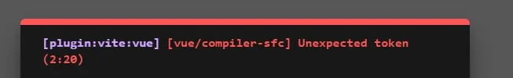
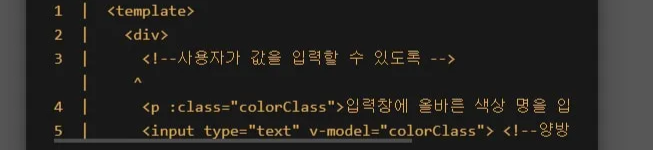
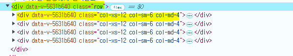

# [실습] Single-File Component

날짜: 2024년 11월 6일

# import 경로 → component 이름을 바꿨으나 이전 이름이 실행되는 이유

---

1. **VSCode 캐시 문제**:
    - 만약 VSCode가 이전 파일 이름을 캐시하고 있어서 문제가 지속된다면, VSCode를 재시작하거나 Vue Language Server를 재시작
    - `Ctrl + Shift + P`를 눌러 "Restart Vue Language Server"를 검색한 후 실행하면 된다.
2. **파일 시스템의 대소문자 구분**:
    - Windows나 macOS에서는 대소문자를 구분하지 않지만, Linux와 같은 서버 환경에서는 대소문자를 구분한다. 서버 환경에서도 동일한 문제가 발생할 수 있으니 주의

# 하위 Component는 div안에서 어떤식으로 사용되나요?

---

```jsx
<div> 
<h2>MyComponent</h2>
<MyComponentItem /> 
</div>
```

1. 재사용성: `<MyComponentItem />` 같은 컴포넌트를 여러 곳에서 재사용할 수 있다. 
한 번 정의하고 여러 번 사용할 수 있어 코드 중복을 줄일 수 있다.
2. 계층 구조: 컴포넌트를 중첩하여 복잡한 UI를 더 작고 관리하기 쉬운 부분으로 나눌 수 있다. 
이는 `<MyComponent>` 안에 `<MyComponentItem />`을 포함시키는 것처럼 계층적 구조를 만들 수 있다.
3. 캡슐화: 각 컴포넌트는 자체적인 로직, 상태, 스타일을 가질 수 있어 관련 코드를 하나의 단위로 묶을 수 있다.

# 스타일 영향 → 최상위 컴포넌트 : scope 적용시

---

<aside>
💡

**특정 스타일은 최상위 요소에만 적용이 된다. (내부 기능적 요소)
⇒ 내부의 엘리먼트에는 직접적인 영향을 주지 않는다.** 

</aside>

트의 스타일은 기본적으로 자식 컴포넌트의 루트 요소에만 영향을 미친다.

```html
<!-- App.vue -->
<template>
  <h1>App.vue</h1>
  <MyComponent />
</template>

<style scoped>
div { border: 1px solid red; }
</style>

<!-- MyComponent.vue -->
<template>
  <div>
    <h2>MyComponent</h2>
    <MyComponentItem />
  </div>
</template>

```

- `깊은 선택자(>>>나 /deep/)`를 사용하면 자식 컴포넌트의 내부 요소에도 스타일을 적용할 수 있지만, 이는 컴포넌트 캡슐화를 깨뜨릴 수 있으므로 주의해서 사용해야 한다.

# npm 프로젝트 들어가고, install을 하지 않으면 발생하는 에러 :  $ vite 'vite'은(는) 내부 또는 외부 명령, 실행할 수 있는 프로그램, 또는 배치 파일이 아닙니다.

---

[[Vite Error] Vite 프로젝트, yarn dev, yarn start, yarn run 실행 오류](https://velog.io/@hying/vite-%ED%94%84%EB%A1%9C%EC%A0%9D%ED%8A%B8-yarn-dev-yarn-start-yarn-run-%EC%8B%A4%ED%96%89-%EC%98%A4%EB%A5%98)

# Unhandled error during execution of setup function at <ColorChanger> at <App>
⇒ Vue is not defined

---

<aside>
💡

- `<script setup>`에서는 전역 Vue 객체에 직접 접근할 수 없다
    - 필요한 API를 개별적으로 가져오는 것이 권장된다
    : `import { ref, reactive, computed } from 'vue'`
</aside>

[app.vue]

```html
<template>
  <ColorChanger />
</template>

<script setup>
  import ColorChanger from '@/components/ColorChanger.vue';
</script>

<style scoped>

</style>

```

[colorChanger.vue]

```html
<template>
  <div>
    <!--사용자가 값을 입력할 수 있도록 -->
    <p>입력창에 올바른 색상 명을 입력하면 글자색이 바껴요.</p>
    <input type="text" v-model="colorClass"> <!--양방향 바인딩-->
  </div>
</template>

<script setup>
  const {ref} = Vue
  const colorClass = ref('') //이 속성에 값을 넣는 것

</script>

<style  scoped>
.red {
  color : red;
}
.blue {
  color : blue;
}
.green {
  color : green;
}
</style>
```

`<script setup>`에서 Vue의 API를 가져오는 방식에 대해 설명해 드리겠습니다:

# Unexpected token

---

- **문법 오류**나 **잘못된 구문**이 있을 때 사용됨
- **에러 위치**: **`2:20`** 부분에서 문제가 발생했다고 나와 있습니다. 즉, **2번째 줄의 20번째 문자** 근처에서 문제가 있다는 뜻





**⇒ 코드를 보니까 vue import를 잘못했다.**

```jsx
import {ref} from 'vue' //vue를 문자열로 표기해야 함
```

# 부트스트랩 레이아웃이 먹지 않은 이유

---

⇒ 개발자 모드에서 html 구조 확인



- row밑에서 4개의 For문이 돌아야 함

**[부트스트랩을 활용]**

```jsx
    <header class="sticky-top p-3 d-flex justify-content-center align-items-center bg-success-subtle">
      <h1>My Gallery</h1>
    </header>
```

- 1페이지에 모두 담고 싶을 때 ⇒ xs-12 이런식으로 써야 함

```jsx
      <div class="row">
        <div v-for="index in numberOfItems" :key="index" class="col-xs-12 col-sm-6 col-md-4"> <!--이 요소 4개 만들어야 함-->
          <MyComponentItem />
        </div>
      </div>
```

⇒ div 를 밖에 꺼내고 안에서 for문을 돌리는 이유는 f12 개발자 모드를 통해 확인할 수 있다.

# v-for문 사용 : 부트스트랩에서 이해해보기

---

- `v-for` 디렉티브는 **배열이나 객체를 기반으로 항목을 반복적으로 렌더링**할 때 사용

```
v-for="index in numberOfItems"

```

이 구문은 1부터 `numberOfItems`까지의 숫자를 반복

## key 속성

---

`:key="index"`는 각 반복 항목에 고유한 키를 제공

## index를 key로 사용하는 이유 
⇒  이 경우, **`index`**는 단순히 현재 반복 횟수를 나타내는 변수명 (자유롭게 선택 가능)

---

1. **고정된 반복 횟수**: `numberOfItems`는 변하지 않는 값일 가능성이 높다.
2. **단순한 컴포넌트**: `MyComponentItem`은 내부 상태가 없는 단순한 컴포넌트일 가능성이 있다.
3. **순서 변경 없음**: 이 리스트는 순서가 변경되거나 항목이 추가/제거될 가능성이 낮다.

## 대안 : ?

더 안전한 접근 방식은 다음과 같습니다:

```
<div v-for="index in numberOfItems" :key="`item-${index}`" class="col-xs-12 col-sm-6 col-md-4">
  <MyComponentItem />
</div>

```

이 방식은 각 항목에 고유한 문자열 키를 제공하여 잠재적인 문제를 방지할 수 있습니다[4].

Vue는 `v-for` 디렉티브를 사용할 때 자동으로 현재 반복 중인 항목의 인덱스를 제공합니다. 이것이 `index`가 자동으로 인식되는 이유입니다. 이 기능은 Vue의 템플릿 시스템에 내장되어 있어 매우 편리하게 사용할 수 있습니다.

# 출력값 오류

---

⇒ APP에 모두 출력한 상태


⇒ 나눠서 출력한 상태


<aside>
💡

**수정 사항**

</aside>

⇒ main화면에 리스트 출력하면 해결할 수 있음

# 출력값 오류

---


```jsx
<template>
  <div>
    <h2>가수 이름</h2>
    
    <p>가수 소개글</p>
  </div>
</template>

<script setup>

</script>

<style  scoped>
  img {
    /* border: 1px solid black; */
    border-radius: 50%;
    width : 200px;
    height: 200px;
  }
  div {
    border: 1px solid black; /*원하는 라인에*/
    text-align: center;
    /* display: flex;
    flex-direction:column;
    justify-content:center;
    align-items: center; */

  }
</style>
```

<aside>
💡

**수정 사항**

</aside>

```jsx
  div {
    border: 1px solid black; /*원하는 라인에*/
    width: 800px;
    height: 500px;
    /* text-align: center; */
    display: flex;
    flex-direction:column; /* 내부적으로 설정 */
    justify-content:center;
    align-items: center;

  }
```