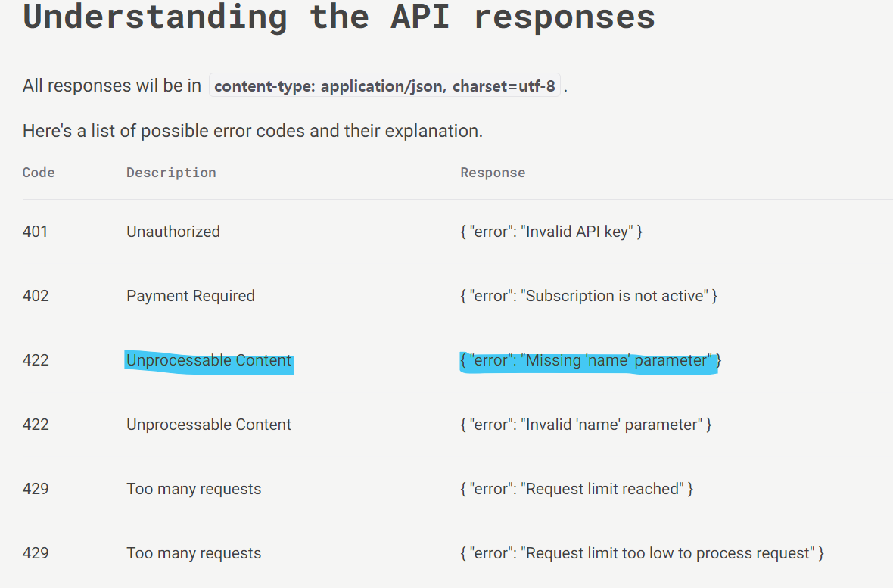

# [실습] JS 비동기 이해하기

날짜: 2024년 10월 29일

# const의 특성 고려하기

---

<aside>
💡

h2Tag.textContent를 변경하는 것은 h2Tag 변수 자체를 변경하는 것이 아니라, 
h2Tag가 `참조하는 객체의 속성을 변경하는 것`이므로 허용된다.

⇒ **메모리 관점**: `h2Tag 변수는 메모리 주소`를 가리키고 있다. 
     const는 이 주소 자체를 변경하지 못하게 한다. ⇒ `주소에 있는 데이터의 변경은 허용`

</aside>

**[const의 특성]**

1. const로 선언된 변수는 재할당이 불가능
2. 하지만 const로 선언된 `객체나 배열의 **내부 속성은 변경**`할 수 있음

# Axios 이해하기

---

<aside>
💡

Axios는 브라우저와 Node.js에서 사용할 수 있는 `Promise 기반의 HTTP 클라이언트 **라이브러리**`다. ⇒ **서버와 데이터를 주고받을 때 사용하는 도구 : api**

</aside>

## Axios 언제 사용하는 가?

---

- **웹 API 호출**: `외부 서버에서 데이터를 가져올` 때 사용
- **데이터 전송**: 서버에 데이터를 `보낼 때` 사용
- **`비동기 작업`**: 페이지 `새로고침 없이 데이터를 주고받을 때` 사용

## 이벤트 리스너로 등록되는 콜백함수, 직접 Axios를 사용할 수 없는 이유

---

- 콜백 함수는 클릭 이벤트가 발생할 때마다 실행되어야 한다.
- Axios 호출 자체는 비동기 작업이므로, 함수 내에서 처리해야 한다.

## 비동기 : `여러 작업을 동시에 처리할 수 있게 해주는 방식`

---

1. `여러 작업을 동시에 처리할 수 있게 해주는 프로그래밍 방식`이다.
2. 한 작업이 완료되기를 기다리지 않고 다른 작업을 시작할 수 있다.

<aside>
💡

예시 : 레스토랑에서 음식을 주문하는 상황

</aside>

1. 동기적 방식:
    - 첫 번째 손님이 주문하고 음식이 나올 때까지 기다린다.
    - 첫 번째 손님의 음식이 나온 후에야 두 번째 손님이 주문할 수 있다.
2. 비동기적 방식:
    - 여러 손님이 동시에 주문할 수 있다.
    - 주방에서는 여러 주문을 동시에 처리한다.
    - 음식이 준비되는 대로 각 손님에게 제공된다.

## Axios 파라미터

---

- Axios 호출 시 파라미터는 필요에 따라 추가할 수 있다.

```jsx
axios({
  method: 'get',
  url: '<https://api.example.com/data>',
  params: { id: 123 }  // URL 파라미터 -> url 쿼리 문자열로 보낼 데이터
  data: { name: 'John' }  // 요청 본문 데이터
})

```

## 실제 사용 예시

---

- 코드는 버튼 클릭 시 랜덤 강아지 이미지 URL을 가져온다.

```jsx
const clickBtn = async () => { //async : 비동기 함수로 선언하는 키워드(항상 promise 반환)
  try {
    const response = await axios({ //async 함수 내에서만 await 사용 가능 
    //await는 promise가 처리될 때 까지 함수의 실행을 일시 중지
    //promise의 결과를 반환
    //then 속성을 사용하지 않고 async/awiat 구문 사용 -> 더 동기적인 스타일로 작성 가능
      method: 'get',
      url: '<https://dog.ceo/api/breeds/image/random>'
    });
    const imageUrl = response.data.message;
    const imgElement = document.createElement('img');
    imgElement.src = imageUrl;
    document.body.appendChild(imgElement);
  } catch (error) {
    console.error('Error:', error);
  }
};
//then보다 더 효과적
```

- **구조 이해하기 (참고)**
    1. 화살표 함수와 `async`:
        
        ```jsx
        const clickBtn = async () => {
          // 함수 내용
        };
        
        ```
        
        여기서 `async`는 화살표 함수 앞에 붙어 이 함수를 비동기 함수로 만든다.
        
        ```jsx
        async function clickBtn() {
          // 함수 내용
        }
        
        ```
        
    2. `await`의 사용:
    `await`는 `async` 함수 내에서만 사용할 수 있다.
    
    1. **Promise란? : Promise는 `비동기 작업의 최종 완료 또는 실패를 나타내는 객체`다.** 
    간단히 말해, "나중에 완료될 것을 약속하는" 객체다.
        
        Promise의 세 가지 상태:
        
        - 대기(pending): 초기 상태, 이행되거나 거부되지 않은 상태
        - **이행(fulfilled): 작업이 성공적으로 완료됨**
        - **거부(rejected): 작업이 실패함**
    
    1. `async/await`와 Promise의 관계: `async/await`는 Promise를 더 쉽게 다루기 위한 문법
     `async` 함수는 항상 Promise를 반환하며, `await`는 Promise가 처리될 때까지 기다린다.
        
        ```jsx
        async function fetchData() {
          try {
            const response = await fetch('<https://api.example.com/data>');
            const data = await response.json();
            console.log(data);
          } catch (error) {
            console.error('Error:', error);
          }
        }
        
        ```
        
        이 코드는 다음 Promise 체인과 동일하다.
        
        ```jsx
        function fetchData() {
          return fetch('<https://api.example.com/data>')
            .then(response => response.json())
            .then(data => {
              console.log(data);
            })
            .catch(error => {
              console.error('Error:', error);
            });
        }
        
        ```
        
    
    `async/await`를 사용하면 비동기 코드를 마치 동기 코드처럼 작성할 수 있어, 가독성이 좋아지고 에러 처리가 더 쉬워진다.
    

## axios 구조

---

```jsx
axios.get('https://api.example.com/data')
  .then(function (response) { //응답을 받았을 때 실행되는 코드
    // 성공적으로 응답을 받았을 때 실행되는 코드
    console.log(response.data);
  })
  .catch(function (error) {
    // 오류가 발생했을 때 실행되는 코드
    console.error('Error:', error);
  })
  
  
//  .finally(function () {
    // 성공하든 실패하든 항상 실행되는 코드
//    console.log('Request completed');
//  });
```

## axios value값 에러 ⇒ Uncaught ReferenceError: value is not defined

---

```jsx
    const promiseObj = axios({
      method : 'get',
      url : 'https://api.agify.io?name=value?age=value', //주석 가져오기
      params : {
        name : name, //value가 define 되지 않음
        value : value
      }

    })
```

<aside>
💡

**수정 내용**

</aside>

```jsx
    const promiseObj = axios({
      method : 'get',
      url : 'https://api.agify.io?name=name?age=value', //주석 가져오기
      params : {
        name : 'name', //문자열로 해당 값을 받아올 수 있도록 한다.
        age : 'value'
      }
```

# index.html:61 Uncaught TypeError: document.createSelector is not a function

---

```jsx
    const promiseObj = axios({
      method : 'get',
      url : 'https://api.agify.io?name=name?age=value', //주석 가져오기
      params : {
        name : 'name', //value가 define 되지 않음
        age : 'age'
      }
    })

    // form 태그
    const form = document.querySelector('form')
    // name이 "name"인 input 태그
    const nameInput = document.querySelector('[name="name"]')
    // api로 받아온 데이터를 보여줄 영역
    const section = document.querySelector('section')

    form.addEventListener('submit', (event) => {
      event.preventDefault()
      const name = nameInput.value //input안에 value를 따와서 name을 넣는다.

      const nameP = document.createElement('p')
      // 내용 입력
      nameP.textContent = `제 이름은 : ${name} 입니다.` //ptage 생성하고
      
      // input tag 초기화
      nameInput.value = ''

      // 이름 정보 section에 추가
      section.appendChild(nameP

      const age = Math.floor(Math.random() * 45 + 1) //1부터 랜덤하게 만들기
      console.log(age)
      const ageP = document.createSelector('p') //pTag 생성
      agep.textContent = `제 나이는 : ${age}입니다.`
      section.appendChild(ageP)
      
    })
```

⇒ tag Error 발생 : 근데 현재 상태에서는 같이 출력되는 문제

## axios 요청 구조 이해하기 ⇒ axios의 데이터에 접근하는 것 잊지말기

---

<aside>
💡

**params 이해하기 : URL에 추가될 쿼리 파라미터**

</aside>

- API는 쿼리 파라미터를 자동으로 처리하므로, 기본 URL만 제공하고 **`params`** 객체를 통해 파라미터를 전달하는 것이 올바른 방법

```jsx
//method랑 url은 원래 기본 요소로 받아들여지는 것
const promiseObj = axios({
  method: 'get',
  url: 'https://api.agify.io', //요청을 보낼 API의 기본 URL 
  params: { //API는 쿼리 파라미터를 자동으로 처리함
    name: name // URL에 추가될 쿼리 파라미터 == 위에서 받은 변수명으로 사용해도 무방함
    //이거는 https://api.agify.io?name=입력한이름로 변환될 것
  }
})
```

## .catch 블록이 작동할 때

---

- `API 요청 자체가 실패`할때만 `catch()` 블록 실행

## response.data.age 사용 이유

---

```jsx
const age = response.data.age || Math.floor(Math.random() * 45 + 1);
```

- **`response.data`**: axios는 서버 응답의 본문을 **`data`** 속성에 저장
- **`response.data.age`**: **API가 반환한** 나이 값에 접근
    - API가 항상 나이 정보를 제공한다는 보장이 없기 때문

## 상기 코드를 기반으로 제출한 코드 수정

---

**[제출 코드]**

```jsx
    // form 태그
    const form = document.querySelector('form')
    // name이 "name"인 input 태그
    const nameInput = document.querySelector('[name="name"]')
    // api로 받아온 데이터를 보여줄 영역
    const section = document.querySelector('section')

    form.addEventListener('submit', (event) => {
      event.preventDefault()
      const name = nameInput.value.trim() //input안에 value를 따와서 name을 넣는다.

      // 입력받은 name 정보를 위한 P 태그 생성
      const nameP = document.createElement('p')

      //공백시 오류발생할 수 있도록 -> 이것 자체도 메서드니까
      if (name === '') { //이건 참고
        alert('이름을 입력해주세요.')
        return //실행중단
      }
      
      // 내용 입력
      nameP.textContent = `제 이름은 : ${name} 입니다.` //ptage 생성하고
      
      // input tag 초기화
      nameInput.value = '' //입력하고 inputtag안을 비워준다.

      // 이름 정보 section에 추가
      section.appendChild(nameP) //그리고 section에 추가 
      // 이름 정보 추가하고 

      //정확하게 axios가 무슨 역할을 하는지 확인할 필요가 있음 
      //age 값을 어떻게 받아올지에 대한 고민 필요

      // axios를 사용하여 얻은 값으로 ~나머지 기능을 완성한다. 
      // 얻은 값으로 나머지 기능을 완성한다.
      const promiseObj = axios({
      method : 'get',
      url : 'https://api.agify.io?name=name?age=value', //주석 가져오기
      params : { 
        name : 'name', // 그냥 위에서 받은 파라미터를 사용하면 됨
        }
      })
      .then(function (response) { //응답데이터
        const age = response.data.age || Math.floor(Math.random() * 45 + 1); // 1부터 45까지 랜덤하게 만들기
        console.log(age);
        const ageP = document.createElement('p'); // pTag 생성
        ageP.textContent = `제 나이는 : ${age}입니다.`;
        section.appendChild(ageP);
    //   // data를 사용하여 추가적인 작업을 수행할 수 있습니다.
    //   console.log(response);
      }).catch(function (error) {
        console.log(error)
        console.log("실패")
      })
      
    })
```

### 수정 1 : name 부분

---

```jsx
      const promiseObj = axios({
      method : 'get',
      url : 'https://api.agify.io', //주석 가져오기
      params : { 
        name : name, // 그냥 위에서 받은 파라미터를 사용하면 됨
        }
      })
```

→ 랜덤으로 숫자 뽑으려고 했는데 null값이 뜨는 것을 볼 수 있음

# img src 추가 에러

---

- response.data.message:1GET file:///C:/Users/SSAFY/Desktop/%EC%83%88%20%ED%8F%B4%EB%8D%94/%EC%83%88%20%ED%8F%B4%EB%8D%94/javascript_ws_5_1/response.data.message net::ERR_FILE_NOT_FOUND

```jsx
url = response.data.message
        
        //img 태그 추출
        const imgTag = document.querySelector('img')
        imgTag.setAttribute('src', url) //리소스 자체를 감싸주는 것이라서 url을 그대로 넣으면 됨
```

### Q. 궁금했던 점 profile.jpg는 setDefault(sth, sth)을 했을 때 문자로 선언했는데 url은 왜 변수냐?

---

- profile.jpg 자체를 가져올 때 `문자열` 로 만들어주고
- `url` 자체가 `문자열`이기 때문에 변수로 끌어올 때 문제가 없었던 것

# GET <https://api.agify.io/> 422 (Unprocessable Content)

---

[API Documentation for Agify.io](https://agify.io/documentation)



→ `name` parameter.. 

# index.html:1 Access to XMLHttpRequest at '[https://dog.ceo/](https://dog.ceo/)' from origin 'null' has been blocked by CORS policy: No 'Access-Control-Allow-Origin' header is present on the requested resource.

---

```jsx
    const clickBtn = axios({ //여기에 axios
      method: 'get',
      url: 'https:/dog.ceo/' //parameter일단 가져오지 않음 => 필요없을 것 같아서 => 링크 수정
    })
```

[CORS 에러 해결방법. Access to XMLHttpRequest at  from origin 'null' has been blocked by CORS policy: Cross origin requests are only supported for protocol schemes: http, data, chrome, chrome-extension, chrome-untrusted, https.](https://i5i5.tistory.com/935)

⇒ 상기 블로그를 참고해서 관리자 모드로 실행하니까 되고, 일반  크롬도 작동은 함

[🌐 악명 높은 CORS 개념 & 해결법 - 정리 끝판왕 👏](https://inpa.tistory.com/entry/WEB-%F0%9F%93%9A-CORS-%F0%9F%92%AF-%EC%A0%95%EB%A6%AC-%ED%95%B4%EA%B2%B0-%EB%B0%A9%EB%B2%95-%F0%9F%91%8F)

[CORS는 왜 이렇게 우리를 힘들게 하는걸까?](https://evan-moon.github.io/2020/05/21/about-cors/)

# Failed to load resource: net::ERR_FILE_NOT_FOUND

---

- url에 따른 경로 오류였음

```jsx
const clickBtn = axios({ //여기에 axios
      method: 'get',
      url: 'https://dog.ceo/api/breeds/image/random' //parameter일단 가져오지 않음 => 필요없을 것 같아서 => 링크 수정
      //url을 이상하게 가져왔나?
    })
    .then((response) => {
      //응답이 잇다면? => url을 이상하게 가져와서 오류가 떳음
      const imgTag = document.querySelector('img')
      console.log('response 확인', response) //data가 이상하게 나오는데 ? => message안에 url이 나옴
      console.log('url 주소 확인', response.data.message) //url이 없는 것을 확인할 수 있음 => img is not defined

      imgTag.setAttribute('src', response.data.message) //새로운 url => clickBtn에 있는 것
      //그리고 저 h2가 바뀐다
```

## 버튼을 클릭하지 않았음에도 불구하고, 그냥 axios가 작동됨..

---

- 함수 `선언문`은 `완전히 호이스팅`되어 선언 전에도 사용할 수 있지만, `함수 표현식이나 화살표 함수`는 `변수 선언과 같은 규칙`을 따름

[수정 전]

```jsx
const clickBtn = axios({ //여기에 axios
      method: 'get',
      url: 'https://dog.ceo/api/breeds/image/random' //url 값을 잘못 가져옴
    })
    .then((response) => {
      const imgTag = document.querySelector('img')
      console.log('response 확인', response) 
      console.log('url 주소 확인', response.data.message) 

      imgTag.setAttribute('src', response.data.message) 
      
      if (imgTag.src !== "noResult.png") { //이게 아니라면 h2 태그 내용 바꿈
        const h2Tag = document.querySelector('h2')
        h2Tag.textContent = '' 
      }

    })
    .catch((error) => {
      console.log(error) 
    })
    
    const btn = document.querySelector('button') //button
    btn.addEventListener("click", clickBtn)//Event => click시에 작동
    //새로운 태그?
```

<aside>
💡

**수정 코드 : event function을 실행하고 다시 접근**

</aside>

```jsx
    const btn = document.querySelector('button') //button
    btn.addEventListener("click", function(event){ //즉 event function을 실행하고 -> axios를 실행함으로써 문제를 해결함
      const clickBtn = axios({ 
      method: 'get',
      url: 'https://dog.ceo/api/breeds/image/random' 
    })
    .then((response) => {
      const imgTag = document.querySelector('img')

      imgTag.setAttribute('src', response.data.message) 
      //그리고 저 h2가 바뀐다
      
      if (imgTag.src !== "noResult.png") {
        const h2Tag = document.querySelector('h2') 
        h2Tag.textContent = '' 
        }
      })
    .catch((error) => {
      //error
      console.log(error) //error이유
    })
  })
```

## addEventListener에 있는 콜백 함수를 추 후에 선언한다면 어떻게 될까?

---

<aside>
💡

`const`와 `let`으로 선언된 변수는 호이스팅은 되지만, 초기화되기 전에는 접근할 수 없는 "일시적 사각지대(Temporal Dead Zone)"에 있게 된다.

</aside>

```jsx
 btn.addEventListener("click", clickBtn)
    const clickBtn = axios({ 
      method: 'get',
      url: 'https://dog.ceo/api/breeds/image/random' 
      .....
    })
```

- `addEventListener`에 전달되는 함수는 이벤트가 발생할 때 실행되어야 하므로, 함수 선언이나 함수 표현식이 먼저 정의되어 있어야 한다.
- `axios` 호출 자체는 함수가 아니라 Promise를 반환하는 비동기 작업이다.
    - 이를 이벤트 리스너로 직접 사용할 수 없다.

## Chrome is moving towards a new experience that allows users to choose to browse without third-party cookies. : 발생 결과

---

[크롬의 서드파티 쿠키(제3자 쿠키) 중단, 어떻게 대응해야 할까? - 성장마케팅](https://growthmk.com/insight/blocking-third-party-cookies/)

⇒  구글은 사용자들에게 더 많은 선택권을 주고 싶어한다는 뜻

# 써드 파티 쿠키란?

---

- 방문하지 않은 웹사이트에서 만든 작은 정보 조각
- 이 정보는 사용자가 인터넷에서 무엇을 보고 클릭했는지 기록한다.

<aside>
💡

일상 생활로 가정했을 때 ⇒ 여러 상점을 돌아다니는데, 한 명의 점원이 나를 계속 따라다니면서 무엇을 보고, 무엇에 관심 있어 하는지 몰래 메모하는 것과 비슷하다. 따라서 내가 직접 만난 적은 없지만, 여러분의 쇼핑 습관을 잘 알고 있는 것

</aside>

- 직접 방문하지 않은 웹사이트(광고회사 등)가 우리의 인터넷 사용 습관을 추적하고 기록할 수 있게 한다.

## 써드 파티 쿠키의 작동 방식

---

1. **웹사이트 방문**: 특정웹사이트(예: 쇼핑몰)에 방문
2. **쿠키 생성**: 이 `웹사이트에는 다른 회사(예: 광고회사)의 작은 코드`가 숨어있고, 해당 코드는 컴퓨터나 스마트폰에 쿠키를 만든다.
3. **정보 수집**: 이 쿠키는 그 웹사이트에서 `무엇을 클릭하고, 얼마나 오래 머물렀는지 등을 기록`한다
4. **다른 웹사이트로 이동**: 다른 웹사이트로 이동해도, 그 쿠키는 기기에 남아있다.
5. **정보 공유**: 새로운 웹사이트에 같은 광고회사의 코드가 있다면, 이전에 만든 쿠키의 정보를 읽을 수 있다.
6. **프로필 작성**: 이렇게 여러 웹사이트에서 모은 정보로 `관심사나 행동 패턴`을 알아낸다.

### **왜 허용하는가?**

---

- 광고 수익: 구글은 광고로 돈을 많이 번다.
    - 써드 파티 쿠키는 맞춤 광고를 만드는 데 중요해서, 구글은 이걸 완전히 없애기 어렵다.
- 구글은 사용자가 직접 선택할 수 있게 하려고 한다 ⇒ 쿠키를 쓸지 말지 결정

### **문제점은 없는가?**

---

- 개인정보 침해: 인터넷 사용 습관을 몰래 지켜볼 수 있다.
- 보안 위험: 나쁜 사람들이 이 정보를 훔쳐갈 수도 있다.
- 투명성 부족: 많은 사람들이 자신의 정보가 어떻게 사용되는지 모르고 있다.

# Failed to load resource: the server responded with a status of 403

---

[내 코드]

- url과 관련된 오류로 판단됨

```jsx
    const API_URL = 'https://api.nasa.gov/mars-photos/api/v1/rovers/curiosity/photos' //값은 axios 요청시 활용
    const API_KEY = ' 8' //지워야 함
    // 아래에 코드 작성
    // 요청메서드는 get -> 화성일은 3000
    axios({
      url : API_URL,
      method : 'get',
      params : { //url에 있는 파라미터를 기반으로 -> 추가될 친구들
        sol : 3000, //값은 지정 => apiurl 바꿔야되는지 확인 필요 -> keep
        api_key : API_KEY //값 지정
      }
    })//시간당 한도 1000개 keep
    .then((response) => {
      //2.응답 데이터에서 첫번쨰 사진 데이터의 이미지 주소를 활용해 img 요소를 생성
      //response에서 출력값이 나오는지 먼저 점검할 필요가 있음
      console.log(response)
      console.log(response.data)

      const img = document.createElement('img') //img element 생성
      //img src넣기

      //3.img요소를 추가하기 위해 photos 가져오기
      const photoImg = document.querySelector('.photos') //photos가져오기
      //여기 밑에 append child해주기

    })
    .catch()
```

⇒ 홈페이지에 나와있는 링크 그대로 사용하니 에러가 해결됨 : [https://api.nasa.gov/mars-photos/api/v1/rovers/curiosity/photos?sol=1000&api_key=DEMO_KEY](https://api.nasa.gov/mars-photos/api/v1/rovers/curiosity/photos?sol=1000&api_key=DEMO_KEY)

⇒ `api key` 를 잘못 넣음 ⇒ API_KEY 떄문에 오류 발생

# axios 새로 다시 했을 때 속성 변경이 적용되지 않음?

---

[수정전]

```jsx
const API_URL = 'https://api.nasa.gov/mars-photos/api/v1/rovers/curiosity/photos'
    const API_KEY = ''
    const photoContainer = document.querySelector('.photos') //photos를 가져왔음
    axios({ //일단 얘는 되는 것
      method: 'get',
      url: API_URL,
      params: {
        sol: 3000,
        api_key: API_KEY,
      } //동일
    })
      .then((response) => {
        const photo = response.data.photos[0] //photo를 응답으로 가져온 것
        const imgElement = document.createElement('img') //img element를 가져온 것
        imgElement.src = photo.img_src
        photoContainer.appendChild(imgElement) //그리고 그것을 넣은 것
      })
      .catch((error) => {
        console.error(error)
      }) //자 여기까진 그전 기본 코드 => 이건 괜찮음  이전꺼니까
// 
      //0. 그 전에 form에 preventDefault를 선언해줘야 함 따라서 addEventListner을 추가할 것
      const formEvent = (event) => {
      //1. 일단 사용자로부터 화성일 데이터를 입력받는다. => inputSol
      //inputValue를 뽑아오려면 input tag를 먼저 뽑아와야 한다. 
        const inputSol = document.querySelector('.input-sol') //input-sol
        const date = inputSol.value //inputSol에 들어가는 value => 화성일 데이터
        // console.log(date) //왜 값이 안나오니? => 값이 나오는 것 확인 함
      //submit을 하면 api요청을 보낸다
        event.preventDefault() //제대로 작동함
        axios({
          url : API_URL,
          method : 'get',
          params : {
            sol : date, // 3000일이었던 것 => 이전에 있는 값 중첩이 안되는 것인지? 
            api_key: API_KEY
          }
        })
        .then((response) => {
          //해당 데이터 => 여기 자체에서 지금 또 에러를 먹는 것 같음
          // console.log(response) //확인해보니 위에랑 약간 다른 값
          // console.log(response.img_src) //또 undefined가 뜸.. => 값이 있을떄임 이건
          // console.log(response.data.photos[0].img_src) 
          //봤을 떄 출력값은 받아옴 맞게
          const photo = response.data.photos[0].img_src //photo가 따졌음
          const imgElement = document.createElement('img') 
          //photo넣기 전에 초기화 시켜버릴까?
          console.log(imgElement, '지금 현재??왜 그러지 왜 이전거가 삭제 안되었을까')
          
//          console.log(photo) //photo자체가 지금 undefined로 되어있음 => 여기서 error가 발생함
          console.log(photo)
          console.log(imgElement)
          if (photo !== 'undefined') { //기존 img 제거 후 새로
            imgElement.setAttribute('src', photo) //undefined가 아니면 -> photo로 바뀔 것
            //지금 imgsource가 바뀌지 않은 것을 확인할 수 있음
            //왜 자체적으로 안바뀌지? setAttribute를 해도?
            console.log(imgElement, '변경되었소?') //출력값만 변경되었음
            //imgElement.src = photo

          }
        })
        // .catch((error) => {
        //   //밑에 추가해야 함 => photos가 있는 자리에
        //   if (photoContainer.imgElement !== 'undefined') {
        //     photoContainer.imgElement.remove()
        //   }
        //   const pTag = document.createElement('p')
        //   pTag.textContent = '로버 Curiosity는 해당 화성일에 찍은 사진이 없습니다.'
        //   photoContainer.appendChild(pTag)
        //   console.log('로버 Curiosity는 해당 화성일에 찍은 사진이 없습니다.')
        //   } //undefined인 것
        // )
    }
    const form = document.querySelector('form')
    form.addEventListener('submit', formEvent) //event를 막는다 => function(event) {}
```

⇒ **`photoContainer`**에 추가하는 부분이 누락 ⇒ 그런데 값이 하나 더 생겨버리는 문제가 발생

# Error를 강제로 발생시켜 → catch에서 작동하도록 하기

---

```jsx
throw new Error('No photos available')
```