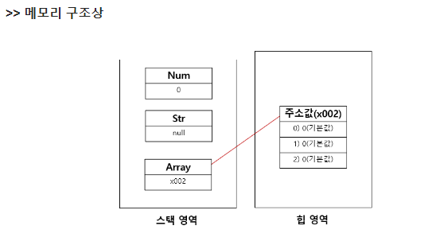

# [실습] JS_기본 문법

날짜: 2024년 10월 22일

# 일반적 변수 선언 ⇒ const

---

```jsx
const numbers = [1, 2, 3, 4, 5];
const dictionary = { key: "value" };
```

## 1. 내부 값 변경 기능

---

- 변수가 참조하는 객체나 배열의 내용을 수정하는 것

```jsx
const numbers = [1, 2, 3];
numbers.push(4); // 가능
console.log(numbers); // [1, 2, 3, 4]

const dict = { name: "John" };
dict.name = "Jane"; // 가능
console.log(dict); // { name: "Jane" }
```

---

```jsx
const numbers = [1, 2, 3];  // numbers에는 배열의 메모리 주소(예: x001)가 저장됨
```

```jsx
numbers.push(4);  // x001 주소의 배열에 새 요소 추가
numbers[0] = 10;  // x001 주소의 배열의 첫 번째 요소 변경
```

### 시각화

---

```jsx
메모리
+--------+
| x001   | <- numbers (const)
+--------+
    |
    v
+---+---+---+---+
| 1 | 2 | 3 |   |  배열 (힙 메모리에 저장)
+---+---+---+---+
```

```jsx
+---+---+---+---+
| 1 | 2 | 3 | 4 |  배열 내용 변경 (허용됨)
+---+---+---+---+
```

## 2. 변수 재할당

---

- 변수에 저장된 값(여기서는 메모리 주소)을 완전히 새로운 값으로 바꾸는 것이다.
- **`const`**로 선언된 변수는 이런 `재할당이 불가능하다.`

```jsx
numbers = [5, 6, 7];  // 에러! 새로운 배열(새 주소)로 재할당 불가
numbers = 10;  // 에러! 다른 타입의 값으로 재할당 불가
```

### 시각화

---

```jsx
+--------+
| x001   | <- numbers (변경 불가! const이므로)
+--------+
    |
    v
+---+---+---+---+
| 1 | 2 | 3 | 4 |  기존 배열
+---+---+---+---+

+--------+
| x002   | <- 새 배열 (할당 시도 실패)
+--------+
    |
    v
+---+---+---+
| 5 | 6 | 7 |  새 배열
+---+---+---+
```

[[국비][JAVA] 배열 이해 및 기본형, 참조형 기본 값](https://zoooom-in.tistory.com/104)

**[참조값 이해를 위한 그림]**



### 힙과 스택의 내용 변경 참고

---

<aside>
💡

힙이나 스택의 내용 변경 자체는 let이나 const와 직접적인 관련이 없다. 
const의 제약은 **변수가 가리키는 메모리 주소의 변경을 막는 것이**며, 
그 주소에 저장된 데이터의 변경을 막는 것은 아닙니다.

</aside>

1. const와 let의 차이:
    - const: 변수가 가리키는 `메모리 주소를 변경`할 수 없다.
    - let: 변수가 가리키는 메모리 주소를 변경할 수 있다.
2. 힙 메모리의 내용 변경:
    - const로 선언된 객체나 배열의 내부 값은 변경 가능
    - 이는 변수가 가리키는 메모리 주소는 그대로지만, 그 주소에 저장된 데이터는 변경될 수 있기 때문입니다.
3. 스택 메모리:
    - 함수 호출, 지역 변수 등이 저장
    - const나 let으로 선언된 변수의 식별자와 그 변수가 가리키는 메모리 주소가 여기에 저장

# 연산자 이해하기

---

| 표현식 | 결과 | 설명 |
| --- | --- | --- |
| 0 && 13 | 0 | 첫 번째 **피연산자(0)가 falsy이므로, 즉시 0을 반환하고 13은 평가하지 않는다.** |
| 0 || 13 | 13 | 첫 번째 피연산자(0)가 falsy이므로, **두 번째 피연산자(13)를 평가하여 반환한다.** |

### 단축 평가 규칙 요약

---

1. **AND (&&) 연산자**:
    - 왼쪽에서 오른쪽으로 평가
    - `첫 번째 falsy 값을 만나면 즉시 그 값을 반환`
    - `모든 값이 truthy라면 마지막 값을 반환`
2. **OR (||) 연산자**:
    - 왼쪽에서 오른쪽으로 평가합니다.
    - `첫 번째 truthy 값을 만나면 즉시 그 값을 반환`
    - `모든 값이 falsy라면 마지막 값을 반환`

```jsx
console.log(false && "hello");  // false
console.log(true && "hello");   // "hello" => 둘다 참이면 : 뒤에 있는 것
console.log(false || "hello");  // "hello" => 참인 것
console.log(true || "hello");   // true => 둘다 참이면 : 앞에 있는 것

```

# Uncaught ReferenceError: city is not defined

---

```jsx
        console.log(`수도 : ${info[city]}`) //city를 찾을 때 -> 'city'를 찾아야 함
        //문자열을 씌우지 않아 발생한 문제
        console.log(`utcOffset : ${info[utcOffset]}`) 
        console.log(`latitude : ${info[latitude]}`)
        console.log(`longitude : ${info[longitude]}`)
```

## undefined 발생 이유

---

```jsx
const citiesInfo = [
      {
        city: '서울',
        utcOffset: ['한국 표준시', 'KST', 'UTC+9'],
        latitude: 37,
        longitude: 126
      },
      {
        city: '도쿄',
        utcOffset: ['일본 표준시', 'JST', 'UTC+9'],
        latitude: 35,
        longitude: 139
      },
      {
        city: '상하이',
        utcOffset: ['중국 표준시', 'CST', 'UTC+8'],
        latitude: 31,
        longitude: 121
      }
    ]
```

→ 값이 없다는 의미?


<aside>
💡

**`undefined`**가 출력되는 이유

</aside>

- **`for...in`** 구문에서 **`info`**가 객체의 키를 문자열로 반환
    - **`info`**는 **`citiesInfo`** 배열의 인덱스를 문자열로 반환
    - 따라서 **`citiesInfo[info]`**는 각 객체에 접근할 수 있게 해준다.
- 따라서 **`info['city']`**는 올바른 접근 방식이다.
    - 대신, 접근하려 상기처럼 한다면 ⇒ **`citiesInfo[info]['city']`**로 접근해야한다.

```jsx
// 추가 정보 출력

for (const index in citiesInfo) {
    const info = citiesInfo[index];
    console.log(`수도 : ${info.city}`);
    console.log(`utcOffset : ${info.utcOffset}`);
    console.log(`latitude : ${info.latitude}`);
    console.log(`longitude : ${info.longitude}`);
}
```

===

```jsx

    for (const index in citiesInfo) {
    const info = citiesInfo[index]; //object 하나가 담기게 됨 => index로 접근
    //index 하나로 접근해서 딴다. => index로 접근
    console.log(`수도 : ${info.city}`);
    console.log(`utcOffset : ${info.utcOffset[0]}`);
    console.log(`latitude : ${info.latitude}`);
    console.log(`longitude : ${info.longitude}`);
```

<aside>
💡

**최종적으로 for..in과 for…of 이해하기**

</aside>

- **`for...in`**: 객체의 **키**(또는 배열의 인덱스)를 반복 ⇒ 따라서 **`info`**는 인덱스나 키 나타냄
- **`for...of`**: 반복 가능한 객체(배열 등)의 **값**을 반복 ⇒ 따라서 각 값에 직접 접근할 수 있음

### for 루프 한번 더 이해하기

---

```jsx
    const studentNames = ['John', 'Alice', 'Bob']
    const studentAges = {
      John: 50,
      Alice: 100,
      Bob: 25
    }

    for (const names of studentNames) {
      console.log(names, studentAges[names]) //names 자체 => 지금 키로 값 뽑기
    }
```

<aside>
💡

**for .. in과 for ..of의 차이**

</aside>

1. `for...in`은 객체의 속성(키)을 순회한다.
2. `for...of`는 반복 가능한 객체(예: 배열, 문자열)의 값을 순회합니다.

## iterable

---

- 반복 가능한 객체는 자신의 요소를 `순차적으로 접근할 수 있는 메커니즘을 제공`하는 데이터 구조입니다
- 이러한 객체들은 **`for...of`** 루프나 스프레드 연산자(**`...`**)와 같은 구조에서 사용될 수 있다.

| 특성 | for...in | for...of |
| --- | --- | --- |
| 대상 | 객체 | 반복 가능한(iterable) 객체 |
| 접근 | **키(key)** | **값(value)** |
| 사용 예시 | **객체의 속성 순회** | **배열, 문자열, Map, Set 등의 요소 순회** |
| 순서 보장 | 보장되지 않음 | 보장됨 |
| 상속된 속성 | 포함 | 포함하지 않음 |
| 성능 | 상대적으로 느림 | 상대적으로 빠름 |
| 구문 | `for (let key in obj)` | `for (let value of iterable` |

## for...in 반복문

---

- `for...in`은 주로 `객체의 속성`을 순회할 때 사용합니다.
    - **객체의 `모든 키(속성 이름)`**를 알고 싶을 때
    - 객체의 구조를 탐색하거나 디버깅할 때

```jsx
const person = {name: "Alice", age: 30, job: "Engineer"};
for (let key in person) { // python) for i in person:
    console.log(key + ": " + person[key]);
    //key 자체를 뽑고 -> dictonary에 key로 접근
}
// 출력:
// name: Alice
// age: 30
// job: Engineer
```

## for...of 반복문

---

- `for...of`는 주로 배열이나 문자열과 같은 반복 가능한 객체의 값을 순회할 때 사용합니다.
- `순서 보장`

```jsx
const fruits = ["apple", "banana", "cherry"];
for (let fruit of fruits) {
    console.log(fruit);
}
// 출력:
// apple
// banana
// cherry
```

## 직관적으로 받아들이기

---

### for...in

---

- 서랍장의 각 서랍을 열어보는 것과 같습니다.
    - 객체의 모든 속성(서랍)을 확인하고 싶을 때

```jsx
const 내서랍장 = {상의: "티셔츠", 하의: "청바지", 신발: "운동화"};

for (let 서랍 in 내서랍장) {
    console.log(서랍 + "에는 " + 내서랍장[서랍] + "가 있어요.");
}
// 즉 키 자체가 서랍
// 나의 서랍장 안에 특정 서랍이 있다면 ==> 내용물 확인 가능

// 출력:
// 상의에는 티셔츠가 있어요.
// 하의에는 청바지가 있어요.
// 신발에는 운동화가 있어요.

```

### for...of

---

- for...of는 마치 상자에서 물건을 하나씩 꺼내보는 것과 같습니다.
    - 배열의 각 항목을 직접 다룰 때
    - 문자열의 각 글자를 확인할 때

**예시:**

```jsx
const 과일바구니 = ["사과", "바나나", "체리"];

for (let 과일 of 과일바구니) {
    console.log(과일 + "를 꺼냈어요.");
}
// 출력:
// 사과를 꺼냈어요.
// 바나나를 꺼냈어요.
// 체리를 꺼냈어요.

```

### 실제 사용 예시

---

1. **물건 찾기 (for...in 사용)**
    - for...in은 "무엇이 있는지" 확인할 때
    
    ```jsx
    const 가방 = {지갑: "검정색", 휴대폰: "아이폰", 열쇠: "집열쇠"};
    
    function 물건찾기(찾는물건) {
        for (let 항목 in 가방) {
            if (항목 === 찾는물건) {
                return 가방[항목] + " " + 찾는물건 + "을(를) 찾았어요!";
            }
        }
        return "그 물건은 가방에 없어요.";
    }
    
    console.log(물건찾기("휴대폰")); // "아이폰 휴대폰을(를) 찾았어요!"
    
    ```
    
2. **장바구니 계산 (for...of 사용)**
    - for...of는 "각 항목을 어떻게 할지" 결정할 때 사용한다고 생각하면 됩니다.
    
    ```jsx
    const 장바구니 = [
        {이름: "사과", 가격: 1000},
        {이름: "바나나", 가격: 1500},
        {이름: "우유", 가격: 2000}
    ];
    
    function 총금액계산() {
        let 총액 = 0;
        for (let 상품 of 장바구니) {
            총액 += 상품.가격;
        }
        return 총액 + "원입니다.";
    }
    
    console.log("총 금액은 " + 총금액계산()); // "총 금액은 4500원입니다."
    
    ```
    

## 조건 while, for문 출력

---

```jsx
    const scores = [90, 80, 70, 60, 40]
    //아래 코드 작성
    //for loop만들 돌려서 scoores출력
    //for..of => 단순 배열
    for (const score of scores) {
        console.log(score) // 90, 80, 70, 60, 40 ..
    }
    length = scores.length // scores를 기반으로 길이 추출
    //총 길이는 5
    //단 while 문 
    
    console.log('------------')

    //index로 접근을 위해서
    //
    length -=1 
     //index로 접근
    while(length >= 0) {
        console.log(scores[length])
        length -= 1
    }
```