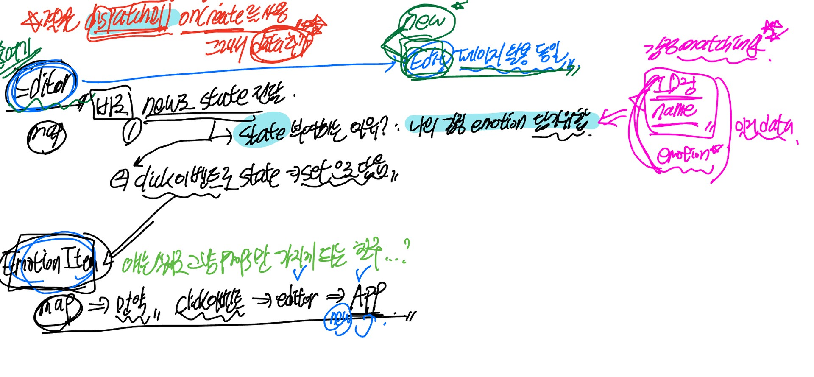

# [React] 감정 일기장 복습4

날짜: 2024년 12월 8일

# New 페이지(컴포넌트) 만들기

---

## New 페이지 UI 만들기

---

## CSS text area width 조절

---

[[CSS] textarea 크기 고정하기](https://velog.io/@leemember/CSS-textarea-%ED%81%AC%EA%B8%B0-%EA%B3%A0%EC%A0%95%ED%95%98%EA%B8%B0)

[[CSS3]textarea css로 간단하게 크기 고정하기 (+javascript로 글자수 제한하기)](https://gahyun-web-diary.tistory.com/26)

## Editor 컴포넌트 EmotionItem 컴포넌트 배치 고민

---



- 일단 Emotion Id가 아닌 Editor에 작성하는게 맞다고 판단됨


⇒ 일단 그럴듯하게 만들긴 했음

**[Editor.jsx, Editor.css]**


**[EmotionItem.jsx, EmotionItem.css]**


## 오늘의 날짜 기본값 new Date()로 설정했는데 적용이 안되어있음

---

- event.target.value는 원활하게 작동되는 것으로 보임

```jsx
const Editor = () => {
  // 여기서 state를 보관해서 날짜를 저장해야 함
  // use State()를 오늘로 설정완료했는데 날짜에는 표기가 안됨
  const [todayDate, setTodayDate] = useState(new Date()) //기본적으로 오늘의 값이 들어갈 수 있도록 설정

  const onChangeDate = (e) => {
    setTodayDate(e.target.value)
  }
...
        <h1 className='Editor_Date_Title'>오늘의 날짜</h1>
        <input className='Editor_Date_Input' type="date" 
        value={todayDate} onChange={onChangeDate} name="" id="" />
      </section>
```


- 출력형식이 기존과 다름


```jsx
const changeFormatter = (date) => {
  const year = date.getFullYear()
  const month = date.getMonth() + 1
  const day = date.getDate()
  //근데 단순히 작성하면 2024-12-8 => 우리가 원하는 00-00이 아님
  if (month < 10 && day < 10) {
    return `${year}-0${month}-0${day}`
  } else if (month < 10) {
    return `${year}-0${month}-${day}`
  } else if (day < 10) {
    return `${year}-${month}-0${day}`
  } else {
    return `${year}-${month}-${day}`
  }
} 
```

## 감정 이모지가 담기지 않음

---

```jsx
const Editor = () => {
    const [todayEmotion, SetTodayEmotion] = useState([]) 
...

  //감정 데이터
  const onChangeEmotion = (e) => {
    SetTodayEmotion(e.target.value)
  }
...
      <section className='Editor_Emotion'>
        <h1 className='Editor_Emotion_Title'>오늘의 감정</h1>
        <div className="Editor_Emotion_Item">
          {emotionData.map((item) => 
          <EmotionItem
          value={todayEmotion}
          onChange={onChangeEmotion}
          key={item.emotionId}
          {...item}/>)}
        </div>
      </section>
```

[수정 1차]

```jsx
  //감정 데이터 == 이게 애초에 onChange를 담을 수 없음 컴포넌트라서
  const onClickEmotion = (emotionId) => {
    //emotion아이디로 일치되는 값 찾기 emotionData
    const findEmotion = emotionData.find((item) => String(item.emotionId) === String(emotionId)) //일치되는 값 찾기
    //해당 값 findEmotion의 값을 넣어줌 일단 그것을 이용해서 나중에 진행
    SetTodayEmotion(findEmotion) //배열로
  }
```

```jsx
        <div className="Editor_Emotion_Item">
          {emotionData.map((item) => 
          <EmotionItem
          value={todayEmotion}
          onClick={() => onClickEmotion(item.emotionId)}
          key={item.emotionId}
          {...item}/>)}
        </div>
```

⇒ onClick를 컴포넌트에 주면 하위 컴포넌트에서 어떻게 다루면 좋을지에 대한 학습 부족,, ⇒ `button.component` 참고

<aside>
💡

**수정 사항**

</aside>


```jsx
 const onClickEmotion = (emotionId) => {
    console.log(emotionId, '들어온 것 확인 emotionId')
    //emotion아이디로 일치되는 값 찾기 emotionData
    const findEmotion = emotionData.find((item) => String(item.emotionId) === String(emotionId)) //일치되는 값 찾기
    console.log(findEmotion, 'findEmotion 확인')
    //해당 값 findEmotion의 값을 넣어줌 일단 그것을 이용해서 나중에 진행
    SetTodayEmotion(findEmotion) //배열로
    console.log(todayEmotion, 'todayEmotion 값 확인') //
  }
...
        <div className="Editor_Emotion_Item">
          {emotionData.map((item) => 
          <EmotionItem
          value={todayEmotion}
          onClick={() => onClickEmotion(item.emotionId)}
          // 제대로 담기는지 먼저 테스트만?
          key={item.emotionId}
          {...item}/>)}
        </div>
```

- 맞게 들어간 것 확인

## onClick될떄마다 백그라운드 배경 변경

---

- 백그라운드 배경은 `EmotionItem` 영역에서 진행해야 되는 부분..

### 📝 힌트

---

1. 상태 관리:
    - 현재 선택된 감정을 추적할 수 있는 상태가 필요할 것 같습니다.
    - `useState`를 사용하여 이 상태를 관리하는 것을 고려해보세요.
2. 조건부 스타일링:
    - CSS 클래스를 동적으로 적용하는 방법을 생각해보세요.
    - 선택된 감정과 현재 아이템의 `emotionId`를 비교하는 로직이 도움될 수 있습니다.
3. 이벤트 핸들링:
    - `onClick` 이벤트에서 선택된 감정을 업데이트하는 로직을 구현해보세요.
4. 부모-자식 컴포넌트 통신:
    - `Editor`와 `EmotionItem` 사이의 데이터 흐름을 재검토해보세요.
    - props를 통해 필요한 정보와 함수를 전달하는 방법을 고려해보세요.
5. 리액트의 key 속성:
    - 리스트 렌더링 시 `key` prop의 역할을 생각해보세요.

## 상태 관리 측면 ⇒ value 전달 활용

---


- 특정 버튼을 클릭하면 클릭된 요소 하나만 응답되어야하는데 다 응답이 됨 : 5번 불필요한 반복이 됨
    - 그렇다면 `emotionItem에서 한개만 선택`되어야 하는 것 아닌가? ⇒ 지금 Editor 자체에서 선택

- **지금 상태**
    - 상태 관리는 **하나의 컴포넌트에서 모든게 이루어지는게 좋다**고 했는데.. 그럼 Editor가 맞지 않는가
    - 최소의 data만 props 전달을 해야하는데 그렇게 되면 지금 위배되는 건가?
        - clickEvent값과, 전달값 모든 것을 제공하기 때문에
        - 재사용성..? 모르겠다..
- **Editor.jsx 코드**
    
    ```jsx
    import { emotionData } from '../util/get-matching-image'
    import Button from './Button'
    import EmotionItem from './EmotionItem'
    import './Editor.css'
    import { useState } from 'react'
    import { useNavigate } from 'react-router-dom'
    
    const changeFormatter = (date) => {
      const year = date.getFullYear()
      const month = date.getMonth() + 1
      const day = date.getDate()
      //근데 단순히 작성하면 2024-12-8 => 우리가 원하는 00-00이 아님
      if (month < 10 && day < 10) {
        return `${year}-0${month}-0${day}`
      } else if (month < 10) {
        return `${year}-0${month}-${day}`
      } else if (day < 10) {
        return `${year}-${month}-0${day}`
      } else {
        return `${year}-${month}-${day}`
      }
    } 
    
    //new로부터 onCreate 데이터 받음 => 이걸 실행하면 => new에 전달해줘야 함
    const Editor = ({onCreate}) => {
      const nav = useNavigate()
      const [todayDate, setTodayDate] = useState(changeFormatter(new Date())) 
      const [todayDiary, SetTodayDiary] = useState() 
      const [todayEmotion, SetTodayEmotion] = useState([]) 
      //감정도 보관해야 함
    
      // Q. 클릭하면 선택이 되는 것 .. 그럼 background는 자체적으로 설정이되는 것인데 => 선택된 데이터를 넘겨주나?
    
      //날짜 데이터
      const onChangeDate = (e) => {
        setTodayDate(e.target.value)
      }
    
      //일기 데이터
      const onChangeDiary = (e) => {
        SetTodayDiary(e.target.value)
      }
    
      //감정 데이터 == 이게 애초에 onChange를 담을 수 없음 컴포넌트라서 => 
        //Q. 이 감정을 그러면 EmoitonItem에서 관리해야하는건지? 지금 여기서 관리하는 상태 전달 못하는지?
      const onClickEmotion = (emotionId) => {
        const findEmotion = emotionData.find((item) => String(item.emotionId) === String(emotionId)) //일치되는 값 찾기
        SetTodayEmotion(findEmotion) 
      }
     
      return (
        <div className='Editor'>
          <section className='Editor_Date'>
            <h1 className='Editor_Date_Title'>오늘의 날짜</h1>
            <input className='Editor_Date_Input' type="date" 
            value={todayDate} onChange={onChangeDate} name="" id="" />
          </section>
          <section className='Editor_Emotion'>
            <h1 className='Editor_Emotion_Title'>오늘의 감정</h1>
            <div className="Editor_Emotion_Item">
              {emotionData.map((item) => 
              <EmotionItem
              value={todayEmotion}
              onClick={() => onClickEmotion(item.emotionId)}
              // 제대로 담기는지 먼저 테스트만?
              key={item.emotionId}
              {...item}/>)}
            </div>
          </section>
          <section className='Editor_Diary'>
            <h1 className='Editor_Diary_Title'>오늘의 일기</h1>
            <textarea className='Editor_Diary_Input' 
            value={todayDiary} onChange={onChangeDiary}
            name="" id="" placeholder='오늘은 어땠나요?'></textarea>
          </section>
          <section className='Editor_Button'>
            <Button text={"취소하기"}
            onClick={() => {nav('/')}}/>
            <Button text={"작성 완료"}
            // onCreate 호출
            type={"POSITIVE"}/>
          </section>
        </div>
      )
    }
    export default Editor
    ```
    
- **Editor.css 코드**
    
    ```jsx
    /* 내부적으로 정렬 : 레이아웃 > 크기 > 간격 */
    .Editor {
      display: flex;
      flex-direction: column;
    }
    
    /* section끼리 좀 떨어져 있어야 할 것 같음 : 이정도 */
    .Editor > section {
      margin: 10px;
    }
    
    /* 공통 요소 묶으면 좋지 않을까? : 묶음 */
    .Editor > section > input, textarea {
      border: none;
      border-radius: 5px;
      background-color: rgb(236, 236, 236);
      padding : 5px 20px;
      font-size : 18px;
    }
    
    .Editor .Editor_Date > input {
      /* outline: none; */
      cursor: pointer;
    }
    
    /* Editor_Emotion_Item이 있어야 함 */
    .Editor .Editor_Emotion {
      display: flex;
      flex-direction: column;
    }
    
    .Editor .Editor_Emotion .Editor_Emotion_Item {
      display: flex; 
      justify-content: center;
      cursor: pointer;
    }
    
    .Editor .Editor_Diary > textarea {
      /* width는  cursor로 움직이지 못하게*/
      /* 넓이 조절 : 크기 */
      /* 임의로 조절 가능?  == 반응 유동적..?*/
      /* 일단 이렇게 구성 */
      width: 540px;
      height: 200px;
      resize: vertical;
      margin-bottom: 10px;
      /* 일단 얘네 조절 */
    }
    
    /* Q. 궁금한게 Editor내부에 EditorButton인것은 알겠는데 이러면 
    Editor도 같이 적용되는 것은 아닌지? */
    .Editor .Editor_Button {
      margin-top: 10px !important;
      /* Q. 적용이 왜 안될까 */
      display: flex;
      justify-content: space-between;
    }
    ```
    
- **EmotionItem.jsx 코드**
    
    ```jsx
    import { getEmotionImage } from '../util/get-motion-image'
    import './EmotionItem.css'
    
    //emotionId를 기반으로 
    // div태그들로 구성됨
    const EmotionItem = ({emotionId, emotionName, onClick, value}) => {
      // console.log('emotionItem 내부 : onClick 알아보기', onClick)
      console.log('보관한 상태 전달확인? : ', value) //그럼 emotion을 클릭하면 1~5번까지 다 선택된다는 의미.. 
      return (
        <div className={`EmotionItem EmotionItem_${value}`}
        onClick={onClick}>
          {/* 그냥 onClick이 실행되는 것 */}
          {/* 임시로 */}
          
          {/* <h4>완전 좋음</h4> */}
          <h4>{emotionName}</h4>
        </div>
      )
    }
    
    export default EmotionItem
    ```
    
- **EmotionItem.css 코드**
    
    ```jsx
    .EmotionItem {
      display: flex;
      flex-direction: column;
      justify-content: center;
      align-items: center;
      margin: 10px;
      padding: 10px 25px;
      background-color: rgb(236, 236, 236);
      border-radius: 5px;
    }
    
    .EmotionItem_1 {
      background-color: rgb(99,201,101);
    }
    .EmotionItem_2 {
      background-color: rgb(157,215,114);
    }
    .EmotionItem_3 {
      background-color: rgb(253,206,23);
    }
    .EmotionItem_4 {
      background-color: rgb(253, 132, 70);
    }
    .EmotionItem_5 {
      background-color: rgb(253, 86, 95);
    }
    
    .EmotionItem > img {
      width: 50px;  
    }
    
    .EmotionItem > h4 {
      font-size: 18px;
    }
    ```
    


[선생님 코드]

```jsx
//Editor.jsx
          // 제대로 담기는지 먼저 테스트만?
          // 그냥 선택이 올바르게 되어있는지에 대한 판단을 위해서 단순 데이터만 설정
          isSelected={item.emotionId === tempEmotion}
          
 //EmotionItem.jsx
 const EmotionItem = ({emotionId, emotionName, onClick, isSelected}) => {

  // selected가 트루면 => 아닌 애들은 false이고
  // true인 애들은 이거가 들어갈 것
  return (
    <div className={`EmotionItem ${isSelected ? `EmotionItem_${emotionId}` : ""}`}
    onClick={onClick}>
```

⇒  단순 해결 방법 : `일치 여부 메서드`를 통해서 Emotion backgroundColor 조정..

## create 동작여부 확인

---


- 동작이 진행되는 것을 볼 수 있음
    - 일단은 update 기능을 고려하지 않고, create 기능만 고려했을 때 값은 들어감

## 결과 값 확인 ⇒ img 받아오는 오류

---


- 감정을 설정했음에도 불구하고 받아오지 못함..


- content값에는 들어있음 ⇒ 보니까 emotionId를 `emotion` 이라고 받아옴
    - onCreate 자체의 문제


## 만약 해당 코드에서 update까지 고려한다면?

---

[editor.jsx]

```jsx
  //일단 create기준
  const onClickBtn = (createdDate, emotionId, content) => {
    //작성 완료, 수정 완료 버튼으로 진행될 것
    //new에서는 작성완료로 사용되기 때문에 주의해야할 포인트
    //따라서 변수가 무엇이냐에 따라서 다를 것 같은데 즉 여기로 들어오는게 onCreate나 onupdate
    onCreate(createdDate, emotionId, content) //맞게 들어가는 것 볼 수 있음
    //만들고 home으로 이동시키기
    nav("/")    
  }

```

→ if 조건문에 function

```jsx
  //일단 create기준
  const onClickBtn = (createdDate, emotionId, content, id) => {
    //메서드로 if문 가능한가?
    if (onCreate) {
      onCreate(createdDate, emotionId, content) //맞게 들어가는 것 볼 수 있음
      //만들고 home으로 이동시키기
    } else if (onUpdate) {
      onUpdate(createdDate, emotionId, content, id) //id값을 어떻게 받아올거냐? == edit 에서 params값을 받아오고 보내줄 것 같음
    }
    nav("/")    
  }
```

## 지금 날짜가 선택한 날짜가 아닌 오늘 날짜로 초기화되는 문제

---

```jsx
        createdDate : new Date().getTime(),
//crate의 값이 잘못되어있음
```

- 해결 완료 : 매개변수 인자값을 받은 내용으로 변경

## [궁금한점]

---

## 1. CSS 선택자

- `.Editor .Editor_Button`은 `.Editor` 클래스 내부의 `.Editor_Button` 클래스를 가진 요소를 선택합니다.

| 선택자 | 설명 | 예시 | 범위 | 특정성 |
| --- | --- | --- | --- | --- |
| `.Editor_Button` | **모든 문서에서 해당 클래스 요소 선택** | 모든 `.Editor_Button` 요소 | 전체 문서 | 낮음 |
| `.Editor .Editor_Button` | `.Editor` 내부의 `.Editor_Button` 요소 선택 | `<div class="Editor">
  <div class="Editor_Button">` | 특정 부모 내부 | 높음 |
| `.Editor_Button.active` | 두 클래스를 동시에 가진 요소 선택 | `<div class="Editor_Button active">` | 특정 조건 | 높음 |

추가 특징:

- 더 구체적인 선택자일수록 우선순위가 높아집니다.
- 범위를 좁힐수록 스타일 충돌 가능성이 줄어듭니다.

## 2. CSS : Box-sizing

---

- `box-sizing`은 **요소의 `전체` 크기를 계산**하는 방법을 지정합니다.
- `border-box`로 설정하면 padding과 border가 width와 height에 포함됩니다.

## 3. 상태 관리 접근 방식

---

- 컴포넌트 구조와 데이터 흐름을 먼저 설계하는 것이 중요합니다. `상태를 어디서 관리할지, 어떻게 전달할지 미리 계획`하세요. 작은 단위로 나누어 테스트하며 개발하는 것도 도움이 됩니다.
1. 상태 관리 방식:
개별 상태 vs 통합 상태는 상황에 따라 다릅니다. 통합 상태는 관리가 편리하지만, **개별 상태는 더 세밀한 제어가 가능합니다**. 프로젝트의 복잡성과 요구사항에 따라 선택하세요.
2. 컴포넌트 책임:
`New` 컴포넌트에서 `onCreate`를 관리하고 `Editor`에 전달하는 것이 일반적인 패턴입니다. 이는 관심사의 분리와 재사용성을 높이는 방식입니다. 하지만 특정 상황에서는 `Editor`에서 직접 처리할 수도 있습니다.

전반적으로, 컴포넌트 설계와 상태 관리에 대해 고민하고 있는 점이 좋습니다. 계속해서 다양한 접근 방식을 시도해보고, 각 방식의 장단점을 경험해보세요. 이를 통해 더 나은 코드 구조와 패턴을 개발할 수 있을 것입니다.

# 전반적 CSS, 기능적 부분 비교

---

<aside>
💡

- **비슷하게 기능과 CSS구현은 진행을 하였으나**, 금번 놓쳤던 포인트는 `감정 선택 로직`을 구현하는 방법이 미숙했음 ⇒ 이거 때문에 state 구조를 의심했었음 : `색다른 필터링 방법 학습`
- 재사용성 측면이 부족했음 ⇒ 작성 완료 버튼
- 또한 기능 통합화가 부족했음
</aside>

| 항목 | 선생님 코드 | 학생 코드 | 개선 방향 |
| --- | --- | --- | --- |
| 상태 관리 | 단일 `input` 상태 | 개별 상태들 | 상태 통합 및 **단순화** |
| 이벤트 핸들링 | 통합된 `onChangeInput` | 개별 핸들러 함수 | 이벤트 핸들링 일반화 |
| **감정 선택 로직** | `isSelected` prop 사용 | 명확하지 않음 | 선택 로직 개선 |
| CSS 구조 | 체계적, `box-sizing` 사용 | 덜 체계적 | **CSS 구조화 및 반응형 고려** |
| 컴포넌트 구조 | `onSubmit` prop 사용 | `onCreate` 직접 사용 | **재사용성 향상** |

방향성 및 진행 상황 피드백:

1. 기능 구현: 전반적으로 잘 따라가고 있습니다. 기본적인 기능을 구현할 수 있는 능력을 보여주고 있습니다.
2. CSS 설계: 기본적인 레이아웃과 스타일링을 할 수 있음을 보여줍니다. 반응형 디자인과 더 체계적인 접근이 필요합니다.
3. 코드 구조: 기능별로 코드를 분리하려는 시도가 보입니다. 하지만 더 효율적인 구조화가 필요합니다.

## 개선이 필요한 부분:

1. 상태 관리: **복잡한 상태는 단일 객체로 관리**하는 습관을 들이세요.
2. 재사용성: **컴포넌트와 함수를 더 일반화하여 `재사용성`**을 높이세요.
3. CSS: BEM 같은 명명 규칙을 사용하고, 반응형 디자인을 고려하세요.
4. **조건부 렌더링: 더 효율적인 조건부 렌더링 기법을 익히세요.**
5. 코드 일관성: 네이밍 컨벤션, 들여쓰기 등 코드 스타일을 일관되게 유지하세요.

전반적으로 기본기는 잘 갖추고 있지만, 더 효율적이고 유지보수가 쉬운 코드를 작성하는 방향으로 발전이 필요합니다. 계속해서 다양한 프로젝트를 경험하며 이러한 부분들을 개선해 나가세요.

## ⚠️ 조건부 랜더링이란? : 컴포넌트 자체에서

---

조건부 렌더링은 React에서 중요한 개념으로, 특정 조건에 따라 다른 컴포넌트나 요소를 렌더링하는 기술입니다. 더 효율적인 조건부 렌더링 기법에는 다음과 같은 것들이 있습니다:

1. 삼항 연산자 사용:
    
    ```jsx
    {isLoggedIn ? <UserGreeting /> : <GuestGreeting />}
    
    ```
    
2. 논리 연산자 &&:
    
    ```jsx
    {isLoggedIn && <UserGreeting />}
    
    ```
    
3. 즉시 실행 함수:
    
    ```jsx
    {(() => {
      if (condition1) return <Component1 />;
      if (condition2) return <Component2 />;
      return <Component3 />;
    })()}
    
    ```
    
4. 객체 매핑:
    
    ```jsx
    const COMPONENTS = {
      1: <Component1 />,
      2: <Component2 />,
      3: <Component3 />
    };
    return COMPONENTS[value] || <DefaultComponent />;
    
    ```
    
5. 컴포넌트 추상화:
복잡한 조건부 로직을 별도의 컴포넌트로 분리하여 관리합니다.

이러한 기법들을 상황에 맞게 적절히 사용하면 코드의 가독성과 성능을 향상시킬 수 있습니다. 특히 복잡한 조건부 렌더링 로직을 다룰 때 유용합니다.