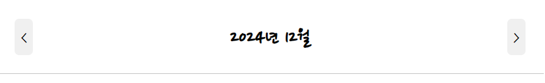

# [React] 감정 일기장 복습1

날짜: 2024년 12월 5일

# 컴포넌트 구조화에 대한 의문

---

- 스스로 이 내용을 보고 구조별 단락을 어떻게 나눠야지라는 생각을 못하겠음



컴포넌트 구조화와 HTML 구조에 대한 이해를 높이기 위한 방법을 알려드리겠습니다:

1. 컴포넌트 구조화 학습 방법
    - 먼저 전체 UI를 종이에 그려보기
    - **반복되는 부분 찾아보기 (DiaryItem처럼)**
    - 독립적으로 동작할 수 있는 부분 찾기
    - "이 부분이 다른 곳에서도 쓰일 수 있을까?" 고민해보기
2. HTML 구조화 연습
    - 시맨틱 태그 공부하기 (header, main, section, article 등)
    - 실제 웹사이트들의 구조 분석해보기
        - 개발자 도구로 유명한 웹사이트의 HTML 구조 살펴보기
        - **왜 이렇게 구조를 잡았는지 고민해보기**
3. 실전 연습 방법
    - 작은 프로젝트부터 시작하기
    - **처음에는 큰 블록으로 나누기**
    예) Header / Main Content / Footer
    - **그 다음 각 블록 안의 작은 단위로 나누기**
    예) Main Content → DiaryList → DiaryItem
4. 구조화 기준
    - **재사용성: 여러 곳에서 쓰일 수 있는가?**
    - 유지보수: 수정이 쉬운가?
    - 가독성: 코드가 깔끔한가?
    - 책임분리: 각 부분의 역할이 명확한가?
5. 실제 예시로 연습하기
이미지의 경우:

```jsx
<div className="app">
  <Header /> {/* 날짜 네비게이션 */}
  <main>
    <DiaryList> {/* 일기 목록 전체 관리 */}
      <DiaryItem /> {/* 개별 일기 항목 */}
      <DiaryItem />
      <DiaryItem />
    </DiaryList>
  </main>
</div>

```

시간이 걸리더라도 **이러한 과정을 반복하다 보면 자연스럽게 구조화 감각이 생길 것입니다. 처음부터 완벽한 구조를 만들려고 하지 마시고, 점진적으로 개선**해나가는 것이 좋습니다.

# Route, Routes

---

[[React] 6. React Router (리액트 라우터) 사용하기](https://goddaehee.tistory.com/305)

## Routes와 Route 개념 차이

| 구분 | Routes | Route |
| --- | --- | --- |
| 역할 | 여러 라우트를 감싸는 부모 컴포넌트 | 개별 경로와 컴포넌트를 매핑하는 단일 컴포넌트 |
| 위치 | **최상위에 위치** | Routes 내부에 위치 |
| 특징 | - URL 매칭된 `첫` Route만 렌더링
- 중첩 라우팅 지원
- Switch의 대체제(v6) | **- path로 경로 지정**
- element로 렌더링할 컴포넌트 지정 |
| 사용 예시 | `<Routes>...</Routes>` | `<Route path="/" element={<Home />} />` |
| 개수 | 하나의 앱에 하나만 사용 | 여러 개 사용 가능 |

예시 코드:

```jsx
<Routes>
  <Route path="/" element={<Home />} />
  <Route path="/diary" element={<DiaryList />} />
  <Route path="/new" element={<Editor />} />
</Routes>

```

## 공식 문서 참고

1. React Router 공식 문서:
    - [https://reactrouter.com/docs/en/v6](https://reactrouter.com/docs/en/v6)
    
    
    
2. React 공식 문서:
    - [https://react.dev/](https://react.dev/)

위 문서들에서 자세한 사용법과 예제들을 확인하실 수 있습니다. 특히 React Router v6 문서를 참고하시면 Routes와 Route에 대한 더 자세한 설명을 보실 수 있습니다.

# 버튼은 Nav, Link는 무엇으로? + 쿼리 스트링

---

[[React] Router를 사용해 페이지를 이동해보자!💨](https://velog.io/@wjddma1202/React-Router%EB%A5%BC-%EC%82%AC%EC%9A%A9%ED%95%B4-%ED%8E%98%EC%9D%B4%EC%A7%80%EB%A5%BC-%EC%9D%B4%EB%8F%99%ED%95%B4%EB%B3%B4%EC%9E%90)

[[React] useSearchParams 과 useParams 초간단 사용법](https://velog.io/@liljoon/React-useSearchParams-%EA%B3%BC-useParams-%EC%B4%88%EA%B0%84%EB%8B%A8-%EC%82%AC%EC%9A%A9%EB%B2%95)

```jsx
  const [searchParams, setSearchParams] = useSearchParams()
  const id = searchParams.get('value')
  console.log(id)
```


## `searchParams`와 `setSearchParams`의 역할

| 이름 | 설명 |
| --- | --- |
| `searchParams` | 현재 URL의 쿼리 파라미터 값을 읽을 수 있게 해줌. 예: `?value=123`에서 `123`을 가져옴. |
| `setSearchParams` | **쿼리 파라미터 값을 변경할 때 사용하는 함수**. 새 값을 URL에 설정함. |

## `setSearchParams` 이해를 위한 표

| 개념 | 설명 | 예시 |
| --- | --- | --- |
| **쿼리 파라미터** | URL에서 `?` 다음에 오는 값. 데이터 전송 방법. | `?value=123` |
| **현재 값** | URL에서 현재 쿼리 파라미터의 값. | `value`가 `123`일 때, 현재 값: `123` |
| **`setSearchParams`** | 쿼리 파라미터 값을 변경하는 함수. | `setSearchParams({ value: '456' })` |
| **변경 후 URL** | `setSearchParams`를 호출한 후의 URL. | `?value=456` |
| **사용 목적** | URL의 값을 변경하여 다른 데이터를 보여주기 위함. | 사용자가 선택한 옵션에 따라 화면 업데이트 |

### 간단한 예시

1. **`searchParams`**:
    - URL에 있는 파라미터를 가져와서 사용할 수 있음.
    - 예: `console.log(id)`는 URL에서 `value`를 추출하여 출력함.
2. **`setSearchParams`**:
    - URL의 쿼리 파라미터를 변화시킬 때 사용.
    - 예: `setSearchParams({ value: '456' })`를 호출하면 URL이 `?value=456`로 변경됨.

# 폰트 설정

---

[[React] React 프로젝트에 폰트 적용하기](https://enne.tistory.com/6)

# 정적 웹 페이지로 배포하기 == npm run preview

---

[정적 웹 페이지로 배포하기](https://ko.vite.dev/guide/static-deploy)

`npm run preview`는 Vite를 사용하는 프로젝트에서 빌드 결과물을 미리 보기 위해 실행하는 명령어입니다. 이 기능이 왜 필요한지, 어떤 작업을 수행하는지 간단하게 설명할게요.

## `npm run preview` 기능 이해하기

### 기능 설명

- **미리 보기**: `npm run preview` 명령어는 Vite로 빌드한 후의 정적 파일을 로컬 서버에서 실행하여 미리 보여줍니다. 이를 통해 실제 배포하기 전에 웹 페이지가 어떻게 보일지를 확인할 수 있습니다.

### 실행 과정

1. **빌드 실행**: 먼저, `npm run build` 명령어를 실행해서 `dist` 디렉터리에 HTML, CSS, JavaScript 파일과 같은 정적 자산을 생성합니다.
2. **프리뷰 서버 시작**: `npm run preview`를 실행하면, Vite가 `dist` 폴더에 있는 파일을 서빙하기 위한 로컬 서버를 시작합니다.
3. **브라우저에서 확인**: 로컬 서버가 시작되면 브라우저를 통해 이 서버에 접속하여 빌드 결과를 확인할 수 있습니다. 이때, 실제 배포 환경과 유사한 상태에서 동작을 테스트할 수 있습니다.

### 왜 사용하는가?

- **검증**: 배포 전에 웹 페이지가 잘 작동하는지 검토할 수 있습니다.
- **디자인 확인**: 빌드한 결과물이 디자인과 레이아웃이 의도한 대로 나오는지 확인할 수 있습니다.
- **버그 발견**: 개발 중에 놓친 오류나 버그를 찾아 수정할 수 있습니다.

이와 같은 이유로 `npm run preview`는 빌드 후 결과물을 확인하고 검증하는 중요한 단계입니다. 더 궁금한 사항이 있으면 언제든지 질문해 주세요!

## 정적 웹 페이지 배포 vs 동적 웹 페이지 배포

### 정적 웹 페이지 배포

| **특징** | **설명** |
| --- | --- |
| **정적 파일** | HTML, CSS, JavaScript 파일을 서버에 그대로 배포. |
| **서버 처리 없음** | 서버에서 처리할 로직이 없으며, 사용자의 요청에 따라 고정된 파일을 서빙. |
| **빠른 로딩 속도** | 서버에서 바로 파일을 제공하므로 로딩 속도가 빠름. |
| **호스팅 요구 사항** | 간단한 웹 서버(예: GitHub Pages, Netlify 등)에서 호스팅 가능. |
| **예시** | 개인 블로그, 포트폴리오, 랜딩 페이지 등. |

### 동적 웹 페이지 배포

| **특징** | **설명** |
| --- | --- |
| **서버 처리** | 요청에 따라 서버에서 데이터베이스와 연동하여 동적으로 HTML 생성. |
| **사용자 맞춤화** | 사용자의 요청이나 세션에 따라 다른 내용을 제공. |
| **느린 로딩 속도** | 서버에서 처리해야 할 작업이 많아 상대적으로 느릴 수 있음. |
| **호스팅 요구 사항** | 데이터베이스 및 서버 사이드 코드가 필요한 서버에서 호스팅. |
| **예시** | 온라인 쇼핑몰, 소셜 미디어, CMS(컨텐츠 관리 시스템) 등. |

### 주요 차이점 요약

1. **파일 처리 방식**:
    - **정적 웹 페이지**: 고정된 파일을 직접 제공.
    - **동적 웹 페이지**: 요청에 따라 파일을 생성하여 제공.
2. **속도**:
    - **정적 웹 페이지**: 빠른 로딩, 서버의 부하가 적음.
    - **동적 웹 페이지**: 추가적인 처리가 필요하여 상대적으로 느릴 수 있음.
3. **유연성**:
    - **정적 웹 페이지**: 내용 변경 시 파일을 직접 수정해야 함.
    - **동적 웹 페이지**: 데이터베이스를 통해 실시간으로 내용이 업데이트됨.

이렇게 정적 웹 페이지와 동적 웹 페이지 배포는 웹 개발에서 기본적으로 다른 특징과 사용 사례를 가지고 있습니다. 추가적인 질문이 있으면 언제든지 물어보세요!

# React 유틸리티 파일 명명 규칙

---

### 1. 파일 이름

- **소문자 사용**: 파일 이름은 보통 소문자로 작성합니다. 예: `utils.js`, `helpers.js`
- **하이픈 또는 언더스코어 사용**: 여러 단어를 포함하는 경우, 하이픈(``)이나 언더스코어(`_`)를 사용해 구분합니다. 예: `date-utils.js`, `array_helpers.js`
- **기능 설명 포함**: 파일 이름에 해당 파일이 어떤 기능을 하는지 설명하는 것이 좋습니다. 예: `stringManipulation.js`, `apiHelper.js`

### 2. 함수 및 변수 이름

- **Camel Case 사용**: 함수나 변수의 이름은 카멜 케이스(camelCase)를 사용합니다. 예: `generateRandomNumber`, `formatDate`
- **명사 또는 동사 사용**: 함수 이름은 동사로 시작하여 해당 기능을 설명합니다. 예: `fetchData`, `calculateSum`
- **상수는 대문자**: 상수는 대문자와 언더스코어를 사용하여 작성합니다. 예: `API_ENDPOINT`, `MAX_LENGTH`

### 3. 디렉토리 구조

- **유틸리티 디렉토리**: 유틸리티 파일은 `utils`, `helpers` 또는 `services` 같은 별도의 디렉토리 내에 배치합니다. 예: `/src/utils/`, `/src/helpers/`
- **기능별 서브디렉토리**: 관련된 유틸리티들을 기능별로 서브디렉토리에 그룹화할 수 있습니다. 예: `/src/utils/date/`, `/src/utils/math/`

### 4. 예시

```
src/
├── utils/
│   ├── apiHelper.js
│   ├── dateUtils.js
│   ├── stringManipulation.js
│   └── validators.js

```

이러한 명명 규칙을 따르면 프로젝트 내의 유틸리티 파일이 더 일관되게 유지되고, 다른 개발자들이 코드를 이해하는 데 도움이 됩니다. 필요에 따라 팀 내에서의 특정 규칙을 정하고 따르는 것도 좋은 방법입니다. 추가적인 질문이 있으면 언제든지 말씀해 주세요!

# Filter와 Find 메서드

---

## `filter`와 `find` 메서드의 차이

| **특징** | **`filter`** | **`find`** |
| --- | --- | --- |
| **목적** | 배열에서 조건에 맞는 **모든 요소**를 찾아 **새로운 배열**로 반환 | 조건에 맞는 **첫 번째 요소만** 찾아 반환 (발견되면 즉시 종료) |
| **반환 값** | 조건을 만족하는 모든 요소로 구성된 새로운 배열 | 조건을 만족하는 첫 번째 요소 (없으면 `undefined`) |
| **원본 배열 변화** | 원본 배열을 변경하지 않고 **새로운 배열 반환** | 원본 배열에 영향을 주지 않음 |
| **사용 예시** | 여러 개의 요소를 찾고 싶을 때 | 특정 요소 하나를 찾고 싶을 때 |
| **사용 위치** | 모든 조건을 만족하는 요소가 필요할 때 | 특정 조건을 만족하는 단일 요소가 필요할 때 |

### 예시 코드

1. **`filter` 사용 예시**:

```jsx
const numbers = [1, 2, 3, 4, 5];

// 짝수만 필터링
const evenNumbers = numbers.filter(num => num % 2 === 0);

console.log(evenNumbers); // 출력: [2, 4]

```

1. **`find` 사용 예시**:

```jsx
const numbers = [1, 2, 3, 4, 5];

// 첫 번째 짝수 찾기
const firstEven = numbers.find(num => num % 2 === 0);

console.log(firstEven); // 출력: 2

```

### 요약

- `filter`는 조건에 맞는 모든 요소를 배열로 반환하고, `find`는 조건에 맞는 첫 번째 요소를 반환합니다.
- 필요에 따라 둘 중 하나를 사용하면 됩니다. 여러 요소가 필요할 때는 `filter`, 특정 하나의 요소가 필요할 때는 `find`를 사용하세요.

더 궁금한 점이 있으면 언제든지 질문해 주세요!

# [오류] Emotion을 util에서 불러오는 과정 ⇒ 못불러옴

---

⇒ 애초에 `getEmotion` 데이터를 못받아옴

[Home.jsx]

```jsx
  console.log(id, '파라미터 아이디 : qeuryString')
  console.log(getEmotion(1), 'getEmotion') //값이 1만 나옴
```

[util > get-motion-image.js]

```jsx
import emotion1 from '../assets/emotion1.png'
import emotion2 from '../assets/emotion2.png'
import emotion3 from '../assets/emotion3.png'
import emotion4 from '../assets/emotion4.png'
import emotion5 from '../assets/emotion5.png'

//이게 배열이 아닌데? 
//근데 생각해보면 emotion을 배열로 만들어줘야 함
//어떠한 emotionName, emotionId
const emotions = [
  {
    id : 1,
    emotionId : emotion1,
    emotionName : '완전 좋음'
  },
  {
    id : 2,
    emotionId : emotion2,
    emotionName : '좋음'
  },
  {
    id : 3,
    emotionId : emotion3,
    emotionName : '그럭 저럭'
  },
  {
    id : 4,
    emotionId : emotion4,
    emotionName : '나쁨'
  },
  {
    id : 5,
    emotionId : emotion5,
    emotionName : '최악'
  },
]

export const getEmotion = (emotionId) => {
  //특정 emotion번호가 들어오면 그걸 가져오게 하는 것
  //거기에 맞게 return? => 그니까 1이 들어오면 1에 매칭 시켜줘야 함
  //지금 여기에 맞게 1이면 => emotion1을 반환해줘야함
  //그럼 일단 내생각에 filter로 일치된 내용이나 find로 반호나해줘야하는데 => 거기서 감정을 맞게 찾는 것
  const emotion = emotions.find((item) => String(emotionId) === String(item.emotionId))
  //찾은 emotion => 반환
  console.log(emotion)
  return emotion
}

```

⇒ 애초에 emotion 값을 못받아옴  : `find` 는 조건을 만족하지 못할경우 undefined반환

⇒ `원인` : id를 받아와야하는데 emotion id를 받아옴

```jsx

//받아는 왔는데 깔끔하지 못한 느낌..
```

<aside>
💡

**강의에서 해설된 내용**

</aside>

```jsx
export function getEmotionImage (emotionId) {//emotion 관련 id를 받아와서 필터링
  switch (emotionId) {
    case 1: 
      return emotion1
    case 2: 
      return emotion2
    case 3:   
      return emotion3
    case 4: 
      return emotion4
    case 5: 
      return emotion5
    default:
      return null
  }
}

```

<aside>
💡

**지피티 분석 내용**

</aside>

### 접근 방식 비교

| 특성 | 배열과 find 메서드 사용 | switch 문 사용 |
| --- | --- | --- |
| 코드 길이 | 더 길고 복잡함 | 간결하고 직관적 |
| 확장성 | 새로운 감정 추가가 쉬움 | 새로운 case 추가 필요 |
| 성능 | 배열 순회 필요 (O(n)) | 직접 접근 (O(1)) |
| 유연성 | 객체로 추가 정보 저장 가능 | **단순 매핑에 적합** |
| 가독성 | 데이터 구조가 명확히 보임 | 로직이 간단히 보임 |

### 예시와 분석

1. 배열과 find 메서드 접근:
    
    ```jsx
    const emotions = [
      { id: 1, emotionId: emotion1, emotionName: '완전 좋음' },
      // ... 다른 감정들
    ];
    
    export const getEmotion = (emotionId) => {
      return emotions.find(item => String(emotionId) === String(item.id));
    }
    
    ```
    
    - 장점: 감정에 대한 추가 정보(이름 등)를 쉽게 저장하고 관리할 수 있음
    - 단점: **매번 배열을 순회해야 하므로 성능상 비효율적**일 수 있음
2. switch 문 접근:
    
    ```jsx
    export function getEmotionImage(emotionId) {
      switch (emotionId) {
        case 1: return emotion1;
        // ... 다른 케이스들
        default: return null;
      }
    }
    
    ```
    
    - 장점: **직접적이고 성능이 좋음**
    - 단점: 새로운 감정을 추가할 때 함수를 수정해야 함

### **문제 해결 접근 방법**

1. 요구사항 명확화:
    - **단순히 이미지만 필요한지, 추가 정보도 필요한지 파악**
2. 확장성 고려:
    - 향후 확장 가능성을 고려하여 적절한 방식 선택
3. 성능 고려:
    - 데이터 규모와 접근 빈도를 고려하여 적절한 방식 선택

### 헷갈림의 원인

1. 과도한 일반화:
    - **단순한 문제에 복잡한 해결책을 적용하려 함**
2. 데이터 구조와 로직의 혼동:
    - **데이터 저장과 접근 로직을 분리하지 않음**

### 개선 방향

1. **문제를 단순화하여 접근**
2. **요구사항에 맞는 가장 간단한 해결책 먼저 고려**
3. **필요에 따라 점진적으로 복잡성 추가**

이렇게 접근하면 문제 해결이 더 쉬워지고, 코드도 더 깔끔해질 것입니다.

## 데이터 저장과 접근 로직을 분리하지 않을 경우 예시

---

프로그래밍에서 중요한 개념인 "관심사의 분리(Separation of Concerns)"와 관련이 있습니다. 이를 더 자세히 설명해 드리겠습니다:

1. **데이터 저장:**
    - 데이터의 구조와 내용을 정의하는 부분
    - 예: `emotions 배열`의 정의
2. **접근 로직:**
    - 저장된 데이터를 사용하는 방법을 정의하는 부분
    - 예: `getEmotion` 함수

두 개념을 분리하지 않았을 때의 예:

```jsx
export const getEmotion = (emotionId) => {
  const emotions = [
    { id: 1, emotionId: emotion1, emotionName: '완전 좋음' },
    // ... 다른 감정들
  ];
  return emotions.find(item => String(emotionId) === String(item.id));
}

```

분리한 경우:

```jsx
// 데이터 저장
const emotions = [
  { id: 1, emotionId: emotion1, emotionName: '완전 좋음' },
  // ... 다른 감정들
];

// 접근 로직
export const getEmotion = (emotionId) => {
  return emotions.find(item => String(emotionId) === String(item.id));
}

```

이렇게 분리하면:

1. 코드의 가독성이 향상됩니다.
2. 데이터 구조 변경과 접근 로직 변경을 독립적으로 할 수 있습니다.
3. 재사용성과 유지보수성이 높아집니다.

# [CSS] 관련 개념 부족

---

```jsx
@font-face { /* 사용자 폰트 정의 */
  font-family: "NanumPenScript";
  src: url('/public/NanumPenScript-Regular.ttf');
}

body * { /*body 내의 모든 요소에 스타일을 적용*/
  font-family: "NanumPenScript";
}

html, body {
  margin : 0px;
  width : 100%;
  background-color: rgb(246, 246, 246);
  /* min-height : 100%; */
  /* height : 100%; */
  /*min-height: 100%;와 height: 100%;는 페이지 전체 높이를 차지하게 만듭니다. 
    둘 중 하나만 사용해도 충분합니다. */
}

/* 메인 컨테이너 스타일 => body 태그 안의 div아이디가 root */
#root {
  background-color: white;
  max-width: 600px;
  width: 100%; /* 부모 요소의 전체 너비를 차지 */
  margin: 0 auto; /* 요소를 수평 중앙에 위치 */
  /* min-height: 100%; */
  height : 100%;
  min-height: 100vh; /* vh : 뷰포트 : 브라우저 창의 높이의 100%를 최소 높이로 설정 */
  /* vh : 현재 브라우저 스크린 크기 : 브라우저 스크린 높이만큼 */
  box-shadow: rgba(100, 100, 100, 0.2) 0px 0px 29px 0px;
  /* 순서대로 색상, x-offset, y-offset, blur-radius, spread-radius를 나타냅니다. */
}
```

1. 뷰포트와 높이 설정:
    - 뷰포트(viewport)는 웹 페이지가 표시되는 브라우저의 가시 영역입니다.
    - `vh` (viewport height)는 뷰포트 높이의 1%를 나타냅니다. 100vh는 **뷰포트 전체 높이입니다.**
    - 높이 설정 best practice:
        
        ```css
        html, body {
          height: 100%;
        }
        #root {
          min-height: 100vh;
        }
        
        ```
        
    
    이렇게 하면 `#root`가 최소한 뷰포트 전체 높이를 차지하며, **내용이 더 길어지면** 그에 맞춰 늘어납니다.
    
    [가시화]
    
    1. HTML과 BODY 설정:
        
        ```
        +------------------------+
        |  HTML (height: 100%)   |
        |  +--------------------+|
        |  | BODY (height: 100%)||
        |  |                    ||
        |  |                    ||
        |  |                    ||
        |  |                    ||
        |  |                    ||
        |  +--------------------+|
        +------------------------+
        
        ```
        
        HTML과 BODY가 브라우저 창의 전체 높이를 차지합니다.
        
    2. ROOT 설정:
        
        ```
        +------------------------+
        |  HTML & BODY           |
        |  +--------------------+|
        |  | #root (min-height: ||
        |  |        100vh)      ||
        |  |                    ||
        |  |                    ||
        |  |                    ||
        |  |                    ||
        |  +--------------------+|
        +------------------------+
        
        ```
        
        #root는 최소한 뷰포트 높이(100vh)만큼의 높이를 가집니다.
        
    3. 내용이 적을 때:
        
        ```
        +------------------------+
        |  HTML & BODY           |
        |  +--------------------+|
        |  | #root              ||
        |  | +-----------------+||
        |  | | Content         |||
        |  | +-----------------+||
        |  |                    ||
        |  |                    ||
        |  +--------------------+|
        +------------------------+
        
        ```
        
        내용이 적어도 #root는 여전히 전체 뷰포트 높이를 유지합니다.
        
    4. 내용이 많을 때:
        
        ```
        +------------------------+
        |  HTML & BODY           |
        |  +--------------------+|
        |  | #root              ||
        |  | +-----------------+||
        |  | | Content         |||
        |  | |                 |||
        |  | |                 |||
        |  | |                 |||
        |  | |                 |||
        |  | +-----------------+||
        |  +--------------------+|
        |                        |
        +------------------------+
        
        ```
        
        **내용이 뷰포트 높이를 초과하면 #root와 BODY, HTML이 함께 늘어납니다.**
        
    
    이 설정의 주요 이점은 내용의 양에 관계없이 최소한 전체 화면 높이를 차지하면서, 필요시 더 늘어날 수 있다는 것입니다.
    
2. HTML과 BODY:
    - HTML은 최상위 요소입니다. **BODY는 HTML의 직접적인 자식**입니다.
    - HTML에 스타일을 적용하지 않으면, 일부 브라우저에서 **예상치 못한 여백**이 생길 수 있습니다.

1. ROOT와 BODY:
    - `#root`는 보통 React 앱의 최상위 컨테이너로, **BODY의 직접적인 자식**입니다.
    - **ROOT에 적용된 스타일은 BODY의 크기와 스타일을 기반으로 동작**합니다.

1. Box Shadow 속성:
    - **x-offset: 그림자의 수평** 위치 (양수: 오른쪽, 음수: 왼쪽)
    - **y-offset: 그림자의 수직** 위치 (양수: 아래, 음수: 위)
    - **blur-radius: 그림자의 흐림** 정도 (값이 클수록 더 흐림)
    - **spread-radius: 그림자의 크기** (양수: 확장, 음수: 축소)

[box-shadow - CSS: Cascading Style Sheets | MDN](https://developer.mozilla.org/en-US/docs/Web/CSS/box-shadow)

이러한 설정들을 통해 웹 페이지의 레이아웃과 시각적 효과를 정밀하게 제어할 수 있습니다.

## height와 min-height의 사용법

---

### CSS 속성 비교

| 속성 | 설명 | 사용 예시 | 효과 |
| --- | --- | --- | --- |
| `height: 100%` | **부모 요소**의 높이를 기준으로 100% 설정 | `html, body { height: 100%; }` | **부모 요소의 높이에** 따라 높이가 결정됨. |
| `min-height: 100%` | 부모 요소의 높이를 기준으로 **최소** 높이 설정 | `#root { min-height: 100%; }` | 내용이 부족하면 100% 높이를 유지하며, **내용이 많아질 경우 늘어남.** |
| `min-height: 100vh` | 뷰포트 높이에 기반하여 최소 높이를 설정 | `#root { min-height: 100vh; }` | 항상 뷰포트 높이만큼 최소 높이를 유지함. |

### 예시 코드

### HTML 구조

```html
<!DOCTYPE html>
<html lang="en">
<head>
    <meta charset="UTF-8">
    <meta name="viewport" content="width=device-width, initial-scale=1.0">
    <title>Height vs Min-Height Example</title>
    <link rel="stylesheet" href="styles.css">
</head>
<body>
    <div id="root">
        <h1>Hello World!</h1>
        <p>This is a simple demonstration of height and min-height properties.</p>
        <!-- 이 부분에 내용이 더 추가될 수 있습니다. -->
    </div>
</body>
</html>

```

### CSS 코드

```css
html, body {
    height: 100%;  /* 부모 요소의 높이를 100%로 설정 */
    margin: 0;     /* 기본 마진 제거 */
    padding: 0;    /* 기본 패딩 제거 */
}

#root {
    min-height: 100vh; /* 뷰포트 전체 높이를 최소 높이로 설정 */
    background-color: white;
    margin: 0 auto;    /* 수평 중심 정렬 */
    max-width: 600px;  /* 최대 너비 설정 */
    box-shadow: rgba(100, 100, 100, 0.2) 0px 0px 29px 0px; /* 그림자 효과 */
    padding: 20px;     /* 내부 여백 */
}

```

### 설명

- **HTML 구조**:
    - `#root`는 내용을 담고 있는 최상위 요소입니다.
- **CSS**:
    - `html, body { height: 100%; }`: HTML과 BODY 요소가 브라우저 전체 높이를 차지합니다.
    - `#root { min-height: 100vh; }`: #root 요소는 뷰포트의 높이를 최소한으로 차지하며, 내용이 더 많아지면 늘어납니다.

### 결과

1. **내용이 적을 경우**:
    - `#root`는 뷰포트 전체 높이를 차지합니다.
2. **내용이 많을 경우**:
    - 사용자가 추가한 내용에 따라 `#root`는 아래로 늘어납니다.