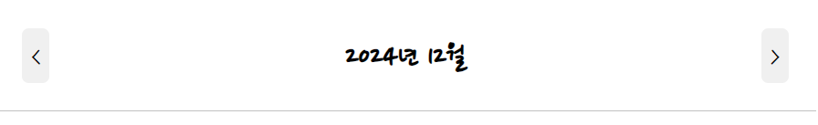

# [React] 감정 일기장 복습2

날짜: 2024년 12월 6일

# 공통 컴포넌트 제작 연습

---

## Header 컴포넌트

---



- CSS 배치가 이상한 것 같음 ⇒ 상하 간격이 넓음


```jsx
/* <div className='Header'> 
<section className="header_left">leftChild</section>
<section className="header_title">title</section>
<section className="header_right">rigthChild</section>
</div> */

.Header {
  display : flex;
  justify-content: center;
  align-items: center;
  /* justify-content:space-around */
  /* header자체에 밑줄 */
  border-bottom: 1px solid #C1C1C1;
}

.Header > .header_left {
  display : flex;
  justify-content: flex-start;
}

.Header > .header_title {
  display: flex;
  justify-content: center;
  /* 가운데 text를 넣고 */
  flex: 1;
  /* text-align: center; */
  /* flex 1을 하니까 원하는 대로 채워짐 => 의미 */
  /* font sizing */
  font-size: 24px;
  font-weight: bold;
}

.Header > .header_right {
  display: flex;
  justify-content: flex-end;
}

```

## Button 컴포넌트

---


- 옆에 버튼 컴포넌트의 크기가 옹졸함
    - 동일하게 CSS 배치 및 구성이 이상해보임


⇒ button을 div태그로 감싸는게 아니라 바로 button 자체에 class 적용 : `해당 부분에 대한 감이 없음`

[수정전]

```jsx
.Button {
  display: flex;
  padding : 20px;
  width: 100%;
  /* 너비 수정 ㅣㄹ요 */
  /* 글씨에 맞게 너비 설정 */
}

.Button > button {
  border: none;
  border-radius: 5px;
  /* width: 80px; */
  height: 40px;
  cursor: pointer;
  font-size: 18px;
}

.Button .Button_POSITIVE {
  background-color: rgb(0, 196, 112);
}

.Button .Button_NEGATIVE {
  background-color: rgb(239, 86, 86);
}
```

[수정 후]

```jsx

.Button  {
  padding : 10px 20px; 
  /* 단순 10px이 아닌 상하 : 좌우 : 20px */
  background-color: rgb(236,236,236);
  border: none;
  border-radius: 5px;
  /* width: 80px; */
  height: 40px;
  cursor: pointer;
  font-size: 18px;
  white-space: nowrap;
  /* 화면이 줄어들더라도 줄바꿈하지 않도록 */
}

/* .Button .Button_POSITIVE {
  background-color: rgb(0, 196, 112);
} */

.Button_POSITIVE {
  background-color: rgb(99, 201, 101);
  color:white;
}

/* .Button .Button_NEGATIVE {
  background-color: rgb(239, 86, 86);
} */

.Button_NEGATIVE {
  background-color: rgb(253, 86, 95);
  color: white;
}
```

## button component에 클릭 이벤트

---

- 컴포넌트 자체에 `onclick 이벤트는 작동`할 수 없다. ⇒ `props` 전달구조가 어떤식으로 되는 건지?

<aside>
💡

따라서 **`()`** 부분은 Button 컴포넌트까지 전달되지만, 실제로 함수를 호출(실행)하는 것은 사용자가 버튼을 클릭할 때입니다.

</aside>

1. Props 전달:
    - `onClick={() => {console.log('버튼클릭')}}`에서 **화살표 함수 전체가 `onClick` prop으로 Button 컴포넌트에 전달됩니다.**
2. Button 컴포넌트 내부:
    
    ```jsx
    const Button = ({ onClick, text, type }) => {
      return (
        <button onClick={onClick} className={`btn ${type}`}>
          {text}
        </button>
      );
    };
    
    ```
    
    - 여기서 전달받은 `onClick` 함수를 내부 `<button>` 요소의 `onClick` 속성에 할당합니다.
3. 실행 시점:
    - `() => {console.log('버튼클릭')}` 이 함수는 버튼이 실제로 클릭될 때 실행됩니다.
    - 즉, **`()` 부분**은 Button 컴포넌트 내부가 아닌, **사용자가 버튼을 클릭하는 시점에 실행**됩니다.
4. 동작 구조:
    - 부모 컴포넌트: 함수를 정의하고 prop으로 전달
    - Button 컴포넌트: 받은 함수를 내부 버튼에 연결
    - 브라우저: 사용자 클릭 시 연결된 함수 실행

이 방식의 장점은 Button 컴포넌트를 재사용하면서 다양한 동작을 구현할 수 있다는 것입니다. Button 컴포넌트는 단순히 함수를 전달받아 실행하는 역할만 하고, 실제 동작은 부모 컴포넌트에서 정의합니다.

| 단계 | 설명 | 코드 예시 |
| --- | --- | --- |
| 1. Props 전달 | 부모 컴포넌트에서 onClick prop으로 함수를 전달 | `<Button onClick={() => {console.log('버튼클릭')}} text={"<"} type={"DEFAULT"} />` |
| 2. 화살표 함수 | onClick prop으로 전달되는 화살표 
함수는 정의된 작업을 포함 | `() => {console.log('버튼클릭')}` |
| 3. Button
    컴포넌트 | Button 컴포넌트에서 onClick prop을 받아 `<button>`의 onClick에 연결 | `const Button = ({ onClick, text, type }) => { return <button onClick={onClick}>{text}</button>; };` |
| 4. 클릭 시 실행 | 사용자가 버튼을 클릭하면, 
**Button 컴포넌트의 onClick에 연결된 함수가 실행** | `console.log('버튼클릭')` |

## 버튼을 왜 div로 감싸지 않았을까?

---

```jsx
const Button = ({text, type, onClick}) => {
  return (
    <button onClick={onClick}
    className={`Button Button_${type}`}>{text}</button>
    // </div>
  )
}
```

버튼을 div로 감싸지 않은 이유는 여러 가지가 있을 수 있지만, 일반적으로는 **재사용성과 독립적인 기능**을 고려한 설계가 많습니다. 사용자가 이 버튼을 **다른 UI 컨텍스트에서 자유롭게 사용할 수 있도록 구성**했을 가능성이 높습니다.

⇒ 각 위치에서의 버튼의 모양을 바꾸게 할 가능성이 있기 떄문

## padding, white-space, CSS 동적 속성, width와 flex

---

1. 원하는 컴포넌트의 모양을 조절하기 위해서 `padding` 값을 유연하게 활용 할 것
    - 상하 / 좌우
2. `white-space: nowrap`에 대해:
    - 이 속성은 텍스트가 **줄 바꿈되지 않고 한 줄로 유지**되도록 합니다.
    - `white-space` : 요소 안의 공백을 어덯게 처리할지 ⇒ `noraml : 기본` == 자동줄바꿈

[white-space - CSS: Cascading Style Sheets | MDN](https://developer.mozilla.org/ko/docs/Web/CSS/white-space)

1. CSS 선택자의 차이점:
    
    ```jsx
     ... className={`Button Button_${type}`}>{text}</button>
    // 중첩된 구조가 아닌 단일 요소에 두개의 클래스를 동시 적용
    ```
    
    - `.Button .Button_POSITIVE`:
        - 이것은 `.Button` 클래스 **내부**에 있는 `.Button_POSITIVE` 클래스를 가진 요소를 선택합니다.
        - **즉, 중첩된 구조를 가정합니다.**
        
        ```jsx
        <div class="Button"> 
         //중첩된 구조 예시
            <span class="Button_POSITIVE">클릭하세요!</span>
        </div>
        ```
        
    - `.Button_POSITIVE`:
        - 이것은 단순히 `.Button_POSITIVE` 클래스를 가진 모든 요소를 선택합니다.
2. `flex: 1`과 `width: 50%`의 차이:
    - `flex: 1`:
        - Flexbox 레이아웃에서 사용됩니다.
        - 요소가 **가능한 모든 공간을 차지**하도록 합니다.
        - 다른 flex 아이템들과 공간을 균등하게 나눕니다.
    - `width: 50%`:
        - **부모 요소 너비의 50%로 너비**를 고정합니다.
        - Flexbox와 관계없이 작동합니다.

**`flex: 1`을 사용하면 요소가 사용 가능한 공간을 모두 채우려고 하므로, 레이아웃이 더 유동적이고 반응형**이 될 수 있습니다.

# 일기 관리 기능 구현하기1-2

---

## Dispatch 사용하기 ⇒ useReducer + useEffect 구조 참고

---

[Hooks API Reference – React](https://ko.legacy.reactjs.org/docs/hooks-reference.html#usereducer)

[8. useEffect, useReducer, useDispatch, useSelector, useMemo, useCallback](https://velog.io/@ty-yun21/react8)

## [에러] Uncaught Error: Too many re-renders. React limits the number of renders to prevent an infinite loop.

---

```jsx
function App() {
  const [data, dispatch] = useReducer(reducer, mockData) //일단 빈배열

  dispatch({
    type: "CREATE", //create로 들어갈 값 임시로 생성
    data: {//data에 들어갈 값
      id : 4,
      createdDate : new Date().getTime(),
      emotion : 1,
      content : '기분 좋은 하루'
    }
  })
```

⇒ 이렇게 작성했더니 갑자기 저런 에러가 발생 

⇒ 컴포넌트가 무한 루프에 빠졌을 때 발생합니다. 이 경우, **`dispatch` 호출이 컴포넌트가 렌더링되는 동안 실행되고 있기 때문에 이런 문제가 발생**

⇒ 따라서 `dispatch` 를 컴포넌트의 맨 처음에 호출될 수 있도록 `useEffect` 활용

[[React] useEffect 내 무한루프 원인 (Error Maximum Update depth exceeded)](https://prohannah.tistory.com/76)

## dispatch와 useEffect를 적절하게 사용한다면?

---

`dispatch`를 사용할 때 `useEffect`를 사용하는 것은 특정 상황에서 적절하고 유용할 수 있습니다. 다음은 `dispatch`와 `useEffect`를 함께 사용하는 이유와 상황에 대한 설명입니다.

### 언제 `useEffect`를 사용하는 것이 적절한가?

1. **컴포넌트가 마운트될 때 한 번만 실행할 경우**:
    - 초기 상태 설정이나 **API 호출, 데이터 로딩 등을 위해 dispatch를 사용**할 때 `useEffect`를 쓸 수 있습니다.
    - 이렇게 하면 컴포넌트가 **처음 렌더링될 때 한 번만 dispatch가 실행되므로 무한 루프를 방지**할 수 있습니다.
    
    ```jsx
    useEffect(() => {
      dispatch({ type: "INITIALIZE", payload: initialData });
    }, []); // 빈 배열을 전달하여 토글링 방지
    
    ```
    
2. **의존성 배열을 사용하여 특정 상태나 prop의 변화에 반응할 경우:**
    - **특정 상태나 prop이 변경될 때**마다 dispatch를 실행하고 싶다면, 그 값들을 의존성 배열에 추가할 수 있습니다.
    
    ```jsx
    useEffect(() => {
      dispatch({ type: "UPDATE", payload: someValue });
    }, [someValue]); // someValue가 변할 때마다 dispatch
    
    ```
    
3. **기타 비동기 작업 수행 시**:
    - 예를 들어, API 호출 후 데이터를 가져와서 상태를 업데이트할 때 `useEffect`와 `dispatch`를 함께 사용하면 좋습니다.

### 주의할 점

- **`dispatch`를 직접적으로 렌더링 함수 내에서 호출하지 않기**:
    - **렌더링 함수 내에서 dispatch를 호출하면 컴포넌트가 매 렌더링 시마다 호출되어 무한 재렌더링을 초래**할 수 있습니다. 이를 피하기 위해 `useEffect`를 사용하여 특정 조건을 만족할 때만 호출해야 합니다.

### 요약

- *`useEffect`*는 **dispatch**를 사용하여 상태 업데이트를 수행할 때, 특히 초기화 또는 특정 조건에서 실행해야 할 로직을 처리하는 데 적절합니다.
- 이러한 접근 방식은 React의 상태 관리 및 렌더링 최적화를 통해 효과적으로 작동합니다.

## [에러]  App.jsx:38 Warning: Maximum update depth exceeded. This can happen when a component calls setState inside useEffect, but useEffect either doesn't have a dependency array, or one of the dependencies changes on every render. Error Component Stack
at App

---

```jsx
function App() {
  const [data, dispatch] = useReducer(reducer, mockData) //일단 빈배열
  useEffect(()=>{
    dispatch({
      type: "CREATE", //create로 들어갈 값 임시로 생성
      data: {//data에 들어갈 값
        id : 4,
        createdDate : new Date().getTime(),
        emotion : 1,
        content : '기분 좋은 하루'
      }
    })
  }, [data])
```

⇒ data 값을 지워준다 : data가 바뀔떄마다 호출..


⇒ data를 지우고 deep depth 문제를 해결하고 나니 알맞게 들어간 것을 볼 수 있음 
     : `정확하게 useEffect` 의 depth를 지금 dispatch에서 어떻게 활용하면 좋을지 감이 안옴

⇒ 일단 이 방법이 맞는지 모호..

## [고민] 현재 방향성을 잃음

---

```jsx

function reducer(state, action) { 
  switch(action.type) {
    case "CREATE":
      return [action.data , ...state]
    case "UPDATE":
      // id값이 같을때 => 즉 id값이 같지 않을때는 기존 item 모두 들고감 == 즉 없는 값 수정
      //즉 item 다 가져가기 : 거짓일 때, 값이 있을땐 action data를 들고간다.
      return state.map((item) => String(item.id) !== String(action.id) ? action.data : item)
    case "DELETE":
      return state.find((item) => String(item.id) === String(action.id)) 
    case "default":
      return state //state 현태 상태 그대로를 돌려준다.
  }
}

//계속 리랜더링 할필요가 없으면 외부에 작성 => mockData쓸것
//이거는 어떻게 보면 계속 랜더링 되어야 하는 값아닌가.. ? 일단
const mockData = [ //어떤 데이터 => 날짜 데이터, 감정, 내용, id
  {id : 1, createdDate : new Date().getTime(), emotion : 1, content : '오늘 합격해서 기분이 좋아요'},
  {id : 2, createdDate : new Date().getTime(), emotion : 2, content : '2번 일기'},
  {id : 3, createdDate : new Date().getTime(), emotion : 3, content : '3번 일기'},
]

function App() {
  const [data, dispatch] = useReducer(reducer, mockData) //일단 빈배열
  useEffect(()=>{
    dispatch({ //맞게 들어간것을 볼 수 있음
      type: "CREATE", //create로 들어갈 값 임시로 생성
      data: {//data에 들어갈 값
        id : 4,
        createdDate : new Date().getTime(),
        emotion : 1,
        content : '기분 좋은 하루'
      }
    })

    //값을 그대로 받아올텐데 id랑 별도 필요가 없을건데 == 검토 필요
    dispatch({ 
      type:"UPDATE",
      data : {
        id : 4,
        createdDate : new Date().getTime() + 1,
        emotion : 1,
        content : '최고의 하루!' 
      }
    })

    dispatch({//dispatch를 이런식으로 선언하는게 맞는가?
      type : "DELETE", 
      data : {
        id : 4,
      }
    })
  }, [dispatch]) //data가 바뀔떄만? => dispatch가 바뀔떄만? : 그럼 여기 dispatch면 dispatch여야 하는 이유

```

⇒ 따라서 힌트 얻기

### 힌트:

1. **dispatch의 용도**:
    - `dispatch`는 상태를 업데이트하기 위한 신호입니다. **`useEffect` 안에서 여러 번 호출하는 것이 가능하지만, 이는 컴포넌트가 초기 렌더링될 때 한 번**만 발생합니다.
2. **의존성 배열**:
    - `useEffect`의 **의존성 배열에 `dispatch`를 넣는 것은 조금 더 고려**할 필요가 있습니다. 만약 `dispatch`가 항상 같은 함수라면, 정적으로 설정하는 게 좋습니다.
3. **상태 관리의 일관성**:
    - 여러 `dispatch` 호출이 있을 때, 각 호출이 이루어진 순서와 결과가 상태에 미치는 영향을 생각해 보세요. 예를 들어, **CREATE 후 UPDATE를 시도할 때, 해당 ID가 존재하는지의 여부는 중요**합니다.
4. **DELETE의 논리**:
    - `DELETE`의 경우, 현재 상태에서 아이템을 삭제하는 방식으로, 전달하는 `data` 객체가 실제로 필요한지를 검토해 보세요. `action.data`를 사용하지 않고, 단순히 `action.id`로 올릴 수 있습니다.

**기본적으로, 여러 dispatch를 `useEffect` 안에서 호출하는 것이 가능합니다. 그러나 각 dispatch가 실행되는 순서가 상태에 어떤 식으로 영향을 미치는지를 생각하며, 컴포넌트의 상태를 관리하는 것이 중요합니다.**

## dispatch 사용 ⇒ `근본적`

---

- dispatch가 언제 어떨 때 작동되는지에 대해서 생각을 해볼 것
    - `화면에 페이징될 때 사용되는 것인지 아니면, 클릭 할 때 사용되는 것인지` 이런 부분에 대한 고민 후 dispatch 와 관련된 코드 작성하기
    - 강의 힌트보고 가이드라인 잡음

```jsx
function reducer(state, action) { 
  switch(action.type) { //dispatch type별로 있긴 있어야 하는데,,
    case "CREATE":
      return [action.data , ...state]
    case "UPDATE":
      // id값이 같을때 => 즉 id값이 같지 않을때는 기존 item 모두 들고감 == 즉 없는 값 수정
      //즉 item 다 가져가기 : 거짓일 때, 값이 있을땐 action data를 들고간다.
      return state.map((item) => String(item.id) !== String(action.id) ? action.data : item)
    case "DELETE":
      return state.find((item) => String(item.id) === String(action.id)) 
    case "default":
      return state //state 현태 상태 그대로를 돌려준다.
  }
}
```

```jsx
function App() {
  const [data, dispatch] = useReducer(reducer, mockData) //일단 빈배열
  const idRef = useRef(4) //4번부터니까

  //dispatch를 언제 실행한것인지에 대한 생각 없이 지금 작성했었음
  //id값을 직접받는게 XX
  const onCreate = (createdDate, emotionId, content) => { //들어올 데이터들
      dispatch({ //맞게 들어간것을 볼 수 있음
      type: "CREATE", //create로 들어갈 값 임시로 생성
      data: {//data에 들어갈 값
        // ref => current값 존재 주의
        id : idRef.current++, 
        createdDate : new Date().getTime(),
        emotion : emotionId,
        content : content}
    })
  }

  const onUpdate = (id, createdDate, emotionId, content) => { //id값을 받아서 matching => 여기에 대한 처리를 어떻게 할지에 대한 고민
    dispatch({ 
      type:"UPDATE",
      data : {
        id,
        createdDate : new Date().getTime() + 1,
        emotionId,
        content 
      }
    })
  }

  const onDelete = (id) => {
    dispatch({
      type : "DELETE",
      data : {
        id
      }
    })
  }
```

## [오류] Update가 전체 수정이 되는 문제, Delete가 전체 삭제가 되는 문제

---

- 강의에서 button으로 testing을 진행함 ⇒ `개발하면서도 중간중간 테스팅 하는 것 중요`

```jsx
      <button onClick={() => onCreate(
        new Date().getTime, 1, '4번 일기 작성'
      )}>생성 버튼</button>
      <button onClick={() => onDelete(1)}>삭제 버튼</button>
      <button onClick={() => onUpdate(
        1, new Date().getTime, 1, '오늘 합격했어요'
      )}>수정 버튼</button>
```

⇒ div 자체에 문제보다는 reducer 함수의 문제일 확률이 높음

[디버깅] : delete문

```jsx
    case "DELETE":
      console.log('전체 삭제의 원인 찾기')
      console.log(action.id, 'action.id의 값?')
      console.log(state, 'state의 값')
      console.log(state.find((item) => String(item.id) === String(action.id), '일치하는 내용 확인'))
      return state.find((item) => String(item.id) === String(action.id)) 
```


⇒ 실제 동작의 문제로 보았을떄 button에서 인수전달과정이 문제인듯

```jsx
      <button onClick={() => onUpdate(1)}>삭제 버튼</button>
```

```jsx
      <button onClick={() => onDelete({
        id : 1,
      })}>삭제 버튼</button> //객체 형태로 반환
```


[수정 로직]

```jsx
<button onClick={() => onDelete(1)}>삭제 버튼</button>
...
  const onDelete = (id) => {
    console.log('onDelete에 id 태그 들어옴', id) //여기까지 통과 완료
    dispatch({ 
      type : "DELETE",
      data : {
        id
      }
    })
    console.log('dispatch지나감') //여기까지도 지나감
  }
...
    case "DELETE":
      console.log('------------')
      console.log(action.id, 'action.id의 값?')
      console.log(state, 'state의 값')
      console.log(state.find((item) => String(item.id) === String(action.id), '일치하는 내용 확인'))
      return state.find((item) => String(item.id) === String(action.id)) 
      // 같은 것 한개만 종료될 것인데.. 왜
```


<aside>
💡

**문제 상황 발견**

</aside>

⇒ action.id가 아니라 [action.data.id](http://action.data.id) 인 것 같음 : `맞음` ⇒ `코드 잘보기`

```jsx
    case "DELETE":
      console.log('------------')
      console.log(action.data.id, 'action.id의 값?')
      console.log(state, 'state의 값')
      console.log(state.find((item) => String(item.id) === String(action.data.id), '일치하는 내용 확인'))
      console.log('전체 state출력', state)
      return state.find((item) => String(item.id) === String(action.data.id)) 
```

[최종 해결]

```jsx
    case "DELETE":
      //지금 코드를 잘못 작성함 => 삭제되는 코드만 남겨버림 ==> 즉 filter로 배열 확보 => 같지 않은 것위주로
      return state.filter((item) => String(item.id) !== String(action.data.id)) 
```

### 수정 코드 상동

---

```jsx
      <button onClick={() => onUpdate(
        1, new Date().getTime(), 1, '1번 일기를 새로운 일기로 바꿔봐요'
      )}>수정 버튼</button>
```

⇒ 기존 로직 만들고

[현재 로직 선택한 로직 제외 모든 것을 바꿈] ⇒ 해당 되는 것만 : DELETE FILTER와 바껴서 작동

```jsx
 case "UPDATE":
      // id값이 같을때 => 즉 id값이 같지 않을때는 기존 item 모두 들고감 == 즉 없는 값 수정
      //즉 item 다 가져가기 : 거짓일 때, 값이 있을땐 action data를 들고간다.
      return state.map((item) => String(item.id) !== String(action.data.id) ? action.data : item)
```

<aside>
💡

**수정 사항**

</aside>

```jsx
case "UPDATE":
      // id값이 같을때 => 즉 id값이 같지 않을때는 기존 item 모두 들고감 == 즉 없는 값 수정
      //즉 item 다 가져가기 : 거짓일 때, 값이 있을땐 action data를 들고간다.
      return state.map((item) => String(item.id) === String(action.data.id) ? action.data : item)
```

## 구현 하면서 궁금했던 점들

---

## 1. Mock Data와 리렌더링

```jsx
const mockData = [
  {id : 1, createdDate : new Date().getTime(), emotionId : 1, content : '1번 일기'},
  {id : 2, createdDate : new Date().getTime(), emotionId : 2, content : '2번 일기'},
  {id : 3, createdDate : new Date().getTime(), emotionId : 3, content : '3번 일기'},
]
```

- **한 번만 불러오는 이유**:
    - `mockData`는 컴포넌트 외부에 선언되어 있기 때문에, 앱이 처음 **렌더링될 때 한 번만 생성**됩니다. 그 다음에는 변화하지 않습니다.
    - **`useReducer`를 통해 상태를 관리할 경우, 상태가 업데이트되더라도 `mockData` 자체는 변하지 않으므로 계속 동일한 데이터가 사용됩니다.**
- **값이 사라졌다 나타나는 이슈**:
    - mockData의 값이 사라지거나 변경되는 것은 `dispatch`를 통해 새로운 상태가 만들어질 때 발생하는 것이지, `mockData` 자체가 변경되는 것은 아닙니다.
    - 만약 렌더링 과정에서 `mockData`를 사용하고 있지 않다면, React는 상태가 변하는 것처럼 보일 수 있어도, `mockData`는 동일하게 유지됩니다.

<aside>
💡

- `mockData는 초기 데이터로`서의 중요한 역할을 하며, 이 데이터는 이후의 상태 업데이트에서 독립적으로 유지됩니다. ⇒ 따라서 `useReducer에서 업데이트 상태를 관리`합니다.
- **상태에 값이 추가되면 mockData 자체는 변하지 않고, `새로운 배열`이 상태에 들어가게 됩니다.** 상태는 mockData를 사용하여 시작되지만, `이후의 상태는 dispatch를 통해 관리`됩니다.
- 컴포넌트 외부에서 선언함으로써 재사용성과 초기 데이터의 관리가 용이해집니다.
    - 초기 데이터는 애플리케이션이 시작될 때, 테스할 때 보여줄 `기본 데이터`를 제공합니다.
</aside>

### 1-1. mockData와 useReducer의 관계

- **mockData는 상수:**
    - `mockData`는 컴포넌트 외부에서 정의된 상수(array)입니다.
    - 이 배열은 앱이 **처음 렌더링될 때 한 번 생성**되며, 이후 변경되지 않습니다. **따라서 `mockData` 자체는 변하지 않습니다.**
- **useReducer로 상태 관리**:
    - `useReducer`를 사용하여 상태를 관리할 때, **실제로 상태를 업데이트하는 것은 `dispatch`를 통해** 이루어집니다.
    - 이때, **`mockData`에서 새로운 상태를 생성하여 반환할 수 있으며, 이 새로운 상태는 `useReducer`의 `state`로 저장**됩니다.
- **상태 변화**:
    - `dispatch`를 통해 상태를 업데이트할 때, `mockData`는 여전히 동일하게 유지됩니다. **즉, mockData는 상태의 초기 값으로만 사용될 뿐, 이후의 업데이트와는 무관합니다.**

### 2. mockData가 없을 때

- **빈 배열 사용:**
    - 만약 `mockData`가 정의되어 있지 않고, `useReducer`를 `useReducer(reducer, [])`와 같이 빈 배열로 초기화하면, 상태는 빈 배열로 시작하게 됩니다.
    - 이 경우, 각 dispatch 작업(예: CREATE, UPDATE, DELETE)은 상태가 빈 배열에서 이루어지므로 처음에는 추가된 데이터가 없을 것입니다.
- **상관관계**:
    - **`dispatch` 작업이 무관하다는 것은, mockData가 있든 없든 상관없이, 상태를 관리하는 방식이 동일하다는 의미**입니다.
    - mockData가 없더라도, `useReducer([])`와 같이 빈 배열로 시작하면, 이후 `dispatch`를 통해 추가하거나 삭제하는 작업이 수행됩니다.

### 3. 추가와 삭제의 차이

- **추가**:
    - 데이터를 추가하는 것은 단순히 **`dispatch` 작업이 무관하다는 것은, mockData가 있든 없든 상관없이, 상태를 관리하는 방식이 동일하다는 의미**하는 것입니다. 이 경우, mockData는 영향을 받지 않지만, 상태에는 새로운 데이터가 추가됩니다.
- **삭제**:
    - 삭제 역시 상태를 변경하는 것이며, 예를 들어 특정 ID를 가진 항목을 제거할 때 새**로운 배열을 반환하므로 원래의 mockData는 여전히 존재**합니다.
    - 삭제된 항목은 상태에서만 제거되는 것이고, mockData는 여전히 기존의 데이터로 남아 있습니다. 즉, **삭제는 상태에서만 일어나는 변화입니다.**

### ⚠️ 4. 왜 헷갈리는지?

- **데이터의 본질**:
    - **mockData는 초기 데이터로서의 역할을 하고, 이후의 상태는 dispatch를 통해 관리되므로 이 두 가지의 역할이 혼동될 수 있습니다.**
    - **mockData는 상수이므로 변화하지 않지만, `useReducer`의 state는 지속적으로 변화하는 동적인 상태입니다.** 이러한 점에서 두 개념이 혼란스러울 수 있습니다.

### 최종 정리

- mockData는 초기 데이터의 역할을 하는 상수이고, 상태 관리의 기초 데이터입니다.
- `useReducer`를 통해 상태가 업데이트되는 것은 mockData와는 독립적으로 이루어집니다.
- **추가와 삭제는 state의 변화이며, mockData 자체는 영향을 받지 않습니다.**

이해가 되셨나요? 추가로 궁금한 점이나 헷갈리는 부분이 있다면 언제든지 말씀해 주세요!

## 2. createContext의 위치

- **Context 선언 위치**:
    - **일반적으로 `createContext`는 컴포넌트 외부에 선언하는 것이 모범 사례**입니다. 이렇게 하면 **여러 컴포넌트에서 같은 Context를 사용할 수 있습니다.**
- **useCreateContext 사용**:
    - **`useContext`는 Context의 값을 불러오는 용도**로 사용합니다. 여러 컴포넌트에서 Context를 사용해야 한다면, Context Provider로 감싸주고 그 부분을 사용할 수 있습니다.
- **값 초기화**:
    - `createContext(data)`를 사용하면 초기값을 설정할 수 있지만, 이를 반드시 해야 하는 것은 아닙니다**. 값이 없을 때의 기본값을 제공하고 싶다면 초기값을 설정하세요.**
    
    ```jsx
    const useStateContext = createContext(initialState);
    const useDispatchContext = createContext({});
    
    ```
    

## 3. Provider와 value 속성

- **Provider 사용**:
    - `<useStateContext.Provider value={data}>`와 같은 방식은 올바릅니다. **여기서 `value` 속성을 통해 Context의 값을 공급합니다.**
    - 여러 Context를 사용할 경우, `<useDispatchContext.Provider>`로 묶는 방법이 좋습니다.

### 3-1. `createContext`와 `Provider`의 관계

1. **`createContext(initialState)`**:
    - `createContext`는 새로운 Context 객체를 생성하며, 이 객체는 React의 Context API를 통해 컴포넌트 트리에서 값을 공유할 수 있도록 합니다.
    - **이때 전달하는 `initialState`는 Context의 초기값을 설정합니다.** 이 값은 Provider가 제공하지 않을 경우 사용됩니다.
    
    ```jsx
    const useStateContext = createContext(initialState); // 초기값 설정
    
    ```
    
2. **`<useStateContext.Provider value={data}>`**:
    - **`Provider`는 Context에서 정의된 값을 공급하는 역할**을 합니다.
    - `value` 속성을 통해, **하위 컴포넌트가 사용할 수 있는 값을 정의**합니다. 하위 컴포넌트들은 이 값을 `useContext` 훅을 통해 접근할 수 있습니다.
    
    ```jsx
    <useStateContext.Provider value={data}>
      {/* 하위 컴포넌트들 */}
    </useStateContext.Provider>
    
    ```
    

### 요약

- **초기값**:
    - **`createContext(initialState)`는 Context의 초기값을 설정하는 것이고, 이 값은 `Provider`가 제공하지 않을 경우 사용**할 수 있습니다. ⇒ `즉 공급자가 없을 경우`
- **실제 값 공급**:
    - `<Provider>`는 실제로 하위 컴포넌트에게 사용할 값을 제공하는 역할을 합니다. 이때 `value` 속성을 통해 특정 값을 설정합니다. ⇒ `자식들은 공급받은 value 값을 사용할 수 있음`

### 비유

- **createContext**: Context의 초기값을 설정하는 "초기 설정"과 같습니다. 이 값은 제공되는 값이 없을 때 하위 컴포넌트에서 사용할 수 있습니다.
- **Provider**: 실제 컴포넌트 트리에서 Context의 값을 "제공"하며, 필요할 때 해당 값을 사용할 수 있도록 합니다.

결론적으로, 두 개념은 서로 연결되어 있지만 역할이 다릅니다. `createContext`로 초기값을 설정하고, `Provider`를 통해 실제로 사용할 값을 공급하는 것입니다.

```jsx
import React, { createContext, useContext } from 'react';

// 1. Context 생성 및 초기값 설정
const MyContext = createContext({ name: '기본 사용자' });

// 2. Provider를 통해 실제 값을 공급
function App() {
  const user = { name: '홍길동' };

  return (
    <MyContext.Provider value={user}>
      <ChildComponent />
    </MyContext.Provider>
  );
}

// 3. 하위 컴포넌트에서 Context 사용
//provider는 트리구조 특정 부분에서 데이터를 공급하고, 하위 모든 컴포넌트가 데이터를
//접근할 수 있도록 해준다. 따라서 쉽게 사용할 수 있도록 만들어준다.
function ChildComponent() {
  const user = useContext(MyContext); // Provider가 제공한 값을 가져옴
  return <div>{user.name}</div>; // '홍길동'이 출력됨
}

**// 4. Provider가 없을 경우 == 데이터가 적고 단순화된 경우**
function AnotherChildComponent() {
  const user = useContext(MyContext); // Provider가 없으면 초기값 사용
  return <div>{user.name}</div>; // '기본 사용자'가 출력됨
}
```

- **`createContext`**: 초기값을 설정하는 역할 (도서관의 카탈로그).
- **`Provider`**: 하위 컴포넌트에게 실제로 사용할 값을 공급하는 역할 (도서관의 대출 시스템).

## 4. 매개변수 전달

<aside>
💡

- **단순 매개변수**: 필요할 때마다 직접적인 값을 전달할 수 있습니다. 코드가 간단하고 빠르게 작성할 수 있지만, 매개변수가 많아지면 가독성이 떨어질 수 있습니다.
- **객체 전달**: 매개변수를 그룹화하여 더 **구조적이고 가독성이 높은 방식으로 데이터를 전달합니다**. 코드 유지보수에 도움이 됩니다.
</aside>

- **매개변수 전달 방법**:
    - `<button onClick={() => onUpdate(1, new Date().getTime(), 1, '오늘 합격했어요')}>수정 버튼</button>`과 같이 괄호를 사용하여 인자를 전달하는 것은 가능합니다.
    - 이**런 방식으로 필요한 값을 매개변수로 전달할 수 있습니다.**
- **객체로 전달해야 할 경우**:
    - 여러 값을 한 번에 전달하고 싶을 때는 객체로 만드는 것이 좋습니다. 예를 들어:
    
    ```jsx
    const handleUpdate = () => {
      onUpdate({
        id: 1,
        createdDate: new Date().getTime(),
        emotion: 1,
        content: '오늘 합격했어요'
      });
    };
    
    <button onClick={handleUpdate}>수정 버튼</button>
    
    ```
    
- **요약: 필요한 값이 많을 때는 객체로 전달하여 가독성을 높이고, 적은 수의 인자는 직접 전달하는 방식을 사용하면 됩니다.**

### 4-1. 매개변수 전달 방법

**1. 단순 매개변수 전달**:

- 매개변수를 단순히 여러 개의 값으로 전달할 수 있습니다.
- 예를 들어, `onUpdate(1, "2023-02-01", 3, 'hello')`와 같이 **직접적으로 전달**할 수 있습니다.
- 이렇게 하면 각 값이 함수의 매개변수에 **순서대로 할당됩니다.**

```jsx
const handleUpdate = () => {
  onUpdate(1, new Date().getTime(), 1, '오늘 합격했어요');
};

<button onClick={handleUpdate}>수정 버튼</button>

```

**2. 객체로 전달**:

- 매개변수를 여러 개 전달할 때, 그것들을 하나의 객체로 묶어서 전달하는 방법이 있습니다.
- 이 방법은 **여러 매개변수를 그룹화하여 전달할 수 있어 관리하기 쉽고 가독성**이 좋습니다.

```jsx
const handleUpdate = () => {
  onUpdate({
    id: 1,
    createdDate: new Date().getTime(),
    emotion: 1,
    content: '오늘 합격했어요'
  });
};

<button onClick={handleUpdate}>수정 버튼</button>

```

### 4-2. 왜 객체로 전달할까?

1. **가독성**:
    - 매개변수를 **객체로 묶으면 함수를 호출할 때 어떤 값이 어떤 의미를 가지는지 명확하게 알 수 있습니다.**
    - 예를 들어, `onUpdate({ id: 1, createdDate: ..., emotion: 1, content: ... })`는 이 함수가 어떤 데이터를 받는지 한눈에 알아볼 수 있습니다.
2. **유지보수**:
    - **매개변수의 수가 많아질수록 매개변수를 추가하거나 변경할 때 영향을 덜 받습니다**. 만약 매개변수를 추가해야 한다면, 객체 형태로 전달하면 함수의 시그니처를 바꾸지 않고도 추가할 수 있습니다.
    - 예를 들어, `onUpdate({ id, createdDate, emotion, content, newField })`처럼 새로운 필드를 추가할 수 있습니다.
3. **순서 상관 없음**:
    - 객체로 전달하면 매개변수의 **순서를 신경 쓸 필요가 없습니다.** 매개변수를 객체의 프로퍼티로 명시하기 때문에 순서에 의존하지 않습니다.
    - 예를 들어, `onUpdate({ content: '오늘 합격했어요', id: 1, createdDate, emotion: 1 })`처럼 어떤 순서로든 값을 전달할 수 있습니다.

# Home page 구현하기

---

## Provider 값이 Home 컴포넌트에서 전달받지 못함

---


- 지금 provider로 잘 전달하고 있는 것은 확인됨


⇒ 지금 컴포넌트도 잘받아오는데 console.log가 찍히지 않는다?

⇒ `provider로 정상적`으로 받아오고 있음

```jsx
  const {data} = useContext(DiaryStateContext)  
  console.log('home에서 data확인', data) //여기 자체도 값을 못받아옴
```

<aside>
💡

**수정 사항**

</aside>

## 구조 분해 할당의 문제 ⇒ 객채가 아닌 배열

---

이미지를 보면 Context의 값이 객체가 아닌 배열 형태 `[{...}, {...}, {...}]`로 전달되고 있습니다.

따라서 `const {data} = useContext(DiaryStateContext)`와 같이 객체 구조분해할당을 사용하면 undefined가 됩니다. 대신 다음과 같이 직접 받아와야 합니다:

```jsx
const data = useContext(DiaryStateContext)

```

Context provider에서 전달한 value가 배열 자체이므로, 객체 구조분해할당 대신 배열을 직접 받아와야 올바르게 데이터를 사용할 수 있습니다.

### 데이터 구조에 따른 구조분해할당 차이

| 데이터 타입 | 데이터 구조 | 구조분해할당 방법 | 예시 |
| --- | --- | --- | --- |
| 객체 | `{ key: value }` | `const { key } = object` | `const { name, age } = { name: "홍길동", age: 20 }` |
| 배열 | `[value1, value2]` | `const [item] = array` | `const [first, second] = [1, 2, 3]` |

### 예시 코드

1. **객체인 경우**:

```jsx
// Context value가 객체일 때
const value = { data: [{id: 1}, {id: 2}] };
const { data } = useContext(MyContext); // O

```

1. **배열인 경우**:

```jsx
// Context value가 배열일 때
const value = [{id: 1}, {id: 2}];
const data = useContext(MyContext); // O
const { data } = useContext(MyContext); // X (undefined)

```

현재 Context의 값이 배열 형태 `[{...}, {...}, {...}]`이므로, 객체 구조분해할당 `{data}`를 사용하면 undefined가 됩니다. 따라서 `const data = useContext(DiaryStateContext)`처럼 직접 받아와야 합니다.

## 배열 구조분해할당 `[data]`를 사용하면 안되는 이유는

1. Context에서 전달되는 **값 자체가 배열 `[{...}, {...}, {...}]`이므로, 이 배열 전체를 그대로 받아와**야 합니다.
2. 만약 `[data]`로 구조분해할당을 하면:
    - **배열의 첫 번째 요소만 추출하게 됩니다**
    - 즉, `{content: "1번 일기", createdDate: 1733489907618, ...}` 이것만 받아오게 됩니다
    - 나머지 2번, 3번 일기 데이터는 받아올 수 없게 됩니다

따라서 전체 배열을 그대로 받아오기 위해서는:

```jsx
const data = useContext(DiaryStateContext)

```

이렇게 작성해야 합니다.

## 실제 Home 컴포넌트 → DiaryList 컴포넌트 살펴보기

---

[Home] : 배열(객체) 구조 분해 할당 미진행 ⇒ data구조 `[{..},{..},{..}]`

```jsx
//Home
  const data = useContext(DiaryStateContext)  
  console.log('home에서 data확인', data) 
  ...
<DiaryList data={data}/> //여기서 data 키, 값으로 {data} 접근 한 것
```

[DiaryList] : 구조 분해 할당 진행

```jsx
const DiaryList = ({data}) => { //구조 분해 할당
  //Home에서 data 키로 값을 전달받았기 때문에 여기서는 구조 분해할당을 진행
  console.log(data, 'data값 확인')
```

## CSS 배치의 어려움

---


## DiaryList

---

[DiaryList의 className과 div 전반적 구조]

```jsx
    <div className="DiaryList">

      <section className='diary_header'>
        <select className='diary_date'>
          <option value="latest">최신순</option>
          <option value="oldest">오래된 순</option>
        </select>
        <div className='diary_button'>
          <Button text={"새 일기쓰기"}
          type={"POSITIVE"}/>
        </div>
      </section>

      <section className='DiaryListItem'>
        {data.map((item) => 
        //item 자체를 다 줄 것이기 때문에
        <DiaryListItem 
        key={item.id}
        {...item}/>)}
      </section>
    </div>
```

[DiaryList의 css]

```jsx
.diary_header {
  display: flex;
  gap: 10px;
  margin-top: 20px;
}

.diary_header .diary_date {
  border: none;
  border-radius: 5px;
  background-color: rgb(236,236,236);
  font-size: 18px;
  width: 15%;
  display: flex;
  justify-content: center; 
  /* ?? 값이 쏠림 */
}

.diary_header .diary_button > Button {
  flex : 1;
  /* width: 85%; */
  /* 넓이도 왜 안늘어나지.. */
  font-size: 20px;
}
```

## DiaryListItem

---

[DiaryListItem.jsx]

```jsx
import { getEmotionImage } from '../util/get-motion-image'
import Button from './Button';
import './DiaryListItem.css'

//item에 들어있는 요소들 => 다 구조분해 할당으로 진행하고
//img를 어떻게 가져올 것인가?

const DiaryListItem = ({id, createdDate, emotionId, content}) => {
  // 받아온 데이터들 item 자체
  return (
    <div className="DiaryListItem">
      <section className={`img_section img_section_${emotionId}`}>
        
      </section>
      <section className='data_section'>
        <h1>{createdDate}</h1>
        {/* 일단 이거 추후 2022.05.31 구조로 바꿀 것 */}
        <h4>{content}</h4>
      </section>
      <section className='btn_section'>
        <Button 
        text={"수정하기"}/>
      </section>
    </div>
  )
}

export default DiaryListItem
```

[DiaryListItem.css]

```jsx
/* 처음에 css Link 잘못 작성했었음 */
/* 원하는것처럼 CSS가 들어가지 않음 ㅠㅠ  */
.DiaryListItem {
  display: flex;
}

.DiaryListItem > section {
  display: flex;
}

.DiaryListItem .img_section {
  width: 20%;
}

.DiaryListItem .data_section {
  flex-direction: column;
  width: 60%;
}

.DiaryListItem .btn_section {
  width: 20%;
}

.img_section_1 {
  background-color: rgb(99,201,101);
}
.img_section_2 {
  background-color: rgb(157,215,114);
}
.img_section_3 {
  background-color: rgb(253,206,23);
}
/* .img_section_4 {} */
/* .img_section_5 {} */
```

## 날짜 데이터 범위 뽑기 + 날짜 형식 변경하기

---

[[Javascript] 자바스크립트 Date 기간 조회하는 법 (+ 주의사항)](https://beforb.tistory.com/23)

[[JavaScript]자바스크립트 날짜 계산 방법 총정리: 특정 날짜 차이 계산](https://winkitee.tistory.com/114)