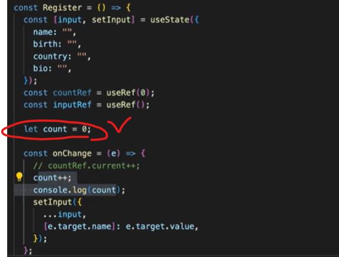

# [React] Inflearn 한입리액트 5

날짜: 2024년 12월 1일

[https://drive.google.com/file/d/1EOjrOhtzkzx_GCI_CKRYH4NmBSPT-ugw/view?usp=drive_web](https://drive.google.com/file/d/1EOjrOhtzkzx_GCI_CKRYH4NmBSPT-ugw/view?usp=drive_web)

# [강의를 들으면서 궁금한 점]

---

### Q1. React는 콧수염 구문을 사용하지 않나요??

- A: React에서는 콧수염 구문 {{}}을 사용하지 않습니다. 
대신 중괄호 {}를 사용하여 JavaScript 표현식을 삽입합니다.

| 특성 | Vue | React |
| --- | --- | --- |
| 구문 | 콧수염 구문 {{ }} | 중괄호 { } |
| 기반 | HTML **템플릿** | **JSX (JavaScript XML)** |
| JavaScript 표현식 | 제한된 표현식 지원 | 모든 **JavaScript 표현식 지원** |
| 컨텍스트 | Vue 인스턴스의 데이터 컨텍스트 | 컴포넌트의 JavaScript 컨텍스트 |
| 최적화 | Vue 프레임워크에 의해 처리 | JavaScript 엔진에 의해 직접 최적화 가능 |
| HTML과의 유사성 | 높음 | 낮음 |
| 유연성 | 상대적으로 낮음 | 높음 |
| 학습 곡선 | 상대적으로 낮음 | 상대적으로 높음 |
| 디자인 철학 | **HTML 템플릿 중심** | JavaScript 중심 |

### Q1-1. JS에서 단순 객체선언으로 `{}` 가 사용되는데 React의 `{}`의 역할과 
          명확한 구분이 있는지 궁금?

| 사용 사례 | 예시 | 설명 |
| --- | --- | --- |
| JavaScript 표현식 삽입 | `<div>{user.name}</div>` | 변수, 함수 호출 등 **JavaScript 표현식을 JSX에 삽입** |
| **객체 리터럴 
(이중 중괄호)** | `<div style={{ color: 'red' }}></div>` | CSS 스타일 등 객체를 JSX 속성에 전달 |
| 조건부 렌더링 | `{isLoggedIn && <UserGreeting />}` | 조건에 따라 컴포넌트나 요소를 렌더링 |
| 리스트 렌더링 | `<ul>{items.map(item => <li key={item.id}>{item.name}</li>)}</ul>` | 배열을 반복하여 JSX 요소 리스트 생성 |
| Props 전달 | `<MyComponent name={user.name} />` | 동적 값을 컴포넌트의 props로 전달 |
| 이벤트 핸들러 | `<button onClick={handleClick}>Click me</button>` | 이벤트 핸들러 함수를 JSX 요소에 연결 |

### Q1-2. 객체 리터럴과 이중 중괄호

---

| 개념 | 설명 | 예시 | 사용 상황 |
| --- | --- | --- | --- |
| 객체 리터럴 | **중괄호 {}를 사용하여 객체를 직접 생성**하는 방법 | `const obj = { key: 'value' };` | 일반 JavaScript 코드 |
| 단일 중괄호 | **JSX에서 JavaScript 표현식을 삽입**할 때 사용 | `<div>{variableName}</div>` | 변수, 함수 호출 등 삽입 시 |
| **이중 중괄호** | JSX에서 **객체 리터럴을 직접 사용할 때 필요** | `<div style={{ color: 'red' }}></div>` | 인라인 스타일, 객체를 prop으로 직접 전달 시 |
| 객체 변수 전달 | 이미 정의된 **객체 변수를 전달할 때는 단일 중괄호** 사용 | `<Component data={objectVariable} />` | 미리 정의된 객체를 prop으로 전달 시 |

이중 중괄호는 주로 **JSX 내에서 객체를 직접 정의할 때 사용되며,** 이는 인라인 스타일이나 객체를 직접 prop으로 전달할 때 흔히 볼 수 있습니다

### Q1-3. JSX에서 이중 중괄호 사용은 객체를 직접 정의하는 것?

[스타일 객체 직접 정의]

```jsx
<div style={{ color: 'red', fontSize: '14px' }}></div>
```

⇒ 이는 다음 JS객체와 동일

```jsx
{ color: 'red', fontSize: '14px' }
```

1. 이유:
    - 외부 중괄호 {}: JSX에서 JavaScript 표현식을 사용한다는 의미
    - **내부 중괄호 {}: JavaScript 객체 리터럴을 생성**
2. 장점:
    - 인라인으로 스타일을 직접 정의할 수 있어 편리함
    - 동적 스타일링이 쉬움
3. 주의점:
    - **CSS 속성명은 카멜케이스(camelCase)로 작성 (예: font-size → fontSize)**
    - 값은 대부분 문자열로 제공
4. 대안:
미리 정의된 스타일 객체를 사용할 수도 있습니다:
    
    ```jsx
    const styles = { color: 'red', fontSize: '14px' };
    return <div style={styles}></div>;
    
    ```
    

이 방식은 React에서 인라인 스타일을 적용할 때 일반적으로 사용되는 패턴

## Q2. boolean, undefined, null 등이 랜더링되지 않는데 true값을 랜더링 하려면 어떻게해야하는가?

- A: Boolean 값을 렌더링하려면 **문자열로 변환**해야 합니다. 
    예를 들어, {String(true)}와 같이 사용할 수 있습니다.

## Q3. 객체 자체를 랜더링하려하면 왜 오류가 뜨는가?

- A: React는 객체를 직접 렌더링할 수 없습니다. 
     객체의 특정 속성을 렌더링하거나, JSON.stringify()를 사용해 문자열로 변환해야 합니다.

### Q3-1. JSON.stringify()와 객체 렌더링의 관계

1. 객체 직접 렌더링의 문제:
React에서는 객체를 직접 렌더링할 수 없습니다. 예를 들어:
    
    ```jsx
    const obj = { name: "John", age: 30 };
    return <div>{obj}</div>; // 오류 발생
    
    ```
    
2. **JSON.stringify()의 역할:**
    - **객체를 문자열로 변환합니다.**
    - 이 문자열은 React에서 렌더링할 수 있습니다.
3. 사용 예시:
    
    ```jsx
    const obj = { name: "John", age: 30 };
    return <div>{JSON.stringify(obj)}</div>; // 작동함
    
    ```
    
4. 결과:
화면에 `{"name":"John","age":30}`와 같이 출력됩니다.
5. 주의사항:
    - 디버깅이나 간단한 표시용으로는 유용하지만, 실제 UI에는 적합하지 않을 수 있습니다.
    - 복잡한 객체의 경우 가독성이 떨어질 수 있습니다.
6. 대안:
    - **객체의 특정 속성만 렌더링: `<div>{obj.name}</div>`**
    - 객체를 적절한 JSX 구조로 변환하여 렌더링

결론적으로, **JSON.stringify()는 객체를 문자열로 변환하여 React에서 렌더링 가능한 형태로 만드는 방법** 중 하나입니다.

## Q4. 왜 jsx에는 모든 태그가 닫혀있어야하는가?

- A: JSX는 XML과 유사한 문법을 사용하며, XML에서는 모든 태그가 닫혀야 합니다.
    이는 코드의 명확성과 일관성을 위한 것입니다.

## Q5.  jsx라는게 정확하게 무엇인가?

- A: JSX는 JavaScript XML의 약자로, JavaScript에 XML을 추가한 확장 문법입니다. 
( 확장 가능한 마크업 언어 : XML ⇒ 데이터 전달에 중점)
React에서 UI를 설명하는데 사용됩니다.

```jsx
<book>
  <title>React 기초</title>
  <author>홍길동</author>
  <year>2023</year>
</book>
```

## Q6. import Header from './components/Header'
Vue에서는 @/components가 되었는데 React는 왜 안되는가?

- A: '@' 경로 별칭은 기본적으로 설정되어 있지 않습니다. 
webpack이나 다른 번들러 설정을 통해 경로 별칭을 추가할 수 있습니다.

## Q7. react의 구조는 function으로 많이 시작되는듯 함 
특히 구조는 : main = () => { return ( ) } 으로 보임 그러나 정확한 구조에 대한 이해가 어려움

- A: 함수형 컴포넌트에서 ()는 암시적 반환을 위해 사용됩니다. 
{}를 사용하면 명시적 return 문이 필요합니다.

### Q7-1. 구조 분해해보기

1. 함수 정의 구조:
    
    ```jsx
    const main = () => {
      // 함수 본문
    };
    
    // 전통적 함수 구조
    // function main() {
      // 함수 본문
    //}
    ```
    
    이는 ES6의 화살표 함수 문법입니다. 여기서 {}는 함수의 본문을 나타냅니다.
    
2. 반환 구문:
    - **명시적 반환:**
        
        ```jsx
        const main = () => {
          return (
            <div>Hello World</div>
          );
        };
        
        ```
        
    - 암시적 반환:
        
        ```jsx
        const main = () => (
          <div>Hello World</div>
        );
        
        ```
        
3. **()의 역할:**
    - **JSX를 그룹화합니다.**
    - **여러 줄의 JSX를 반환**할 때 사용합니다.
    - 암시적 반환을 가능하게 합니다.
4. {}와 ()의 차이:
    - **{}: 함수 본문을 나타내며, 여러 구문을 포함할 수 있습니다.**
    - **(): JSX를 그룹화하고, 단일 표현식으로 취급합니다.**
5. 암시적 반환의 장점:
    - 코드가 간결해집니다.
    - 단순한 컴포넌트에 적합합니다.

중요한 점은 ()를 사용한 암시적 반환은 JSX를 즉시 반환하는 간단한 컴포넌트에 유용하며, 
{}를 사용한 명시적 반환은 추가 로직이 필요한 경우에 사용된다는 것입니다.

## Q8. 그리고 return할때 {user.isLogin ? (<div>로그아웃</div>) : (<div>로그인</div>) } 이렇게 구문을 사용하는 이유가 뭔가요?

- A: 조건부 렌더링에서 **{}는 JavaScript 표현식**을, **()는 JSX를 그룹화**합니다.

| 구성 요소 | 역할 | 예시 |
| --- | --- | --- |
| {} | **JavaScript 표현식 실행** | {user.isLogin ? ... : ...} |
| 삼항 연산자 | 조건부 렌더링 | condition ? trueCase : falseCase |
| () | **JSX 요소 그룹화** | (<div>로그아웃</div>) |
| 전체 구조 | **조건부** JSX 렌더링 | {condition ? (JSX1) : (JSX2)} |

이 구조를 사용하면 컴포넌트 내에서 조건에 따라 다른 UI를 쉽게 렌더링할 수 있습니다.

### Q8-1. JSX에서 {} 표현식을 사용하는 이유

| 역할 | 설명 | 예시 |
| --- | --- | --- |
| 구분 | HTML과 JavaScript 구분 | `<div>{변수명}</div>` |
| 신호 | JavaScript 실행 지점 표시 | `{함수호출()}` |
| 안전 | 제한된 코드만 실행 | `{안전한_표현식}` |
| 일관성 | 모든 JavaScript에 동일 규칙 적용 | `{값1 + 값2}` |
| 효율 | React의 코드 처리 최적화 | `{조건 ? 값1 : 값2}` |

이렇게 {}를 사용함으로써 JSX에서 JavaScript를 안전하고 효과적으로 사용할 수 있습니다.

## Q9. React에서 className=""으로 설정하는 이유

- A: class는 JavaScript의 예약어이기 때문에 JSX에서는 className을 사용합니다.
 이는 HTML과 JavaScript 사이의 충돌을 방지하기 위함입니다.

## Q10. 정확하게 DOM이 무엇인지 CSS DOM은 무엇인지?

- A: DOM(Document Object Model)은 **HTML 문서의 프로그래밍 인터페이스**입니다. 
CSSOM(CSS Object Model)은 CSS의 프로그래밍 인터페이스로, 스타일 정보를 다룹니다.
1. DOM (Document Object Model):
    - **웹 페이지의 구조를 나타내는 트리 형태의 구조**입니다.
    - **HTML 요소들을 JavaScript로 조작**할 수 있게 해줍니다.
    - 예: document.getElementById('myDiv').innerHTML = '새로운 내용';
2. CSSOM (CSS Object Model):
    - 웹 페이지의 스타일 정보를 나타내는 구조입니다.
    - **CSS 스타일을 JavaScript로 읽거나 수정할 수 있게 해줍니다.**
    - 예: document.body.style.backgroundColor = 'blue';

간단한 비유를 들어보겠습니다:

- **DOM은 집의 구조(벽, 문, 창문 등)를 나타냅니다.**
- CSSOM은 집의 장식(페인트, 커튼, 가구 등)을 나타냅니다.

이를 표로 정리하면 다음과 같습니다:

| 특성 | DOM | CSSOM |
| --- | --- | --- |
| 대상 | HTML 구조 | CSS 스타일 |
| 역할 | 페이지 구조 표현 | 스타일 정보 표현 |
| 조작 대상 | HTML 요소 | CSS 속성 |
| 사용 예 | 요소 추가/삭제 | 스타일 변경 |
| 비유 | 집의 구조 | 집의 장식 |

두 모델을 통해 웹 개발자는 JavaScript를 사용하여 웹 페이지의 구조와 스타일을 동적으로 조작할 수 있다.

## Q9. React에서도 자식→ 부모 전달이 가능한지

- A. React에서도 자식 컴포넌트가 부모 컴포넌트와 통신할 수 있습니다.
- 이는 주로 콜백 함수를 통해 이루어집니다:
    - 부모 컴포넌트에서 함수를 정의하고, 이를 자식 컴포넌트에 prop으로 전달합니다.
    - **자식 컴포넌트는 이 함수를 호출하여 부모에게 데이터를 "전달"할 수 있습니다.**
    - React에서도 이벤트 버블링은 존재하지만, 주로 명시적인 prop 전달을 사용합니다.

## Q10. React에서 Props 사용 Vue와 비교

- A. React의 props와 Vue의 defineProps는 비슷한 개념이지만, 사용 방식에 차이가 있습니다:
    - **React: props를 함수 매개변수로 직접 받아 사용합니다. 별도의 정의 과정이 필요 없습니다.**
        
        ```jsx
        function Button({ text }) {
          return <button>{text}</button>;
        }
        <Button text="카페" />
        
        ```
        
    - Vue: defineProps를 사용하여 prop을 명시적으로 정의합니다.
    <Button :text="카페" />
        
        ```jsx
        <script setup>
        defineProps({
          text: String
        })
        </script>
        <template>
          <button>{{ text }}</button>
        </template>
        
        ```
        
- React는 더 유연하지만, Vue는 더 명시적인 접근 방식을 취합니다.

## Q11. React의 useState와 Vue의 ref, reactive와 비교

- 유사점: 모두 `반응형 상태를 관리`합니다.
- 차이점:
    - useState는 더 단순하고 직관적입니다. `상태와 갱신 함수를 한 번에 제공`합니다.
    - ref와 reactive는 Vue의 상태 관리 시스템에 더 깊이 통합되어 있습니다.

예시:

```jsx
// React
const [count, setCount] = useState(0);

// Vue
const count = ref(0);

```

### Q11-1. useState와 ref의 차이점 전격 해부해보기

| 특성 | React (useState) | Vue **(ref)** | Vue (reactive) |
| --- | --- | --- | --- |
| 선언 방식 | const [state, setState] = useState(initialValue) | const state = ref(initialValue) | const state = reactive({...}) |
| 값 접근 | state | **state.value** | state.property |
| 값 수정 | **set**State(newValue) | **state.value = newValue** | state.property = newValue |
| 주 사용 대상 | 모든 타입 | **원시** 타입 | 객체 |
| 컴포넌트 통합 | **함수형 컴포넌트** 내부 | 어디서나 사용 가능 | 어디서나 사용 가능 |
1. 카운터 예제:

React:

```jsx
function Counter() {
  const [count, setCount] = useState(0);

  return (
    <div>
      <p>Count: {count}</p>
      <button onClick={() => setCount(count + 1)}>Increment</button>
    </div>
  );
}

```

Vue:

```jsx
<script setup>
import { ref } from 'vue'

const count = ref(0)

function increment() {
  count.value++
}
</script>

<template>
  <div>
    <p>Count: {{ count }}</p>
    <button @click="increment">Increment</button>
  </div>
</template>

```

1. 객체 상태 관리:

React:

```jsx
function UserProfile() {
  const [user, setUser] = useState({ name: 'John', age: 30 });

  const updateAge = () => {
    setUser({ ...user, age: user.age + 1 });
  };

  return (
    <div>
      <p>Name: {user.name}, Age: {user.age}</p>
      <button onClick={updateAge}>Increase Age</button>
    </div>
  );
}

```

Vue:

```jsx
<script setup>
import { reactive } from 'vue'

const user = reactive({ name: 'John', age: 30 })

function updateAge() {
  user.age++
}
</script>

<template>
  <div>
    <p>Name: {{ user.name }}, Age: {{ user.age }}</p>
    <button @click="updateAge">Increase Age</button>
  </div>
</template>

```

주요 차이점:

1. 상태 선언: React는 useState로 상태와 setter 함수를 동시에 생성, Vue는 ref나 reactive로 반응형 상태를 생성합니다.
2. 값 접근/수정: **React는 상태 직접 접근과 setter 함수 사용, Vue의 ref는 .value 사용,** reactive는 직접 접근합니다.
3. 객체 상태 갱신: **React는 새 객체를 생성해야 하지만, Vue의 reactive는 직접 수정 가능**합니다.

이러한 차이로 인해 각 프레임워크에서의 상태 관리 패턴과 코드 구조가 달라집니다.

## Q12. 리렌더링과 반응형 객체

- 리렌더링: **컴포넌트의 UI를 다시 그리는 과정**
- 반응형 객체 vs 일반 객체:
    - **반응형 객체: 값이 변경되면 자동으로 UI 업데이트를 트리거**
    - 일반 객체: 값이 변경되어도 **`UI` 업데이트가 자동으로 일어나지 않음**

**예시:**

```jsx
// React
const [user, setUser] = useState({name: 'John'});
// user.name이 변경되면 자동으로 리렌더링

// 일반 객체
let normalUser = {name: 'John'};
// normalUser.name이 변경되어도 자동 리렌더링 안 됨

```

## Q13. JSX에서의 state 사용

- JSX에서는 중괄호 {}를 사용하여 JavaScript 표현식을 삽입합니다.
- **state 값을 표시할 때도 중괄호를 사용**해야 합니다.

예시:

```jsx
const [name, setName] = useState('John');
return <div>{name}</div>;  // 중괄호로 감싸서 사용

```

이유: JSX는 HTML과 유사하지만 JavaScript 표현식을 포함할 수 있어야 하므로, 중**괄호를 사용하여 JavaScript 코드임을 명시**합니다.

## Q14. option의 value 의미

- value는 각 옵션의 "숨겨진 값"이에요.
- 사용자에게는 "한국", "영국", "미국"이 보이지만, 컴퓨터는 "kr", "uk", "us"를 인식해요.
- 이렇게 하면 데이터 처리가 더 쉬워져요.

## Q15. set 함수의 작동 원리

| 상자 (State) | 초기 내용 | 교체 버튼 (Setter) | 사용 예시 |
| --- | --- | --- | --- |
| name | "이름" | setName | setName("김철수") |
| birth | "" | setBirth | setBirth("2000-01-01") |
| country | "" | setCountry | setCountry("kr") |
| bio | "" | setBio | setBio("안녕하세요") |

실제 React 컴포넌트에서 이를 사용하는 예시:

```jsx
import React, { useState } from 'react';

function UserProfile() {
  const [name, setName] = useState("이름");
  const [birth, setBirth] = useState("");
  const [country, setCountry] = useState("");
  const [bio, setBio] = useState("");

  const handleNameChange = (e) => setName(e.target.value);
  const handleBirthChange = (e) => setBirth(e.target.value);
  const handleCountryChange = (e) => setCountry(e.target.value);
  const handleBioChange = (e) => setBio(e.target.value);

  return (
    <div>
      <input value={name} onChange={handleNameChange} placeholder="이름" />
      <input value={birth} onChange={handleBirthChange} type="date" />
      <select value={country} onChange={handleCountryChange}>
        <option value="">국가 선택</option>
        <option value="kr">한국</option>
        <option value="uk">영국</option>
        <option value="us">미국</option>
      </select>
      <textarea value={bio} onChange={handleBioChange} placeholder="자기소개" />

      <div>
        <h2>프로필 미리보기</h2>
        <p>이름: {name}</p>
        <p>생년월일: {birth}</p>
        <p>국가: {country}</p>
        <p>자기소개: {bio}</p>
      </div>
    </div>
  );
}

export default UserProfile;

```

이 예시에서:

1. 각 입력 필드는 해당 상태(상자)와 연결되어 있습니다.
2. **onChange 이벤트가 발생할 때마다 (사용자가 입력할 때마다) 해당 setter 함수가 호출됩니다.**
3. **상태가 변경될 때마다 컴포넌트가 다시 렌더링되어 화면에 즉시 반영됩니다.**

이렇게 하면 사용자의 입력에 따라 실시간으로 프로필 미리보기가 업데이트되는 동적인 폼을 만들 수 있습니다.

### Q15-1. Vue의 V-model과 비교하기

1. Vue (v-model 사용):

```jsx
<template>
  <input v-model="name" placeholder="이름" />
</template>

<script setup>
import { ref } from 'vue'

const name = ref('이름')
</script>

```

1. React (useState + onChange):

```jsx
const [name, setName] = useState('이름');

return (
  <input
    value={name}
    onChange={(e) => setName(e.target.value)}
    placeholder="이름"
  />
);

```

주요 차이점:

1. 문법: Vue는 v-model 디렉티브를 사용하여 간단히 처리, **React는 value와 onChange를 명시적으로 설정합니다.**
2. 상태 관리: Vue는 ref나 reactive를 사용, React는 useState를 사용합니다.
3. 양방향 바인딩: Vue의 v-model은 자동으로 양방향 바인딩을 제공, **React는 이를 수동으로 구현**합니다.

두 접근 방식 모두 입력 필드와 상태를 동기화하는 데 효과적이지만, React의 방식이 더 명시적이고 Vue의 방식이 더 간결합니다.

## Q16. useState내 객체 사용 및 setSth 사용

- 목적: 반복적인 구조 제거
- 방법: useState({})로 여러 상태를 하나의 객체로 관리
- **onChange 이벤트 핸들러:**
    - 목적: 모든 입력 필드에 대해 하나의 함수로 상태 업데이트
    - 방법:
        - **setInput({...})**을 사용하여 **객체 형태**로 상태 업데이트
        - e.target.name을 사용하여 동적으로 업데이트할 속성 결정
    - 작동 원리:
        - **각 입력 필드에 name 속성 부여**
        - **e.target.name으로 해당 필드의 이름을 가져옴**
        - **[[e.target.name](http://e.target.name/)]: e.target.value로 동적으로 객체 속성 업데이트**

| 항목 | 이전 방식 | 개선된 방식 |
| --- | --- | --- |
| 상태 정의 | 여러 useState 호출 | 하나의 useState로 객체 관리 |
| 상태 구조 | const [name, setName] = useState('') | const [input, setInput] = useState({name: '', ...}) |
| 이벤트 핸들러 | 각 필드마다 별도 함수 | 하나의 onChange 함수로 통합 |
| 상태 업데이트 | setName(e.target.value) | **setInput({...input, [[e.target.name](http://e.target.name/)]:** e.target.value}) |
| JSX 구조 | onChange={onChangeName} | onChange={onChange} name="name" |

이 방식의 장점:

1. 코드 중복 감소
2. 상태 관리 단순화
3. 확장성 향상 (새 필드 추가 시 용이)

## Q17. useRef, useState의 차이 그리고 일반 함수

| 특징 | useState | useRef |
| --- | --- | --- |
| 목적 | 화면에 보이는 값을 관리 | 화면과 상관없는 값이나 DOM을 관리 |
| 변경 시 | 화면이 다시 그려짐 | 화면이 다시 그려지지 않음 |
| 사용 시기 | **사용자에게 보여줄 내용** | **내부적으로만 필요한 값들** |

쉬운 예시로 설명하자면:

1. useState는 마치 칠판과 같아요:

```jsx
const [score, setScore] = useState(0);
// 선생님이 칠판에 점수를 쓰면 모든 학생이 볼 수 있어요

```

1. useRef는 선생님의 메모장 같아요:

```jsx
const teacherNote = useRef(0);
// 선생님이 메모장에 뭔가 적어도 학생들은 모르죠

```

실제 사용 예시:

```jsx
// useState - 학생들의 점수 표시
const [score, setScore] = useState(0);
<div>현재 점수: {score}</div>

// useRef - 선생님의 비상연락망
const emergencyContact = useRef();
<input ref={emergencyContact} />

```

이렇게 생각하면 됩니다:

- useState: 모두가 봐야 하는 정보
- **useRef: 내부적으로만 필요한 정보나 DOM 요소**

### Q17-1. 일반함수를 사용하면 안되나?

| 구분 | 값 유지 | 리렌더링 | 사용 목적 |
| --- | --- | --- | --- |
| useState | O | O (값 변경 시 자동 리렌더링) | 화면에 표시되는 상태 관리 |
| useRef | O | X (값이 변해도 리렌더링 안됨) | DOM 참조, 내부 값 관리 |
| 일반 변수 | X | X | 임시 값 저장 |
1. useState: 전광판
    - 값이 바뀌면 모두가 볼 수 있게 화면이 업데이트됨
    - 예: 점수판, 시계
2. useRef: 메모장
    - **값은 계속 유지되지만 화면에는 영향 없음**
    - **컴포넌트가 리렌더링되어도 값이 보존됨**
    - 예: 선생님의 출석부
3. 일반 변수: 메모지
    - 컴포넌트가 리렌더링되면 **값이 초기화됨**
    - **임시로 사용하고 버리는 용도**



useRef를 사용하는 이유:

- 컴포넌트가 리렌더링되어도 값을 유지하고 싶을 때
- DOM 요소에 직접 접근해야 할 때 (focus, 스크롤 등)
- 불필요한 리렌더링을 피하면서 값을 관리하고 싶을 때

### Q17-2. useRef의 current 작동원리 더 알아보기

1. useRef와 current의 관계를 우편함에 비유하면:
- useRef는 우편함
- current는 우편함 안의 공간
- **우편함 주인(컴포넌트)이 바뀌어도 우편함 안의 내용물은 유지됨**
1. DOM 참조시 current의 동작:

```jsx
const inputRef = useRef();
<input ref={inputRef} />

```

이것은 마치:

- 우편함(inputRef)에 "이 input 요소의 주소"를 넣는 것
- inputRef.current로 언제든 그 input에 접근 가능
- focus(), blur() 등 DOM 조작 가능

| useRef 동작 | 실생활 비유 |
| --- | --- |
| useRef 생성 | 새 우편함 설치 |
| .current 할당 | 우편함에 물건 넣기 |
| .current 접근 | 우편함에서 물건 꺼내기 |
| 리렌더링 시 | 우편함 내용물 유지 |

예시:

```jsx
// 우편함 만들기
const countRef = useRef(0);

// 우편함에 새 값 넣기
countRef.current++;

// 우편함에서 값 확인하기
console.log(countRef.current);

```

이렇게 current는 마치 우편함처럼 값을 안전하게 보관하고, 필요할 때 꺼내 쓸 수 있는 공간이라고 이해하시면 됩니다.

## Q18. 리액트 훅

