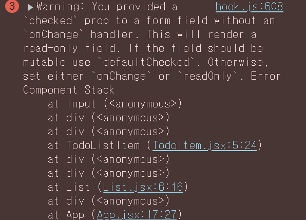

# [React] TodoList 복습2

날짜: 2024년 12월 3일

# You provided a `checked` prop to a form field without an `onChange` handler. This will render a read-only field. If the field should be mutable use `defaultChecked`. Otherwise, set either `onChange` or `readOnly`. Error Component Stack

---



- onChange Handler를 사용하라는 의미
- 아니면 readOnly를 사용해라 라는 의미 == 수정

# [지난 시간 궁금한 점 ]

---

## 1. TodoItem과 List의 구조에 대해:

---

- 중앙 관리와 개별 컴포넌트 관리는 애플리케이션의 구조와 요구사항에 따라 다릅니다.
- **List에서 map을 사용하여 TodoItem을 생성하는 것은 일반적인 패턴**입니다.
- `todo.id`, `todo.title` 등을 사용하는 것은 문제없습니다. 이는 각 todo 항목의 속성에 접근하는 올바른 방법입니다.

## 1-1. 중앙 관리 / 개별 관리

---

- TodoItem 컴포넌트 내에서 map을 사용하는 것은 일반적인 패턴은 아닙니다. 일반적으로 **List 컴포넌트에서 map을 사용하여 TodoItem을 생성하는 것이 더 흔한 패턴**입니다. 이에 대해 설명드리겠습니다:
1. 컴포넌트 구조:
    - List 컴포넌트: todo 배열을 props로 받아 map을 사용해 TodoItem들을 렌더링합니다.
    - TodoItem 컴포넌트: 단일 todo 항목을 표시합니다.
2. 중앙 관리 vs 개별 관리:
    - 중앙 관리: App 또는 상위 컴포넌트에서 전체 todo 목록을 관리합니다.
    - 개별 관리: 각 TodoItem은 자신의 상태만 관리합니다.
3. 권장되는 구조:

```jsx
// List 컴포넌트
const List = ({ todos }) => {
  return (
    <div>
      {todos.map(todo => (
        <TodoItem key={todo.id} todo={todo} />
      ))}
    </div>
  );
};

// TodoItem 컴포넌트
const TodoItem = ({ todo }) => {
  return (
    <div>
      <h4>{todo.title}</h4>
      <p>{todo.date}</p>
    </div>
  );
};

```

이 구조를 사용하면 각 컴포넌트의 책임이 명확해지고, 재사용성과 유지보수성이 향상됩니다. 버튼의 집합을 별도의 Controller 컴포넌트로 관리하는 것도 좋은 접근 방식입니다.

### 1-1-1. 중앙 관리 (App 또는 상위 컴포넌트에서 관리):

- **여러 컴포넌트에서 공유되는 데이터일 때**
- 전체 애플리케이션의 상태를 일관되게 유지해야 할 때
- 데이터 흐름이 복잡하고 여러 컴포넌트 간 상호작용이 많을 때

### 1-1-2. 개별 관리 (컴포넌트 내부에서 관리):

- 해당 컴포넌트에서만 사용되는 로컬 상태일 때
- **상태 변경이 다른 컴포넌트에 영향을 주지 않을 때**
- 간단한 UI 상태 (예: 토글, 폼 입력 등)를 다룰 때

결론적으로, 상태 관리의 편의성과 애플리케이션의 구조를 고려하여 적절한 방식을 선택해야 합니다. **작은 규모의 앱에서는 컴포넌트 내부 상태 관리로 충분할 수 있지만, 앱이 커지고 복잡해질수록 중앙화된 상태 관리**가 더 효율적일 수 있습니다.

## 2. `useRef`와 ID 관리:

---

- `num = useRef(3)`는 ID를 관리하기 위한 좋은 방법입니다.
- `useRef`는 렌더링 사이에 값을 유지하면서 변경해도 리렌더링을 트리거하지 않습니다.
- **이는 state와 달리 변경 시 컴포넌트를 다시 렌더링하지 않아도 되는 값에 적합합니다.**

## 3. 새로운 todo 객체 생성:

---

- 새로운 todo 객체를 생성하는 것은 반응형이 아닙니다. 이는 불변성을 유지하기 위한 것입니다.
- React에서는 **상태 업데이트 시 새로운 객체를 생성**하는 것이 권장됩니다.

## 4. 객체 리터럴 문법:

---

- `{ }` 와 `({ })` 의 차이:
    - `{ }`: 일반적인 객체 리터럴
    - `({ })`: **주로 화살표 함수에서 객체를 즉시 반환할 때 사용**됩니다.
- 여기서는 `{ }` 사용이 적절합니다.

요약하면, 현재의 구조와 접근 방식은 React의 일반적인 패턴을 따르고 있으며 적절합니다. `useRef`를 사용한 ID 관리와 새로운 객체 생성 방식은 React의 권장 사항에 부합합니다.

## ⚠️ 5. 하위 컴포넌트 관리, 중앙 관리 : state 관련

---

| 특성 | 하위 컴포넌트에서 useRef 사용 | 상위 컴포넌트에서 state 관리 |
| --- | --- | --- |
| 데이터 범위 | 컴포넌트 로컬 | **여러 컴포넌트 공유** |
| 리렌더링 | **값 변경 시 리렌더링 없음** | 값 변경 시 리렌더링 발생 |
| 사용 사례 | **폼 입력, DOM 조작** | 공유 데이터, 전역 상태 |
| 데이터 전달 | **이벤트 발생 시 (예: 제출)** | **실시간** |
| 성능 | 더 좋음 (불필요한 리렌더링 방지) | 상대적으로 덜 좋음 |
| 디버깅 | 상대적으로 어려움 | 더 쉬움 |
| 코드 복잡성 | 단순함 | 상대적으로 복잡함 |
| 반응성 | 낮음 (수동 업데이트 필요) | **높음 (자동 업데이트)** |

### 5-1. 상위 컴포넌트에서 상태 관리 (중앙 집중식)

```jsx
const TodoApp = () => {
  const [todos, setTodos] = useState([]);

  const addTodo = (newTodo) => {
    setTodos([...todos, newTodo]);
  };

  const toggleTodo = (id) => {
    setTodos(todos.map(todo =>
      todo.id === id ? {...todo, completed: !todo.completed} : todo
    ));
  };

  return (
    <div>
      <TodoForm addTodo={addTodo} />
      <TodoList todos={todos} toggleTodo={toggleTodo} />
    </div>
  );
};

---------------------------------------------------------------------------------

const TodoForm = ({ addTodo }) => {
  const [text, setText] = useState('');

  const handleSubmit = (e) => {
    e.preventDefault();
    addTodo({ id: Date.now(), text, completed: false });
    setText('');
  };

  return (
    <form onSubmit={handleSubmit}>
      <input
        value={text}
        onChange={(e) => setText(e.target.value)}
        placeholder="할 일 추가"
      />
      <button type="submit">추가</button>
    </form>
  );
};

---------------------------------------------------------------------------------

const TodoList = ({ todos, toggleTodo }) => (
  <ul>
    {todos.map(todo => (
      <li key={todo.id} onClick={() => toggleTodo(todo.id)}>
        {todo.text} - {todo.completed ? '완료' : '미완료'}
      </li>
    ))}
  </ul>
);

```

장점:

- 전체 상태를 한 곳에서 관리하여 데이터 흐름이 명확합니다.
- 여러 컴포넌트에서 공유되는 상태를 쉽게 관리할 수 있습니다.
- 상태 변경 로직이 중앙화되어 있어 디버깅이 용이합니다.

### 5-2.하위 컴포넌트에서 상태 관리 (분산식)

```jsx
const TodoApp = () => {
  return (
    <div>
      <TodoForm />
      <TodoList />
    </div>
  );
};

-----------------------------------------------------------------
const TodoForm = () => {
  const [text, setText] = useState('');

  const handleSubmit = (e) => {
    e.preventDefault();
    // 로컬 스토리지나 컨텍스트 API를 사용하여 todo 추가
    const newTodo = { id: Date.now(), text, completed: false };
    const todos = JSON.parse(localStorage.getItem('todos') || '[]');
    localStorage.setItem('todos', JSON.stringify([...todos, newTodo]));
    setText('');
  };

  return (
    <form onSubmit={handleSubmit}>
      <input
        value={text}
        onChange={(e) => setText(e.target.value)}
        placeholder="할 일 추가"
      />
      <button type="submit">추가</button>
    </form>
  );
};
-------------------------------------------------------

const TodoList = () => {
  const [todos, setTodos] = useState([]);

  useEffect(() => {
    const storedTodos = JSON.parse(localStorage.getItem('todos') || '[]');
    setTodos(storedTodos);
  }, []);

  const toggleTodo = (id) => {
    const updatedTodos = todos.map(todo =>
      todo.id === id ? {...todo, completed: !todo.completed} : todo
    );
    setTodos(updatedTodos);
    localStorage.setItem('todos', JSON.stringify(updatedTodos));
  };

  return (
    <ul>
      {todos.map(todo => (
        <li key={todo.id} onClick={() => toggleTodo(todo.id)}>
          {todo.text} - {todo.completed ? '완료' : '미완료'}
        </li>
      ))}
    </ul>
  );
};

```

장점:

- 각 컴포넌트가 자신의 상태를 독립적으로 관리하여 컴포넌트 간 결합도가 낮아집니다.
- 컴포넌트를 재사용하기 쉽습니다.
- 상위 컴포넌트의 리렌더링이 하위 컴포넌트에 영향을 미치지 않아 성능상 이점이 있을 수 있습니다.

이 두 접근 방식은 애플리케이션의 규모와 복잡성, 그리고 요구사항에 따라 선택할 수 있습니다. 작은 규모의 앱에서는 하위 컴포넌트 관리가 간단할 수 있지만, 큰 규모의 앱에서는 중앙 집중식 관리가 더 효율적일 수 있습니다.

# [오류] Search조건 필터링 에러

---

```jsx
import { useState } from 'react'
import './List.css'
import TodoItem from './TodoItem'

// input tag의 검색내용을 기반으로 찾는 것 => 중앙과 무관 내부데이터 자체가 다 몰려있음
const List = ({todo}) => {
  const [search, setSearch] = useState('')
  //search => search로 원하는 것 찾기
  //input값에 따라서

  const onChangeSearch = (e) => {
    //search에 값 담아주기
    console.log(e.target.value)
    setSearch(e.target.value)
    //search에 해당 값이 계속담긴다.
  }
  
  //그리고 list에 있는 친구들은 onChangeSearch 내용 기반으로 확인
  //filter와 includes
  //todoItem 내역이 바껴야하는데,,
  //여기 todo.map으로 빠지는 내역이 바뀐다.
  //해당 내용
  const searchFilter = (search) => {
    todo.map((item) => item.title.includes(search) ? item.title.includes(search):item)
  }

  return (
    <div className="List">
      <div>Todos 🔍</div>
      <div className="ListSearch">
        <input type="text" 
        value={search}
        placeholder="검색어를 입력하세요" 
        onChange={onChangeSearch}/>
      </div>
      <div className="ListInput">
        {todo.map((item) => (
          <TodoItem 
            key={item.id}
            todo={item}
          />
        ))}
      </div>
    </div>
  )
}

export default List
```

<aside>
💡

**수정 사항**

</aside>

```jsx
  const searchFilter = (search) => { //참인것만 반환
    return todo.filter((item) => item.title.toLowerCase().includes(search.toLowerCase()))
  }//참인 데이터만 반환

```

```jsx
      <div className="ListInput">
        {searchFilter(search).map((item) => (
          <TodoItem 
            key={item.id}
            todo={item}
          />
        ))}
      </div>
```

1. filter 사용 이유:
    - `filter` 메소드는 배열의 각 요소에 대해 **주어진 조건을 만족하는 요소만을 모아 새로운 배열**을 만듭니다.
    - 여기서는 검색어와 일치하는 할 일 항목만을 선별하는 데 사용됩니다.
2. includes 사용:
    - **`includes` 메소드는 문자열에 특정 문자열이 포함되어 있는지 확인합니다.**
    - `item.title.toLowerCase().includes(search.toLowerCase())`는 할 일의 제목(소문자로 변환)에 검색어(소문자로 변환)가 포함되어 있는지 확인합니다.
    - 이 조건이 `true`인 항목만 `filter`에 의해 선택됩니다.
3. searchFilter 동작 원리:
    - `searchFilter(todo, search)`를 호출할 때, 전체 할 일 목록(`todo`)과 현재 검색어(`search`)를 전달합니다.
    - **검색어가 비어있을 때(`search === ''`), `includes` 조건은 모든 항목에 대해 `true`를 반환하므로 모든 할 일이 표시됩니다.**
    - 검색어가 입력되면, 그에 맞는 할 일만 필터링됩니다.

따라서 별도의 true/false 조건문을 작성할 필요가 없습니다. `filter`와 `includes`의 조합이 이미 그 역할을 수행하고 있습니다. 이 방식은 간결하고 효율적으로 검색 기능을 구현할 수 있게 해줍니다.

## [궁금한 점] JS의 include 동작

---

1. JavaScript의 `includes` 메소드 동작:
    - **빈 문자열 `''`은 모든 문자열의 부분 문자열입니다.**
    - **따라서 `"어떤문자열".includes('')`는 항상 `true`를 반환합니다.**
2. 검색 로직에 적용:
    
    ```jsx
    item.title.toLowerCase().includes(search.toLowerCase())
    
    ```
    
    - **`search`가 빈 문자열일 때, 이 조건은 모든 `item.title`에 대해 `true`가 됩니다.**
3. 예시:
    
    ```jsx
    "안녕하세요".includes('')  // true
    "Hello".includes('')       // true
    "".includes('')            // true
    
    ```
    

따라서 검색어가 비어있을 때, `filter` 함수는 모든 항목을 포함하게 되어 전체 목록이 그대로 표시됩니다. 이는 의도적인 설계로, 사용자가 검색어를 지웠을 때 자연스럽게 전체 목록으로 돌아가게 합니다.

# [오류] 값을 받아오게 만들 수 있으나 id값이 없어서 일치를 시키지 못함.. 어디서 빠진걸까

---

```jsx
  const [todo, setTodo] = useState(todos) 
  const num = useRef(3) //3부터 시작

  //update
  const onUpdateTodo = (checked) => {
    //input으로 isDone값을 받아올 것 
    //id를 받아와서 true / false 비교해서 isDone을 toggle 해줄 것
    //set으로 영향을 줘야하거든?
    //true false는 받아왔는데 그 아이디를 어떻게 바꿔줌?
    //checked이면 그것을 isDOne을 변경 => id 어떻게 바꿔옴?
    todo.map((item) => {
      if (checked) { //트루면 false로
        item.isDone = false
      } else {
        item.isDone = true
      }
    })
  }
```

⇒ 지피티에게 아이디어 요청

```jsx
1. ID 활용: 각 todo 항목을 식별하기 위해 ID를 사용해야 합니다. 
   현재는 ID를 사용하고 있지 않아 어떤 항목을 업데이트해야 할지 모릅니다.
   
2. 상태 불변성: React에서 상태를 업데이트할 때는 불변성을 유지해야 합니다. 
   직접 객체를 수정하는 대신 새로운 배열을 만들어야 합니다.
   
3. 데이터 흐름: App 컴포넌트에서 상태를 관리하고 있으므로, 업데이트 로직도 여기에 있어야 합니다.

4. 이벤트 핸들러 체인: TodoItem에서 시작된 이벤트가 List를 거쳐 App까지 전달되어야 합니다. 
    이 과정에서 필요한 정보(ID와 새로운 상태)를 함께 전달해야 합니다.
    
이 포인트들을 고려하여 코드를 수정해 보세요. 

특히 onUpdateTodo 함수에서 어떤 todo 항목을 업데이트해야 하는지 식별하는 방법을 고민해 보세요.
```

⇒ id값에 접근.. 여기만 해결하면 일단 알 수 있을 것 같은데 뭘까 : 여기까지의 생각이 `hell`

```jsx
[힌트]
const onUpdateTodo = (id, newIsDone) => {
  // 여기서 id를 사용하여 특정 todo 항목을 찾고 업데이트할 수 있습니다.
}
```

<aside>
💡

수정 사항

</aside>

```jsx
      <input 
        type="checkbox"
        onChange={()=>onChangeUpdate(todo)}
        checked={todo.isDone}
      />
```

```jsx
  //onChangeCheck를 누르면 checked가 수정될 것
  const onChangeUpdate = (todo) => {
    console.log(todo)
    onChangeCheck(todo.id) //todo의 id를 전달해준다.
  }
```

# [오류] 토글이 되지 않는 문제 발생

---

```jsx
  //update
  const onUpdateTodo = (checkedId) => {
    //console.log로 확인
    console.log(checkedId, 'app까지 왔는가?') //온 것 확인됨
    //이제 이것으로 영향을 줄 것
    //이것으로 id값 판별해서 수정하는 것임 
    //새로운 배열로 반환? == 일단 해보면서
    todo.map((item) => {
      if (item.id === checkedId) {
        //같으면 => isDone을 toggle해줄 것 => 만약 true면 false, false면 true
        (item.isDone === true) ? !item.isDone : item.isDone //true면 false
      }
    })
  }
```

⇒ 지피티 힌드

```jsx
토글 접근 방식은 좋은 시도입니다만, 몇 가지 개선이 필요해 보입니다:

1. 불변성: React에서는 상태를 직접 수정하지 않고, 새로운 배열을 생성해야 합니다.

2. 조건부 연산자 사용: 현재 조건부 연산자가 올바르게 사용되지 않았습니다.

3. 상태 업데이트: `map`의 결과를 새로운 상태로 설정해야 합니다.

4. 반환값: `map` 함수 내에서 각 항목에 대해 새로운 객체를 반환해야 합니다.

이러한 점들을 고려하여 코드를 수정해 보세요. 
특히 `setTodo` 함수를 사용하여 새로운 상태를 설정하는 것을 잊지 마세요. 
그리고 각 todo 항목에 대해 새로운 객체를 생성하여 불변성을 유지하는 방법을 고민해 보세요.
```

## [궁금한 점]

---

## 1. React에서 전체 객체를 교체하는 이유

---

- React는 얕은 비교(shallow comparison)를 사용하여 상태 변화를 감지합니다.
- **객체의 참조가 변경되어야 React가 변화를 인식하고 리렌더링을 수행**합니다.
- **이 방식은 성능 최적화를 위한 것으로, 메모리 사용량 증가는 미미**합니다.

## 2. 불변성 유지의 의미

---

- `...item`은 스프레드 연산자로, 기존 객체의 모든 속성을 새 객체에 복사합니다.
- 이후 `isDone: !(item.isDone)`으로 **특정 속성만 변경합니다.**
- 결과적으로 새로운 객체가 생성되어 React가 변화를 감지할 수 있습니다.

## 3. 토글 기능

---

- **`!(item.isDone)`은 토글 역할을 합니다.**
- `true`는 `false`로, `false`는 `true`로 변환됩니다.

이 방식은 React의 상태 관리 원칙을 따르며, 예측 가능한 상태 업데이트를 가능하게 합니다. 성능 면에서도 대부분의 경우 충분히 효율적입니다.

# [오류] 삭제 필드 추가 후 : Cannot read properties of undefined (reading 'title')

---

```jsx
  const onDeleteTodo = (checkedId) => {
    console.log(checkedId, 'app까지 왔는가2?') //온 것 확인됨

    const newTodo = todo.filter((item) => { //일치하는 것만 뽑으면
      if (item.id === checkedId) {
        return //값 자체를 안넣고 지나감
      }
      return item //나머지는 넣고
    })
    setTodo(newTodo) // 새로운 Todo로 상태 업데이트
  }
```

⇒ 기존에 map으로 했을 떄 오류

```jsx
Uncaught TypeError: Cannot read properties of undefined (reading 'title')
```

```jsx
Uncaught TypeError: Cannot read properties of undefined (reading 'title')
    at List.jsx:30:39
    at Array.filter (<anonymous>)
    at searchFilter (List.jsx:30:17)
    at List (List.jsx:43:10)
```

```jsx
"Cannot read properties of undefined (reading 'title')":
이 오류는 undefined 객체의 'title' 속성을 읽으려고 할 때 발생합니다.
searchFilter 함수에서 todo 배열의 일부 항목이 undefined일 수 있습니다.

"The above error occurred in the <List> component":
이 오류는 List 컴포넌트 내에서 발생했음을 나타냅니다.

"Consider adding an error boundary":
React는 오류 처리를 위해 에러 경계(Error Boundary) 사용을 권장합니다
```

## 왜 filter로는 안되었을까?

---

### 1. **map()**

- **목적**: 배열의 **각 요소를 변환하여 새로운 배열을 생성**합니다.
- **사용 사례**: 데이터를 변환할 때. 예를 들어, 사용자 목록에서 각 사용자 객체를 컴포넌트로 변환할 때 사용합니다.

```jsx
const users = [{ name: 'Alice' }, { name: 'Bob' }];
const userComponents = users.map(user => <UserCard name={user.name} />);

```

### 2. **filter()**

- **목적**: **특정 조건을 만족하는 요소만**을 포함하는 새로운 배열을 생성합니다.
- **사용 사례**: 데이터에서 특정 조건을 만족하는 항목을 선택할 때. 예를 들어, 완료된 할 일만 필터링할 때 사용합니다.

```jsx
const todos = [{ title: 'Task 1', isDone: true }, { title: 'Task 2', isDone: false }];
const completedTodos = todos.filter(todo => todo.isDone);

```

### 3. **reduce()**

- **목적**: 배열의 **모든 요소를 하나의 값으로 축약**합니다.
- **사용 사례**: 합계 계산, 객체 생성 등. 예를 들어, todo 목록에서 완료된 할 일의 수를 세는 경우에 사용할 수 있습니다.

```jsx
const todos = [{ title: 'Task 1', isDone: true }, { title: 'Task 2', isDone: false }];
const completedCount = todos.reduce((count, todo) => todo.isDone ? count + 1 : count, 0);

```

### 요약

- *map()**은 **데이터를 변환**할 때 사용하고,
- *filter()**는 특정 **조건에 맞는 데이터를 선택할 때 사용**하며,
- *reduce()**는 데이터를 축약하여 단일 값으로 만들 때 사용합니다.

### 에러 관련

`filter()`와 `map()`의 차이점은 반환값에 있습니다:

- `filter()`는 조건에 맞지 않는 요소를 제외하고 새로운 배열을 만듭니다.
- `map()`은 모든 요소를 변환하여 새로운 배열을 만듭니다.

이러한 메소드들은 React에서 데이터를 렌더링할 때 자주 사용되며, 적절한 메소드를 선택하는 것이 중요합니다. 각 메소드의 목적과 상황에 맞게 사용하는 것이 효율적인 코드를 작성하는 데 도움이 됩니다.