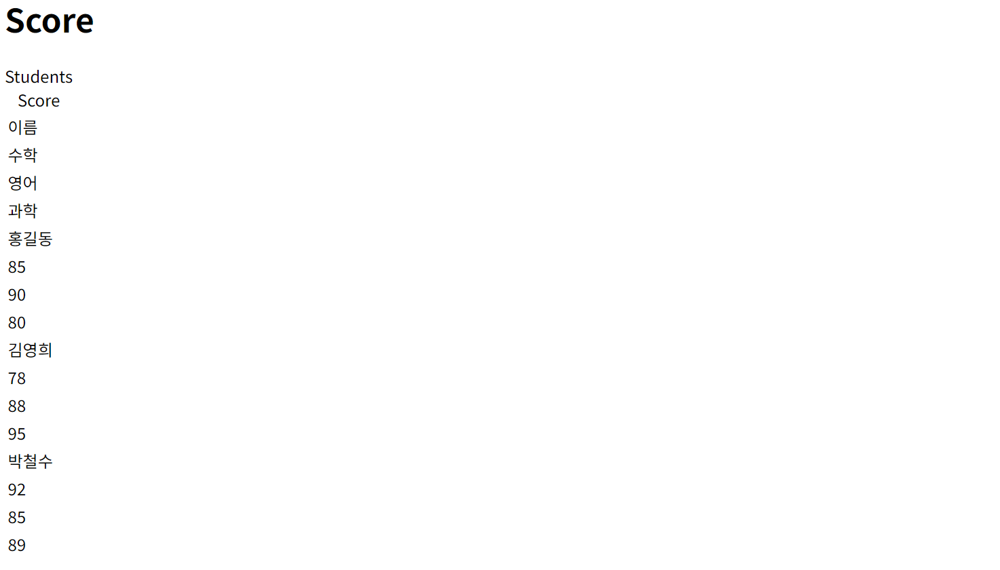

# [추가] 다차원 리스트 렌더링 실습해보기

날짜: 2024년 12월 10일

# 다차원 리스트 렌더링이란?

---

<aside>
💡

- 다차원 리스트 렌더링은 복잡한 데이터를 관리하고 표현하는 데 매우 유용한 방법입니다.
- 특히 표 형식의 데이터나 관계형 데이터를 처리할 때 강력한 도구가 될 수 있습니다.
</aside>

- 다차원 리스트 렌더링은 `배열(또는 리스트) 내`에 `또 다른 배열이 포함된 구조`를 렌더링하는 방식입니다.
- 이는 2차원 또는 그 이상의 데이터 구조를 표현할 수 있게 해 주며, **일반적으로 표 형식의 데이터나 그리드 형식의 데이터를 표시할 때 유용합니다.**
    - 예를 들어, **학교 시간표, 행정 데이터, 게임의 맵, 이미지 그리드 등이 다차원 리스트**로 표현될 수 있습니다.

## 활용 사례

---

### **1. 표 형식 데이터 표시**:

- 데이터의 표현이 필요할 때, 예를 들어 학생 성적표, 쇼핑몰의 상품 리스트, 다양한 통계 자료 등을 표 형식으로 나열할 수 있습니다.

```jsx
function ProductTable({ products }) {
  return (
    <table>
      <thead>
        <tr>
          <th>상품명</th>
          <th>가격</th>
          <th>재고</th>
        </tr>
      </thead>
      <tbody>
        {products.map((product, i) => (
          <tr key={i}>
            <td>{product.name}</td>
            <td>{product.price}</td>
            <td>{product.stock}</td>
          </tr>
        ))}
      </tbody>
    </table>
  );
}

```

### **2. 시간표 표현**:

- 학교의 수업 시간표를 배열의 배열 형식으로 정의하여 요일과 시간을 기준으로 과목을 정리할 수 있습니다. 이는 학사 관리 시스템에서 자주 사용됩니다.

```jsx
function TimeTable({ schedule }) {
  return (
    <table>
      <tbody>
        {schedule.map((day, i) => (
          <tr key={i}>
            {day.map((subject, j) => (
              <td key={j}>{subject}</td>
            ))}
          </tr>
        ))}
      </tbody>
    </table>
  );
}

```

### **3. 그리드 레이아웃**:

- 이미지 갤러리 등에서 이미지를 그리드 형식으로 표시할 때 다차원 리스트를 사용할 수 있습니다.

### **4. 게임 스프레드 시트**:

- 게임 맵을 2D 배열로 관리하여 각 위치에 객체나 적을 배치할 때 유용합니다.

## 왜 다차원 리스트를 선호할까?

---

| **장점** | **설명** |
| --- | --- |
| **구조화된 데이터 표현** | 다차원 리스트를 사용하면 관계형 데이터를 구조화하여 표현할 수 있으며, 데이터 간의 관계를 쉽게 이해하고 시각적으로 나타낼 수 있습니다. |
| **가독성** | 다차원 리스트를 통해 코드를 작성하면 데이터 구조가 명확해져 가독성이 높아집니다. 
각 리스트가 무엇을 의미하는지 쉽게 파악할 수 있습니다. |
| **유연성** | 사용자는 데이터를 다양한 방법으로 조작할 수 있으며, 행과 열을 조정하여 필요한 정보를 유동적으로 표시할 수 있습니다. |
| **편리한 렌더링** | React의 map 함수를 활용하여 배열의 배열을 쉽게 순회하면서 컴포넌트를 렌더링할 수 있습니다. React는 배열의 인덱스를 키로 사용하여 성능을 최적화하고, 데이터 변화 시 UI에 쉽게 반영할 수 있습니다. |

# 예제

---

- 학교의 시간표를 표시하는 컴포넌트를 만들겠습니다. 이 컴포넌트는 데이터의 배열을 기반으로 주어진 시간표를 2차원 테이블 형식으로 렌더링합니다.

### 1. 프로젝트 구조 설정

먼저, 프로젝트 구조를 다음과 같이 설정해 보세요:

```
/your-project
  ├─ /src
      ├─ /components
          ├─ Schedule.jsx
      ├─ App.jsx
      ├─ index.js

```

### 2. 데이터 정의

`App.jsx`에서 사용할 시간표 데이터를 정의합니다.

```jsx
// src/App.jsx
import React from "react";
import Schedule from "./components/Schedule";

const App = () => {
  // 시간표 데이터: 5일 (월~금), 각 요일마다 4개의 수업
  const classes = [
    ["수학", "과학", "체육", "미술"],    // 월요일
    ["영어", "역사", "체육", "음악"],    // 화요일
    ["물리", "화학", "수학", "역사"],    // 수요일
    ["미술", "체육", "영어", "수학"],    // 목요일
    ["체육", "과학", "화학", "음악"],    // 금요일
  ];

  return (
    <div>
      <h1>학교 시간표</h1>
      <Schedule classes={classes} />
    </div>
  );
};

export default App;

```

### 3. 다차원 리스트 렌더링 컴포넌트 작성

이제 `Schedule.jsx` 파일을 만들어 시간표를 렌더링할 컴포넌트를 작성합니다.

```jsx
// src/components/Schedule.jsx
import React from "react";

const Schedule = ({ classes }) => {
  return (
    <table>
      <thead>
        <tr>
          <th>시간</th>
          <th>월요일</th>
          <th>화요일</th>
          <th>수요일</th>
          <th>목요일</th>
          <th>금요일</th>
        </tr>
      </thead>
      <tbody>
        {/* 각 시간대에 대한 수업을 반복해서 렌더링 */}
        {classes.map((day, timeIndex) => (
          <tr key={timeIndex}>
            <td>{`${timeIndex + 1}교시`}</td>
            {day.map((lesson, dayIndex) => (
              <td key={dayIndex}>{lesson}</td>
            ))}
          </tr>
        ))}
      </tbody>
    </table>
  );
};

export default Schedule;

```

### 결론

이 예제를 통해 다차원 리스트 렌더링을 활용하여 다양한 데이터를 표 형식으로 표시하는 방법을 익힐 수 있습니다. 필요에 따라 더 복잡한 데이터나 다양한 사용자 상호작용을 추가하여 확장해 나갈 수 있습니다. 추가 질문이나 다른 실습 내용이 필요하다면 언제든지 말씀해 주세요!

# 실습

---

### 1. 학생 성적표 만들기

- **목표**: 학생들의 과목별 성적을 다차원 배열로 표현하여 성적표를 표시합니다.
- **데이터 구조**:
    
    ```jsx
    const students = [
      ["이름", "수학", "영어", "과학"],
      ["홍길동", 85, 90, 80],
      ["김영희", 78, 88, 95],
      ["박철수", 92, 85, 89]
    ];
    
    ```
    
- **구현 사항**:
    - 헤더(과목명)를 표시하고 각 학생의 이름과 성적을 테이블로 렌더링합니다.
    - 성적 평균을 계산하여 추가 열을 만들고 표시할 수 있습니다.

## [에러] 코드 문법 에러

---

```jsx
  13 |          <tr>
  14 |            {row.map(col) => {
  15 |              <th>{col}</th>
     |          ^
  16 |            }}
  17 |          </tr>
```

```jsx
13 |          <tr>
  14 |            {row.map((col)) => (
  15 |              <th>{col}</th>
     |          ^
  16 |            )}
  17 |          </tr>
```

→ map 을 두번써본 것은 처음이라서 해당 부분이 맞는지부터 확인해야 할 것 같음

[수정]

```jsx
      <table>
        <caption>Students Score</caption>
        {students.map((row) => 
          row.map((col) =>
        <tr>
        <td>{col}</td>
        </tr>
      )
        )}
      </table>
```




[수정2]

```jsx
      <table>
        <caption>Students Score</caption>
          <tr>
            {students.map((row) => 
              row.map((col) =>
            <td>{col}</td>
              )
            )}
          </tr>
      </table>
```

## [정답] 데이터 찍어내는 방법

---

```jsx
    <div>
      <h1>Score</h1>
    <table>
      {/* 머리 구조 */}
      <thead>
        <tr>
          {students[0].map((header, index) => (
            <th key={index}>{header}</th>
          ))}
        </tr>
      </thead>
      <tbody>
        {students.slice(1).map((row, rowIndex) => (
          <tr key={rowIndex}>
            {row.map((col, colIndex) => (
              <td key={colIndex}>{col}</td>
            ))}
          </tr>
        ))}
      </tbody>
    </table>
    </div>
```

# Slice 개념

---

- `students.slice(1)`는 JavaScript의 배열 메서드인 `slice`를 사용하여 `students` 배열에서 특정 부분을 추출하는 것입니다.

### `slice` 메서드 설명

---

- **용도**: `slice`는 **배열의 일부분을 선택하여 새로운 배열을 반환하**는 메서드입니다. 원**래 배열은 변경되지 않습니다.**
- **구문**: `array.slice(start, end)`
    - **`start`: 추출할 시작 인덱스 (포함)**
    - `end`: 추출할 종료 인덱스 (비포함, 생략 시 배열의 끝까지)

### `students.slice(1)`의 의미

- **`students` 배열**:
    
    ```jsx
    const students = [
      ["이름", "수학", "영어", "과학"], // 0번째 인덱스
      ["홍길동", 85, 90, 80],           // 1번째 인덱스
      ["김영희", 78, 88, 95],           // 2번째 인덱스
      ["박철수", 92, 85, 89]            // 3번째 인덱스
    ];
    
    ```
    
- **`slice(1)`**:
    - 인덱스 1부터 배열의 끝까지를 포함하는 새로운 배열을 반환합니다. 따라서 위의 `students` 배열에서 `slice(1)`을 호출하면 다음과 같은 결과를 얻게 됩니다:
    
    ```jsx
    [
      ["홍길동", 85, 90, 80], // 1번째 인덱스
      ["김영희", 78, 88, 95], // 2번째 인덱스
      ["박철수", 92, 85, 89]  // 3번째 인덱스
    ]
    
    ```
    

## JavaScript의 `slice` 메서드와 Python의 리스트 슬라이싱 기능은 비슷한 개념으로 데이터를 부분적으로 추출하는 데 사용

---

### 1. JavaScript의 `slice`

- **구문**: `array.slice(start, end)`
    - `start`: 포함된 시작 인덱스
    - `end`: 비포함된 종료 인덱스 (기본값은 배열의 끝)

**예시**:

```jsx
const students = ["홍길동", "김영희", "박철수"];
const selectedStudents = students.slice(1); // ["김영희", "박철수"]

```

### 2. Python의 리스트 슬라이싱

- **구문**: `list[start:end]`
    - `start`: 포함된 시작 인덱스
    - `end`: 비포함된 종료 인덱스 (기본값은 리스트의 끝)

**예시**:

```python
students = ["홍길동", "김영희", "박철수"]
selected_students = students[1:]  # ["김영희", "박철수"]

```

### 주요 차이점

- **JavaScript에서 `slice()` 메서드는 메서드 호출 형태로, 배열을 조작할 수 있는 다양한 메서드의 일환입니다.**
- Python에서는 슬라이스 구문을 사용하여 리스트를 직접 참조하는 형태입니다.

### 이 두 기능의 유사성

- 두 언어 모두 특정 인덱스 범위의 요소를 쉽게 추출할 수 있는 방법을 제공하며, 데이터 조작과 관리의 편리함을 높여줍니다.
- 두 경우 모두 원본 배열이나 리스트는 변경되지 않고, 슬라이스된 배열이나 리스트가 새로 생성됩니다.

### 결론

따라서, JavaScript의 `students.slice(1)`을 사용하는 것은 Python의 리스트에서 `students[1:]`와 비슷한 기능을 수행합니다. 이러한 기능들을 통해 데이터를 더 효과적으로 처리하고, 필요한 부분만을 쉽게 사용할 수 있습니다. 추가로 궁금한 사항이 있으면 언제든지 질문해 주세요!

### 2. 쇼핑몰 상품 목록

- **목표**: 여러 카테고리의 상품을 테이블 형식으로 나열합니다.
- **데이터 구조**:
    
    ```jsx
    const products = [
      ["상품명", "가격", "재고"],
      ["티셔츠", 20000, 50],
      ["청바지", 40000, 30],
      ["운동화", 60000, 20],
    ];
    
    ```
    
- **구현 사항**:
    - 상품 이름, 가격, 재고를 테이블로 렌더링합니다.
    - 가격이 특정 값을 초과하는 상품을 하이라이트하거나 필터링할 수 있는 기능을 추가할 수 있습니다.

[완료]


```jsx
const Price = ({products}) => {
  //상품명, 가격, 재고
  //그리고 티셔츠, 청바지, 운동화 첫번쨰 0이 모두 중요한 내용

  return (
    <div>
      <h1>Hello</h1>
      <table>
        <thead>
          <tr>
          {products[0].map((category, cateIdx) =>
            <th key={cateIdx}>{category}</th>
          )}
          </tr>
        </thead>
          {/* 첫번쨰 idx가 굵은 색 */}
        <tbody>
          {products.slice(1).map((row, rowIdx) => 
          <tr key={rowIdx}>
            <th>{row[0]}</th>
            {row.slice(1).map((col, colIdx) => 
            <td key={colIdx}>
              {col}
            </td>
            )}
          </tr>
          )}
        </tbody>
      </table>
    </div>
  )
}

export default Price
```