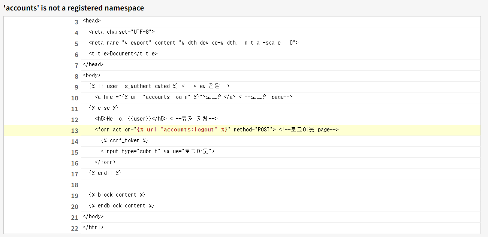

# Django ErrorLog 7-1

날짜: 2024년 10월 12일

# NoReerseMatch at/libraries/

---

- 'accounts' is not a registered namespace



[urls.py]

```python
urlpatterns = [
    path('admin/', admin.site.urls),
    path('libraries/', include('libraries.urls')),
]

```

- account 정보가 없음 → `등록되지 않음`

[수정] → 추가

```python
    path('accounts/', include('accounts.urls')), #추가
```

# user 인증 오류

---


```python
<body>
  <!--인증된 사용자인경우-->
    <a href="">로그인</a> <!--로그인 page-->
   <!--그게 아닌 경우-->  
     <!--view 전달-->
    <h5>Hello, {{user}}</h5> <!--유저 자체-->
    <form action="" method="POST"> <!--로그아웃 page-->
      
      <input type="submit" value="로그아웃">
    </form>
  

  
  
</body>
```

<aside>
💡

**수정 1**

</aside>

- 인증되었을 경우 == 로그인 되었을 경우인데 상기에는 잘못 표기 함

```python
<body>
  <!--인증된 사용자인경우-->
   <!--view 전달-->
    <h5>Hello, {{user}}</h5> <!--유저 자체-->
    <form action="" method="POST"> <!--로그아웃 page-->
      
      <input type="submit" value="로그아웃">
    </form>
   <!--그게 아닌 경우-->  
    <a href="">로그인</a> <!--로그인 page-->
  

  
  
</body>
```

# IntegrityError at /libraries/1/review/create/

---

- NOT NULL constraint failed: libraries_review.user_id


[views.py]

```python
def review_create(request, book_pk): #book정보
    book = Book.objects.get(pk=book_pk) #pk에 대한 정보
    review_form = ReviewForm(request.POST)
    if review_form.is_valid():
        review = review_form.save(commit=False)
        review.book = book #review의 book -> book_instance == book에 대한 정보
        review_form.save() #다시 저장
        return redirect('libraries:detail') #detail page로
    context = {
        'review_form' : review_form
#        'book' : book #book에 대한 정보
    }
    return render(request, 'libraries/detail', context)

```

<aside>
💡

**수정 1**

</aside>


→ review처럼 user와 관련된 내용도 넣어줘야 하는데 해당 부분이 누락되어 에러가 발생함

- 즉 현재는 book관련 내용만 담긴 것

```python
def review_create(request, book_pk): #book정보
    book = Book.objects.get(pk=book_pk) #pk에 대한 정보
    review_form = ReviewForm(request.POST)
    if review_form.is_valid():
        review = review_form.save(commit=False)
        review.book = book #review의 book -> book_instance == book에 대한 정보
        review.user = request.user #request에서 받아서 == user에 대한 정보 저장
        review_form.save() #다시 저장
        return redirect('libraries:detail', book_pk) #detail page로
```

# 이름이 바뀔때마다 이름이 반영되는 문제

---


<aside>
💡

수정 1

</aside>

- 현재 request.user의 값을 받아서 → 리뷰 전체목록의 내용도 계속 변경되는 문제가 확인됨

[기존]

```python
      
        <li> {{user}}-{{review.content}} </li> <!--user에 대한 정보-->
        <!--리뷰 삭제 추가 예정-->
      
```


**[수정 후] → review의 user에 접근해서 누가 작성했는지 확인**

```python
      
        <li> {{review.user}}-{{review.content}} </li> <!--user에 대한 정보-->
        <!--리뷰 삭제 추가 예정-->
      
```

# user의 review_delete 삭제 → 개념 모호

---

[urls.py]

```python
path('<int:book_pk>/review/<int:review_pk>/delete'. views.review_delete, name="review_delete")
```

[views.py]

- 삭제할게 무엇인지에 대한 생각을 해보기

```python
#user에 대한 정보, review에 대한 정보 -> user ? review? 
#review를 삭제
def review_delete(request, book_pk, review_pk): #book_pk에 대한 정보를 받고 -> 그 뒤에 삭제
    #book = Book.objects.get(pk=book_pk) #book에 대한 정보를 받고 -> book이 아니라 review를 삭제할 것임
    #book의 review를 삭제,, 
    #삭제할 정보 -> review를 삭제할 것임
    review = Review.objects.get(pk=review_pk) #특정 리뷰 삭제
    if request.user == review.user : #위에서 request와 review의 유저가 같은가?
        review.delete() #같으면 review 삭제
    return redirect('libraries:detail', book_pk) #다시 상세페이지로 리턴
```

# NoReverseMatch at /libraries/1/

---

-  `Reverse for 'review_delete' with no arguments not found. 1 pattern(s) tried: ['libraries/(?P<book_pk>[0-9]+)/review/(?P<review_pk>[0-9]+)/delete\\Z']`


```python
12	    {{review_form.as_p}}
13	    <input type="submit" value="리뷰 작성">
14	  </form>
15	  <hr>
16	  <h3>리뷰 전체 목록</h3>
17	    <ul>
18	      
19	        <li> {{review.user}}-{{review.content}} </li> <!--user에 대한 정보-->
20	        <!--리뷰 삭제 추가 예정-->
21	         <!--로그인 접속 유저가 같을 때--> <!--delete가 받는 매개변수들 모두 넣기-->
22	          <form action=" book.pk reveiw.pk"  method="POST"> <!--어떤 리뷰 삭제? : user가 같을 때 -->
23	            
24	          </form>
25	        
26	      
27	    </ul>
28	  <hr>
29	  <a href="">[BACK]</a>
30	
```

- Reverse for 'review_delete' with no arguments not found. 1 pattern(s) tried: ['libraries/(?P<book_pk>[0-9]+)/review/(?P<review_pk>[0-9]+)/delete\\Z']

<aside>
💡

**수정1 : 오탈자 확인**

</aside>

```python
<form action=""  method="POST"> <!--어떤 리뷰 삭제? : user가 같을 때 -->

```

