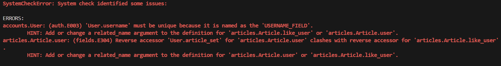

# [복습] M:N relationship

날짜: 2024년 10월 14일

# user와 article 모델 1:N 관계 형성 에러
→ SystemCheckError: System check identified some issues

---

- 'User.username' must be unique
- HINT: Add or `change a related_name argument` to the definition for 'articles.Article.like_user’



[수정 전]

```python
class Article(models.Model):
    #1대 N관계 형성
    #추가로 M:N관계 형성
    user = models.ForeignKey(settings.AUTH_USER_MODEL, on_delete=models.CASCADE)
    #또 user와 article의 관계 -> 참조할 것 -> 아티클과 어떠한 것의 관계를 맺을것인가?
    like_user = models.ManyToManyField(settings.AUTH_USER_MODEL) #좋아요를 위해서 -> like_user로 바꾼다
    #별도 중개모델 없이 장고 내장시스템에서 가능하다
    title = models.CharField(max_length=10)
    content = models.TextField()
    created_at = models.DateTimeField(auto_now_add=True)
    updated_at = models.DateTimeField(auto_now=True)
```

<aside>
💡

수정 1 : 똑같은 필드 참조 → `related_name` 을 사용하여 변경

</aside>

```python
class Article(models.Model):
    #1대 N관계 형성
    #추가로 M:N관계 형성
    user = models.ForeignKey(settings.AUTH_USER_MODEL, on_delete=models.CASCADE)
    #또 user와 article의 관계 -> 참조할 것 -> 아티클과 어떠한 것의 관계를 맺을것인가?
    like_user = models.ManyToManyField(settings.AUTH_USER_MODEL, related_name="like_user") #좋아요를 위해서 -> like_user로 바꾼다
    #또 똑같은 필드를 참조해서 user.article_set.all()이 되고있는 상황이었음
    #별도 중개모델 없이 장고 내장시스템에서 가능하다
    title = models.CharField(max_length=10)
    content = models.TextField()
    created_at = models.DateTimeField(auto_now_add=True)
    updated_at = models.DateTimeField(auto_now=True)
```

<aside>
💡

수정 2 : User.username은 반드시 unique해야한다.

</aside>

[수정 전]

```python
class User(AbstractUser):
    username = models.CharField(max_length=150)
    #기존에 유저 모델이 있을 경우 에러 발생
```

[수정 후]

```python
class User(AbstractUser):
    username = models.CharField(max_length=150, unique=True)
    #기존에 유저 모델이 있을 경우 에러 발생
```

- Unique를 넣어준다.

# 좋아요 기능 구현에 대한 이해

---

```python
def likes(request, pk):
    article = Article.objects.get(pk=pk)
    if request.user in article.like_users.all(): #request.user == 현재 사용자
    #즉 현재 사용자가 이 게시글에 좋아요를 눌렀는지 확인하는 조건문
        article.like_users.remove(request.user)
        #좋아요를 취소한다는 의미는 사용자와 게시글 사이의 좋아요 관계를 제거
    else:
        article.like_users.add(request.user)
	      #역참조를 진행하는 이유 == M:N에서 양방향 참조가 가능함
		    #역참조를 사용해서 게시글에서 좋아요를 누른 사용자들에게 접근
    return redirect('articles:index')
```

→ 1:N 관계에서는 단순 어떠한 사용자와 어떠한 게시글에 대한 내용의 관계를 담음

→ N:M 관계에서는 사용자와 게시글 사이의 `좋아요` 관계를 담음

## 좋아요 기능과 관계를 왜 형성하는가?

---

```python
# 게시글에 좋아요를 누른 사용자 수 확인
likes_count = article.like_users.count()

# 특정 사용자가 이 게시글에 좋아요를 눌렀는지 확인
has_liked = article.like_users.filter(id=request.user.id).exists()

# 사용자가 좋아요를 누른 모든 게시글 가져오기
liked_articles = request.user.like_articles.all()
```

| 특성 | 단순 카운트 방식 | Many-to-Many 관계 방식 |
| --- | --- | --- |
| **구현 방법** | Article 모델에 likes_count 필드 추가 | Article과 User 모델 간 `M:N` 관계 설정 |
| **데이터 저장** | 숫자만 저장 | 관계 정보 저장 |
| **좋아요 수 확인** | article.likes_count | article.like_users.count() |
| **누가 좋아요 눌렀는지 확인** | 불가능 | 가능 (article.like_users.all()) |
| **사용자별 좋아요한 게시글 확인** | 불가능 | 가능 (user.like_articles.all()) |
| **좋아요 취소 기능** | 구현 복잡 | 쉽게 구현 가능 |
| **`중복 좋아요 방지`** | 추가 로직 필요 | `자동으로 처리`됨 |
| **쿼리 효율성** | 단순 조회 시 효율적 | 복잡한 조회 시 효율적 |
| **메모리 사용** | 적음 | 상대적으로 많음 |
| **확장성** | 제한적 | 높음 (다양한 기능 구현 가능) |
| **코드 예시** | article.likes_count += 1 | article.like_users.add(user) |
| **데이터 일관성** | 관리 어려움 | `데이터베이스가 보장` |
| **`사용자 인터랙션 추적`** | 불가능 | `가능` |

→ 여기서 우리가 배운 내용이 담겨있음 (세션, 쿠키와 관련)

## Django의 Many-to-Many 관계 : `장고 중개 모델`

---

- indeed 양방향으로 접근 가능

```python
class Article(models.Model):
    like_users = models.ManyToManyField(User, related_name='like_articles') #인스턴스
```

- **`article.like_users`**: 게시글에서 좋아요를 누른 사용자들에 접근
- **`user.like_articles`**: 사용자가 좋아요를 누른 게시글들에 접근

[사용 가능 메서드]

```python
#쓰여진 것 그대로
article.like_users.add(user): 게시글에 좋아요를 누른 사용자 추가
article.like_users.remove(user): 게시글에서 좋아요를 누른 사용자 제거

user.like_articles.add(article): 사용자가 좋아요를 누른 게시글 추가
user.like_articles.remove(article): 사용자가 좋아요를 누른 게시글 제거
```

<aside>
💡

**`article.remove(request.user)`가 안되는 이유**

</aside>

- **메서드 존재 여부**: **`Article`** 모델 자체에는 **`remove`** 메서드가 없다
- **`like_users`**는 **`RelatedManager`**를 반환 == `remove` 메서드 제공
- **`Article`** 모델에서 **`like_users`** 필드를 정의했기 때문에 → 역참조를 사용해서 관계 관리

## 양방향 접근 예시

---

```python
# 게시글에서 사용자 추가/제거
article.like_users.add(user)
article.like_users.remove(user)

# 사용자에서 게시글 추가/제거
user.like_articles.add(article)
user.like_articles.remove(article)
```

## 게시글에 작성자가 자신의 게시글에 좋아요를 누르지 못하게 하려면?

---

```python
if request.user != article.author: #현재 요청자와 작성자가 같은사람인지 확인하고
#접근하지 못하도록 만든다.
    if request.user in article.like_users.all():
        article.like_users.remove(request.user)
    else:
        article.like_users.add(request.user)
```

# 좋아요 버튼이 바뀌지 않는 문제

---

[views.py]

```python
#조회 페이지 -> get을 사용할 이유가 없음 
#단, 로그인되어있는 유저만 좋아요 기능을 사용할 수 있음
@login_required
def likes(request, pk) : 
    article = Article.objects.get(pk=pk) #pk정보를 받고 이것을 활용
    #게시글 세부 정보를 받아올 수 있어야 함
    
    #이곳에 user 누락
    if request.user != article: #like의 요청이 들어왔을 때 게시글의 작성자 인지 아닌지
       #게시글의 작성자가 아닌 경우에만 좋아요를 할 수 있도록
       #article에 좋아요를 누른 user인지 아닌지 비교해야함 
       #article을 기반으로 좋아요버튼을 확인해야함
        if request.user in article.like_users.all():
            #좋아요를 누른 경우 -> 취소
            article.like_users.remove(request.user) #좋아요 취소
        else:
            article.like_users.add(request.user) #좋아요 추가 == 즉 게시글에 좋아요한 유저 추가
    return redirect('articles:index')
```

[index.html]

```python
  
    <p>작성자 : {{ article.user }}</p>
    <p>글 번호: {{ article.pk }}</p>
    <a href="">
      <p>글 제목: {{ article.title }}</p>
    </a>
    <p>글 내용: {{ article.content }}</p>
    <hr> 
    <!--article 하나를 뽑아와야 하기 떄문에-->
    <!--view에서 사용한것과 동일하게 보면된다.-->
    <form action="" method="POST">
      
      <!--like.users 오타-->
      <!--in 조건문이 아닌 동등함을 비교하는 오류-->
       <!--라이크한 유저 중에 있다면-->
        <input type="submit" value="좋아요 취소">
      
        <input type="submit" value="좋아요">
      
    </form>
  
```

<aside>
💡

수정 1

</aside>

[index.html]

```python
 
    <p>작성자 : {{ article.user }}</p>
    <p>글 번호: {{ article.pk }}</p>
    <a href="">
      <p>글 제목: {{ article.title }}</p>
    </a>
    <p>글 내용: {{ article.content }}</p>
    <!--article 하나를 뽑아와야 하기 떄문에-->
    <!--view에서 사용한것과 동일하게 보면된다.-->
    <form action="" method="POST">
      
       <!--라이크한 유저 중에 있다면-->
        <input type="submit" value="좋아요 취소">
      
        <input type="submit" value="좋아요">
      
    </form>
    <hr> 
    

```

[views.py]

```python

#조회 페이지 -> get을 사용할 이유가 없음 
#단, 로그인되어있는 유저만 좋아요 기능을 사용할 수 있음
@login_required
def likes(request, pk) : 
    article = Article.objects.get(pk=pk) #pk정보를 받고 이것을 활용
    #게시글 세부 정보를 받아올 수 있어야 함
    if request.user != article.user: #like의 요청이 들어왔을 때 게시글의 작성자 인지 아닌지
       #게시글의 작성자가 아닌 경우에만 좋아요를 할 수 있도록
       #article에 좋아요를 누른 user인지 아닌지 비교해야함 
       #article을 기반으로 좋아요버튼을 확인해야함
        if request.user in article.like_users.all():
            #좋아요를 누른 경우 -> 취소
            article.like_users.remove(request.user) #좋아요 취소
        else:
            article.like_users.add(request.user) #좋아요 추가 == 즉 게시글에 좋아요한 유저 추가
    return redirect('articles:index')
#작성자 본인은 좋아요를 하지 못하게 막았다.

```

# Shell_plus 내에 생성한 데이터 M:N

---

- 생성한 인스턴스 두개 연결
- model 자체에 MTM 정의

**[정방향 관계]**

- 모델에 직접 ManyToManyField를 정의한 경우 사용

```python
customer1.product.add(product1)
```

**[역방향 관계]**

- ManyToManyField가 정의되지 않은 모델에서 접근할 때 사용
- 참조한 것은 이렇게 접근하고 → 역으로는 정의했다고 가정하면

```python
product1.customer_set.add(customer1)
```

**[예시]**

```python
## 모델 정의
class Customer(models.Model):
    name = models.CharField(max_length=100)
    products = models.ManyToManyField('Product', related_name='customers')

class Product(models.Model):
    name = models.CharField(max_length=100)
    
---------------------------------------------------

# Shell에서 사용
customer1 = Customer.objects.create(name="John") #customer 생성
product1 = Product.objects.create(name="Laptop") #product 생성

# 정방향 관계 추가
customer1.products.add(product1) #관계 추가
#고객이 산 제품을 더한다

# 역방향 관계 추가 (related_name 사용)
product1.customers.add(customer1)
# 제품을 산 고객의 정보를 더한다.

# 관계 확인
print(customer1.products.all())
print(product1.customers.all())
```

※ 참고 : **`related_name`**을 사용하면 **`_set`** 접미사 대신 지정한 이름을 사용할 수 있음

- 중간 모델을 사용하는 경우, **`add()`**, **`remove()`**, **`clear()`** 메서드를 직접 사용할 수 없다.
(중간 모델의 인스턴스를 생성/삭제 해야한다)

# Reservation model → Order model : `중개 모델`

---


- 기존처럼 instance 값을 넣어주는 방식 == 중개모델의 특이점

## Related_name 설정 후

---


- 참조는 그냥 단순 add
- 역참조는 → realted_name으로 한 것을 기준으로 add