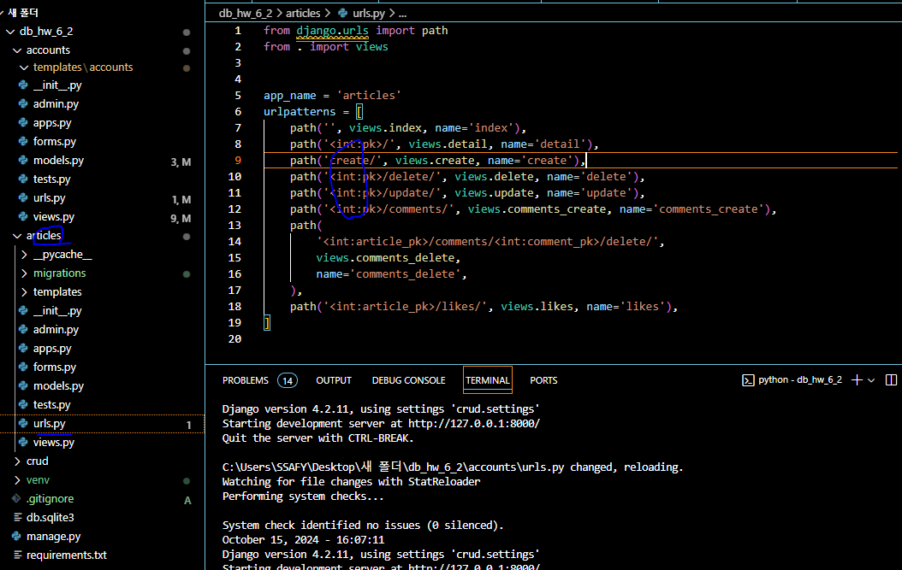

# [복습] django

날짜: 2024년 10월 15일

# ValueError at /accounts/profiles/admin/

- Field 'id' expected a number but got 'admin'.

---

**[urls.py]**

```jsx
    path('profiles/<str:user_pk>/', views.profile, name="profile"),

```



- 현재 모두 int 타입으로 받고 있는데, str 타입으로 받아서 생기는 문제일 수 있다고 판단됨
- 일단 게시글 자체는 int:pk 타입으로 받고 있음

<aside>
💡

**문제의 원인**

</aside>

- URL 패턴에서 **`<str:user_pk>`**로 정의했지만, 실제로는 숫자 ID를 기대
- 장고의 usermodel 자체가 기본저긍로 숫자를 기대함
    - 그 이유는 **`User.objects.get(pk=user_pk)`**에서 **`pk`**는 숫자를 기대하지만, 문자열이 전달
    
    [views.py]
    
    ```python
    def profile(request, user_pk) : #유저의 정보
        User = get_user_model()
        person = User.objects.get(pk=user_pk) #특정 유저의 정보
        #특정 유저의 정보를 페이지로 돌려줄 것임
        context = {
            'person' : person,
        } #person정보를 돌려줌 -> 사람의 정보를 제공한다. 어디에? profile page에
        return render(request, 'accounts/profile', context)
    ```
    

<aside>
💡

**문제 해결**

</aside>

- 즉 pk로 받고 있는 문제를 해결해야 함

**1️⃣ url 구조 부터 일단 수정해보기**

```python
    path('profiles/<str:username>/', views.profile, name="profile"),
	  #일단 인자를 username으로 받기로했으니 해당 내용을 활용한다.
```

**[수정]**

```python
person = User.objects.get(username=username)
```

## User.object.get() 메서드의 방식 → 다양한 방식으로 사용자 조회

---

```python
from django.contrib.auth import get_user_model

User = get_user_model()

# pk로 조회
user = User.objects.get(pk=1)

# username으로 조회
user = User.objects.get(username='johndoe')

# email로 조회
user = User.objects.get(email='john@example.com')
```

- 기타 : 다양한 필드를 사용해서 사용자르 조회할 수 있음(하기 내용 참고)
    - id (pk)
    - username ⇒ 회원가입할 때 ID생각해보기 → **중복이 기본적으로 허용되지 않음**
    - email
    - first_name
    - last_name
    - password
    - is_active
    - is_staff
    - is_superuser
    - date_joined
    - last_login

## 단, username과 email로 조회했을 때 중복의 위험성은?
→ HOW처리

---

1. **Username**: 기본적으로 고유하게 설정한다. Django는 username 필드에 **`unique=True`** 옵션을 설정한다. ⇒ 회원가입할 때 ID 생각하면 됨
2. **Email**: 기본 User 모델에서는 고유하지 않을 수 있다. 그러나 많은 프로젝트에서 이메일 주소를 고유하게 만든다.
3. **get() 메서드의 동작**:
    - 정확히 하나의 객체를 찾으면 해당 객체를 반환한다.
    - 객체를 찾지 못하면 **`DoesNotExist`** 예외를 발생시킨다.
    - 둘 이상의 객체를 찾으면 **`MultipleObjectsReturned`** 예외를 발생시킨다.

# NoReverseMatch at /articles/

- Reverse for 'profile' with arguments '('admin',)' not found. 1 pattern(s) tried: ['accounts/profiles/(?P<user_pk>[0-9]+)/\\Z']

---

```jsx
4	  <meta charset="UTF-8">
5	  <meta http-equiv="X-UA-Compatible" content="IE=edge">
6	  <meta name="viewport" content="width=device-width, initial-scale=1.0">
7	  <title>Document</title>
8	</head>
9	<body>
10	  <!-- articles/index.html -->
11	  <h1>Articles</h1>
12	  
13	    <h3>Hello, {{ user.username }}</h3>
14	    <a href="">내 프로필</a>
15	    <a href="">NEW</a>
16	    <form action="" method="POST">
17	      
18	      <input type="submit" value="Logout">
19	    </form>  
20	    <form action="" method="POST">
21	      
22	      <input type="submit" value="회원탈퇴">
23	    </form>  
24	    <a href="">회원정보 수정</a>
```

# <str:user_pk>와 <user_pk:str>의 차이

---

1. **`<str:user_pk>`**:
    - 이것은 Django의 표준 URL 패턴 구문
    - 여기서 **`str`**은 타입 변환기(converter)를 나타내며, **`user_pk`**는 변수 이름
    - Django는 이 구문을 인식하고 URL에서 해당 부분을 문자열로 해석한다.
2. **`<user_pk:str>`**:
    - 이 구문은 Django에서 유효하지 않음
    - Django는 이 형식을 인식하지 못하고 오류를 발생시킬 것

# 패턴 두개 차이 비교
profile/str:username & /str:username/profile/'

---

| URL 패턴 | 사용 권장 상황 |
| --- | --- |
| /str:username/profile/ | 1. `사용자 중심`의 웹사이트 구조가 필요할 때
2. SEO 최적화가 중요한 경우
3. 사용자별로 다양한 페이지 확장이 예상될 때 
(예: /username/posts/, /username/photos/)
4. 직관적인 URL 구조가 사용자 경험에 중요할 때 |
| profile/str:username/ | 1. `기능 중심`의 웹사이트 구조를 원할 때
2. URL `충돌 가능성을 최소화`하고 싶을 때
3. 프로필 관련 기능을 명확히 구분하고 관리하고자 할 때 
4. 프로필 기능에 대한 확장성이 필요한 경우 
  (예: profile/username/edit/, profile/username/settings/) |

[<str:username>/ 이 먼저인 경우 `사용자 중심`]

```python
'/str:username/profile/'
```

- `사용자 중심적`인 구조
- `사용자의 다양한 페이지를 쉽게 확장` 가능 (예: '/str:username/posts/', '/str:username/followers/')
- 단점: 루트 URL에서 시작하므로 다른 URL과 충돌할 가능성이 높음
    - 예: 사용자 이름이 'about'인 경우, '/about/' URL과 충돌 가능
    - 중복된 라우트

### 다른 URL과 충돌할 가능성

---

[1번 예시]

```python
urlpatterns = [
    path('<str:username>/', views.user_profile, name='user_profile'),
    #사용자가 about이라는 사용자명을 가지고 있을 때
    path('about/', views.about, name='about'),
]
```

- 하지만 사용자가 'about'이라는 사용자명을 가지고 있다면, '/about/' URL로 접근했을 때 about 페이지 대신 'about'이라는 사용자의 프로필 페이지가 표시

[2번 예시]

```python
urlpatterns = [
    path('<str:username>/', views.user_profile, name='user_profile'),
    path('settings/', views.settings, name='settings'),
    path('logout/', views.logout, name='logout'),
]
```

- '/settings/' 또는 '/logout/' URL로 접근하려고 해도, 이 URL들이 'str:username/' 패턴과 먼저 매치
- 'settings'나 'logout'이라는 이름의 사용자 프로필 페이지를 찾게 되고, 원래 의도했던 설정 페이지나 로그아웃 기능에 접근할 수 없게 됨

[profile/<str:username>/일 경우 `기능 중심`]

```python
'profile/str:username/'
```

- `기능` 중심적인 구조 → `더 유용할 수 있음`
- `프로필 관련 기능을 명확히 구분`
    - 프로필 관련 기능을 쉽게 확장 가능 (예: 'profile/str:username/edit/', 'profile/str:username/settings/')
- 다른 URL과의 충돌 가능성이 낮음

## SEO란? : search Engine Optimization → 검색엔진최적화

---

- 상위에 노출시키기 위한 다양한 기법과 전략
- 사용자 이름이 URL 앞부분에 위치하면 SEO에 더 유리할 수 있음

# profile에서는 username으로, follow에서는 pk로 받는이유

---

| 특성 | 프로필 URL (username) | 팔로우 URL (user_pk) |
| --- | --- | --- |
| URL 예시 | `profile/<username>/` | `<int:user_pk>/follow/` |
| 주요 장점 | **사용자 친화적,** SEO 최적화 | 성능 최적화, 내부 로직 단순화 |
| 가독성 | 높음 (의미 있는 문자열) | 낮음 (숫자 ID) |
| 데이터베이스 조회 속도 | 상대적으로 느림 | 빠름 (인덱스 사용) |
| 변경 가능성 | **변경 가능 (사용자가 username 변경 가능)** | **변경 불가 (pk는 고정)** |
| 보안 | 상대적으로 높음 (무작위 접근 어려움) | 상대적으로 낮음 (순차적 접근 가능) |
| SEO 친화도 | 높음 | 낮음 |
| 사용 목적 | 공개적인 프로필 표시 | 내부 시스템 로직 (팔로우 기능) |
| URL 구조의 의미 | 기능(프로필) 중심 | 사용자 중심 |
| 일반적인 사용 사례 | 사용자 프로필 페이지 | 백엔드 API, 내부 기능 |

이 표는 두 URL 패턴의 주요 차이점과 각각의 장단점을 요약하고 있습니다. 프로젝트의 요구사항과 우선순위에 따라 적절한 방식을 선택할 수 있습니다.

## 언제 url에서 pk를 사용하고, 일반 username을 사용하는가?

---

| 항목 | 고유 식별자 | 사용자 친화적 식별자 |
| --- | --- | --- |
| 게시글 | pk (예: 1234) | 제목 (예: "오늘의 날씨") |
| 사용자 | user_pk (예: 5678) | username (예: "john_doe") |
- 결국 의미상으로는 동일한 개념을 적용

# PROFILE HTML → 쿼리셋이 공개되는 문제
+ 그리고 본인 계정이 Unfollow로 표기됨

---

```python
  <h1>{{ person.username }}님의 프로필</h1>
  <p>팔로잉 : {{person.followings.all}} / 팔로워 : {{person.followers.all}}</p> <!--참조와 역참조-->
  <form action=" " method="POST"> <!--매개변수 인자 : 특정 username의 프로필 : 조회한 사람의 -->
    
    
      <input type="submit" value="Follow">
    
      <input type="submit" value="Unfollow">
    
  </form>
```


<aside>
💡

**수정1**

</aside>

```python
  <h1>{{ person.username }}님의 프로필</h1>
  <!--길이가 몇개인지 출력하기-->
  <p>팔로잉 : {{person.followings.all | length}} / 팔로워 : {{person.followers.all | length}}</p> <!--참조와 역참조-->
  <form action=" " method="POST"> <!--매개변수 인자 : 특정 username의 프로필 : 조회한 사람의 -->
    
    <!--내가 person의 팔로워들 목록에 있는 것을 확인하는게 아니라 지금 요청받은 person의 user가 있는지 확인해야 함-->
    <!--따라서 usernmae이 -->
    
      <input type="submit" value="UnFollow"> <!--목록에 있으면 언팔가능-->
    
      <input type="submit" value="follow">
    
  </form>

```

# AttributeError at /accounts/1/follow/

- 'User' object has no attribute 'user_pk'

---

- 지금 user는 user_pk라는 속성이 없음 —> 따라서 pk가 아닌 str값을 사용하는 것을 통일 시켜주고, 맞춰주면 됨
    - 지금까지 과거 데이터를 보니 다 username을 사용한것으로 확인됨

## DoesNotExist at /accounts/1/follow/

- User matching query does not exist.

---


```python
person = User.objects.get(username=username) #특정 유저가 본인과 같지 않은지 확인 #나의 입장
```

- 존재하지 않는다? ⇒ 저장하지 않아서 발생했던 일시적 오류

# 다른 계정으로 follow했을 때 문제
→ TypeError at /accounts/hello/follow/

- argument of type 'method' is not iterable → in 연산자 사용시

---


→ 일단 만약 프로필 유저와 해당 유저가 일치하지 않는다면과 관련된 함수를 작성하지 못함

```python
<body>
  <h1>{{ person.username }}님의 프로필</h1>
  <!--길이가 몇개인지 출력하기-->
  <p>팔로잉 : {{person.followings.all | length}} / 팔로워 : {{person.followers.all | length}}</p> <!--참조와 역참조-->
  <form action="" method="POST"> <!--매개변수 인자 : 특정 username의 프로필 : 조회한 사람의 -->
    <!--iterable-->
    
    <!--내가 person의 팔로워들 목록에 있는 것을 확인하는게 아니라 지금 요청받은 person의 user가 있는지 확인해야 함-->
    <!--따라서 usernmae이 -->

    
    
      <input type="submit" value="UnFollow"> <!--목록에 있으면 언팔그-->
    
      <input type="submit" value="follow">
    
  </form>

```

<aside>
💡

1차 수정

</aside>

[profile.html]

```python
  <h1>{{ person.username }}님의 프로필</h1>
  <!--길이가 몇개인지 출력하기-->
  <p>팔로잉 : {{person.followings.all | length}} / 팔로워 : {{person.followers.all | length}}</p> <!--참조와 역참조-->
   <!--유저와 유저 비교-->
  <form action="" method="POST"> <!--매개변수 인자 : 특정 username의 프로필 : 조회한 사람의 -->
    <!--iterable-->
    
    <!--내가 person의 팔로워들 목록에 있는 것을 확인하는게 아니라 지금 요청받은 person의 user가 있는지 확인해야 함-->
    <!--따라서 usernmae이 -->
    <!--view내용과 동일해야함-->
     <!--그리고 usernmae을 출력하는게 아님-->
      <input type="submit" value="UnFollow"> <!--목록에 있으면 언팔그-->
    
      <input type="submit" value="follow">
    
  </form>  
  

```

[views.py]

```python
from django.contrib.auth import get_user_model
@login_required #로그인만 가능 -> 로그인 되어있지 않을떄 로그인 페이지로 redirect?
# == 이거 자체가 자동으로 redirect 되는 것 -> 로그인 페이지로
#authenticated
#follow 기능 구현
def follow(request, username): #user에 대한 정보
    #로그인 되어있지 않다면 로그인 페이지로 redirect 되어야 한다. == authenticated -> html에서
    User = get_user_model()
    person = User.objects.get(username=username) #특정 유저가 본인과 같지 않은지 확인 #나의 입장
    if request.user != person:
    #자신을 follow할 수 없어야 함
    #내가 -> 그사람들 목록에 있는지
		    #이곳 수정 -> 활성화
        if request.user in person.followers.all() : #목록에 있따면 -< 팔로우 취소 == 지금 여기서 활성화안됨
            person.followers.remove(request.user)
        else: #없다면
            person.followers.add(request.user)
    return redirect('accounts:profile', person.username) #실제로 매개변수로 받은 내용을 사용할 수 있음
#person.username을 하면 데이터베이스에서 실제로 조회된 사용자이름 접근 가능 == 더 명확해짐
#나의 프로필 페이지가 아니라 그 사람의 페이지에
#팔로우 여부에 따라 다른 버튼이 렌더링
```

# @login_required

---

- 자동으로 로그인 페이지로 리다이렉트