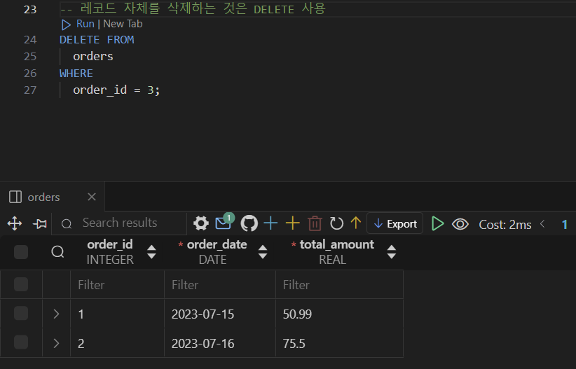

# [복습] DB SQL_헷갈리는 개념 위주

날짜: 2024년 10월 12일 → 2024년 10월 13일

# 앞 뒤 모두 특정 단어를 추출하려고 할 때

---

```sql
SELECT
  *
FROM
  tracks
WHERE
  Name LIKE "%LOVE%"; --양 옆으로 %%를 하면 love가 포함된 전체를 다룰 수 있음

  -- Name LIKE "%Love" --love로 끝나는 것
  -- OR Name LIKE "Love%"; --love를 포함한 데이터 %
  -- -- LIKE "love%"는 love로 시작하는 데이터
  -- -- LIKE "love"는 love만 추출
  -- -- love가 모두 있으려면? 
```

# A별로 그룹화 하여, A와 각 그룹별 데이터의 수, 각 그룹별 UnitPrice의 총 합을 계산를 조회하시오라는 예제

---

- 그룹화 == `A`
- select로 뽑아낼 필드는 → `수` , `unitprice`

 

<aside>
💡

즉 그룹화를 할 때 → 그룹별 OOO을 뽑으면 됨
그리고 OOO을 `AS` 로 나만의 키워드로 명시화하면 → 조건 `Having` 으로 활용할 수 있음

</aside>

## Parse error : misuse of `aggregate` : SUM()

---

```sql
-- 그룹별 OOOO :: 이 말은 즉 그룹화된 -> sth을 구해라
SELECT --그룹별 unitprice의 총합
  GenreId, --그룹화하는 친구들 뽑고
  -- 그 그룹의 UnitPrice
  SUM(UnitPrice) AS 'TotalPrice' --genreid로 묶여있으니까 => 여기에 대한 unitprice가 매겨질 것 => 조회하는 것
FROM
  tracks
WHERE
  TotalPrice >= 100 --위에서 정의한 개념으로 조건 나누기
GROUP BY
  GenreId; --이걸로 그릅화했다
```

→ WHERE 절을 Having으로 수정

## Parse error : near “GROUP” : sysntax error

---

```sql
SELECT --그룹별 unitprice의 총합
  GenreId, --그룹화하는 친구들 뽑고
  -- 그 그룹의 UnitPrice
  SUM(UnitPrice) AS 'TotalPrice' --genreid로 묶여있으니까 => 여기에 대한 unitprice가 매겨질 것 => 조회하는 것
FROM
  tracks
HAVING
  TotalPrice >= 100 --위에서 정의한 개념으로 조건 나누기
GROUP BY
  GenreId; --이걸로 그릅화했다
```

<aside>
💡

**오류 해결 —> 완결**

</aside>

```sql
SELECT --그룹별 unitprice의 총합
  GenreId, --그룹화하는 친구들 뽑고
  -- 그 그룹의 UnitPrice
  SUM(UnitPrice) AS 'TotalPrice' --genreid로 묶여있으니까 => 여기에 대한 unitprice가 매겨질 것 => 조회하는 것
FROM
  tracks
GROUP BY
  GenreId --이걸로 그릅화했다
HAVING
  TotalPrice >= 100;--위에서 정의한 개념으로 조건 나누기   
```

# 집계 함수

---

- 주로 **`GROUP BY`**와 함께 사용 → 데이터를 그룹화하고, **각 그룹에 대해 집계**할 때
- Having 절과 함께 사용
    - 그룹화된 조건을 적용할 때
- Select 절에서 사용 → `데이터를 요약` 할 때 (GROUB BY 없이 사용)

# WHERE / HAVING의 차이 (by 집계함수)

---

<aside>
💡

 WHERE는 **개별 행에 조건을 적용**하고, HAVING은 **그룹화된 결과**에 조건을 적용

</aside>

| 특성 | WHERE | HAVING |
| --- | --- | --- |
| 적용 대상 | 개별 행 | 그룹화된 데이터 |
| 사용 시점 | GROUP BY 전 | GROUP BY 후 |
| 집계 함수 사용 | 불가능 | 가능 |
| 예시 | `SELECT * 
FROM 테이블 WHERE 조건` | `SELECT 컬럼, SUM(값) 
FROM 테이블 
GROUP BY 컬럼 
HAVING SUM(값) > 100` |

[왜 HAVING을 사용하는가?]

- **집계 함수 사용**: `WHERE`는 개별 행을 대상으로 하기 때문에 집계 함수와 함께 사용할 수 없다.
반면, `HAVING`은 그룹화된 결과에 조건을 적용할 수 있다.

### HAVING 사용 예시

---

```sql
-- 각 카테고리별 총 매출이 1000 이상인 경우만 선택
SELECT category, SUM(price)
FROM sales
GROUP BY category
HAVING SUM(price) > 1000;

```

# SQL 쿼리 문법 순서

---

SQL 쿼리의 문법 순서는 다음과 같습니다:

1. **SELECT**: 반환할 열을 지정
2. **FROM**: 데이터를 가져올 테이블을 지정
3. **WHERE**: 조건에 맞는 `행을 필터링`
4. **GROUP BY**: 데이터를 그룹화
5. **HAVING**: `그룹화된` 데이터에 조건
6. **ORDER BY**: 결과를 정렬
7. **LIMIT**: 반환할 행의 수를 제한

### 내부적 SQL 쿼리 실행 순서

---

1. **FROM**: 데이터를 가져올 테이블을 선택
2. **WHERE**: 개별 행을 필터링
3. **GROUP BY**: 데이터를 그룹화
4. **HAVING**: 그룹화된 데이터에 조건을 적용
5. **SELECT**: 선택한 열을 반환
6. **ORDER BY**: 결과를 정렬
7. **LIMIT**: 반환할 행의 수를 제한

# 데이터 베이스 생성 → Parse error
: AUTOINCREMENT is only allowed on an Integer PK

---

```sql
CREATE TABLE orders(
  order_id PRIMARY KEY AUTOINCREMENT, --db는 이거 입력해줘야 함
  order_date DATE NOT NULL,
  total_amount REAL NOT NULL,
);
```

→ 타입을 지정하지 않아서 error 발생

## Parse error : near ‘)’ : syntax error

---

```sql
CREATE TABLE orders(
  order_id INTEGER PRIMARY KEY AUTOINCREMENT, --db는 이거 입력해줘야 함
  order_date DATE NOT NULL,
  total_amount REAL NOT NULL,
);
```

→ `,` 표시로 에러 발생

# 데이터 베이스 삽입 시 → 테이블 ()에 넣는 값

---

```sql
INSERT INTO --orders 테이블, 어떠한 값에? --> 자동으로 등록되는것 외에 내용 등록
  orders (order_date, total_amount)
VALUES
  ('2023-07-15', 50.99),
  ('2023-07-16', 75.5),
  ('2023-07-17', 30.25)
```

→ 어떤 테이블에 어떠한 데이터를 넣을 것인지 작성하는데 :  ‘’ 를 사용하지 않고 → 단순 명을 작성하면 됨

# Parse error : near ‘WHERE’ : syntax error

---

```sql
DROP TABLE --3번째 레코드 삭제
  orders --orders의 테이블에
WHERE --어디? = 3번쨰 레코드
  order_id = 3;
```

⇒ `레코드` 자체를 삭제하는 것은 : `DELETE FROM` 



## DROP과 DELETE 구분 잘하기** ⇒ 레코드와 테이블 구분

---

- `레코드` 자체의 일부를 삭제할 때 : `DELETE FROM`
- 삭제할 `필드`  : `ALTER TABLE` sth `DROP COLUMN`  column_name

# Parse error : no such column : name

---

```sql

UPDATE
  orders --table명
SET --어떠한 영역?
  name = '홍길동' --name영역을 홍길동으로 바꿀거야
WHERE --어디?
  customer_id = 1; --customer id가 1인 곳
```


→ 테이블명을 잘못 기재함

# Parse error : near “TABLE” : syntax error

---

```sql
-- 테이블 삭제
DELETE TABLE --table 삭제
    orders; 
```

→ 테이블 삭제도 DROP  :: 레코드만 삭제 `DELETE`

[수정]

```sql

-- 테이블 삭제
DROP TABLE --table 삭제
    orders; 
```

# Parse error : unknown column ‘customer_id’ in foreign key definition

---

```sql
CREATE TABLE orders (
    order_id INTEGER PRIMARY KEY,   -- 주문 ID (기본 키)
    order_date DATE,                -- 주문 날짜 (날짜 타입)
    total_amount REAL,               -- 총 주문 금액 (실수 타입)
    Foreign Key (customer_id) --> foreign key로 작동하는 것
    REFERENCES customers(customer_id) --> 외래키가 참조하는 것
);
```

→ 먼저 customer_id를 생성하고 참조를 해야한다.

```sql
CREATE TABLE orders (
    order_id INTEGER PRIMARY KEY,   -- 주문 ID (기본 키)
    order_date DATE,                -- 주문 날짜 (날짜 타입)
    total_amount REAL,               -- 총 주문 금액 (실수 타입)
    --선언을 먼저 하고 참조해야 함
    customer_id INTEGER,
    Foreign Key (customer_id) --> foreign key로 작동하는 것
    REFERENCES customers(customer_id) --> 외래키가 참조하는 것
);
```

# pk는 자동생성

---

```sql
-- data넣기 : 생성
-- update로
INSERT INTO --order_id는 자동생성
    orders (order_date, total_amount, customer_id) 
VALUES
    ('2023-07-15', 50, 1),
    ('2023-07-16', 75, 2),
    ('2023-07-17', 30, 3);
```

# SELECT - FROM - WHERE절 요청에 맞는 풀이

---

- 특정 데이터 출력 == `select`
- ~인 조건 == `WHERE`

```sql
SELECT
  last_name, age --특정 필드만 출력하되, ==특정 필드
FROM
  users
WHERE
  age < 18 --age가 18세 미만인 == 특정 조건
ORDER BY
  last_name, age DESC --네임이 같은 경우 > age기준으로 내림차순
```

## 중복 제거 : SELECT 옆에 바로 `DISTINCT`

---

```sql

SELECT DISTINCT--동일한 중복 데이터를 제외하고 조회
  last_name, age
FROM
  users
WHERE
  age < 18
ORDER BY
  last_name, age DESC; 

```

# Parse error :near “’남’” : syntax error

---

<aside>
💡

**3번쨰 글자가 A인 경우를 찾을 때** 

</aside>

- 단순 `__A` 로 끝날 경우 → bsA이런 경우만 추출된다 == 즉 3글자만 추출된다
    - 따라서 `__A%` 로 바꿔준다면, 3글자 이상의 값에 3번쨰 글자가 A인 것을 탐색할 수 있다.
- 또한 조건절은 글에서 요구하는 것처럼 `(A or B) AND C` 구조로 사용해도 무방하다.

[초기 SQL 코드]

```sql

SELECT
  *
FROM
  users
WHERE --A또는 B이고, X인 경우 -> AX, BX로 표기 ==?
  (country LIKE '경%' AND LIKE '__남')
  OR (country LIKE '충%' AND LIKE '__남');
```

<aside>
💡

수정 1차

</aside>

```sql
SELECT
  *
FROM
  users
WHERE --A또는 B이고, X인 경우 -> AX, BX로 표기
  (country LIKE '경%' AND country LIKE '__남')
  OR (country LIKE '충%' AND country LIKE '__남');
```

→ 공통 요소 찾음 : 다만, 또 값이 뜨지 않는 문제 발생


<aside>
💡

수정 2차

</aside>

```sql
SELECT
  *
FROM
  users
WHERE
  (country LIKE '경%' OR country LIKE '충%')
  AND country LIKE '__남%'; --남의 키워드가 조회되지 않음 == 방금은 단순 남, 그리고 세번째가 남이고 그 뒤에 조건 유의
```

# 헷갈리는 개념, 상황 정리 ⇒ 문제 요구 상황 분석

---

<aside>
💡

1. **집계 함수**: 데이터의 `요약`(평균, 합계 등)이 필요할 때 사용한다.
2. **GROUP BY**: `특정 기준`으로 데이터를 `그룹화하여` `요약된 결과`를 얻고자 할 때 사용한다.
3.  **`COUNT(*)`**는 모든 행을 포함하고, **`COUNT(column_name)`**은 특정 열에 값이 있는 행만 포함한다.
4. **HAVING**: 그룹화된 데이터에 조건을 적용한다.
5. **서브쿼리**: 복잡한 조건이나 계산이 필요할 때 메인 쿼리 내에서 보조적으로 사용한다.
</aside>

## SELECT 절에 표기 해야할 것

---

- **집계 결과를 얻고자 하는 열**: **`GROUP BY`**와 함께 사용하여 데이터를 그룹화하고 요약할 열을 선택한다.
- **필요한 집계 함수**: **`COUNT`**, **`SUM`**, **`AVG`** 등 필요한 집계 함수를 사용하여 원하는 데이터를 요약한다.

## **집계 함수 : 주로 SELECT와 함께 사용  or Groub by와 함께 사용_그룹 별 요약 결과**

---

- **집계 함수**는 여러 행의 값을 하나의 값으로 요약하는 데 사용된다.
    - 예: **`MAX`**, **`MIN`**, **`SUM`**, **`COUNT`**, **`AVG`**.
- 집계 함수는 일반적으로 **`SELECT`** 절에서 사용되며, **`GROUP BY`**와 함께 사용하여 그룹별로 요약된 결과를 얻을 수 있다.

## **GROUP BY : 특정 열(각)을 기준으로 그룹화 → 집계함수 적용**

---

- ***`GROUP BY`***는 데이터를 특정 열을 기준으로 그룹화하여 집계 함수를 적용할 수 있게 합니다.
- 예를 들어, `각` 국가별 사용자 수를 구할 때 사용합니다.

```sql
SELECT 
	coutnry, COUNT(*) AS User_count #전체..
FROM 
	users
GROUB BY 
	country;
```

## COUNT(*) vs COUNT(column_name)

---

- **`COUNT(*)`**: 테이블의 모든 행을 센다. 특정 열에 관계없이 **전체 행의 개수를 구할 때** 사용한다.
- **`COUNT(column_name)`**: 지정된 열의 **`NULL`**이 아닌 값의 개수를 센다. 
                                       특정 열에 값이 있는 행만 세고 싶을 때 사용한다.

[전체 사용자 수를 구할 때]

```sql
SELECT COUNT(*) AS total_users
FROM users;
```

[각 국가별 사용자 수를 구할 때] → `국가` `별` 

```sql
SELECT country, COUNT(*) AS user_count
FROM users
GROUP BY country;
```

[특정 열에 값이 있는 사용자 수를 구할 때] → `NULL` 이 아닌 개수를 셀 때

- 전화번호가 있는 사용자만 세고 싶을 때

```sql
SELECT country, COUNT(phone) AS phone_count
FROM users
GROUP BY country;
```

## **HAVING 절 → Groub by의 친구 :: 집계 함수 결과의 조건**

---

**`HAVING`** 절은 **`GROUP BY`**로 그룹화된 결과에 조건을 적용할 때 사용됩니다.

- **`WHERE`** 절과 비슷하지만, 집계 함수의 결과에 조건을 걸 때 사용됩니다.

```sql
SELECT 
	coutnry, COUNT(*) AS User_count 
FROM 
	users
Having 
	COUNT(*) > 10
```

## **서브쿼리**

---

- **서브쿼리**는 쿼리 내에 포함된 또 다른 쿼리입니다. `복잡한 조건이나 계산이 필요할 때` 유용합니다.
- 최대 잔액을 가진 사용자를 찾을 때 서브쿼리를 사용할 수 있습니다.

```sql
SELECT *
FROM users
WHERE balance = (
    SELECT MAX(balance)
    FROM users
)
LIMIT 1;
```

## 파생되는 문제의 요구 사항 이해 부족

---

1. **전체 사용자의 평균 balance를 구하세요**

```sql
SELECT AVG(balance) AS average_balance
FROM users;
```

- **전체 사용자**의 특정 평균을 구한다는 것은 `특정 열의 평균 값`을 구하는 것
    - 모든 사용자를 개별적으로 표시할 필요 없이 **단순 평균값만 출력하면 됨**
        - **즉 사용자의 데이터를 개별적으로 표시할 필요가 없다는것이 핵심**
- **`GROUP BY`**가 필요하지 않으며, 단순히 집계 함수만 사용

1. **각 country별로 사용자의 수를 구하시오 ⇒ `각 country` : 그룹화, `country 별 사용자 수` : 구할 것**
    - 특정 기준(여기서는 **`country`**)으로 데이터를 그룹화하고, 각 그룹에 대해 집계 함수를 적용
    - 국가별로 그룹화하여 각 그룹(나라)의 사용자 수를 보고 싶다는 의미

[초기 코드]

```sql
SELECT
  COUNT(country) AS 'user_count' 
FROM
  users
GROUP BY
  country;
```

<aside>
💡

**수정 코드1**

</aside>

[요구 사항]

```sql
SELECT
  country, COUNT(country) AS 'user_count' 
FROM
  users
GROUP BY
  country;
```

- **각** 나라별로 사용자 수를 구해야 하므로, 데이터를 나라별로 그룹화
- **`GROUP BY`**와 함께 **`COUNT`**를 사용하여 각 그룹의 사용자 수를 셈
- **`GROUP BY country`**는 국가별로 데이터를 그룹화하고, **`COUNT(*)`**는 각 그룹의 사용자 수를 셉니다.

1. **balance가 가장 많은 사용자 정보 중, 가장 먼저 조회되는 한 명의 정보만 조회하시오.**
    
    → 즉 가장 많은 사용자 정보 중, 가장 먼저 조회되는 1명의 데이터 == 사용자 정보를 출력
    
    - why? : balance를 출력하라고 한 것이 아니라 사용자 정보를 알고 싶다고 함
    - 단 MAX(balance)를 해야하는데 → select 절에서 표현하지 않고 하기 위해 subquery를 사용

[초기 코드]

```sql
SELECT
  MAX(balance) 
  --balance가 가장 많은 사용자 == 구하고자 하는 값
FROM
  users
LIMIT
  1; -
```

<aside>
💡

수정 코드 1

</aside>

### Parse error : misuse of aggregate function Max()

---

```sql
SELECT
  *
FROM
  users
WHERE 
  MAX(balance) -- 집계함수를 여기서 쓰는게 맞나 : HAVING?..?
LIMIT
  1;
```

<aside>
💡

수정 코드 2

</aside>

### Parse error : Having clause on a non-aggregte query

---

```sql
SELECT
  *
FROM
  users
HAVING
  MAX(balance) -- 집계함수를 여기서 쓰는게 맞나 : HAVING?..?
LIMIT
  1;

```

<aside>
💡

**수정 코드 3**

</aside>

select 값의 출력

---

```sql
SELECT
  *, MAX(balance) --이 값이 나오면 안됨..
FROM
  users
HAVING
  MAX(balance)
LIMIT
  1;
```


<aside>
💡

수정 코드 4

</aside>

- balance니까 balance의 기준으로 group화 하면 되겠다! ⇒ 오류

```sql
SELECT
  * --이 값이 나오면 안됨..
FROM
  users
GROUP BY --Having == GROUP BY에 주로 사용
  balance
HAVING
  MAX(balance) -- 집계함수를 여기서 쓰는게 맞나 : HAVING?..?
LIMIT
  1;
```


<aside>
💡

**수정 코드5 → 도움을 받음**

</aside>

- 이미지에서 **`MAX(balance)`**가 표시되지 않도록 하려면, 
**`MAX(balance)`**를 **`SELECT`** 절에 포함하지 않고 **`HAVING`** 절에서 사용할 수 있도록 서브쿼리를 활용

```sql
SELECT *
FROM users
WHERE balance = ( -- 서브쿼리를 사용하면 된다. 
    SELECT MAX(balance)
    FROM users
)
LIMIT 1;
```

- 가장 높은 잔액을 가진 사용자를 찾고자 할 때는 서브쿼리를 사용하여 최대 값을 찾음
    - 메인 쿼리에서 이 값을 기준으로 필터링
- 서브쿼리에서 **`MAX(balance)`**를 사용하여 최대 잔액을 찾고, 메인 쿼리에서 이 잔액과 일치하는 사용자를 선택함

→ 즉 서브쿼리에서는 `최대 잔액` 을 찾는다

→ 메인 쿼리에서는 `최대 잔액` 과 일치하는 모든 열을 선택한다.

# 서브쿼리 주의 사항

---

<aside>
💡

서브쿼리와 메인 쿼리에 동일한 조건을 넣어주는 것이 중요함

</aside>

1. 정확성 보장:서브쿼리와 메인 쿼리에 동일한 조건을 넣음으로써 결과의 정확성을 보장할 수 있다. 
    1. 서브쿼리에서 조건을 누락하면 의도하지 않은 결과가 나올 수 있다.
2. 독립적인 실행 가능성:서브쿼리에 모든 필요한 조건을 포함시키면, 서브쿼리를 독립적으로 실행하고 테스트할 수 있다. 이는 디버깅과 쿼리 최적화에 유용하다.

```sql
SELECT *
FROM users
WHERE last_name LIKE '박%'
  AND age >= 25
  AND age = (
    SELECT MIN(age)
    FROM users
    WHERE last_name LIKE '박%'
      AND age >= 25
  );
```