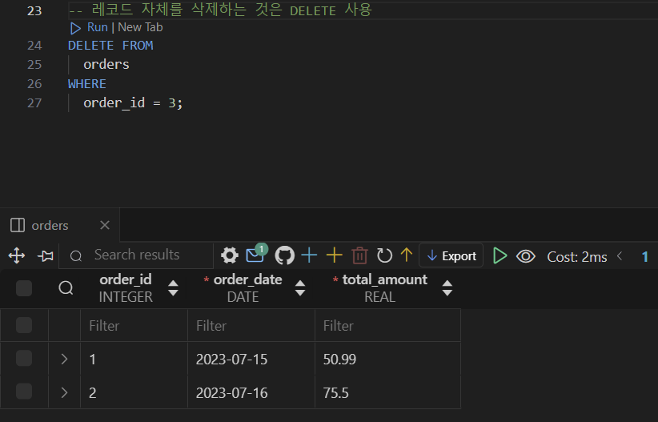

# [복습] DB SQL_헷갈리는 개념 위주

날짜: 2024년 10월 12일

# 앞 뒤 모두 특정 단어를 추출하려고 할 때

---

```sql
SELECT
  *
FROM
  tracks
WHERE
  Name LIKE "%LOVE%"; --양 옆으로 %%를 하면 love가 포함된 전체를 다룰 수 있음

  -- Name LIKE "%Love" --love로 끝나는 것
  -- OR Name LIKE "Love%"; --love를 포함한 데이터 %
  -- -- LIKE "love%"는 love로 시작하는 데이터
  -- -- LIKE "love"는 love만 추출
  -- -- love가 모두 있으려면? 
```

# A별로 그룹화 하여, A와 각 그룹별 데이터의 수, 각 그룹별 UnitPrice의 총 합을 계산를 조회하시오라는 예제

---

- 그룹화 == `A`
- select로 뽑아낼 필드는 → `수` , `unitprice`

 

<aside>
💡

즉 그룹화를 할 때 → 그룹별 OOO을 뽑으면 됨
그리고 OOO을 `AS` 로 나만의 키워드로 명시화하면 → 조건 `Having` 으로 활용할 수 있음

</aside>

## Parse error : misuse of `aggregate` : SUM()

---

```sql
-- 그룹별 OOOO :: 이 말은 즉 그룹화된 -> sth을 구해라
SELECT --그룹별 unitprice의 총합
  GenreId, --그룹화하는 친구들 뽑고
  -- 그 그룹의 UnitPrice
  SUM(UnitPrice) AS 'TotalPrice' --genreid로 묶여있으니까 => 여기에 대한 unitprice가 매겨질 것 => 조회하는 것
FROM
  tracks
WHERE
  TotalPrice >= 100 --위에서 정의한 개념으로 조건 나누기
GROUP BY
  GenreId; --이걸로 그릅화했다
```

→ WHERE 절을 Having으로 수정

## Parse error : near “GROUP” : sysntax error

---

```sql
SELECT --그룹별 unitprice의 총합
  GenreId, --그룹화하는 친구들 뽑고
  -- 그 그룹의 UnitPrice
  SUM(UnitPrice) AS 'TotalPrice' --genreid로 묶여있으니까 => 여기에 대한 unitprice가 매겨질 것 => 조회하는 것
FROM
  tracks
HAVING
  TotalPrice >= 100 --위에서 정의한 개념으로 조건 나누기
GROUP BY
  GenreId; --이걸로 그릅화했다
```

<aside>
💡

**오류 해결 —> 완결**

</aside>

```sql
SELECT --그룹별 unitprice의 총합
  GenreId, --그룹화하는 친구들 뽑고
  -- 그 그룹의 UnitPrice
  SUM(UnitPrice) AS 'TotalPrice' --genreid로 묶여있으니까 => 여기에 대한 unitprice가 매겨질 것 => 조회하는 것
FROM
  tracks
GROUP BY
  GenreId --이걸로 그릅화했다
HAVING
  TotalPrice >= 100;--위에서 정의한 개념으로 조건 나누기   
```

# 집계 함수

---

- 주로 **`GROUP BY`**와 함께 사용 → 데이터를 그룹화하고, **각 그룹에 대해 집계**할 때
- Having 절과 함께 사용
    - 그룹화된 조건을 적용할 때
- Select 절에서 사용 → `데이터를 요약` 할 때 (GROUB BY 없이 사용)

# WHERE / HAVING의 차이 (by 집계함수)

---

<aside>
💡

 WHERE는 **개별 행에 조건을 적용**하고, HAVING은 **그룹화된 결과**에 조건을 적용

</aside>

| 특성 | WHERE | HAVING |
| --- | --- | --- |
| 적용 대상 | 개별 행 | 그룹화된 데이터 |
| 사용 시점 | GROUP BY 전 | GROUP BY 후 |
| 집계 함수 사용 | 불가능 | 가능 |
| 예시 | `SELECT * 
FROM 테이블 WHERE 조건` | `SELECT 컬럼, SUM(값) 
FROM 테이블 
GROUP BY 컬럼 
HAVING SUM(값) > 100` |

[왜 HAVING을 사용하는가?]

- **집계 함수 사용**: `WHERE`는 개별 행을 대상으로 하기 때문에 집계 함수와 함께 사용할 수 없다.
반면, `HAVING`은 그룹화된 결과에 조건을 적용할 수 있다.

### HAVING 사용 예시

---

```sql
-- 각 카테고리별 총 매출이 1000 이상인 경우만 선택
SELECT category, SUM(price)
FROM sales
GROUP BY category
HAVING SUM(price) > 1000;

```

# SQL 쿼리 문법 순서

---

SQL 쿼리의 문법 순서는 다음과 같습니다:

1. **SELECT**: 반환할 열을 지정
2. **FROM**: 데이터를 가져올 테이블을 지정
3. **WHERE**: 조건에 맞는 `행을 필터링`
4. **GROUP BY**: 데이터를 그룹화
5. **HAVING**: `그룹화된` 데이터에 조건
6. **ORDER BY**: 결과를 정렬
7. **LIMIT**: 반환할 행의 수를 제한

### 내부적 SQL 쿼리 실행 순서

---

1. **FROM**: 데이터를 가져올 테이블을 선택
2. **WHERE**: 개별 행을 필터링
3. **GROUP BY**: 데이터를 그룹화
4. **HAVING**: 그룹화된 데이터에 조건을 적용
5. **SELECT**: 선택한 열을 반환
6. **ORDER BY**: 결과를 정렬
7. **LIMIT**: 반환할 행의 수를 제한

# 데이터 베이스 생성 → Parse error
: AUTOINCREMENT is only allowed on an Integer PK

---

```sql
CREATE TABLE orders(
  order_id PRIMARY KEY AUTOINCREMENT, --db는 이거 입력해줘야 함
  order_date DATE NOT NULL,
  total_amount REAL NOT NULL,
);
```

→ 타입을 지정하지 않아서 error 발생

## Parse error : near ‘)’ : syntax error

---

```sql
CREATE TABLE orders(
  order_id INTEGER PRIMARY KEY AUTOINCREMENT, --db는 이거 입력해줘야 함
  order_date DATE NOT NULL,
  total_amount REAL NOT NULL,
);
```

→ `,` 표시로 에러 발생

# 데이터 베이스 삽입 시 → 테이블 ()에 넣는 값

---

```sql
INSERT INTO --orders 테이블, 어떠한 값에? --> 자동으로 등록되는것 외에 내용 등록
  orders (order_date, total_amount)
VALUES
  ('2023-07-15', 50.99),
  ('2023-07-16', 75.5),
  ('2023-07-17', 30.25)
```

→ 어떤 테이블에 어떠한 데이터를 넣을 것인지 작성하는데 :  ‘’ 를 사용하지 않고 → 단순 명을 작성하면 됨

# Parse error : near ‘WHERE’ : syntax error

---

```sql
DROP TABLE --3번째 레코드 삭제
  orders --orders의 테이블에
WHERE --어디? = 3번쨰 레코드
  order_id = 3;
```

⇒ `레코드` 자체를 삭제하는 것은 : `DELETE FROM` 



## DROP과 DELETE 구분 잘하기** ⇒ 레코드와 테이블 구분

---

- `레코드` 자체의 일부를 삭제할 때 : `DELETE FROM`
- 삭제할 `필드`  : `ALTER TABLE` sth `DROP COLUMN`  column_name

# Parse error : no such column : name

---

```sql

UPDATE
  orders --table명
SET --어떠한 영역?
  name = '홍길동' --name영역을 홍길동으로 바꿀거야
WHERE --어디?
  customer_id = 1; --customer id가 1인 곳
```


→ 테이블명을 잘못 기재함

# Parse error : near “TABLE” : syntax error

---

```sql
-- 테이블 삭제
DELETE TABLE --table 삭제
    orders; 
```

→ 테이블 삭제도 DROP  :: 레코드만 삭제 `DELETE`

[수정]

```sql

-- 테이블 삭제
DROP TABLE --table 삭제
    orders; 
```

# Parse error : unknown column ‘customer_id’ in foreign key definition

---

```sql
CREATE TABLE orders (
    order_id INTEGER PRIMARY KEY,   -- 주문 ID (기본 키)
    order_date DATE,                -- 주문 날짜 (날짜 타입)
    total_amount REAL,               -- 총 주문 금액 (실수 타입)
    Foreign Key (customer_id) --> foreign key로 작동하는 것
    REFERENCES customers(customer_id) --> 외래키가 참조하는 것
);
```

→ 먼저 customer_id를 생성하고 참조를 해야한다.

```sql
CREATE TABLE orders (
    order_id INTEGER PRIMARY KEY,   -- 주문 ID (기본 키)
    order_date DATE,                -- 주문 날짜 (날짜 타입)
    total_amount REAL,               -- 총 주문 금액 (실수 타입)
    --선언을 먼저 하고 참조해야 함
    customer_id INTEGER,
    Foreign Key (customer_id) --> foreign key로 작동하는 것
    REFERENCES customers(customer_id) --> 외래키가 참조하는 것
);
```

# pk는 자동생성

---

```sql
-- data넣기 : 생성
-- update로
INSERT INTO --order_id는 자동생성
    orders (order_date, total_amount, customer_id) 
VALUES
    ('2023-07-15', 50, 1),
    ('2023-07-16', 75, 2),
    ('2023-07-17', 30, 3);
```