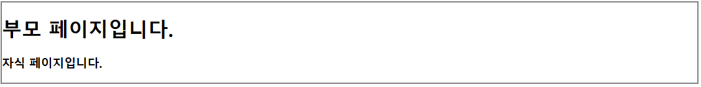

# [실습/개념]

날짜: 2024년 11월 7일

# props 이해하기

---

- **Props 선언: script 부분에서 props를 선언**

```jsx
<script setup>
defineProps({
  myMsg: String,
})
</script>

```

- 이렇게 하면 `myMsg`라는 이름의 prop을 선언하고, 그 타입을 String으로 지정한 것

- **Props 전달: 부모 컴포넌트에서 자식 컴포넌트로 props를 전달할 때**
    
    ```jsx
    <template>
      <ChildComponent :my-msg="parentMessage" />
    </template>
    
    ```
    
    - 여기서 `:my-msg`는 `v-bind:my-msg`의 축약형.
    - `my-msg`는 자식 컴포넌트에서 선언한 prop의 이름과 일치해야 한다.
    - `"parentMessage"`는 부모 컴포넌트의 데이터 또는 계산된 속성

- **Props 사용: 자식 컴포넌트의 템플릿에서는 다음과 같이 prop을 사용할 수 있다:**
    
    ```jsx
    <template>
      <div>{{ myMsg }}</div>
    </template>
    
    ```
    
    - `defineProps`를 사용하면 템플릿에서 자동으로 props에 접근할 수 있게 된다.

## 더 쉽게 이해해보기

---

- props를 우편함이라고 생각
- 우편함에는 여러 칸이 있고, 각 칸에는 이름표가 붙어 있다.
1. **props 정의: ⇒ `먼저 정의가 되어야 템플릿에서 사용 가능`**
    
    ```jsx
    defineProps({
      myMsg: String
    })
    
    ```
    
    이것은  우편함에  "myMsg"라는 이름표가 붙은 칸을만드는 것과 같다.
    
2. **템플릿에서 사용:**
    
    ```html
    <div>{{ myMsg }}</div>
    
    ```
    
    이렇게 하면 "myMsg" 칸에 있는 내용을 바로 꺼내 쓸 수 있다.
    
3. **부모 컴포넌트에서 전달: ⇒ `동적 바인딩` : `부모 컴포넌트에서 자식 컴포넌트로 데이터 전달`**
    
    ```html
    <child-component :my-msg="parentMessage" />
    
    ```
    
    이것은 부모가 "myMsg" 칸에 편지(데이터)를 넣는 것과 같다.
    

### 왜 바로 사용할 수 있나요?

---

1. Vue의 자동 바인딩:
    - **Vue는 props로 정의된 속성을 자동으로 컴포넌트에 바인딩**
    - **마치 우편함의 내용을 자동으로 꺼내주는 것과 같다.**
2. 템플릿의 특별한 규칙:
    - 템플릿에서는 'this.'를 생략할 수 있다.
    - 우**편함 앞에 서면 자동으로 열리는 것처럼, 템플릿에서는 props를 직접 사용할 수 있다.**

| 개념 | 우편함 비유 |
| --- | --- |
| props | 우편함 |
| props 정의 | 우편함에 칸 만들기 |
| 템플릿에서 사용 | 우편함에서 내용 꺼내기 |
| 부모에서 전달 | 우편함에 편지 넣기 |
| Vue의 자동 바인딩 | 우편함이 자동으로 열리고 닫힘 |

## 더 쉽게 비유로 이해해보기

---

→ props는 부모가 자식에게 주는 선물 상자라고 생각

1. **선물 전달**: 부모(부모 컴포넌트)가 자식(자식 컴포넌트)에게 선물(데이터)을 준다.
2. **선물 규칙**: 자식은 받은 선물을 볼 수 있지만, 바꿀 수는 없다. (읽기 전용)
3. **선물 설명서**: 어떤 선물인지 미리 알려준다. (타입 정의)
4. **선물 목록**:
    - 간단히 적기: `['장난감', '책', '과자']`
    - 자세히 적기: `{ 장난감: 자동차, 책: 동화책, 과자: 초콜릿 }`
5. **특별 요청**:
    
    ```
    과자: {
      종류: 초콜릿,
      꼭 필요해요: 네,
      없으면 주는 것: 사탕
    }
    
    ```
    
6. **사용 예시**:
    - 부모: "여기 초콜릿 과자 있어!"
    - 자식: "와! 초콜릿 과자다!"
7. **선물 구경하기**:
"와! 부모님이 주신 초콜릿 과자네!"

| 실제 상황 | Vue.js Props |
| --- | --- |
| 선물 상자 | Props 객체 |
| 선물 | 데이터 |
| 부모님 | 부모 컴포넌트 |
| 아이 | 자식 컴포넌트 |
| 선물 목록 | Props 선언 |
| 선물 설명서 | Props 타입 정의 |
| 특별 요청 사항 | Props 옵션 (required, default 등) |
| 선물 구경하기 | 템플릿에서 Props 사용 |

# props 데이터 사용 ⇒ props를 전달받지 못함

---



**[parentPage]**

```jsx
<template>
  <div>
    <h1>부모 페이지입니다.</h1>
    <!--페이지 3개로 나누어 등록? :props 선언 그럼 지금 children을 활용한다는 것-->
    <!--props이름 : props값 -->
    <Childpage child-prop="children"/> <!--이거 배열 반복해서 등록하기 -->
    <!--childpage에서 넘겨받기 가능-->
  </div>
</template>

<script setup>
  import {ref} from 'vue'
  import Childpage from '@/components/Childpage.vue';
  //children 배열을 작성한다.
  const children = ref([ //선언
    {'name' : "김하나", age:30},
    {'name' : "김두리", age:20},
    {'name' : "김서이", age:10},
  ])
</script>
```

⇒ 여기를 보니까 `동적 바인딩이 아님`

[childPage]

```jsx
<template>
  <div> <!--여기서 사용 가능-->
    <!--자식 데이터 prop받음-->
    <h3>자식 페이지입니다.</h3>
    <p>{{ childProp.name }}</p>
    <p>{{ childProp.age }}</p>
  </div>
</template>

<script setup>
  defineProps({
  'childProp' : Object 
  }) //받아오기 => 객체로 받아와야 함
</script>

<style \ scoped>

</style>
```

⇒ 변수명 상관없다고 했는데,, 일단 교안 보면서 다시 확인해보기

<aside>
💡

**수정 사항**

</aside>

1. 바인딩 문제
2. v-for문 사용 ⇒ 즉 `객체` 자체, 각각의 객체를 보내야 하는데 하나의 덩어리로 보낸 문제

```jsx
<Childpage v-for="child in children" :key="child.name" :dynamic-props="child"/> 
<!--이거 배열 반복해서 등록하기 -->
```


⇒ 값이 하나만 되는 문제..


⇒ 값이 없음 : 새로고침하니까 맞게 된다..

# emit 클릭 이벤트가 작동하지 않는 이유?

---


```jsx
<template>
  <div> <!--여기서 사용 가능-->
    <!--자식 데이터 prop받음-->
    <h3>자식 페이지입니다.</h3>
    <p>이름 : {{ dynamicProps.name }}</p>
    <p>나이 : {{ dynamicProps.age }}</p>
    <p>용돈 : {{ dynamicProps.balance }}</p>
    <button>용돈 더 주세요.</button> <!--givAMeAllowance 이벤트 발생-->
  </div>
</template>

<script setup>
  defineProps({
  'dynamicProps' : Object 
  }) //받아오기 => 객체로 받아와야 함
  
  //emit설정
  const emit = defineEmits(['giveMeAllowance']) //updateBalance => paraents 컴포넌트
  // // const updateBalance = function() {
  // //   //객체를 인자로 받으며, 대상 객체의 balance를 1000증가시킨다.
  // }
  const giveMeAllowance = function () { //vue 첫번째 인자 이벤트
    // updateBalance 함수를 실행한다. => 객체를 인자로 받으며 대상 객체의 balnace를 1000증가시킨다.
    emit('giveMeAllowance') //이거 실행
  }

</script>

<style scoped> /*원하는 것 처럼 전체가 적용되었지만, 의도치 않은 더 외부의 값까지 적용됨 */

</style>
```

<aside>
💡

**수정 사항**

</aside>

1. button을 눌렀을 때 활성화되어야 하는데 ⇒ 클릭이벤트를 활성화시키지 않은 에러 확인
2. updateBalance 함수는 객체를 인자로 받아야하는데 아무런 값도받지 않음..

## vue.js?v=22328dbe:1628 Uncaught ReferenceError: balance is not defined

---

```jsx
  const updateBalance = function(...args) {
    //balance 자체에 접근
    //대상 객체의 balance 증가시킨다.
    balance.value += 1000 //value자체에 접근해서 증가시켜야 함
  }
```

<aside>
💡

**수정 사항**

</aside>

```jsx
<template>
  <div>
    <h1>부모 페이지입니다.</h1>
    <Childpage 
    v-for="(child, index) in children" 
    :key="child.name"
    :dynamic-props="child" 
    @give-me-allowance="updateBalance(index)" <!--인자 자체를 index로 받아버린다.-->
    /> 
  </div>
</template>

```

### v-for = “(child,index) in children” 구문 이해하기

---

1. `v-for`: Vue의 디렉티브로, 배열이나 객체를 반복하여 요소를 렌더링할 때 사용
2. `children`: 반복할 데이터 ⇒ 배열을 가리킴
3. `(child, index)`: 이는 반복문의 현재 항목과 인덱스를 나타냄
    - `child`: 현재 반복 중인 배열 요소
    - `index`: 현재 요소의 인덱스

각 반복에서 현재 요소는 `child`로, 해당 요소의 인덱스는 `index`로 할당

⇒ 이렇게 할당된 `child`와 `index`는 해당 반복 범위 내에서 템플릿에서 사용

```
<template>
  <div>
    <div v-for="(child, index) in children" :key="child.name">
      {{ index + 1 }}. {{ child.name }} ({{ child.age }}세)
    </div>
  </div>
</template>

```

이 구조를 사용하면 배열의 각 요소에 쉽게 접근할 수 있고, 필요한 경우 인덱스도 활용할 수 있음

```jsx
  const updateBalance = function(index) {
    //balance 자체에 접근
    //대상 객체의 balance 증가시킨다.
    children.value[index].balance += 1000 //객체 벨류 자체에 접근
    // balance.value += 1000 //value자체에 접근해서 증가시켜야 함
  }
```

⇒ 특정 객체 접근을 위해서 `인덱스`를 뽑아서 사용했음

⇒ 보니까 키 값만 잘 이용하면 된다..!

# Cannot read properties of undefined (reading 'name')

---

```jsx
<template>
  <li>{{ myProp.name }}-{{ myProp.balance }}원</li>
  <!-- <div>   
  </div> -->
</template>

<script setup>
  //받는다
  defineProps({
    //하나씩 받음 => product
    myProp : Object //object형태로 
  })
</script>
```

⇒ name을 찾을 수 없다? : product List를 받아올 수 없는 것 같음

```jsx
<template>
  <div>
    <h1>쇼핑 애플리케이션</h1>
    <ul>
      <!--근데 자식에게 전달해줄 것-->
      <!--product를 줄것임 어떻게? :my-prop에 담아서 -->
      <ProductList 
        v-for="product in products"
        :key="product.id" 
        :my-prop="product"
        /> <!--리스트로 만들 것 : proudct 자체가 만듬 -->
    </ul>
  </div>
</template>
```


⇒ `list`에 단순 s만 입력했을 때 값이 출력되었으나 prop 자체가 먹지 않은 것 같음

# BusinessCardDetail.vue:16 [Vue warn]: Component emitted event "deleteUserCard" but it is neither declared in the emits option nor as an "onDeleteUserCard" prop. ⇒ 삭제 후 경고 메세지

---

이 경고 메시지는 `Vue 3에서 컴포넌트가 선언되지 않은 이벤트를 emit하고 있다는 것`을 알려주는 것

⇒ 경고 메시지가 발생하는 주된 이유는 `BusinessCardDetail` 컴포넌트에서 `emits` 옵션을 잘못 정의했기 
     때문

<aside>
💡

**문제 사항 도출**

</aside>

- `BusinessCardDetail.vue` 파일에서 `defineEmits`를 잘못 사용

```jsx
const emits = defineEmits(['businessCard'])

```

⚠️ 하지만 실제로 emit하는 이벤트 이름은 'deleteUserCard

```jsx
  const emits = defineEmits(['businessCard']) //businessCard를 인자로 넘긴다
  const deleteCardFunc = function() {//선언 defilEmits
    emits('businessCard')
  }
```

- `defineEmits`는 컴포넌트가 발생시킬 수 있는 이벤트 목록을 정의
- `emit`은 함수이며, 이를 통해 실제로 이벤트를 발생시킨다 ⇒ emits가 아니라 `emit` 사용

## 1번을 삭제하면 1~5번 까지의 명함 내용이 모두 삭제되는 문제

---

- 이 현상의 원인은 `splice` 메서드의 사용 방식 때문
- `for` 루프와는 직접적인 관련이 없다.

<aside>
💡

**문제의 원인**

</aside>

- `splice` 메서드는 두 번째 인자로 삭제할 요소의 개수를 지정해야 한다.
- Vue의 반응성 시스템이 배열의 변경을 감지하고 화면을 업데이트하려면, `ref`로 감싼 값에 직접 접근해야 한다.

```jsx
  const deleteCard = function(index) {
    //특정 값 제거하기 => list에서 이것만 빼고 다시만들어서 ..해야하나? 비효율
    //pop? remove 아무것도 안든
    //특정 index 삭제 splice => value에 접근하면 됨
    businessCards.value.splice(index)
//    businessCards[index]
  }
```

<aside>
💡

**수정 사항**

</aside>

```jsx
const deleteCard = function(index) {
  businessCards.value.splice(index, 1)
}

```

# computed 속성 이해하기

---

## Computed 속성의 기본 사용법

1. 단순 계산:

```jsx
const count = ref(0)
const doubleCount = computed(() => count.value * 2)

//화살표 함수를 함수표현식으로 바꿨을 때
//computed(function() {
  //return count.value * 2
//})
```

1. 객체 데이터 처리:

```jsx
const firstName = ref('John')
const lastName = ref('Doe')
const fullName = computed(() => `${firstName.value} ${lastName.value}`)

```

## Computed 속성의 주요 특징

1. 캐싱: Computed 속성은 의존하는 **반응형 데이터가 변경될 때만 재계산**
2. 선언적 코드: 복잡한 로직을 템플릿에서 분리하여 코드를 더 읽기 쉽게 만듬
3. 성능 최적화: 불필요한 재계산을 방지하여 애플리케이션의 성능을 향상시킴

## Computed 속성의 실제 사용 사례

1. **데이터 필터링:**

```jsx
const products = ref([...])
const filteredProducts = computed(() =>
  products.value.filter(product => product.price > 100)
)

```

1. 계산된 스타일:

```jsx
const isActive = ref(false)
const buttonClass = computed(() => ({
  'active': isActive.value,
  'inactive': !isActive.value
}))

```

1. 페이지네이션 ⇒ 대량의 데이터를 여러 페이지로 나누어 표시하는 기술

```jsx
const items = ref([...])
const itemsPerPage = ref(10)
const currentPage = ref(1)

const paginatedItems = computed(() => {
  const start = (currentPage.value - 1) * itemsPerPage.value
  const end = start + itemsPerPage.value
  return items.value.slice(start, end)
})

```

## 주의사항

1. Getter 함수는 순수 함수여야 합니다. 부작용(side effects)을 발생시키지 않아야 함
2. **비동기 작업은 computed 속성에서 직접 수행하지 않음** → 대신 watch나 methods를 사용한다.
3. 복잡한 연산이 필요한 경우 computed 속성을 사용하여 성능을 최적화할 수 있다.

# ⚠️ 실제 실습에서 computed 활용하기

---

**⇒ 변하는 내용에 대해서 계속해서 계산하지 않는 장점, 성능과 구조 개선**

```jsx
<template>
  <div>
    <h2>보유 명함 목록</h2>
    <p v-if="filterCard">현재 보유중인 명함 수 : {{ businessCards.length }}</p>
    <p v-else>명함이 없습니다. 새로운 명함을 추가해 주세요.</p>

    <businessCardDetail 
      v-for="(businessCard, index) in businessCards"
      :key="businessCard.name"
      :my-prop = businessCard
      @businessCard = "deleteCard(index)"
    /> <!--businessCard를 my-prop로 바인딩하여 넘겨줌 >> myProp로 받으면 됨-->
    <!--emit받기--> <!--emit으로 받는 것은 js? : 그래서 카멜케이스 -->
    
  </div>  
</template>
```

```jsx
  //computed를 사용한 데이터 필터링 => bussinessCard의 length를 구할 것
  const filterCard = computed(() => businessCards.value.length > 0)
```

<aside>
💡

**내용 참고하기**

</aside>

1. 목적에 부합: `filterCard`는 `businessCards` 배열의 길이에 따라 boolean 값을 반환
⇒ 이는 명함이 있는지 없는지를 판단하는 데 사용되며, 템플릿에서 조건부 렌더링(`v-if`/`v-else`)에 
활용
2. 반응성: `computed` 속성은 반응형 : **삭제하면 길이가 계속해서 바뀌기 때문에 (바뀌는게 무엇인지?)**
    
    `=> businessCards`의 내용이 변경될 때마다 `filterCard`가 자동으로 재계산
    

```jsx
const filterCard = computed(() => businessCards.value.length > 0)

```

- `businessCards`의 길이가 0보다 큰지 확인하여 boolean 값을 반환