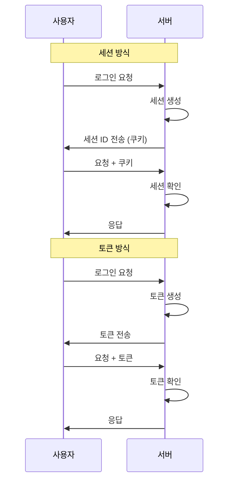
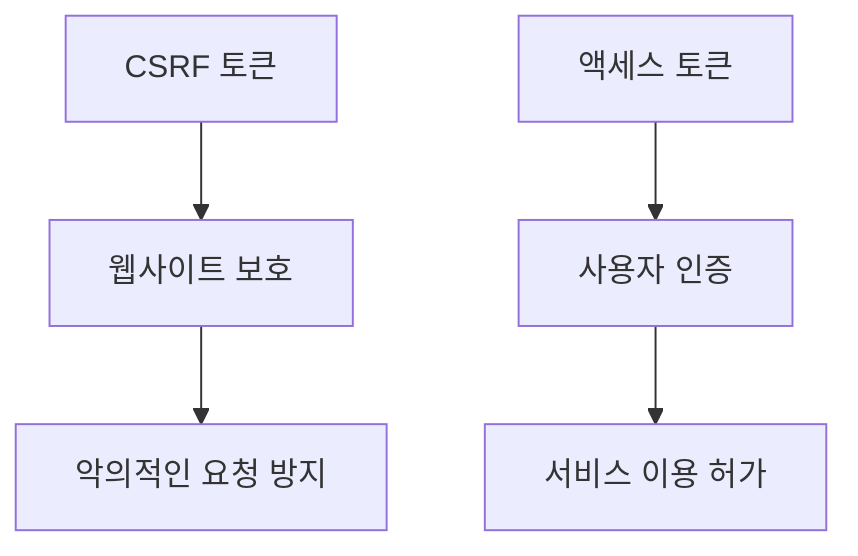
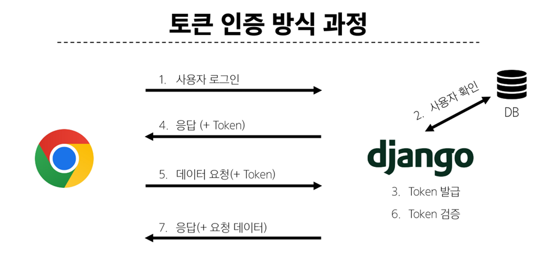
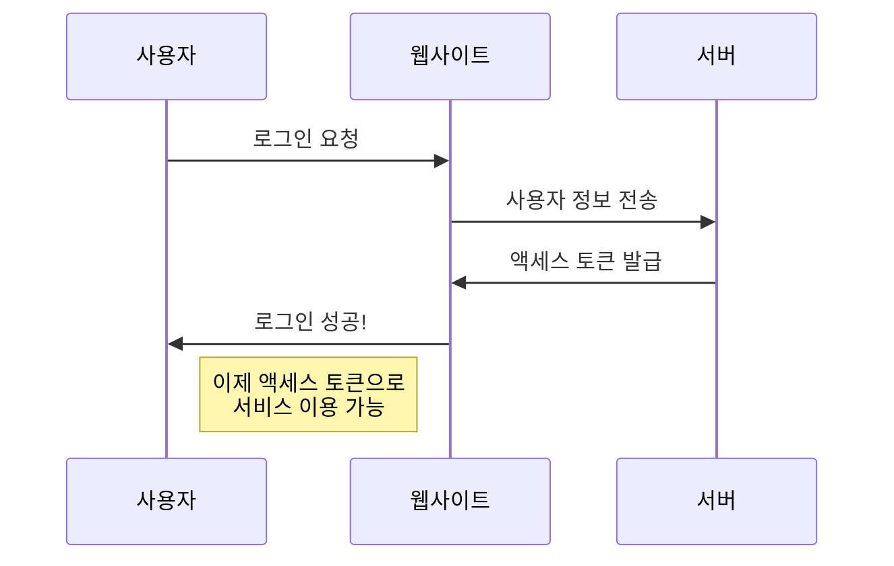

# [실습] Vue with DRF2

날짜: 2024년 11월 14일

# ⚠️ 세션과 토큰 인증의 차이점

---

<aside>
💡

**세션은 서버가 모든 걸 기억하는 방식이고, 토큰은 사용자가 자신의 정보를 들고 다니는 방식**

</aside>

### 간단 비유

---

### 세션 (급식 카드)

1. 학교에서 급식 카드를 줍니다.
2. 카드에는 번호만 있어요.
3. 급식을 받을 때 카드를 보여줍니다.
4. **선생님이 컴퓨터로 카드 번호를 확인하고 급식을 줍니다.**

### 토큰 (특별 급식 티켓)

1. 학교에서 특별 급식 티켓을 줍니다.
2. 티켓에는 이름, 반, 알레르기 정보가 적혀있어요.
3. 급식을 받을 때 티켓을 보여줍니다.
4. **선생님이 티켓만 보고 바로 급식을 줄 수 있어요.**

## 차이점 설명

1. **저장 위치**
    - **세션: 선생님(서버)이 학생 정보**를 가지고 있어요.
    - **토큰: 학생(클라이언트)이 자기 정보**를 가지고 다녀요.
2. **정보 포함**
    - 세션: 카드에는 번호만 있어요.
    - 토큰: 티켓에 모든 정보가 적혀있어요.
3. **확장성**
    - **세션: 다른 학교 급식실에 가면 사용할 수 없어요.**
    - **토큰: 다른 학교 급식실에서도 사용할 수 있어요.**
4. **사용 편의성**
    - 세션: 카드만 가지고 다니면 돼요.
    - 토큰: 티켓을 잘 보관해야 해요.
5. **보안**
    - 세션: 카드를 잃어버려도 큰 문제 없어요.
    - 토큰: 티켓을 잃어버리면 다른 사람이 사용할 수 있어요.

## Mermaid 흐름도



## 쉬운 설명

1. **세션:**
    - 서버가 사용자 정보를 기억합니다.
    - 사용자는 작은 표시(쿠키)만 가지고 다닙니다.
    - **서버에게 매번 "나 기억나요?" 하고 물어봅니다.**
2. **토큰:**
    - 사용자가 자신의 정보가 담긴 특별한 카드를 가집니다.
    - 서버에 갈 때마다 이 카드를 보여줍니다.
    - **서버는 카드만 보고 사용자를 알아볼 수 있습니다.**

# 인증과 권한

---

<aside>
💡

**인증은 "당신이 누구인지 확인하는 과정"이고, 
권한 부여는 "당신이 무엇을 할 수 있는지 결정하는 과정"**

</aside>

예를 들어:

1. 인증: 사용자가 로그인 페이지에서 아이디와 비밀번호를 입력하여 자신이 주장하는 사람임을 증명합니다.
2. 권한 부여: 로그인 후, 시스템은 해당 사용자의 역할(예: 일반 사용자, 관리자)에 따라 특정 페이지나 기능에 대한 접근 권한을 부여합니다.

**인증(Authentication):**

1. 목적: 사용자의 신원을 확인하는 과정입니다.
2. 이유:
    - 시스템에 접근하려는 주체가 실제로 주장하는 사람인지 확인합니다.
    - 무단 접근을 방지하고 보안을 유지합니다.
    - 악의적인 봇이나 자동화된 공격으로부터 시스템을 보호합니다.
3. 방법: 사용자 이름/비밀번호, 생체 인식, 2단계 인증 등을 사용합니다.

**권한 부여(Authorization):**

1. 목적: 인증된 사용자에게 특정 리소스나 기능에 대한 접근 권한을 부여하는 과정입니다.
2. 이유:
    - 사용자마다 다른 수준의 접근 권한을 부여하여 보안을 강화합니다.
    - 사용자의 역할이나 책임에 따라 적절한 기능만 사용할 수 있도록 합니다.
    - 민감한 정보나 중요한 시스템 기능을 보호합니다.
3. 방법: 역할 기반 접근 제어(RBAC), 속성 기반 접근 제어(ABAC) 등의 모델을 사용합니다.

# 자격증명과 토큰

---

1. **자격 증명: 당신이 누구인지 증명하는 정보입니다**. 예를 들어, 학교 도서관에 들어갈 때 사용하는 학생증과 같은 것입니다.
2. **토큰: 자격 증명을 간단하게 만든 것입니다. 놀이공원에서 받는 입장 팔찌**와 비슷합니다.

이제 CSRF 토큰과 액세스 토큰의 차이를 설명해 드리겠습니다:



1. CSRF 토큰:
    - **웹사이트를 나쁜 사람들로부터 보호합니다.**
    - 마치 비밀 암호와 같아서, 진짜 사용자만 알고 있습니다.
2. **액세스 토큰:**
    - 사용자가 누구인지 확인하고 서비스를 이용할 수 있게 해줍니다.
    - **놀이공원 입장 팔찌처럼, 이것이 있으면 여러 놀이기구를 탈 수 있습니다.**





1. 사용자가 웹사이트에 로그인을 합니다.
2. **웹사이트는 서버에 사용자 정보를 보냅니다.**
3. **서버**는 사용자 정보를 확인하고 **액세스 토큰**을 만들어 줍니다.
4. 웹사이트는 사용자에게 로그인 성공을 알립니다.
5. 이제 사용자는 이 액세스 토큰으로 여러 서비스를 이용할 수 있습니다.

<aside>
💡

1. **자격 증명(입장권)**은 인증을 위해 필요한 정보 
⇒ 인터넷 예매
2. **인증은 이 자격 증명을 확인하는 과정**
3. **인증이 완료되면, 사용자는 토큰(팔찌)을 받습니다**. 이 토큰은 사용자가 **이미 인증되었음을 나타내며**, 놀이공원 내에서 자유롭게 움직일 수 있게 해줍니다
</aside>

## **왜 인증을 할까요?**

- **인증**은 "누가 이걸 하고 있는지 확인하는 것"이에요.
- 예를 들어, **놀이공원에 들어갈 때 `입장권`을 보여주는 것처럼**, 웹사이트에서도 누가 들어왔는지 확인해야 해요. 그래야 나쁜 사람들이 못 들어오게 막을 수 있거든요.

## **왜 인증 후에 허가를 할까요?**

- **허가**는 "이제 이걸 해도 돼!"라고 말해주는 거예요.
- **놀이공원에서 입장권을 보여주고 놀이기구를 `탈 수 있는`** 것처럼, 웹사이트에서도 인증이 되면 여러 가지를 할 수 있게 허락해줘요.

## **토큰이란 무엇일까요?**

- **토큰**은 "사용자임을 증명하는 작은 키"예요.
- 놀이공원에서 받는 팔찌나 표처럼, **한 번 인증이 되면 계속 사용할 수 있는 `증명서`** 같은 거예요. 그래서 매번 로그인하지 않아도 돼요.

## **자격 증명이란 무엇일까요?**

- **자격 증명**은 "누군지 확인할 수 있는 정보"예요.
- 놀이공원에 들어가기 위해 필요한 **입장권이 자격 증명**에 해당해요.
    - 입장권에는 당신의 이름이나 특별한 코드가 있을 수 있어요.
    - 이 입장권을 보여주면, 놀이공원 직원이 "아, 이 사람은 입장할 수 있는 사람이구나!"라고 확인할 수 있죠.

자격 증명은 이렇게 놀이공원에 들어갈 때 필요한 입장권처럼, 웹사이트에서도 사용자가 누구인지 확인할 때 사용하는 정보랍니다.

### **자격 증명 vs. 인증**

- **자격 증명**:
    - 이것은 "누군지 확인할 수 있는 정보"예요.
    - 놀이공원에서는 **입장권이 자격 증명에 해당**해요. 입장권에는 당신의 이름이나 특별한 코드가 있을 수 있죠.
- **인증**:
    - 이것은 "**자격 증명을 사용해서 실제로 누군지 확인하는 과정**"이에요.
    - 놀이공원에서는 입장권을 보여주고, **직원이 그걸 확인하는 과정이 인증이에요. 직원이 입장권을 보고 "아, 이 사람은 들어올 수 있어!"라고 하는 것**이죠.

그래서 자격 증명(입장권)은 인증(확인 과정)을 위해 필요한 정보라고 할 수 있어요. **자격 증명이 있어야 인증을 할 수 있는 거죠!**

## **왜 토큰과 자격 증명 자료가 연결될까요?**

- 자격 증명 자료(예: 사용자 이름과 비밀번호)를 통해 처음에 "누구인지" 확인한 다음, 토큰을 발급해줘요.
- 이 **토큰은 "너는 이미 인증됐어!"라는 표시**라서, 자격 증명 자료와 연결되어 있어요.

## **단순히 자격 증명만 식별한다는 건 무슨 의미일까요?**

- "**단순히 자격 증명만 식별한다"는 건, "누군지 확인만 하고 끝난다"**는 뜻이에요.
- 예를 들어, 놀이공원에 들어갈 때 **입장권만 보고 "아, 너는 입장할 수 있구나!"라고 확인하는 것**처럼요. 그 후에는 별다른 행동 없이 그냥 놀이기구를 타러 가는 거죠.

# 실행 흐름

---

<aside>
💡

따라서 인증이 완료되지 않으면 View 함수 자체에 접근할 수 없으며, **모든 요청은 미리 설정된 보안 절차를 거치게 됩니다**. 이는 보안을 강화하고 불법적인 접근을 방지하기 위한 중요한 절차입니다

</aside>

## **View 함수와 인증**

- **View 함수**는 웹 애플리케이션에서 특정 요청을 처리하는 코드입니다.
- 인증이란 사용자가 이 View 함수에 접근하기 전에 이루어지는 과정입니다. **즉, 사용자가 View 함수에 접근하려고 할 때, 먼저 인증이 성공적으로 완료되어야 합니다.**
- 만약 인증이 실패하면, View 함수에 접근할 수 없게 되어 "접근이 차단"됩니다[2](https://velog.io/@couchcoding/%ED%94%84%EB%A0%88%EC%9E%84%EC%9B%8C%ED%81%AC%EA%B0%80-%EB%AC%B4%EC%97%87%EC%9D%BC%EA%B9%8C).

## **실행 흐름**

1. 사용자가 웹사이트에 요청을 보냅니다.
2. 시스템은 먼저 사용자의 신원을 인증합니다.
3. 인증이 성공하면, 시스템은 사용자가 요청한 리소스나 기능에 접근할 권한이 있는지를 확인합니다.
4. 권한이 확인되면, View 함수가 실행되어 요청을 처리합니다.

# 인증 정책 설정 방법

---

<aside>
💡

**전역 설정 / view 함수별 설정**

</aside>

[Authentication - Django REST framework](https://www.django-rest-framework.org/api-guide/authentication/#tokenauthentication)

[Token-Based Authentication and Authorization in Django REST Framework: User and Permissions…](https://medium.com/django-unleashed/token-based-authentication-and-authorization-in-django-rest-framework-user-and-permissions-347c7cc472e9)

[[Django Rest Framework]Authentication & Permission (인증과 권한)](https://donis-note.medium.com/django-rest-framework-authentication-permission-%EC%9D%B8%EC%A6%9D%EA%B3%BC-%EA%B6%8C%ED%95%9C-cc9b183fd901)

## 1. 전역설정

---


[Authentication - Django REST framework](https://www.django-rest-framework.org/api-guide/authentication/#tokenauthentication)

<aside>
💡

**세션 인증 ⇒ 토큰 인증으로 변경해서 session을 
Token으로 변경**

</aside>

- **세션과 토큰의 차이**
    1. **상태 관리**:
        - 세션 인증: 서버에서 세션 정보를 저장하고 관리합니다 (상태 유지).
        - 토큰 인증: 서버에서 상태를 저장하지 않습니다 (무상태).
    2. **확장성**:
        - 세션 인증: 서버 확장이 어려울 수 있습니다.
        - 토큰 인증: 서버 확장이 더 쉽습니다.
    3. **클라이언트 저장**:
        - **세션 인증: 세션 ID를 쿠키에 저장**합니다.
        - **토큰 인증: 토큰을 클라이언트 측(예: 로컬 스토리지)에 저장합니다.**
    4. **보안**:
        - 세션 인증: CSRF 공격에 취약할 수 있습니다.
        - 토큰 인증: XSS 공격에 취약할 수 있지만, 적절히 구현하면 더 안전할 수 있습니다.
    5. **성능**:
        - 세션 인증: 서버에서 세션 조회가 필요합니다.
        - **토큰 인증: 토큰 검증만 하면 되므로 더 빠를 수 있습니다.**
    6. **사용 범위**:
        - 세션 인증: 주로 단일 도메인 웹 애플리케이션에 적합합니다.
        - **토큰 인증: 다중 도메인, 모바일 앱, API 등에 더 적합합니다.**

## name 'authentication_classes' is not defined

---

```jsx
@authentication_classes([SessionAuthentication, BasicAuthentication])
@permission_classes([IsAuthenticated])
```

- 일반적으로 **`@authentication_classes`** 데코레이터를 제대로 임포트하지 않고 사용

## 장고 공식 문서 상 : 토큰 인증 → 토큰 생성 코드 작성

---


[Authentication - Django REST framework](https://www.django-rest-framework.org/api-guide/authentication/)

## Dj-Rest-Auth

---

[https://github.com/iMerica/dj-rest-auth](https://github.com/iMerica/dj-rest-auth)

[Installation — dj-rest-auth 5.0.1 documentation](https://dj-rest-auth.readthedocs.io/en/latest/installation.html)

⇒ 해당 문서에서 facebook, instagram 등을 보면 해당 사이트로 회원가입이 가능하게 만들어주는 것

## Dj-Rest-Auth의 등록 기능 추가 설정 ⇒ optional

---

[Installation — dj-rest-auth 5.0.1 documentation](https://dj-rest-auth.readthedocs.io/en/latest/installation.html#registration-optional)

[09) OAuth](https://wikidocs.net/9942)

# allauth.account.middleware.AccountMiddleware must be added to settings.MIDDLEWARE

---

```jsx
allauth.account.middleware.AccountMiddleware must be added to settings.MIDDLEWARE
```

⇒ 즉 추가해야함

```jsx
MIDDLEWARE = [
	'allauth.account.middleware.AccountMiddleware'
]
```

# Application labels aren't unique, duplicates: rest_framework

---

- rest_framework 관련 복제 문제 ⇒ 중복 문제 해결해야 함
- 토큰을 등록하면 이제 발급받을 수 있다 진행하기

# Unable to log in with provided `credentials`.

---

→ 특수문자등록하지 않아서 나타나는 오류

# param이 없는데 param을 받고 싶어할 경우

---

- 오타

⇒ self로 토큰 만들고 활용해보기 : 내부적으로 그냥 활용 먼저 해보고 진행하

`Authentication credentials were not provided`

---


HTTP 403 Forbidden 오류와 "Authentication credentials were not provided"라는 메시지는 해당 뷰에 대한 인증이 필요함을 나타냅니다. 기본적으로 Django REST Framework는 API 뷰에 대한 인증을 요구

⇒ `로그인`을 하지 않았을 때 발생함 == `headers에 token`을 전달했는가?

⇒ 상기 인증에 대한 로직을 이해하면 이해가 될 것

[02) Django REST Framework 설정](https://wikidocs.net/197539)

# 인증 후 ⇒ 허가

---

[Permissions - Django REST framework](https://www.django-rest-framework.org/api-guide/permissions/)

# django.core.exceptions.ImproperlyConfigured: WSGI application 'crud.wsgi.application’

---

- 버전 오류

# [vite] Internal server error: At least one <template> or <script> is required in a single file component.

---

- template이나 script가 필수적으로 요구되는데, 빈 페이지만을 만들어서 오류가 발생함

# POST [http://127.0.0.1:8000/api/v1/articles/](http://127.0.0.1:8000/api/v1/articles/) 401 (Unauthorized)

---

→ token이 null로 저장되는 문제


```jsx
     "headers": {
            "Accept": "application/json, text/plain, */*",
            "Content-Type": "application/json",
            "Authorization": "Token null"
        },
```

⇒ 일시적 에러였음, 새로고침 하니까 동작됨

## 네비게이션 가드 beforeEach 이해하기

---

### 일상적인 예시

**경비원이 있는 건물을 상상해보세요**. 이 경비원은 모든 사람이 건물에 들어가기 전에 체크합니다:

1. 방문자의 신원을 확인합니다.
2. 방문 목적을 물어봅니다.
3. **필요한 경우 출입을 거부하거나 다른 곳으로 안내합니다.**

**Vue Router의 `beforeEach`는 이 경비원과 같은 역할을 합니다.**

### **`Vue Router에서의 역할`**

1. **`모든 라우트 변경 전에 실행`됩니다.**
2. 사용자가 특정 페이지에 접근할 권한이 있는지 확인합니다.
3. **필요한 경우 다른 페이지로 리다이렉트하거나 접근을 막습니다.**

### 코드 예시

```jsx
router.beforeEach((to, from, next) => {
  if (to.matched.some(record => record.meta.requiresAuth)) {
    // 이 라우트는 인증이 필요합니다. 로그인 여부를 확인하세요.
    if (!isLoggedIn) {
      // 로그인하지 않았다면 로그인 페이지로 리다이렉트합니다.
      next({ name: 'Login' })
    } else {
      // 로그인 했다면 요청한 라우트로 이동합니다.
      next()
    }
  } else {
    // 인증이 필요 없는 페이지는 그냥 통과시킵니다.
    next()
  }
})

```

## router/index.js에서 사용하는 이유

1. **중앙 집중화**: `router/index.js`는 라우팅 관련 모든 설정을 한 곳에서 관리하는 중앙 장소입니다.
2. **전역 적용**: 여기서 설정한 `beforeEach`는 모든 라우트에 적용됩니다.
3. **초기화 시점**: 앱이 시작될 때 라우터가 초기화되므로, 이 시점에 가드를 설정하는 것이 가장 적절합니다.
4. **유지보수 용이성**: 모든 라우팅 로직이 한 파일에 있으면 코드를 이해하고 수정하기가 더 쉽습니다.

<aside>
💡

`beforeEach`는 앱의 "경비원"으로, 사용자가 어떤 페이지에 접근하려 할 때마다 체크를 수행합니다. 이를 `router/index.js`에 배치함으로써, 모든 라우트에 대해 일관된 보안 정책을 쉽게 적용할 수 있습니다. 이는 사용자 인증, 권한 관리, 그리고 전반적인 앱의 보안을 강화하는 데 매우 중요한 역할을 합니다.

</aside>

# 회원가입, 로그인 제한이 먹지 않는 오류

---

⇒ router이름이 제대로 설정되어있지 않은 오류

```jsx

router.beforeEach((to,from) => {
  const store = useArticleStore()
  if (to.name === 'create' && !store.isLogin) {
    window.alert('로그인이 필요합니다.')
    return {name : 'LoginView'} //router니까 바로 보낼 수 있음
  }  

  if ((to.name === 'signup' || to.name === 'signin') && (store.isLogin)){
    window.alert('이미 로그인되어있습니다.')
    return {name : 'ArticleView'}
  }
})
```