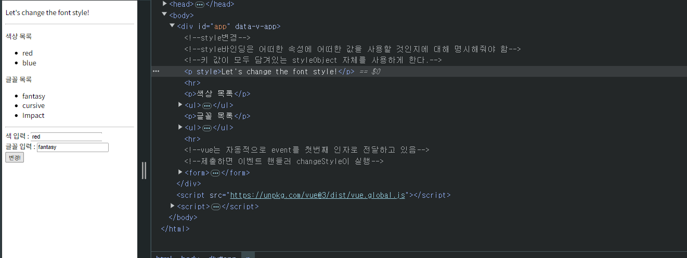

# [복습] Vue Basic Syntax1

날짜: 2024년 11월 6일

# CreateApp({}) 메서드 구조 이해하기

---

<aside>
💡

**문법적인 구조 자체는 인스턴스를 생성하는 메서드, 생성자에 객체의 세부적인 값을 넣어주는 것**

</aside>

<aside>
💡

따라서 `createApp()`을 사용하여 Vue 애플리케이션 **인스턴스를 생성하고, 
이 인스턴스에 루트 컴포넌트의 옵션을 제공하는 것**이 맞다. 

</aside>

1. `createApp()` 함수:
    - Vue 3에서 새로운 애플리케이션 인스턴스를 생성하는 함수
    - 이 함수는 Vue 애플리케이션의 진입점 역할
2. 객체 인스턴스:
    - `createApp()`에 전달하는 객체는 루트 컴포넌트의 옵션을 정의
    - 이 객체에는 `data`, `methods`, `computed`, `setup` 등 다양한 옵션을 포함할 수 있다.
3. `app` 변수:
    - **`createApp()`의 반환값을 `app` 변수에 할당**
    - 이 `app` 변수는 Vue 애플리케이션 **인스턴스**
4. 애플리케이션 인스턴스:
    - 애플리케이션의 전역 구성을 담당
    - 컴포넌트, 디렉티브, 플러그인 등을 등록할 수 있는 메서드를 제공
5. `setup()` 함수:
    - **Composition API의 일부로, 컴포넌트의 로직을 정의하는 데 사용**
    - 반응형 상태, 계산된 속성, 메서드 등을 정의하고 반환할 수 있다.

## 루트 컴포넌트란? : createApp() `함수에 전달되는 객체`

---

루트 컴포넌트의 옵션은 Vue 애플리케이션을 초기화할 때 `createApp()` 함수에 전달되는 객체

[주요 옵션]

1. `data`: 컴포넌트의 반응형 데이터를 정의하는 함수
2. `methods`: 컴포넌트의 메서드들을 정의하는 객체
3. `computed`: 계산된 속성들을 정의하는 객체
4. `watch`: 데이터 변화를 감시하는 옵션
5. `props`: 부모 컴포넌트로부터 받을 속성들을 정의
6. `components`: 하위 컴포넌트들을 등록하는 객체
7. `directives`: 사용자 정의 디렉티브를 등록하는 객체
8. `filters`: 텍스트 포매팅을 위한 필터들을 정의하는 객체.
9. 라이프사이클 훅: `created`, `mounted`, `updated`, `unmounted` 등의 라이프사이클 훅 함수들을 정의
10. `template` 또는 `render`: 컴포넌트의 템플릿을 정의

# StyleBinding 오류 ⇒ Assignment to constant variable.

---



```jsx
    <!--style변경-->
    <!--style바인딩은 어떠한 속성에 어떠한 값을 사용할 것인지에 대해 명시해줘야 함-->
    <!--키 값이 모두 담겨있는 styleObject 자체를 사용하게 한다.-->
    <p :style="styleObject">Let's change the font style!</p>
    <hr>
```

```jsx
 const app = createApp({
      setup(){
        const colorType = ref('') //양방향 바인딩
        const fontType = ref('') //양방향 바인딩
        const styleObject = ref('') //style에 적용할 변수 -> 단방향 directive (p태그 적용)
        const changeStyle = function() { //이벤트핸들러 => 값을 enter, 변경하면
          const new_Style = reactive({ //반응형 객체 자체로 만드는게 더 효과적
            'color' : colorType,
            'font-family' : fontType,
          })
          //styleObject에 할당한다.
//          styleObject.value = new_Style
          styleObject = new_Style //reactive 자체를 주면 -> color, font-family를 .value가 아닌 값으로 접근이 가능
          colorType = ''
          fontType = ''
        }
        return {
          colorType,
          fontType,
          styleObject,
          changeStyle
        }
      }
    })
```

→ 문제 발생이유 : styleObject 자체가 const로 변수 선언이 되었는데 해당 값을 ref(’’) value로 접근하는게
     아니라 자체적으로 접근해서 반영이 되지 않는 문제를 확인함

<aside>
💡

**1차 수정 사항 ⇒ vue.global.js:2476 Uncaught TypeError: Assignment to constant variable.**

</aside>

→ value 자체에 값 접근

```jsx
const styleObject = ref('') //style에 적용할 변수 -> 단방향 directive (p태그 적용)
        const changeStyle = function() { //이벤트핸들러 => 값을 enter, 변경하면
          const new_Style = ref({ //반응형 객체 자체로 만드는게 더 효과적
            'color' : colorType,
            'font-family' : fontType,
          })
          //styleObject에 할당한다.
//          styleObject.value = new_Style
          styleObject.value = new_Style //reactive 자체를 주면 -> color, font-family를 .value가 아닌 값으로 접근이 가능
          colorType = ''
          fontType = ''
        }
```

⇒ 에러 발생위치를 확인해보니 자체적으로 `colorType`과 `fontType`의 값을 바꾸려고 했음 ⇒ value접근

```jsx
colorType.value = ''
fontType.value = ''
```

<aside>
💡

2차 수정 사항 ⇒ form 자체가 제출되는 문제?

</aside>

→ form 자체 문제 없고, Vue도 선언되어있고, mount도 되었고, return도 했다.

**[1차 확인] = vue 인스턴스가 제대로 마운팅 되었는가?**


[2차 확인] 제대로 v-model이 작동되는가? 그리고, styleObject에 새로 선언한 값이 맞게 들어갔는가?

---


```jsx
styleObject.value = new_Style //reactive 자체를 주면 -> color, font-family를 .value가 아닌 값으로 접근이 가능
console.log(styleObject)
console.log(styleObject.value.color) //color 값이 없다? 
```

<aside>
💡

**3차 수정 사항 : 최종 에러 제거**

</aside>

## ⚠️ **핵심 포인트**

---

1. ref 객체는 **`.value`**를 통해 실제 값에 접근
2. **ref 객체에 다른 ref 객체의 값을 할당할 때, 양쪽 모두 `.value`를 사용해야 한다.**
3. 이는 Vue.js의 반응형 시스템이 제대로 작동하기 위한 필수적인 방식

```jsx
console.log(new_Style) // ref 객체 자체를 출력
console.log(new_Style.value) // ref 객체의 실제 값을 출력
styleObject.value = new_Style.value // ref 객체의 값을 다른 ref 객체에 할당
```

# ⚠️ 클래스 바인딩 오류

---

[클래스와 스타일 바인딩 — Vue.js](https://v2.ko.vuejs.org/v2/guide/class-and-style.html)


```jsx
  <div id="app">
    <h1 :class="colorCrimson">Heading</h1>
    <!--클래스 속성값에 바인딩해서 text-decoreate를 적용한다-->
    <!--클래스 적용 유무에 따른 객체 선언-->
    <p :class="{'text-decorate':toggleDecorate}">Lorem, ipsum dolor sit amet consectetur adipisicing elit. Nemo, ipsum.</p>
    <button @click="toggleDecorate">Toggle Text Style</button>
  </div>
```

→ toggleDecorate가 사라지지 않음..

```jsx
    const { createApp, ref  } = Vue
    const app = createApp({
      setup() {
        const colorCrimson = ref('text-crimson') //h1 속성값에 바인딩하여 폰트컬러 변경
        const isDecorate = ref(false)
        const toggleDecorate = function () {
          //Toggle Text Style버튼 클릭시 호출
          //호출하면 isDecorate값 토글
          if (isDecorate.value == false) {
            isDecorate.value = true //대입
          } else {
            isDecorate.value = false
          }
        }
        return {
          colorCrimson,
          isDecorate,
          toggleDecorate,
        }
      }
    })
    app.mount('#app')
```

⇒ app.mount 확인, ref 확인, return 값 확인, if 값 확인

<aside>
💡

**수정 사항**

</aside>

- 템플릿에서의 바인딩:현재 **`p`** 태그의 클래스 바인딩에서 **`toggleDecorate`**를 사용하고 있는데, 이는 함수명 ⇒ 대신 **`isDecorate`**를 사용

```jsx
<p :class="{'text-decorate': isDecorate}">Lorem, ipsum dolor sit amet consectetur adipisicing elit. Nemo, ipsum.</p>
```

### 왜 함수명은 안될까?

---

<aside>
💡

이렇게 하면 **`isDecorate`**의 값이 변경될 때마다 Vue.js가 자동으로 클래스를 적용하거나 제거가능

</aside>

| 특성 | 함수명 사용 (toggleDecorate) | 반응형 데이터 사용 (isDecorate) |
| --- | --- | --- |
| 평가 방식 | **함수 자체가 값으로 평가됨** 
(항상 truthy) | 반응형 변수의 **현재 값으로 평가됨** |
| 반응성 | 반응형이 아님 | **반응형 (값 변경 시 자동 업데이트)** |
| 클래스 적용 | 항상 적용됨 (의도치 않은 동작) | 조건에 따라 동적으로 적용/제거 |
| 용도 | **이벤트 핸들러로 사용 (@click 등)** | **데이터 바인딩에 사용** 
(v-bind, :class 등) |
| 예시 코드 | `:class="{'text-decorate': toggleDecorate}"` | `:class="{'text-decorate': isDecorate}"` |
| 결과 | 항상 'text-decorate' 클래스가 적용됨 | isDecorate 값에 따라 클래스가 토글됨 |
| Vue.js 권장 사용법 | 부적절 | 권장됨 |

# form tag 바인딩 오류 문제 ⇒ console.log의 값

---

→ 현재 객체 자체로 나오고 true/false가 나온다?


```jsx
const { createApp,ref } = Vue

const app = createApp({
  setup() {
    //반응형 변수 formData == 모두 양방향 바인딩
    const formData = ref({ //속성 5개를 가진 객체
      'name' : ref(''), //빈 값들로 만들면 -> 양방향 기능을 통해 사용자들이 직접 와서 접근해서 사용할 수 있음
      'email' : ref(''),
      'age' : ref(''),
      'residence' : ref('서울'), //기본 세팅값 서울
      'languages' : ref(['Python']), //기본 세팅값 파이썬 사용 => 해당 값만 배열으 사용하는 이유는 다양한 값을 담기 위함 
    })
    const submitForm = function() {
      for (const data in formData) { //data가 키 값
        if (Array.isArray(formData[data])) {
          //그런데 languages는 배열
          //배열인 것은 요소 하나 하나 출력?
          subData = formData[data] //배열 값 하나씩
          for (const sub of subData) {
            console.log(sub)
          }
        } else {
          console.log(formData[data])
        }
      }
    }
    return {
      formData,
      submitForm
    }
  }
})

app.mount('#app')
```

⇒ 확인해봤을때 formData ref, value 자체에 접근하고 있음
      &&  ref() 반응형 객체를 넣었음에도 불구하고, 또 내부에서 ref()을 선언해서 문제가 발생하는 것으로 보임


→ undefined 출력되는 문제

<aside>
💡

수정 사항

</aside>

## ⚠️ 특정값 접근 할 때 value 빼먹지 말기!!!

---

```jsx
//그렇다면 하기처럼 출력하는게 맞는데 => value를 붙이지 않아서!
for (const data in formData.value) { //data가 키 값
  if (Array.isArray(formData.value[data])) {
    //그런데 languages는 배열
    //배열인 것은 요소 하나 하나 출력?
    subData = formData.value[data] //배열 값 하나씩
    for (const sub of subData) {
      console.log(sub)
    }
  } else {
    console.log(formData.value[data])
  }
}
```

⇒ 특정 ref 값에 `value` 의 특정 값으로 접근하지 않았기 때문에 오류가 발생했었음

⇒ 아마 reactive를 사용하면 이렇게 하지 않아도 될 것

# ⚠️ Ref 객체 내부 속성들의 반응성?

---

- ref로 객체를 감싸면, 그 객체 내부의 **모든 속성들이 자동으로 반응형이 된다.**
- 따라서 `formData.value.name`이나 `formData.value.email` 모두 반응형으로 동작

### 중첩된 ref 사용:

```jsx
const formData = ref({
  name: ref(''),
  email: ''
})

```

- 이 경우, `name`에 대해 ref를 중첩해서 사용하는 것은 불필요하며 권장되지 않는다
- 이렇게 하면 `formData.value.name.value`와 같이 이중으로 `.value`에 접근해야 하므로 코드가 복잡해진다.

<aside>
💡

ref는 기본적으로 깊은 반응성을 제공 ⇒ **중첩된 객체나 배열의 변경사항도 감지**한다는 의미.

ref 객체 내부의 **모든 속성(키-값 쌍)은 반응형으로 처리**
⇒ 즉, `formData.value.name = 'John'`과 같이 값을 변경하면 Vue가 이를 감지하고 필요한 경우 컴포넌트를 다시 렌더링한다.

</aside>